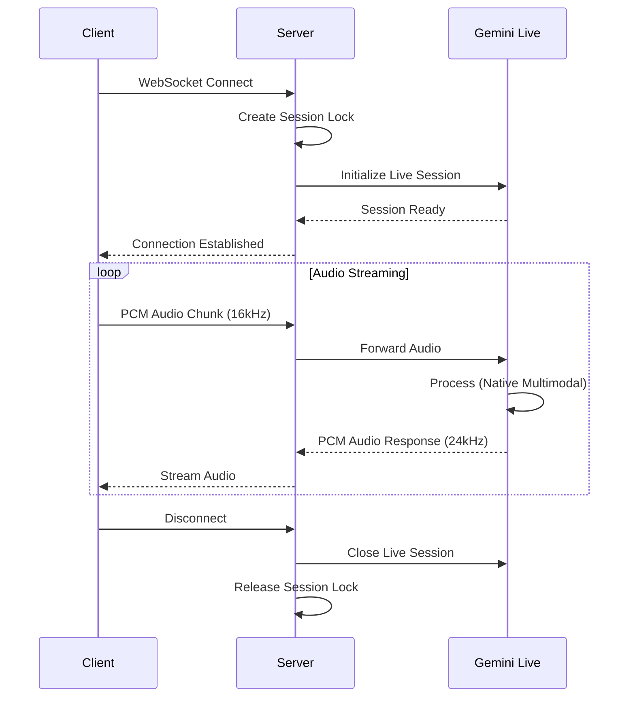

# 🔌 API Specification

Complete API reference for the AI Friend platform.

---

## Table of Contents

1. [WebSocket API](#websocket-api)
2. [REST API](#rest-api)
3. [Data Models](#data-models)
4. [Error Handling](#error-handling)
5. [Rate Limiting](#rate-limiting)

---

## WebSocket API

### Main Voice Interface

**Endpoint**: `/ws`  
**Protocol**: Binary WebSocket  
**Audio Format**: PCM 16-bit, 16kHz mono (client → server), 24kHz mono (server → client)

#### Connection Flow



#### Client → Server (User Audio)

**Format**: Raw 16-bit PCM chunks  
**Sample Rate**: 16,000 Hz (Mono)  
**Chunk Size**: Recommended 1024-4096 samples per message

**Example** (JavaScript):
```javascript
const ws = new WebSocket('ws://localhost:8000/ws');
ws.binaryType = 'arraybuffer';

// Capture audio via AudioWorklet
const audioContext = new AudioContext({ sampleRate: 16000 });
await audioContext.audioWorklet.addModule('/audioWorklet.js');

const stream = await navigator.mediaDevices.getUserMedia({ audio: true });
const source = audioContext.createMediaStreamSource(stream);
const worklet = new AudioWorkletNode(audioContext, 'audio-processor');

worklet.port.onmessage = (event) => {
  const pcmData = event.data; // Int16Array
  ws.send(pcmData.buffer);
};

source.connect(worklet);
```

#### Server → Client (AI Audio)

**Format**: Raw 16-bit PCM chunks  
**Sample Rate**: 24,000 Hz (Mono)  
**Delivery**: Streamed as series of binary messages

**Example** (JavaScript):
```javascript
ws.onmessage = (event) => {
  const audioData = new Int16Array(event.data);
  playAudio(audioData); // Use AudioContext to play
};

function playAudio(pcmData) {
  const audioContext = new AudioContext({ sampleRate: 24000 });
  const buffer = audioContext.createBuffer(1, pcmData.length, 24000);
  buffer.getChannelData(0).set(pcmData.map(v => v / 32768.0));
  
  const source = audioContext.createBufferSource();
  source.buffer = buffer;
  source.connect(audioContext.destination);
  source.start();
}
```

#### Vision Updates (Optional)

**Format**: JSON message over WebSocket  
**Frequency**: 1 FPS (configurable via `VISION_FPS`)

**Message Structure**:
```json
{
  "type": "vision_frame",
  "data": "base64_encoded_jpeg",
  "timestamp": 1707654321000,
  "source": "screen" | "webcam"
}
```

**Example** (JavaScript):
```javascript
async function captureScreen() {
  const stream = await navigator.mediaDevices.getDisplayMedia({ video: true });
  const video = document.createElement('video');
  video.srcObject = stream;
  await video.play();
  
  const canvas = document.createElement('canvas');
  const ctx = canvas.getContext('2d');
  
  setInterval(() => {
    canvas.width = video.videoWidth;
    canvas.height = video.videoHeight;
    ctx.drawImage(video, 0, 0);
    
    canvas.toBlob((blob) => {
      const reader = new FileReader();
      reader.onload = () => {
        ws.send(JSON.stringify({
          type: 'vision_frame',
          data: reader.result.split(',')[1], // base64
          timestamp: Date.now(),
          source: 'screen'
        }));
      };
      reader.readAsDataURL(blob);
    }, 'image/jpeg', 0.8);
  }, 1000); // 1 FPS
}
```

---

## REST API

### Health Check

**`GET /status`**

Returns the current system health and version.

**Response**:
```json
{
  "status": "healthy",
  "version": "2.2.0",
  "uptime": 3600,
  "active_sessions": 5
}
```

**Status Codes**:
- `200 OK`: System is healthy
- `503 Service Unavailable`: System is degraded

---

### Memory Management

#### Store Memory

**`POST /memory/store`**

Store a new memory entry for the user.

**Request**:
```json
{
  "content": "User's favorite color is blue",
  "type": "preference" | "fact" | "event",
  "importance": 0.8,
  "user_id": "user_123"
}
```

**Response**:
```json
{
  "id": "mem_abc123",
  "stored_at": "2026-02-11T21:00:00Z",
  "embedding_generated": true
}
```

**Status Codes**:
- `201 Created`: Memory stored successfully
- `400 Bad Request`: Invalid request body
- `429 Too Many Requests`: Rate limit exceeded

---

#### Query Memory

**`POST /memory/query`**

Retrieve relevant memories based on semantic similarity.

**Request**:
```json
{
  "query": "What is the user's favorite color?",
  "user_id": "user_123",
  "limit": 5,
  "min_similarity": 0.7
}
```

**Response**:
```json
{
  "memories": [
    {
      "id": "mem_abc123",
      "content": "User's favorite color is blue",
      "similarity": 0.95,
      "stored_at": "2026-02-11T21:00:00Z",
      "type": "preference"
    }
  ],
  "count": 1
}
```

---

### Session Management

#### Start Session

**`POST /session/start`**

Manually start a new conversation session.

**Request**:
```json
{
  "user_id": "user_123",
  "initial_context": "User just logged in"
}
```

**Response**:
```json
{
  "session_id": "sess_xyz789",
  "status": "started",
  "created_at": "2026-02-11T21:00:00Z"
}
```

---

#### End Session

**`POST /session/end`**

End the current conversation session.

**Request**:
```json
{
  "session_id": "sess_xyz789"
}
```

**Response**:
```json
{
  "status": "ended",
  "duration_seconds": 1800,
  "messages_exchanged": 42
}
```

---

## Data Models

### Memory Entry

```typescript
interface MemoryEntry {
  id: string;
  user_id: string;
  content: string;
  type: 'preference' | 'fact' | 'event';
  importance: number; // 0.0 - 1.0
  embedding: number[]; // 768-dimensional vector
  stored_at: string; // ISO 8601
  metadata?: Record<string, any>;
}
```

### Session

```typescript
interface Session {
  id: string;
  user_id: string;
  created_at: string;
  ended_at?: string;
  status: 'active' | 'ended';
  messages: Message[];
}
```

### Message

```typescript
interface Message {
  id: string;
  session_id: string;
  role: 'user' | 'assistant';
  content: string;
  audio_duration_ms?: number;
  timestamp: string;
}
```

---

## Error Handling

### Error Response Format

All errors follow a consistent structure:

```json
{
  "error": {
    "code": "INVALID_REQUEST",
    "message": "Missing required field: user_id",
    "details": {
      "field": "user_id",
      "expected": "string"
    }
  }
}
```

### Error Codes

| Code | HTTP Status | Description |
|:-----|:------------|:------------|
| `INVALID_REQUEST` | 400 | Malformed request body |
| `UNAUTHORIZED` | 401 | Missing or invalid authentication |
| `RATE_LIMIT_EXCEEDED` | 429 | Too many requests |
| `SESSION_NOT_FOUND` | 404 | Session ID does not exist |
| `INTERNAL_ERROR` | 500 | Server-side error |
| `SERVICE_UNAVAILABLE` | 503 | Gemini API or database unavailable |

---

## Rate Limiting

### Limits

| Endpoint | Limit | Window |
|:---------|:------|:-------|
| `/ws` | 10 connections | Per user |
| `/memory/store` | 100 requests | Per minute |
| `/memory/query` | 200 requests | Per minute |
| `/session/start` | 10 requests | Per minute |

### Rate Limit Headers

```http
X-RateLimit-Limit: 100
X-RateLimit-Remaining: 95
X-RateLimit-Reset: 1707654380
```

### Exceeded Response

```json
{
  "error": {
    "code": "RATE_LIMIT_EXCEEDED",
    "message": "Too many requests. Please try again in 42 seconds.",
    "retry_after": 42
  }
}
```

---

## Authentication

### API Key (Production)

**Header**: `Authorization: Bearer <api_key>`

**Example**:
```bash
curl -H "Authorization: Bearer sk_live_abc123" \
     https://api.example.com/memory/query
```

### Development Mode

Authentication is disabled when `DEBUG=True` in backend environment.

---

## WebSocket Events

### Client → Server

| Event Type | Description |
|:-----------|:------------|
| `audio_chunk` | Binary PCM audio data |
| `vision_frame` | JSON with base64 image |
| `ping` | Keepalive heartbeat |

### Server → Client

| Event Type | Description |
|:-----------|:------------|
| `audio_chunk` | Binary PCM audio response |
| `status_update` | JSON with session status |
| `pong` | Heartbeat response |
| `error` | JSON error message |

---

## Interactive API Documentation

When the backend is running, visit:

**Swagger UI**: http://localhost:8000/docs  
**ReDoc**: http://localhost:8000/redoc

---

## Code Examples

### Python Client

```python
import asyncio
import websockets
import numpy as np

async def stream_audio():
    uri = "ws://localhost:8000/ws"
    async with websockets.connect(uri) as websocket:
        # Send audio
        audio_data = np.random.randint(-32768, 32767, 1024, dtype=np.int16)
        await websocket.send(audio_data.tobytes())
        
        # Receive audio
        response = await websocket.recv()
        audio_response = np.frombuffer(response, dtype=np.int16)
        print(f"Received {len(audio_response)} samples")

asyncio.run(stream_audio())
```

### JavaScript/TypeScript Client

See examples in [WebSocket API](#websocket-api) section above.

---

**For architecture details, see [ARCHITECTURE.md](./ARCHITECTURE.md)**
