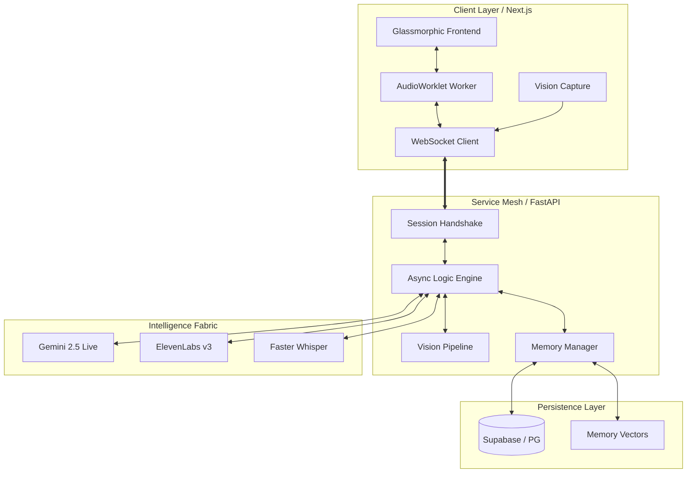
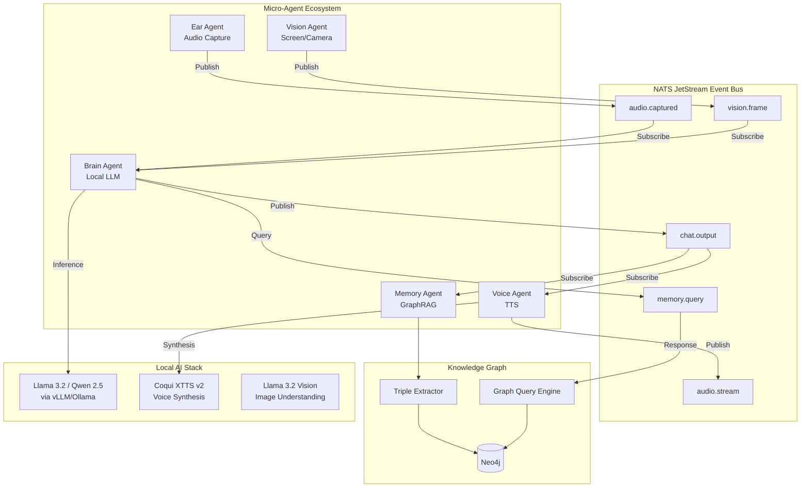
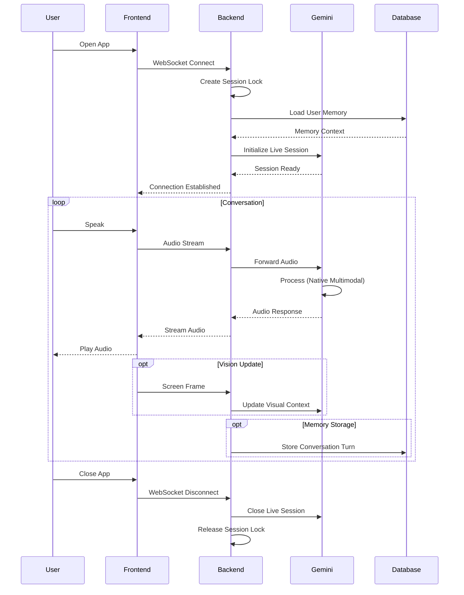
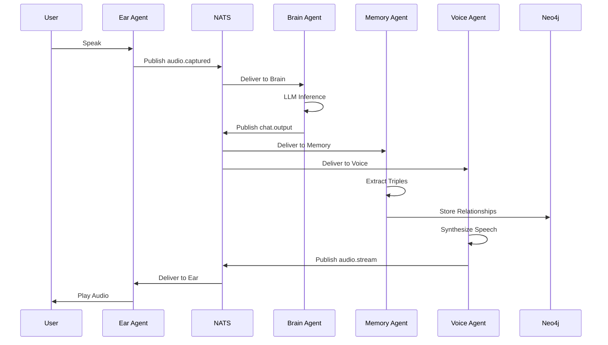

# 🏗️ Architecture Documentation

> **Deep dive into the AI Friend platform architecture, design decisions, and technical implementation**

---

## Table of Contents

1. [System Overview](#system-overview)
2. [v2.2.0 Architecture (Current)](#v220-architecture-current)
3. [v3.0 Architecture (Future)](#v30-architecture-future)
4. [Component Details](#component-details)
5. [Data Flow](#data-flow)
6. [Design Decisions](#design-decisions)
7. [Performance Optimizations](#performance-optimizations)
8. [Security Architecture](#security-architecture)

---

## System Overview

AI Friend is built on a **microservices-inspired architecture** with three primary layers:

1. **Client Layer** (Next.js) - User interface and audio capture
2. **Service Mesh** (FastAPI) - Business logic and orchestration
3. **Intelligence Fabric** - External AI services (Gemini, ElevenLabs)
4. **Persistence Layer** - Database and memory systems

---

## v2.2.0 Architecture (Current)

### High-Level Architecture



### Component Breakdown

#### 1. Client Layer (Next.js 14)

**Glassmorphic Frontend** (`components/VoiceInterface.tsx`)
- Modern UI with glassmorphism design
- Real-time status indicators
- Webcam/screen capture controls
- Session management

**AudioWorklet Worker** (`components/AudioWorklet.ts`)
- High-performance audio capture (16kHz, 16-bit PCM)
- Runs on separate thread for minimal latency
- Direct binary streaming to WebSocket
- ~10ms capture latency

**WebSocket Client**
- Binary protocol for raw PCM audio
- Automatic reconnection with exponential backoff
- Session state synchronization
- Heartbeat monitoring

**Vision Capture**
- Screen capture via `navigator.mediaDevices.getDisplayMedia()`
- Webcam via `navigator.mediaDevices.getUserMedia()`
- 1 FPS frame rate (configurable)
- Base64 JPEG compression

#### 2. Service Mesh (FastAPI)

**Async Logic Engine** (`main.py`)
- Non-blocking I/O for concurrent connections
- WebSocket lifecycle management
- Audio streaming coordination
- Error handling and recovery

**Session Handshake** (`main.py:handle_websocket`)
- Connection state locking
- Duplicate connection prevention
- Silent handoff for reconnections
- Session ID management

**Vision Pipeline** (`main.py:vision_handler`)
- Frame decompression
- Rate limiting (1 FPS)
- Context injection into LLM
- Adaptive quality control

**Memory Manager** (`app/memory_store.py`)
- Multi-layer RAG implementation
- Vector similarity search
- Context window optimization
- Temporal decay for relevance

#### 3. Intelligence Fabric

**Gemini 2.5 Live** (`app/gemini_live.py`)
- Native multimodal processing
- Audio-to-audio streaming
- Vision integration
- Tool calling support

**ElevenLabs v3** (Optional)
- Premium voice synthesis
- Emotional expression tags
- Hinglish support
- Streaming TTS

**Faster Whisper** (Fallback)
- Local STT for non-Live mode
- GPU acceleration
- Multilingual support

#### 4. Persistence Layer

**Supabase (PostgreSQL)**
- User sessions
- Conversation history
- Memory entries
- Row-level security

**Memory Vectors**
- Embedding storage
- Semantic search
- Context retrieval
- Similarity ranking

---

## v3.0 Architecture (Future)

### Cognitive Mesh Design



### Key Architectural Changes

#### Event-Driven Mesh
- **NATS JetStream** replaces direct function calls
- Microsecond-latency pub/sub
- Durable message delivery
- Stream replay for debugging

#### Micro-Agent Pattern
- **BaseAgent** abstraction for all agents
- Independent scaling per agent
- Fault isolation
- Easy A/B testing

#### GraphRAG Memory
- **Neo4j** for relationship-based memory
- Triple extraction from conversations
- Multi-hop reasoning
- Temporal relationships

#### Local-First Intelligence
- **No API dependencies** for core functionality
- Privacy-preserving
- Offline capable
- Fine-tunable for domain/language

---

## Component Details

### Audio Pipeline (v2.2.0)

```
Microphone
    ↓
AudioWorklet (Browser)
    ↓ [16kHz, 16-bit PCM]
WebSocket (Binary)
    ↓
FastAPI Handler
    ↓
Gemini Live API
    ↓ [Audio Response]
WebSocket (Binary)
    ↓
Browser AudioContext
    ↓
Speakers
```

**Latency Breakdown**:
- AudioWorklet capture: ~10ms
- WebSocket transmission: ~5ms
- Gemini processing: ~200-250ms
- WebSocket return: ~5ms
- Browser playback: ~10ms
- **Total**: ~230-280ms

### Vision Pipeline (v2.2.0)

```
Screen/Camera
    ↓ [1 FPS]
Canvas Capture
    ↓
JPEG Compression (80% quality)
    ↓
Base64 Encoding
    ↓
WebSocket (Text)
    ↓
FastAPI Handler
    ↓
Gemini Vision API
    ↓ [Context Update]
Conversation Context
```

### Memory Pipeline (v2.2.0)

```
Conversation Turn
    ↓
Memory Manager
    ↓
Embedding Generation (Gemini)
    ↓
Vector Storage (Supabase)
    ↓
[On Next Turn]
    ↓
Similarity Search
    ↓
Top-K Retrieval (k=5)
    ↓
Context Injection
    ↓
LLM Prompt
```

---

## Data Flow

### Session Lifecycle



### v3.0 Event Flow



---

## Design Decisions

### Why Native Multimodal (Gemini Live)?

**Traditional Pipeline**:
```
Audio → STT (500ms) → Text → LLM (300ms) → TTS (700ms) → Audio
Total: ~1500ms + network latency
```

**Native Multimodal**:
```
Audio → Gemini Live (250ms) → Audio
Total: ~250ms + network latency
```

**Benefits**:
- 6x latency reduction
- Preserves vocal nuances (tone, emotion)
- Natural interruption handling
- Eliminates transcription errors

### Why WebSockets over HTTP?

- **Bidirectional**: Simultaneous send/receive
- **Low Latency**: No HTTP overhead
- **Binary Support**: Raw PCM streaming
- **Persistent**: No reconnection per message

### Why AudioWorklet over MediaRecorder?

- **Lower Latency**: Direct buffer access (~10ms vs ~100ms)
- **Fine Control**: Custom sample rate, buffer size
- **Separate Thread**: No main thread blocking
- **Raw PCM**: No codec overhead

### Why Multi-Layer Memory?

**Short-term (Exact)**:
- Recent conversation verbatim
- High retrieval cost
- Perfect recall

**Blurry (Session)**:
- Summarized context
- Medium retrieval cost
- Semantic understanding

**Core (Long-term)**:
- Key facts and preferences
- Low retrieval cost
- Identity persistence

This mimics human memory and optimizes for both accuracy and efficiency.

### Why Event-Driven for v3.0?

**Monolithic (v2.2.0)**:
```python
audio = capture()
response = llm(audio)
memory.store(response)
play(response)
```

**Event-Driven (v3.0)**:
```python
# Ear Agent
nats.publish("audio.captured", audio)

# Brain Agent (independent)
audio = nats.subscribe("audio.captured")
response = llm(audio)
nats.publish("chat.output", response)

# Memory Agent (independent)
text = nats.subscribe("chat.output")
memory.store(text)
```

**Benefits**:
- **Scalability**: Scale agents independently
- **Resilience**: Agent failure doesn't crash system
- **Flexibility**: Swap LLM without touching other code
- **Observability**: Monitor each agent separately

---

## Performance Optimizations

### Audio Streaming
- **Buffer Size**: 4096 samples (256ms at 16kHz)
- **Chunk Size**: 1024 bytes for network transmission
- **Compression**: None (raw PCM for quality)

### Vision Processing
- **Frame Rate**: 1 FPS (configurable)
- **Resolution**: 1280x720 (downscaled if needed)
- **Compression**: JPEG 80% quality
- **Caching**: Deduplicate identical frames

### Memory Retrieval
- **Vector Index**: HNSW for fast similarity search
- **Top-K**: Limit to 5 most relevant memories
- **Embedding Cache**: Reuse embeddings for repeated queries
- **Async Loading**: Non-blocking database queries

### WebSocket
- **Binary Protocol**: Avoid JSON overhead
- **Compression**: Disabled (audio already compressed)
- **Keepalive**: 30s heartbeat
- **Buffer Limits**: 1MB max message size

---

## Security Architecture

### Authentication & Authorization
- **Session Tokens**: JWT-based authentication
- **Row-Level Security**: Supabase RLS policies
- **API Key Rotation**: Quarterly key updates
- **Rate Limiting**: 100 req/min per user

### Data Protection
- **Encryption in Transit**: TLS 1.3 for all connections
- **Encryption at Rest**: AES-256 for database
- **PII Handling**: Anonymized logs
- **Data Retention**: 90-day automatic deletion

### Network Security
- **CORS**: Strict origin validation
- **CSP**: Content Security Policy headers
- **WebSocket Origin**: Verified on handshake
- **DDoS Protection**: Cloudflare integration

### Code Security
- **Dependency Scanning**: Weekly Trivy scans
- **Static Analysis**: CodeQL on every PR
- **Secret Management**: Environment variables only
- **Input Validation**: AST-based code validation

---

## Scalability Considerations

### Horizontal Scaling
- **Stateless Backend**: Session state in database
- **Load Balancing**: Round-robin across instances
- **Sticky Sessions**: WebSocket affinity
- **Database Pooling**: Connection reuse

### Vertical Scaling
- **Async I/O**: Non-blocking operations
- **Worker Threads**: CPU-intensive tasks
- **Memory Limits**: Docker resource constraints
- **GPU Acceleration**: For local LLM inference (v3.0)

### Cost Optimization
- **API Caching**: Reduce Gemini API calls
- **Lazy Loading**: Load memories on-demand
- **Connection Pooling**: Reuse database connections
- **CDN**: Static assets via edge network

---

## Monitoring & Observability

### Metrics
- **Latency**: P50, P95, P99 response times
- **Throughput**: Messages per second
- **Error Rate**: 5xx errors per endpoint
- **Memory Usage**: RAG retrieval performance

### Logging
- **Structured Logs**: JSON format
- **Log Levels**: DEBUG, INFO, WARNING, ERROR
- **Correlation IDs**: Track requests across services
- **Retention**: 30 days in production

### Tracing
- **Distributed Tracing**: OpenTelemetry integration
- **Span Tracking**: WebSocket → Backend → Gemini
- **Performance Profiling**: Identify bottlenecks

---

## Future Architecture Evolution

### v3.1: WebRTC Transport
- Replace WebSockets with WebRTC DataChannels
- Target <150ms end-to-end latency
- Peer-to-peer capability for local networks

### v3.2: Full-Duplex Audio
- Moshi/Ultravox integration
- Simultaneous listen/speak
- Natural interruption handling

### v3.3: Spatial AI
- Unity Sentis for on-device inference
- WebXR for AR/VR presence
- 3D avatar with lip-sync

---

**For implementation details, see:**
- [README.md](./README.md) - Getting started guide
- [API_SPEC.md](./API_SPEC.md) - API documentation
- [DEPLOYMENT.md](./DEPLOYMENT.md) - Production deployment
- [v3_roadmap.md](./.gemini/antigravity/brain/98596c69-4693-4011-8405-4bb6b844a387/v3_roadmap.md) - v3.0 implementation plan
