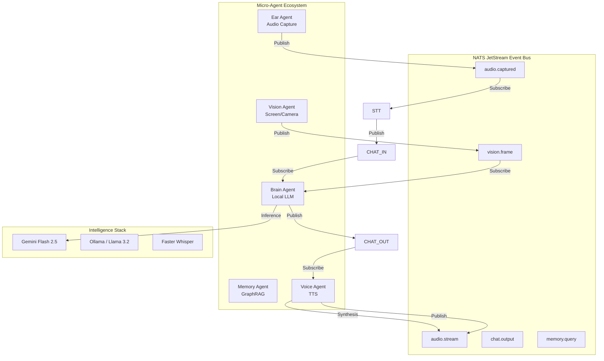

# 🏗️ Architecture Documentation

> **Deep dive into the AI Friend platform architecture, design decisions, and technical implementation**

---

## Table of Contents

1. [System Overview](#system-overview)
2. [v2.2.0 Architecture (Current)](#v220-architecture-current)
3. [v3.0 Architecture (Future)](#v30-architecture-future)
4. [Component Details](#component-details)
5. [Data Flow](#data-flow)
6. [Design Decisions](#design-decisions)
7. [Performance Optimizations](#performance-optimizations)
8. [Security Architecture](#security-architecture)

---

## System Overview

AI Friend is built on the **Sovereign Mesh Architecture**. Unlike traditional monolithic backends, it uses a decentralized ecosystem of specialized micro-agents coordinated via a high-performance **NATS JetStream** event bus.

This architecture enables:
- **Dynamic Scaling**: Scale the STT agent to 5 instances while keeping the Brain agent at 1.
- **Hardware Isolation**: Run the heavy Voice agent on a GPU node, while the Signaling server runs on a light CPU instance.
- **Resilient Recovery**: If one agent crashes, the mesh persists and waits for the agent to reboot.

---

## 🏗️ v3.0 Architecture (Sovereign Mesh)

### Component Lifecycles

All mesh agents follow a strictly standardized **BaseAgent** lifecycle:

1. **Bootstrap Phase**:
   - Connection to `NATS_URL`.
   - JetStream stream initialization (ensures subjects exist).
   - Subscription with specialized `DeliverPolicy` (e.g., `DeliverPolicy.NEW` for real-time audio).
2. **Processing Phase**:
   - Event-driven callback loop.
   - Acknowledgement (`ack()`) of processed messages for reliable delivery.
   - State broadcasts to `state.update`.
3. **Shutdown Phase**:
   - Connection draining.
   - Graceful termination of active inference tasks.

### Cognitive Mesh Tiering

The "IQ" of the agent is distributed across three memory tiers:

| Tier | Technology | Purpose | Retention |
| :--- | :--- | :--- | :--- |
| **Instant** | Local RAM | Active conversation context window. | Per-session. |
| **Semantic** | PostgreSQL (PGVector) | RAG retreival for factual grounding. | Persistent. |
| **Relational** | Neo4j Graph | Entity mapping (Who/What/Where). | Evolutive. |

### Resource Matrix (Estimates)

| Agent | Target Image | CPU (Min) | RAM (Target) | Notes |
| :--- | :--- | :--- | :--- | :--- |
| **Signaling** | `slim` | 0.5 Cores | 512 MiB | High I/O throughput. |
| **STT Agent** | `full` | 2.0 Cores | 2.0 GiB | Heavy Whisper inference. |
| **Brain Agent** | `slim`| 0.5 Cores | 1.0 GiB | High RAM if local embeddings used. |
| **Voice Agent** | `full` | 1.0 Cores | 4.0 GiB | Peak RAM during synthesis. |

### Cognitive Mesh Design



### Key Architectural Patterns

#### 1. Event-Driven Choreography
NATS JetStream acts as the central nervous system. Agents do not know about each other; they only know about relevant subjects (e.g., `audio.captured`, `brain.thought`). This enables microsecond-latency communication and independent service scaling.

#### 2. Specialized Micro-Agents
- **Ear Agent**: Manages raw WebSocket/WebRTC connections and stream resamplers (`soxr`).
- **Brain Agent**: The reasoning core. Handles LLM logic, tool calling, and context injection.
- **STT Agent**: Optimized for real-time transcription using Faster Whisper.
- **Voice Agent**: Orchestrates expressive TTS (ElevenLabs or GPT-SoVITS).
- **Vision Agent**: Synchronizes 1 FPS screen/camera context.

#### 3. Tiered Build Strategy
Containers are split into `slim` (logic-only) and `full` (heavy AI weights) to optimize CI/CD speed and runtime resource usage.

### Cognitive Mesh Design

```mermaid
graph TB
### Cognitive Mesh Dynamics: The Data Loop (v3.0)

For v3.0, the sequential STT -> TTS pipeline is replaced by continuous stream observation:

1. **Capture**: Ear Agent picks up raw PCM and publishes to `audio.captured`.
2. **Transform**: STT Agent transcribes in real-time, publishing segments to `brain.input`.
3. **Decide**: Brain Agent assesses context, queries memory, and decides on a response.
4. **Speak**: Voice Agent synthesizes audio buffers and publishes them to `audio.stream`.
5. **Playback**: Ear Agent consumes `audio.stream` and forwards to the user's browser.

---

**For implementation details, see:**
- [README.md](./README.md) - Getting started guide
- [API_SPEC.md](./API_SPEC.md) - API documentation
- [DEPLOYMENT.md](./DEPLOYMENT.md) - Production deployment
- [task.md](./.gemini/antigravity/brain/4a20e342-4f25-40b2-8f50-ed083aa64ca7/task.md) - Project progress tracker
