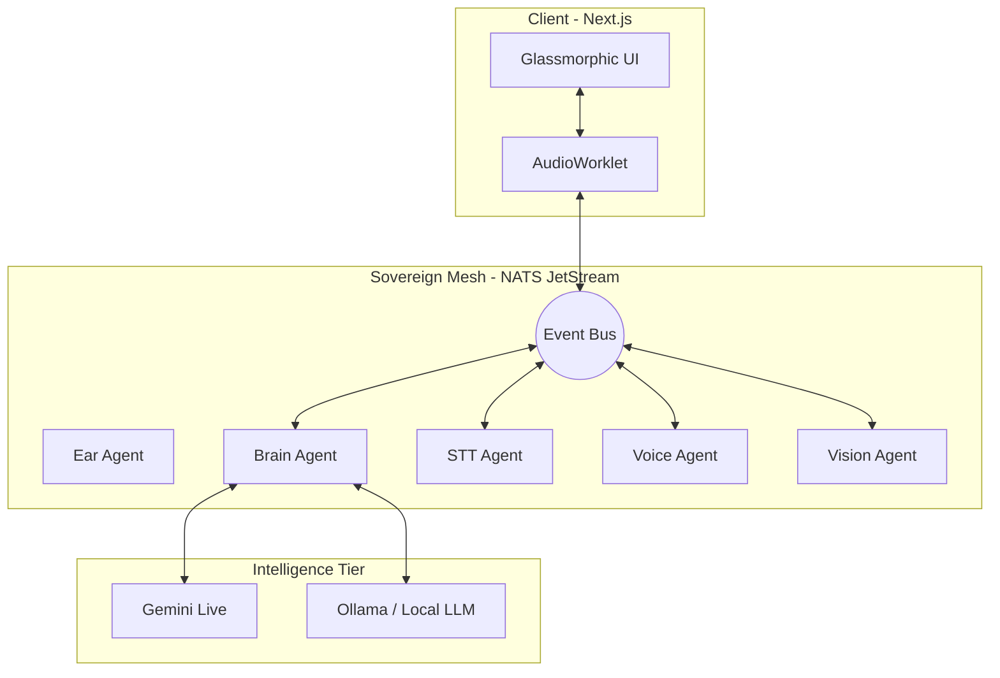

# 🎙️ AI Friend

**Enterprise-Grade Real-Time Multimodal AI Companion**

[](https://github.com/Aniket-a14/Ai_friend/actions/workflows/ci.yml)
[](https://github.com/Aniket-a14/Ai_friend/actions/workflows/links.yml)
[](https://opensource.org/licenses/MIT)
[](https://github.com/Aniket-a14/Ai_friend/releases)
[](https://github.com/Aniket-a14/Ai_friend/tags)
[](https://www.python.org/)
[](https://nodejs.org/)
[](https://fastapi.tiangolo.com/)
[](https://nextjs.org/)
[](https://www.docker.com/)
[](https://github.com/Aniket-a14/Ai_friend/stargazers)
[](https://github.com/Aniket-a14/Ai_friend/network/members)
[](https://github.com/Aniket-a14/Ai_friend/issues)
[](https://github.com/Aniket-a14/Ai_friend/pulls)
[](https://github.com/astral-sh/ruff)

---

## 🌟 Overview

AI Friend is a sophisticated, enterprise-grade, real-time voice-interactive AI platform. Built on the **Sovereign Mesh** pattern, it transcends traditional chatbot limitations by using a decentralized ecosystem of specialized micro-agents coordinated via a high-performance NATS event bus.

The system achieves **sub-300ms** response times through native multimodal intelligence and optimized audio pipelines (`soxr`), enabling authentic visual-vocal situational awareness.

---

## 🏗️ Architecture: v3.0 Sovereign Mesh

The current version (v3.0) has shifted from a monolithic backend to a **distributed agent mesh**.

### Key Innovations:
- **Decentralized Agents**: Specialized actors for STT, Vision, Reasoning (Brain), and Voice (TTS) running as independent containers.
- **NATS JetStream Backbone**: A microsecond-latency event bus replaces direct function calls for agent choreography.
- **Dual-Stack Docker**: Infrastructure (backbone) and Application (agents) separated for modular scaling.
- **Privacy-First**: Optimized to run with local LLMs (Ollama) and local TTS (GPT-SoVITS).

---

## 🚀 Active Features

- **⚡ Ultra-Low Latency**: Sub-300ms response loop using raw PCM streams and `soxr` resampling.
- **👁️ Visual Context**: Real-time screen/webcam awareness synced via the `vision.frames` stream.
- **🧠 Distributed Reasoning**: Brain Agent manages high-level logic, tool calling, and relationship-based memory.
- **🎭 Multi-Format Audio**: High-fidelity synthesis with support for Hinglish and emotional cues.
- **🔐 Enterprise Stability**: Docker health checks, automatic service discovery, and circuit breakers.
- **✨ 100% Lint Clean**: Backend codebase is fully compliant with `ruff` and `flake8` standards (Phase 27 Audit complete).

---

## ⚙️ Technology Stack (v3.0 Mesh)

| Component | Technology | Purpose |
|:----------|:-----------|:--------|
| **Event Bus** | NATS JetStream | Microsecond-latency internal communication |
| **Orchestration** | Docker Compose | Dual-stack (Infra + Agents) management |
| **Intelligence** | Gemini / Ollama | Reasoner and Tool-Caller |
| **Speech-to-Text** | Faster Whisper | High-accuracy audio transcription |
| **Text-to-Speech** | GPT-SoVITS / Eleven | Expressive vocal synthesis |
| **Audio Optimization** | SoX-Resampler (`soxr`) | Low-CPU audio format conversion |
| **Visual Context** | ScreenLink / CameraLink | Real-time situational awareness |

---

## ⚙️ Advanced Configuration (Env Var Dictionary)

| Variable | Default | Purpose |
| :--- | :--- | :--- |
| `AI_NAME` | `AI Friend` | The primary identity of the reasoning engine. |
| `DEBUG` | `False` | Toggles verbose logging across all mesh agents. |
| `NATS_URL` | `nats://nats:4222` | Internal event bus address. |
| `OLLAMA_URL` | `http://ollama:11434` | Endpoint for the Reasoning LLM. |
| `STT_MODEL_SIZE` | `small` | Whisper model speed (`tiny` to `large`). |
| `STT_DEVICE` | `cpu` | Target hardware (`cpu` or `cuda`). |
| `GEMINI_API_KEY` | `Required` | API Key for native multimodal fallback. |
| `DATABASE_URL` | `Required` | Postgres connection string for RAG & History. |

---

## 🧩 Agent Capability Matrix

| Feature | Agent Responsible | Protocol |
| :--- | :--- | :--- |
| **User Voice Capture** | Signaling Server | WebRTC / WS |
| **Voice Activity Detection** | STT Agent | RMS/Silero VAD |
| **Interruption Logic** | STT Agent -> Voice | `audio.stop` Signal |
| **Tool Calling** | Brain Agent | Python ToolRegistry |
| **RAG Retrieval** | Brain Agent | Vector Search |
| **Voice Synthesis** | Voice Agent | GPT-SoVITS / Eleven |

### Frontend Configuration (`frontend/.env`)

```bash
NEXT_PUBLIC_BACKEND_URL=http://localhost:8000  # Backend API endpoint
```

---

## 🏗️ Architecture: Sovereign Mesh Pattern


```mermaid
graph TB
    subgraph Client [Client - Next.js]
        UI[Glassmorphic UI]
        AW[AudioWorklet]
    end
    
    subgraph Mesh [Sovereign Mesh - NATS JetStream]
        NATS((Event Bus))
        EAR[Ear Agent]
        BRAIN[Brain Agent]
        STT[STT Agent]
        VOICE[Voice Agent]
        VISION[Vision Agent]
    end
    
    subgraph Intelligence [Intelligence Tier]
        Gemini[Gemini Live]
        Ollama[Ollama / Local LLM]
    end
    
    UI <--> AW
    AW <--> NATS
    NATS <--> BRAIN
    NATS <--> STT
    NATS <--> VOICE
    NATS <--> VISION
    BRAIN <--> Gemini
    BRAIN <--> Ollama
```

**For detailed architecture documentation, component breakdowns, and design decisions, see [ARCHITECTURE.md](./ARCHITECTURE.md)**

---

### ⚡ Getting Started

#### Prerequisites
- **Docker & Docker Compose**
- **NATS CLI** (Optional, for monitoring)
- **API Keys**: Google Gemini (Required), Supabase/Postgres (For Memory)

#### One-Click Initialization (Recommended)
We provide automation scripts to set up your network and environment templates:

- **Windows**: `.\setup_mesh.ps1`
- **Linux/macOS**: `chmod +x setup_mesh.sh && ./setup_mesh.sh`

#### Launch the Mesh
1. **Backbone**: `docker-compose -f docker-compose.infra.yml up -d`
2. **AI Agents**: `docker-compose up -d --build`

**Access Points**:
- **Frontend**: http://localhost:3000
- **Signaling Server**: http://localhost:8000
- **Infrastructure Dash**: http://localhost:8222 (NATS Monitoring)

### Method 2: Manual Development (For Contributors)

#### Backend Setup

```bash
cd backend

# Create virtual environment
python -m venv .venv

# Activate (Windows)
.venv\Scripts\activate

# Activate (Linux/Mac)
source .venv/bin/activate

# Install dependencies
pip install -r requirements.txt

# Configure environment
cp .env.example .env
# Edit .env with your API keys

# Run the server
python main.py
```

#### Frontend Setup

```bash
cd frontend

# Install dependencies
npm install

# Configure environment
cp .env.example .env
# Edit .env with backend URL

# Run development server
npm run dev
```

### Method 3: v3.0 Infrastructure (Optional - For Advanced Users)

```bash
# Start NATS JetStream and Neo4j
docker compose -f docker-compose.infra.yml up -d

# Verify infrastructure
backend\.venv\Scripts\python.exe demo_memory_agent.py

# Access Neo4j Browser
# URL: http://localhost:7474
# Username: neo4j
# Password: password123
```

---

## 🖥️ Windows Support & Troubleshooting

### Common Issues

#### 1. WebSocket Connection Failed
**Symptom**: "Connection refused" errors  
**Solution**:
```bash
# Check if backend is running
curl http://localhost:8000/status

# Check Docker containers
docker ps

# View backend logs
docker logs ai_friend-backend-1
```

#### 2. AudioWorklet Not Working
**Symptom**: No audio capture in browser  
**Solution**: Ensure you're using HTTPS or `localhost` (required for AudioWorklet API)

#### 3. Gemini API Rate Limits
**Symptom**: 429 errors in logs  
**Solution**: Implement exponential backoff or upgrade to paid tier

#### 4. Neo4j Connection Failed (v3.0)
**Symptom**: "Unable to connect to bolt://localhost:7687"  
**Solution**:
```bash
# Verify Neo4j is running
docker ps | grep neo4j

# Check Neo4j logs
docker logs brain_graph

# Restart infrastructure
docker compose -f docker-compose.infra.yml restart
```

---

---

## 🔌 API Reference

The backend exposes a RESTful API for session management. Full Swagger documentation available at `/docs`.

### Primary Endpoints

#### `GET /token`
Generates a LiveKit access token for real-time WebRTC sessions.
- **Query Param**: `participant` (default: `user`)

#### `POST /start-session`
Initializes a new mesh session and returns a token.

#### `GET /status`
Health check and mesh readiness status.

**Response**:
```json
{
  "status": "healthy",
  "version": "3.0.0",
  "uptime": 3600
}
```

#### `POST /memory/store`
Store a memory entry

**Request**:
```json
{
  "content": "User's favorite color is blue",
  "type": "preference",
  "importance": 0.8
}
```

---

## 🧪 "Skills" & Best Practices Incorporated

This project demonstrates progressive engineering practices across three disciplines:

### 1. Senior Data Scientist
- **Multi-Layer RAG**: Short-term, blurry, and core memory optimization
- **Vector Embeddings**: Semantic similarity search for context retrieval
- **Temporal Decay**: Relevance scoring based on recency

### 2. Senior Backend Engineer
- **Async I/O**: Non-blocking NATS message handling for high concurrency
- **Session Management**: State locking and silent handoff for zero-downtime
- **Event-Driven Architecture**: NATS-based micro-agent choreography (v3.0)
- **Security**: TLS, CORS, rate limiting, and secret management

### 3. Senior Frontend Engineer
- **AudioWorklet**: High-performance audio capture (~10ms latency)
- **WebRTC Transport**: Raw PCM streaming via LiveKit for sub-300ms latency
- **React Optimization**: Server components and lazy loading
- **Glassmorphism**: Modern UI with framer-motion animations

---

## 📂 Project Structure

```
AI_Friend/
├── .agent/                      # Agent Skills & Workflows
│   ├── skills/                  # Development best practices
│   └── workflows/               # Deployment procedures
├── .github/workflows/           # CI/CD Pipelines
│   ├── ci.yml                   # Continuous Integration
│   ├── release.yml              # Release Automation
│   └── codeql.yml               # Security Scanning
├── backend/                     # Python FastAPI Service
│   ├── app/
│   │   ├── agents/              # v3.0 Micro-Agents
│   │   │   └── base.py          # BaseAgent abstraction
│   │   ├── knowledge/           # GraphRAG Components
│   │   │   ├── graph_db.py      # Neo4j connector
│   │   │   └── triple_extractor.py
│   │   ├── gemini_live.py       # Gemini Live client
│   │   ├── llm.py               # LLM orchestration
│   │   └── memory_store.py      # RAG memory layer
│   ├── tools/                   # Client tools (Spotify, Web)
│   ├── .env.example             # Environment template
│   ├── Dockerfile               # Backend container
│   ├── main.py                  # FastAPI application
│   └── requirements.txt         # Python dependencies
├── frontend/                    # Next.js 14 Application
│   ├── app/                     # App Router
│   │   ├── page.tsx             # Landing page
│   │   └── layout.tsx           # Root layout
│   ├── components/              # React Components
│   │   ├── VoiceInterface.tsx   # Main voice UI
│   │   └── AudioWorklet.ts      # Audio capture
│   ├── public/                  # Static assets
│   ├── .env.example             # Frontend env template
│   ├── Dockerfile               # Frontend container
│   └── package.json             # Node dependencies
├── docker-compose.yml           # v2.2.0 Application Stack
├── docker-compose.infra.yml     # v3.0 Infrastructure Stack
├── demo_memory_agent.py         # v3.0 Demo Script
├── ARCHITECTURE.md              # Technical Deep-Dive
├── V3_INFRASTRUCTURE.md         # v3.0 Setup Guide
├── API_SPEC.md                  # API Documentation
├── DEPLOYMENT.md                # Production Deployment
├── CONTRIBUTING.md              # Contribution Guidelines
├── SECURITY.md                  # Security Policy
└── README.md                    # This file
```

---

### Resources

- [Documentation](./ARCHITECTURE.md)
- [API Reference](./API_SPEC.md)
- [Deployment Guide](./DEPLOYMENT.md)

## 📜 License

Released under the **MIT License**. See [LICENSE](./LICENSE) for details.

**Enterprise Ready.** Remix and build at scale.

