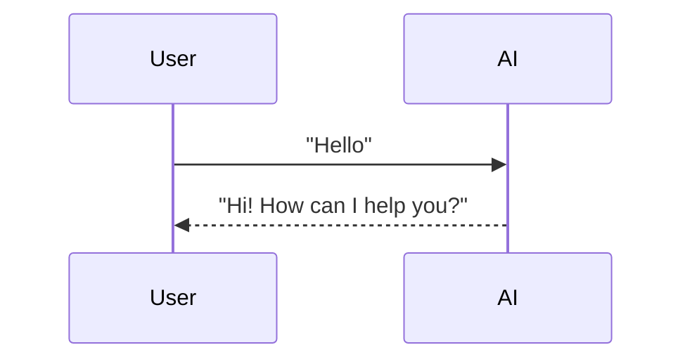

# AI Friend

## Overview
This repository contains code for an AI Friend project.

```mermaid
%%{init: {'theme': 'default'}}%%
sequenceDiagram
    User((User)) <--> |"WebRTC / PCM"| Frontend[Next.js Frontend]
    Frontend --> |"SignalR"| Backend
    Backend --> |"TTS"| User
    User --> |"Voice Input"| Frontend
    Frontend --> |"Voice Output"| User
```

```mermaid
%%{init: {'theme': 'default'}}%%
sequenceDiagram
    participant User
    participant AI
    User ->> AI: "Hello"
    AI -->> User: "Hi! How can I help you?"
```

## Installation
Follow the installation instructions to get started with the AI Friend project.

## Usage
Usage instructions will be provided here.