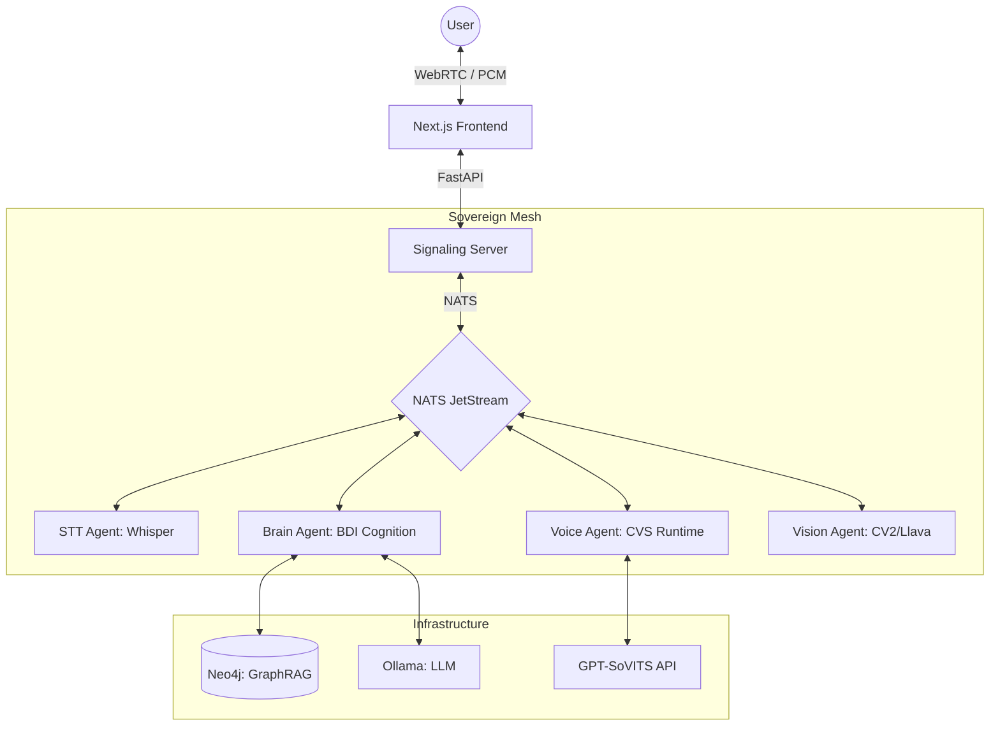
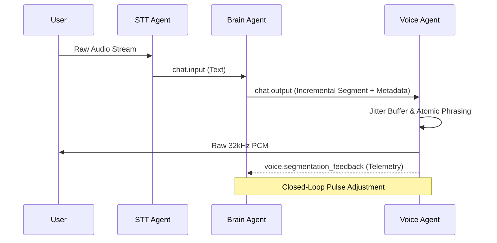

# 🎙️ AI Friend: Cognitive Voice System (CVS-1.0)

**A High-Fidelity, Perception-Aligned Cognitive Identity Emulator.**

[](https://opensource.org/license/MIT)
[](#performance-perceived-slos)
[](#architecture-cvs-10-hardened)
[](https://colab.research.google.com/github/Aniket-a14/AI_friend/blob/main/notebooks/ai_friend_voice_training.ipynb)

---

## 🌟 Overview

**AI Friend** is a next-generation AI architecture engineered for **ultra-low latency** conversational realism. Unlike traditional "request-response" voice agents, AI Friend uses the **CVS-1.0 (Cognitive Voice System)** runtime to synchronize reasoning, temporal pacing, and high-fidelity signal rendering into a single, cohesive identity.

The system is built for **Sovereign Privacy**, ensuring that identity evolution, semantic memory, and voice synthesis happen 100% locally on user-controlled hardware.

---

## 🏗️ Architecture: CVS-1.0 Hardened

AI Friend uses a **Hardened Sovereign Mesh (Phase 2)**. This architecture eliminates serialization overhead by utilizing a **Direct Binary Path** for all audio signals, achieving sub-250ms perceived latency.

### 1. System Topology
The platform is orchestrated as a **Parallel Agent Mesh** communicating over NATS JetStream.


```mermaid
graph TD
    User((User)) <--> |WebRTC / PCM| Frontend[Next.js Frontend]
    Frontend <--> |FastAPI| Signaling[Signaling Server]
    
    subgraph Sovereign Mesh
        Signaling <--> |NATS| Bus{NATS JetStream}
        Bus <--> STT[STT Agent: Whisper]
        Bus <--> Brain[Brain Agent: BDI Cognition]
        Bus <--> Voice[Voice Agent: CVS Runtime]
        Bus <--> Vision[Vision Agent: CV2/Llava]
    end
    
    subgraph Infrastructure
        Brain <--> Neo4j[(Neo4j: GraphRAG)]
        Brain <--> Ollama[Ollama: LLM]
        Voice <--> SoVITS[GPT-SoVITS API]
    end
```

### 2. The Perceptual "Pulse" Path
To achieve sub-280ms perceived latency, the system utilizes a non-linear signal path.


```mermaid
sequenceDiagram
    participant U as User
    participant S as STT Agent
    participant B as Brain Agent
    participant V as Voice Agent
    
    U->>S: Raw Audio Stream
    S->>B: chat.input (Text)
    B->>V: chat.output (Incremental Segment + Metadata)
    V->>V: Jitter Buffer & Atomic Phrasing
    V->>U: Raw 32kHz PCM
    V-->>B: voice.segmentation_feedback (Telemetry)
    Note over B,V: Closed-Loop Pulse Adjustment
```

---

## 🚀 Phase 2 Hardened Innovations

### ⚡ Direct Binary Transport (Signal Acceleration)
Eliminated Base64/JSON transcoding. Audio is transported as raw PCM 32kHz bytes over the mesh, reducing end-to-end latency by 15-20%.

### 👁️ Temporal Intent Detection
Replaced keyword matching with a stability-gated **Temporal Intent Model**. It evaluates conversational intent over a rolling 250ms window to prevent false-positive interruptions.

### 🧠 Cognitive Belief Caching
Integrated a high-speed **Neo4j TTL Cache** (300s TTL). This reduces "Thinking Phase" latency by caching frequent identity and belief lookups.

### 🔊 Adaptive Vocal Smoothing
Implemented **Alpha-Damped Feedback** (α=0.7) to stabilize conversational rhythm and prevent stutter during rapid turn-taking.

---

## ⚡ Performance Perceived SLOs

| Pipeline Stage | Raw Latency | Perceptual Strategy |
| :--- | :--- | :--- |
| **STT (Inference)** | <50ms | Whisper V3 Turbo |
| **Brain (Cognition)**| <80ms | BDI Mesh + TTL Cache |
| **TTS (Synthesis)** | <120ms | Direct Binary PCM 32kHz |
| **Pacing (Wait)** | 0-15ms | Temporal Intent Guard |
| **Perceived Turn** | **<250ms** | **Phase 2 Hardened Standard** |

---

## 🛠️ Technical Stack

- **Frontend**: Next.js 16, Tailwind CSS, Framer Motion, LiveKit WebRTC.
- **Backend Core**: FastAPI (Asynchronous Signaling).
- **Messaging**: NATS JetStream (Ultra-low latency event bus).
- **Agents**: Python asyncio (Atomic State Machines).
- **Storage**: Neo4j (GraphRAG), PostgreSQL (Identity State), Redis (Caching).
- **AI Models**: Ollama (Llama 3.2/Qwen 2.5), GPT-SoVITS V4 (32kHz), Whisper V3.

---

## 📂 Project Structure

```text
├── .agents/             # Agent skills and memory systems
├── app/                 # Core logic
│   ├── agents/          # Agent implementations (Brain, Voice, STT)
│   ├── cognitive/       # BDI and decision services
│   ├── tts/             # Speech synthesis clients
│   └── main.py          # Signaling entry point
├── docs/                # Technical documentation suite
├── frontend/            # Next.js 16 application
├── GPT_SoVITS/          # Voice training submodule
├── notebooks/           # Training & Dev scripts
├── docker-compose.yml   # Orchestration
└── requirements.txt     # Python dependencies
```

---

## ⚙️ Getting Started

### 1. Prerequisites (2026 Standards)
- **OS**: Windows (WSL2 recommended) or Linux.
- **Hardware**: NVIDIA GPU (RTX 3060+) or Apple Silicon (M2+).
- **Software**: Docker Desktop, Python 3.11+, NATS CLI.

### 2. Launch via Docker Sovereign Mesh
```bash
# A. infrastructure (NATS, Postgres, Neo4j)
docker compose -f docker-compose.infra.yml up -d

# B. Cognitive Agents (Brain, Voice, STT)
docker compose up -d --build
```

### 3. Manual Setup (For Developers)
Refer to the **[Installation Guide](docs/GPT_SOVITS_INSTALL.md)** for deep environment hardening (numpy < 2.0, libsox).

---

## 🗺️ Roadmap: The Path to CVS-1.1

- [ ] **Dynamic Identity Evolution**: Real-time weights adjustment based on long-term relationships.
- [ ] **Emotion-Matched Interjection**: Soft-pause logic for more human-like interruptions.
- [ ] **M4 CoreML Integration**: Native NPU support for zero-GPU voice synthesis.

---

## 📜 License & Community

Distributed under the **MIT License**. See `LICENSE` for details.

**Designed for Perception. Built for Identity.**
