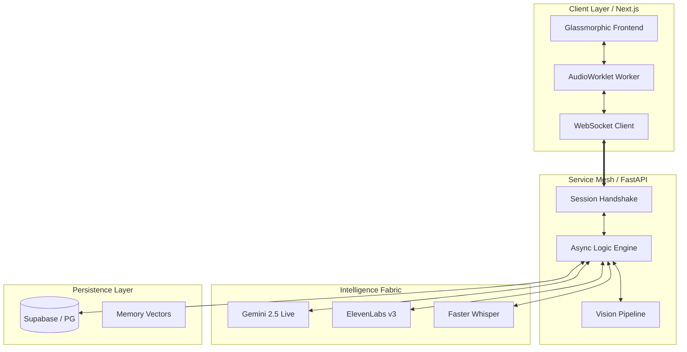

# 🎙️ AI Friend Enterprise v2.2.0
> **The Gold Standard for Native Multimodal AI Companions**

[](https://github.com/Aniket-a14/Ai_friend/actions/workflows/ci.yml)
[](https://github.com/Aniket-a14/Ai_friend/actions/workflows/release.yml)
[](https://opensource.org/licenses/MIT)


AI Friend is a sophisticated, enterprise-grade, real-time voice-interactive AI platform. Unlike traditional "STT -> Text -> TTS" loops, this platform utilizes a **Native Multimodal** approach via **Gemini 2.5 Live**, delivering sub-300ms latency and authentic visual-vocal situational awareness.

---

### 🏛️ Executive Summary
The AI Friend platform is designed to bridge the gap between robotic utilities and human-like digital companions. By combining **Native Multimodal Intelligence** with a **Persistent Memory Architecture**, it enables businesses and developers to deploy agents that don't just "process" but "interact" with authentic emotional intelligence, temporal awareness, and persistent personality growth.

---

## 🛡️ Core Capabilities (Enterprise Hardened)

- **⚡ Ultralow Latency (Sub-300ms)**: Achieved through bidirectional binary WebSockets, modern **AudioWorklet** capture, and non-blocking asynchronous Python I/O.
- **👁️ Visual Grounding**: Real-time 1 FPS vision stream (supporting both Screen Capture and Webcam) integrated directly into the LLM's sensory context.
- **🔐 Industrial-Strength Stability**: High-concurrency handshake logic with **Silent Handoff** and session-locking to prevent "Duplicate Connection" race conditions common in rapid React development.
- **📚 Multi-Layer Memory (RAG)**: Persistent state management using **PostgreSQL/Supabase**, featuring Short-term (Exact), Blurry (Session Context), and Core (Long-term Identity) layers.
- **🎭 Native Vocal Cues**: Direct streaming of PCM audio allowing for expressive tags like `[laughs]`, `[whispers]`, and organic interruptions (barge-in).
- **🌍 Character Agnostic**: Fully configurable identity via the `AI_NAME` environment variable, making it perfect for custom "Digital Human" applications.

## 🏗️ System Architecture


```mermaid
graph TB
    subgraph Client_Layer [Client Layer / Next.js]
        UI[Glassmorphic Frontend]
        AW[AudioWorklet Worker]
        WS_C[WebSocket Client]
    end

    subgraph Service_Mesh [Service Mesh / FastAPI]
        AL[Async Logic Engine]
        EH[Session Handshake]
        VP[Vision Pipeline]
    end

    subgraph Intelligence_Fabric [Intelligence Fabric]
        GL[Gemini 2.5 Live]
        EL[ElevenLabs v3]
        FW[Faster Whisper]
    end

    subgraph Persistence_Layer [Persistence Layer]
        DB[(Supabase / PG)]
        RAG[Memory Vectors]
    end

    UI <--> AW
    AW <--> WS_C
    WS_C <==> EH
    EH <--> AL
    AL <--> VP
    AL <--> GL
    AL <--> EL
    AL <--> FW
    AL <--> DB
```

### 🛠️ Core Technology Matrix

| Layer | Technology | Enterprise Advantage |
| :--- | :--- | :--- |
| **Intelligence** | Google Gemini 2.5 Live | Native Multimodal Speech-to-Speech (eliminates 1.5s STT/TTS lag) |
| **Backend** | Python 3.10+ / FastAPI | High-Concurrency Async/IO with custom `pyaudio` optimization |
| **Frontend** | Next.js 14 / React | Server-side rendering with low-latency client-side `AudioWorklet` |
| **Real-time** | WebSockets (Binary) | Raw PCM 16-bit 16kHz/24kHz bi-directional binary streams |
| **Database** | Supabase (PostgreSQL) | High-concurrency state management with row-level security |
| **Voice** | ElevenLabs v3 | Premium vocal cues for "Emotional Monologue" grounding |

---

## � Getting Started

### Prerequisites
- **Docker & Docker Compose** (Recommended)
- **Node.js 22+** (For manual frontend setup)
- **Python 3.10+** (For manual backend setup)
- **Supabase Account** (For memory persistence)

### 🏁 Standard Deployment (Docker)
The fastest way to experience the high-performance pipeline:

1. **Populate Environment Variables**:
   ```bash
   cp backend/.env.example backend/.env
   cp frontend/.env.example frontend/.env
   ```
2. **Launch the Container Stack**:
   ```bash
   docker-compose up --build -d
   ```
3. **Access the Interface**: Navigate to `http://localhost:3000`.

### 🔧 Developer Setup (Manual)
For those extending the core logic or UI:

**Backend**:
```bash
cd backend
python -m venv .venv
source .venv/bin/activate
pip install -r requirements.txt
python main.py
```

**Frontend**:
```bash
cd frontend
npm install
npm run dev
```

---

## ⚙️ Operational Excellence & Governance

This platform incorporates industry-standard patterns for security, reliability, and maintenance.

### 🛡️ Security Framework
- **Secrets Management**: Configured via non-committed `.env` files with automated `.env.example` templates.
- **Micro-Audits**: Weekly container vulnerability scans (Trivy) and static code analysis (CodeQL) via GitHub Actions.
- **Communcation**: Enforced TLS/SSL for all production WebSocket and REST traffic.
- **Handshake Integrity**: State-managed connection guards to prevent protocol-level flooding or duplicate spoofing.

### 📊 Observability & Reliability
- **Heartbeat Monitoring**: Integrated `AutonomyEngine` for background simulation health checks.
- **Async Traceability**: Structured logging in `main.py` tracks multimodal session state transitions.
- **Resilience Strategy**: 
    - **Frontend**: Exponential backoff reconnection logic.
    - **Backend**: Silent reference handoff for zero-downtime reconnections.

### 🚀 Scalability & Deployment
- **Containerization**: Standardized Docker/Docker-Compose manifests for identical Dev/Staging/Prod environments.
- **Hybrid Infrastructure**: 
    - **Edge Storage**: Session context managed via Supabase (Global PG).
    - **Scale-out ready**: Multi-socket awareness in `main.py` designed for stateless handoff.

---

## 📄 Documentation Index
- [📚 Deployment Guide](./DEPLOYMENT.md) - Production infrastructure best practices.
- [🔌 API Specification](./API_SPEC.md) - Deep dive into binary WebSocket protocols & REST.
- [🤝 Contributing](./CONTRIBUTING.md) - Engineering standards & PR workflows.

## 📄 License
MIT License. **Enterprise Ready.** Remix and build at scale.

