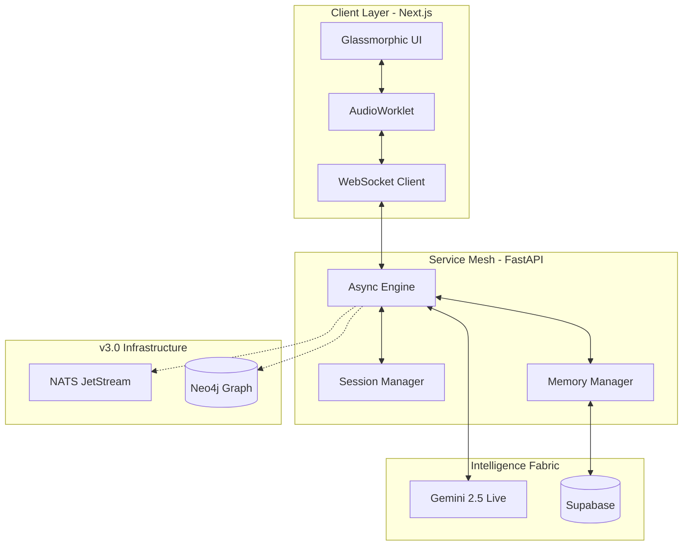

# 🎙️ AI Friend

**Enterprise-Grade Real-Time Multimodal AI Companion**

[](https://github.com/Aniket-a14/Ai_friend/actions/workflows/ci.yml)
[](https://github.com/Aniket-a14/Ai_friend/actions/workflows/links.yml)
[](https://opensource.org/licenses/MIT)
[](https://github.com/Aniket-a14/Ai_friend/releases)
[](https://github.com/Aniket-a14/Ai_friend/tags)
[](https://www.python.org/)
[](https://nodejs.org/)
[](https://fastapi.tiangolo.com/)
[](https://nextjs.org/)
[](https://www.docker.com/)
[](https://github.com/Aniket-a14/Ai_friend/stargazers)
[](https://github.com/Aniket-a14/Ai_friend/network/members)
[](https://github.com/Aniket-a14/Ai_friend/issues)
[](https://github.com/Aniket-a14/Ai_friend/pulls)

---

## 🌟 Overview

AI Friend is a sophisticated, enterprise-grade, real-time voice-interactive AI platform that transcends traditional chatbot limitations. Unlike conventional "STT → Text → TTS" pipelines that introduce 1.5s+ latency, this platform leverages **Native Multimodal Intelligence** via **Gemini 2.5 Live API**, achieving **sub-300ms** response times with authentic visual-vocal situational awareness.

The system is designed to bridge the gap between robotic utilities and human-like digital companions, enabling businesses and developers to deploy agents that don't just "process" but truly "interact" with emotional intelligence, temporal awareness, and persistent personality growth.

---

## 🔄 Evolution (v2.2.0 → v3.0)

### Current State (v2.2.0 - Production Ready)
```
✅ Gemini 2.5 Live API Integration
✅ Sub-300ms Native Multimodal Processing
✅ Real-time Vision (Screen/Camera) at 1 FPS
✅ Multi-Layer RAG Memory (PostgreSQL/Supabase)
✅ Enterprise CI/CD & Security Hardening
✅ Docker-Based Deployment
```

### Future Vision (v3.0 - Infrastructure Deployed)
```
🚧 Local Brain: Llama 3.2 / Qwen 2.5 via Ollama/vLLM
🚧 Local Voice: Coqui XTTS v2 / GPT-SoVITS (Voice Cloning)
🚧 GraphRAG Memory: Neo4j Knowledge Graph
🚧 Event-Driven Mesh: NATS JetStream Micro-Agents
🚧 WebRTC Transport: Ultra-Low Latency (<150ms)
🚧 Full-Duplex Audio: Moshi/Ultravox Integration
```

> **Important**  
> v3.0 infrastructure (NATS + Neo4j) is deployed and operational. See [V3_INFRASTRUCTURE.md](./V3_INFRASTRUCTURE.md) and [v3_roadmap.md](./V3_ROADMAP.md) for implementation details.

---

## 🚀 Key Features

- **⚡ Ultra-Low Latency (Sub-300ms)**: Achieved through native multimodal processing, binary WebSockets, and AudioWorklet capture
- **👁️ Visual Grounding**: Real-time 1 FPS vision stream (screen capture/webcam) integrated directly into LLM context
- **🔐 Industrial-Strength Stability**: Session locking, silent handoff, and high-concurrency handshake guards
- **📚 Multi-Layer Memory (RAG)**: Short-term (exact), Blurry (session), and Core (long-term) memory layers
- **🎭 Expressive Communication**: Native vocal cues (`[laughs]`, `[whispers]`), barge-in support, and Hinglish fluency
- **🌍 Character Agnostic**: Fully configurable identity via `AI_NAME` environment variable
- **🧠 Advanced Cognition**:
  - Native Multimodal: Eliminates STT/TTS conversion lag
  - Visual Context: Screen/camera awareness in real-time
  - Persistent Memory: Relationship building across sessions
  - Tool Calling: Spotify, web search, and custom integrations

---

## 🛠️ Technology Stack

> **Note**  
> Model Evolution Status (February 2026):
> - **v2.2.0 Brain**: Production-ready with Gemini 2.5 Live API
> - **v3.0 Brain**: Infrastructure deployed (NATS + Neo4j). Local LLM integration in progress.
> - **Current Action**: The system is fully functional with Gemini. v3.0 components are being incrementally integrated.

### v2.2.0 (Current Production)

| Component | Technology | Purpose |
|:----------|:-----------|:--------|
| **Intelligence** | Google Gemini 2.5 Live | Native multimodal speech-to-speech processing |
| **Backend** | Python 3.10+ / FastAPI | High-concurrency async I/O with WebSocket support |
| **Frontend** | Next.js 14 / React | Server-side rendering with AudioWorklet capture |
| **Real-time** | WebSockets (Binary) | Raw PCM audio streaming (16-bit, 16kHz/24kHz) |
| **Database** | Supabase (PostgreSQL) | Persistent memory with vector embeddings |
| **Voice** | ElevenLabs v3 | Premium vocal synthesis (optional) |
| **Vision** | Gemini 1.5 Flash | Screen/camera understanding |

### v3.0 (Infrastructure Deployed)

| Component | Technology | Purpose |
|:----------|:-----------|:--------|
| **Event Bus** | NATS JetStream | Microsecond-latency agent communication |
| **Knowledge Graph** | Neo4j | Relationship-based persistent memory |
| **Local LLM** | Ollama / vLLM | Privacy-first local inference (planned) |
| **Voice Synthesis** | Coqui XTTS v2 | Local voice cloning (planned) |
| **Transport** | WebRTC (LiveKit) | Sub-150ms audio/video streaming (planned) |

---

## ⚙️ Configuration

The application is configured via Environment Variables. Create `.env` files in the `backend/` and `frontend/` directories:

### Backend Configuration (`backend/.env`)

```bash
# === Core Settings ===
AI_NAME=AI Friend                    # Name of your AI companion
LOCATION_CONTEXT=Global              # Regional context (e.g., "Mumbai, India")
DEBUG=False                          # Enable debug logging

# === API Keys (Required) ===
GEMINI_API_KEY=your_gemini_key_here  # Google Gemini API
SUPABASE_URL=your_supabase_url       # PostgreSQL database URL
SUPABASE_KEY=your_supabase_key       # Supabase service key

# === API Keys (Optional) ===
ELEVENLABS_API_KEY=your_key_here     # Premium voice synthesis

# === Advanced Settings ===
ALLOWED_ORIGINS=http://localhost:3000  # CORS allowed origins
MAX_MEMORY_ITEMS=100                   # Maximum memory entries
VISION_FPS=1                           # Vision capture frame rate (0.5-2)
```

### Frontend Configuration (`frontend/.env`)

```bash
NEXT_PUBLIC_BACKEND_URL=http://localhost:8000  # Backend API endpoint
```

---

## 🏗️ Architecture


```mermaid
graph TB
    subgraph Client [Client Layer - Next.js]
        UI[Glassmorphic UI]
        AW[AudioWorklet]
        WS[WebSocket Client]
    end
    
    subgraph Backend [Service Mesh - FastAPI]
        API[Async Engine]
        Session[Session Manager]
        Memory[Memory Manager]
    end
    
    subgraph Intelligence [Intelligence Fabric]
        Gemini[Gemini 2.5 Live]
        DB[(Supabase)]
    end
    
    subgraph V3 [v3.0 Infrastructure]
        NATS[NATS JetStream]
        Neo4j[(Neo4j Graph)]
    end
    
    UI <--> AW
    AW <--> WS
    WS <--> API
    API <--> Session
    API <--> Memory
    API <--> Gemini
    Memory <--> DB
    API -.-> NATS
    API -.-> Neo4j
```

**For detailed architecture documentation, component breakdowns, data flow diagrams, and design decisions, see [ARCHITECTURE.md](./ARCHITECTURE.md)**

---

## ⚡ Getting Started

### Prerequisites

- **Docker & Docker Compose** (Recommended for fastest setup)
- **Node.js 22+** (For manual frontend development)
- **Python 3.10+** (For manual backend development)
- **API Keys**:
  - [Google Gemini API Key](https://aistudio.google.com/app/apikey) (Required)
  - [Supabase Account](https://supabase.com/) (Required for memory)
  - [ElevenLabs API Key](https://elevenlabs.io/) (Optional for premium voice)

### Method 1: Docker (Recommended - Fast & Production-Ready)

```bash
# 1. Clone the repository
git clone https://github.com/Aniket-a14/AI_friend.git
cd AI_friend

# 2. Configure Environment Variables
cp backend/.env.example backend/.env
cp frontend/.env.example frontend/.env

# Edit backend/.env with your API keys:
# - GEMINI_API_KEY=your_gemini_key_here
# - SUPABASE_URL=your_supabase_url
# - SUPABASE_KEY=your_supabase_key

# Edit frontend/.env with backend URL:
# - NEXT_PUBLIC_BACKEND_URL=http://localhost:8000

# 3. Start Services
docker-compose up --build
```

**Access Points**:
- Frontend: http://localhost:3000
- Backend API: http://localhost:8000
- API Docs: http://localhost:8000/docs

### Method 2: Manual Development (For Contributors)

#### Backend Setup

```bash
cd backend

# Create virtual environment
python -m venv .venv

# Activate (Windows)
.venv\Scripts\activate

# Activate (Linux/Mac)
source .venv/bin/activate

# Install dependencies
pip install -r requirements.txt

# Configure environment
cp .env.example .env
# Edit .env with your API keys

# Run the server
python main.py
```

#### Frontend Setup

```bash
cd frontend

# Install dependencies
npm install

# Configure environment
cp .env.example .env
# Edit .env with backend URL

# Run development server
npm run dev
```

### Method 3: v3.0 Infrastructure (Optional - For Advanced Users)

```bash
# Start NATS JetStream and Neo4j
docker compose -f docker-compose.infra.yml up -d

# Verify infrastructure
backend\.venv\Scripts\python.exe demo_memory_agent.py

# Access Neo4j Browser
# URL: http://localhost:7474
# Username: neo4j
# Password: password123
```

---

## 🖥️ Windows Support & Troubleshooting

### Common Issues

#### 1. WebSocket Connection Failed
**Symptom**: "Connection refused" errors  
**Solution**:
```bash
# Check if backend is running
curl http://localhost:8000/status

# Check Docker containers
docker ps

# View backend logs
docker logs ai_friend-backend-1
```

#### 2. AudioWorklet Not Working
**Symptom**: No audio capture in browser  
**Solution**: Ensure you're using HTTPS or `localhost` (required for AudioWorklet API)

#### 3. Gemini API Rate Limits
**Symptom**: 429 errors in logs  
**Solution**: Implement exponential backoff or upgrade to paid tier

#### 4. Neo4j Connection Failed (v3.0)
**Symptom**: "Unable to connect to bolt://localhost:7687"  
**Solution**:
```bash
# Verify Neo4j is running
docker ps | grep neo4j

# Check Neo4j logs
docker logs brain_graph

# Restart infrastructure
docker compose -f docker-compose.infra.yml restart
```

---

## 🔌 API Reference

The backend exposes a RESTful and WebSocket API. Full Swagger documentation available at `/docs`.

### WebSocket Endpoint

**`/ws`** - Main Voice Interface  
**Protocol**: Binary WebSocket  
**Audio Format**: PCM 16-bit, 16kHz mono

```javascript
// Client Example
const ws = new WebSocket('ws://localhost:8000/ws');
ws.binaryType = 'arraybuffer';

// Send audio
ws.send(pcmAudioBuffer);

// Receive audio
ws.onmessage = (event) => {
  const audioData = new Int16Array(event.data);
  playAudio(audioData);
};
```

### REST Endpoints

#### `GET /status`
Health check endpoint

**Response**:
```json
{
  "status": "healthy",
  "version": "2.2.0",
  "uptime": 3600
}
```

#### `POST /memory/store`
Store a memory entry

**Request**:
```json
{
  "content": "User's favorite color is blue",
  "type": "preference",
  "importance": 0.8
}
```

---

## 🧪 "Skills" & Best Practices Incorporated

This project demonstrates progressive engineering practices across three disciplines:

### 1. Senior Data Scientist
- **Multi-Layer RAG**: Short-term, blurry, and core memory optimization
- **Vector Embeddings**: Semantic similarity search for context retrieval
- **Temporal Decay**: Relevance scoring based on recency

### 2. Senior Backend Engineer
- **Async I/O**: Non-blocking WebSocket handling for high concurrency
- **Session Management**: State locking and silent handoff for zero-downtime
- **Event-Driven Architecture**: NATS-based micro-agent choreography (v3.0)
- **Security**: TLS, CORS, rate limiting, and secret management

### 3. Senior Frontend Engineer
- **AudioWorklet**: High-performance audio capture (~10ms latency)
- **Binary WebSockets**: Raw PCM streaming without codec overhead
- **React Optimization**: Server components and lazy loading
- **Glassmorphism**: Modern UI with framer-motion animations

---

## 📂 Project Structure

```
AI_Friend/
├── .agent/                      # Agent Skills & Workflows
│   ├── skills/                  # Development best practices
│   └── workflows/               # Deployment procedures
├── .github/workflows/           # CI/CD Pipelines
│   ├── ci.yml                   # Continuous Integration
│   ├── release.yml              # Release Automation
│   └── codeql.yml               # Security Scanning
├── backend/                     # Python FastAPI Service
│   ├── app/
│   │   ├── agents/              # v3.0 Micro-Agents
│   │   │   └── base.py          # BaseAgent abstraction
│   │   ├── knowledge/           # GraphRAG Components
│   │   │   ├── graph_db.py      # Neo4j connector
│   │   │   └── triple_extractor.py
│   │   ├── gemini_live.py       # Gemini Live client
│   │   ├── llm.py               # LLM orchestration
│   │   └── memory_store.py      # RAG memory layer
│   ├── tools/                   # Client tools (Spotify, Web)
│   ├── .env.example             # Environment template
│   ├── Dockerfile               # Backend container
│   ├── main.py                  # FastAPI application
│   └── requirements.txt         # Python dependencies
├── frontend/                    # Next.js 14 Application
│   ├── app/                     # App Router
│   │   ├── page.tsx             # Landing page
│   │   └── layout.tsx           # Root layout
│   ├── components/              # React Components
│   │   ├── VoiceInterface.tsx   # Main voice UI
│   │   └── AudioWorklet.ts      # Audio capture
│   ├── public/                  # Static assets
│   ├── .env.example             # Frontend env template
│   ├── Dockerfile               # Frontend container
│   └── package.json             # Node dependencies
├── docker-compose.yml           # v2.2.0 Application Stack
├── docker-compose.infra.yml     # v3.0 Infrastructure Stack
├── demo_memory_agent.py         # v3.0 Demo Script
├── ARCHITECTURE.md              # Technical Deep-Dive
├── V3_INFRASTRUCTURE.md         # v3.0 Setup Guide
├── API_SPEC.md                  # API Documentation
├── DEPLOYMENT.md                # Production Deployment
├── CONTRIBUTING.md              # Contribution Guidelines
├── SECURITY.md                  # Security Policy
└── README.md                    # This file
```

---

### Resources

- [Documentation](./ARCHITECTURE.md)
- [API Reference](./API_SPEC.md)
- [Deployment Guide](./DEPLOYMENT.md)

## 📜 License

Released under the **MIT License**. See [LICENSE](./LICENSE) for details.

**Enterprise Ready.** Remix and build at scale.

