# AI Friend v2.1.11 - Human-like Voice Companion 🎙️✨

AI Friend is a sophisticated, real-time voice-interactive AI assistant designed to feel like a natural companion rather than a robotic utility. It features **near-instantaneous responses**, **expressive vocal cues**, and a **human-like "soul"**.


[](https://github.com/Aniket-a14/Ai_friend/actions/workflows/ci.yml)
[](https://github.com/Aniket-a14/Ai_friend/actions/workflows/links.yml)
[](https://github.com/Aniket-a14/Ai_friend/actions/workflows/release.yml)
[](https://github.com/Aniket-a14/Ai_friend/releases)


## 🌟 Key Features (The Humanized Era)

- **⚡ Memory v2 (Imperfect Memory)**: Features Short-term, Blurry, and Core memory layers for human-like recall.
- **⏰ Biological Clock**: Awareness of time passage, absences, and simulated day/night energy cycles.
- **🌱 Human Growth Engine**: Learns and evolves her personality based on past conversations.
- **🎭 Expressive Voice**: Uses emotional context and vocal tags like `[laughs]`, `[sighs]`, and `[whispers]` via ElevenLabs v3.
- **☁️ Persistent Soul**: Syncs personality and growth with Supabase (PostgreSQL) for a continuous friendship.

## 🏗️ Architecture

```mermaid
graph TD
    User([User 👤]) <-->|WebSocket Audio| Frontend[Next.js Frontend 🖥️]
    Frontend <-->|WebSocket| Backend[FastAPI Backend 🐍]
    Backend -->|Text| LLM[Google Gemini 2.5 Pro 🧠]
    LLM -->|Text| Backend
    Backend -->|Text| TTS[ElevenLabs v3 🗣️]
    TTS -->|Audio Chunk| Backend
    Backend -->|Audio Chunk| Frontend
    Backend <-->|Context/Memory| DB[(Supabase DB 🗄️)]
```



### 1. Backend (Python/FastAPI)
The core logic engine:
- **Intelligence**: Google Gemini 2.5 Pro with internal emotional monologue.
- **Voice**: ElevenLabs v3 for ultra-realistic speech synthesis.
- **STT**: Faster Whisper for low-latency speech transcription.
- **Store**: Supabase (via asyncpg) for low-latency session and context management.

### 2. Frontend (Next.js/React)
A sleek, reactive interface:
- **Audio Engine**: Real-time 16bit PCM capture (16kHz) and playback (24kHz) via WebSockets.
- **Visualizer**: A dynamic "Assistant Circle" that pulses and morphed based on AI heartbeats.
- **Resilience**: Adaptive reconnect logic with exponential backoff for stable mobile usage.

## 📂 Project Structure

```bash
├── .github/          # CI/CD Workflows
├── backend/          # Python FastAPI application
│   ├── app/          # Core logic (audio, llm, tts)
│   ├── tests/        # Pytest suites
│   └── main.py       # Entry point
├── frontend/         # Next.js 14 application
│   ├── app/          # App Router pages
│   └── components/   # React UI components
├── API_SPEC.md       # API Specification
└── README.md         # You are here
```

## 🔧 Configuration

The project is configured via environment variables. Copy `.env.example` to `.env` in both `backend` and `frontend`.

### Backend `.env`
| Variable | Description |
|----------|-------------|
| `GOOGLE_API_KEY` | Gemini API Key |
| `ELEVENLABS_API_KEY` | ElevenLabs API Key |
| `SUPABASE_URL` | Supabase Project URL |
| `SUPABASE_KEY` | Supabase Anon Key |

### Frontend `.env`
| Variable | Description |
|----------|-------------|
| `NEXT_PUBLIC_WS_URL` | WebSocket URL for Backend (e.g., `ws://localhost:8000`) |


## 🏁 Getting Started

### The Quick Way (Docker)
Ensure you have Docker and Docker Compose installed:
1. Populate your `.env` files in `backend/` and `frontend/`.
2. Run:
```bash
docker-compose up --build
```
Access the assistant at `http://localhost:3000`.

### The Manual Way
See the detailed setup guides in each subdirectory:
- [Backend Setup](./backend/README.md)
- [Frontend Setup](./frontend/README.md)

## ⚙️ Production Workflows

This project uses advanced GitHub Actions for production readiness:

- **🛡️ Security**: Weekly container vulnerability scans (Trivy) and code security analysis (CodeQL).
- **📦 Release Automation**: Automated Docker builds and GHCR publishing on every `v*` tag.
- **🧹 Maintenance**: Dependabot for dependency updates and Stale Bot for issue management.
- **✅ Quality Assurance**: Automated linting (ESLint/Flake8) and documentation link checking.

## 📄 Documentation
- [Deployment Guide](./DEPLOYMENT.md) - How to go live.
- [API Specification](./API_SPEC.md) - WebSocket & REST reference.

## 🤝 Contributing
We welcome contributions! Please see [CONTRIBUTING.md](./CONTRIBUTING.md) for details on how to get started, our coding standards, and the pull request process.

## 📄 License
MIT License. Feel free to build, remix, and share.

