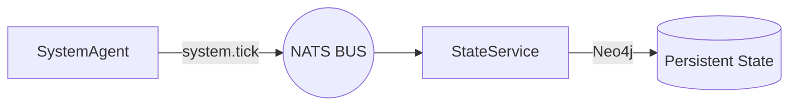

# 🎭 Identity Continuity System (CVS-1.0)

> **"Identity is not a reaction; it is a trajectory."**

The CVS-1.0 Identity System is designed to create the illusion of a continuous, human-like presence. It shifts the agent from a reactive "Think-Speak" pipeline to a persistent **State-Driven Identity Mesh**.

Identity is treated as runtime state, not only as prompt text. The prompt describes boundaries and style, but continuity depends on shared ownership of the live identity object, emotional state that does not rewind, and memory that appears with the restraint of human recollection.

---

## 1. The Mesh Heartbeat (`system.tick`)

Identity maturation occurs continuously, even when conversation is inactive. This is orchestrated via a NATS-level broadcast.

- **`SystemAgent`**: Emits a `system.tick` every 60s (configurable).
- **Idle Evolution**: The `StateService` listens for these ticks to apply incremental decay to internal variables.
  - **Mood**: Drifts slowly towards a neutral baseline.
  - **Energy**: Recovers gradually during periods of rest.
  - **Trust/Attachment**: Moves as a function of time and recent interaction valence.
- **Live State Read Safety**: Current mood, energy, trust, and attachment are read without graph TTL cache. After state persistence, graph cache is invalidated so the agent cannot accidentally hydrate stale emotional values.

---

## 2. Hybrid Identity Model

To prevent personality drift while allowing for growth, the identity is split into two behavioral layers.

### 🛡️ Immutable Core

Stored in `self.immutable_core`, these traits represent the agent's "DNA." They are never modified by the autonomous reflection loop.

- **Values**: (e.g., Privacy, Curiosity, Empathy).
- **Boundaries**: Hard constraints on behavior and data safety.
- **Base Tone**: The fundamental frequency of the agent's personality.

### 🎭 Adaptive variables

These traits are "soft" and evolve based on user interaction history.

- **Speaking Style**: Vocabulary (Hinglish), sentence length, and pacing.
- **Familiarity**: Level of formality adjusted by the `trust` state.
- **Preferences**: Topics identified as high-relevance during reflection.
- **Relationship Mode**: The agent can become more familiar, guarded, playful, or reserved based on repeated interaction evidence.

### Runtime Ownership

`CognitiveService` owns the active `IdentityManager`. `ReflectionService` receives that same instance rather than creating a separate identity owner. This keeps reflection, adaptive persona evolution, and active response generation aligned during a live session.

This distinction matters because identity drift can happen in two opposite ways:

- If every turn rewrites personality too aggressively, the agent becomes unstable.
- If reflection writes to a separate object, the agent appears frozen until restart.

CVS-1.0 uses one live identity owner and confidence-gated reflection so adaptive changes are possible but not chaotic.

---

## 3. Active Memory Surfacing

CVS-1.0 uses **Proactive Recall** rather than passive retrieval, utilizing a dual-channel cognitive architecture.

The **`SurfacingAgent`** runs in the background, alternating between two recall channels:
- **Episodic Channel (pgvector)**: Recalls specific past events, scored using ACT-R base-level activation and Bower's mood-congruent alignment (recalling sad memories when sad).
- **Semantic Channel (Neo4j)**: Extracts structured facts and relational knowledge based on the current conversational context.

- **Narrative Formatting**: Episodic memories are not surfaced as flat strings. They are constructed into Tulving-style narrative episodes with temporal labels ("last week") and emotional context, allowing the agent to bond over shared history ("Remember when we...").
- **Asynchronous Triggers**: Relevant memories are published as `memory.surfaced` mesh events.
- **Decision Blackboard**: The `CognitiveService` buffers these "surfaced" thoughts and injects them into the current decision loop, allowing the agent to "spontaneously" bring up past moments.
- **Novelty Window**: Recently surfaced memories are suppressed temporarily so recall feels selective rather than repetitive.
- **No Passive Refresh**: Surfaced memories do not refresh their own `last_recalled_at`, preventing a feedback loop where the same memory becomes more likely to surface because it just surfaced.

Human-like recall should be suggestive and occasional. A memory can color tone, familiarity, or a question, but it should not be recited every time a semantically adjacent topic appears.

---

## 4. Expressive Temporal Layer (Timing markers)

Timing is a first-class cognitive citizen in CVS-1.0. The agent communicates cognitive load and emotional weight through intentional silence.

### Temporal Tags

The BrainAgent injects structured tags into the LLM stream:

- `<pause=ms>`: Adds a deterministic silence duration (e.g., `<pause=500ms>`).
- `<hesitate>`: Adds a randomized 250-450ms hesitation buffer.

### Signal Execution

The **VoiceAgent** parses these tags and, instead of synthesizing them as text, injects **zeroed PCM buffers** directly into the 32kHz audio stream. This ensures that the pause is physically part of the audio signal, not just a playback delay.

### Affect Is Not Spoken Markup

Earlier prompt contracts required `<emotion ...>` wrappers. CVS-1.0 now treats those wrappers as legacy control markup. `ActionService` strips them before TTS if they appear, and new prompts instruct the model not to emit them. Emotion should be carried as metadata (`emotion`, `emotional_intensity`, `speaking_rate`) while text remains natural speech plus timing markers only.

---

## 5. Configuration & Tuning

All identity parameters are centralized in `config.py`:

- `SYSTEM_TICK_INTERVAL`: Frequency of mesh-wide maturation.
- `INTENT_THRESHOLD`: Sensitivity for interruption intent.
- `GRAPH_CACHE_TTL`: Freshness of belief hydration.

Important distinction:

- Belief and knowledge lookups may use TTL cache.
- Live identity state should not use TTL cache when hydrating current mood/trust.

---

**Designed for Perseverance. Built for Identity.**
