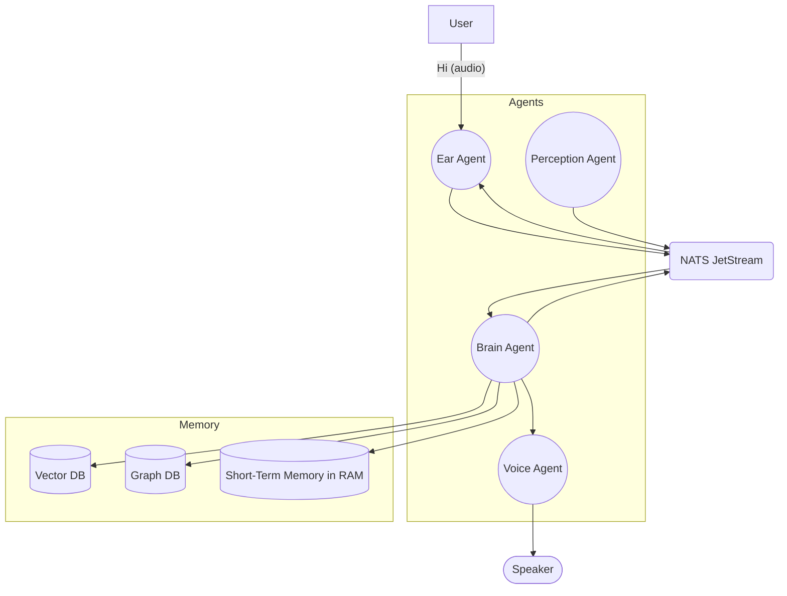
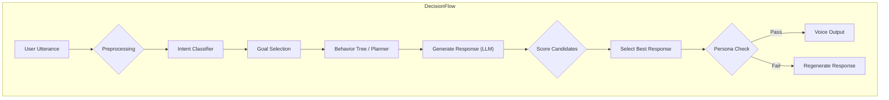

## 0.0 Phase 2 & 3: Psychological Layer & Narrative Memory (April 2026)

The cognitive core was upgraded from a generic LLM pipeline into a full Psychological Layer driven by established cognitive science models. The focus was on moving emotional evaluation out of prompt text and into fast, deterministic heuristic math.

### 0.0.1 Core Psychological Models
- **Appraisal (OCC/Lazarus/EMA)**: Event relevance, novelty, goal congruence, and relationship impact are evaluated deterministically.
- **Emotion (PAD + ALMA)**: Emotional state tracks Valence, Arousal, and Dominance, mapped to human-readable emotion labels.
- **Decision (MAUT)**: Intent generation uses Multi-Attribute Utility Theory to score social goals (ENGAGE, COMFORT, PROTECT) based on current PAD state and relationship trust.
- **Expression (Scherer + Goldman-Eisler)**: Speaking rate and pause biases are deterministically derived from emotional arousal and cognitive confidence, transmitted to the voice synthesizer as metadata.

### 0.0.2 Dual-Channel Narrative Memory
- **Episodic Channel (ACT-R)**: Long-term memory retrieval now scores memories based on Anderson & Lebiere's ACT-R base-level activation (frequency + recency) and Bower's mood-congruent recall.
- **Semantic Channel (GraphRAG)**: Extracts structured relational facts from Neo4j.
- **Narrative Formatting**: The `SurfacingAgent` now groups memory retrieval into narrative episodes, complete with temporal markers ("last week") and emotional context, enabling the LLM to organically bond over shared history rather than reciting database rows.

## 0. CVS-1.0 Runtime Continuity Fixes (Apr 19, 2026)

The runtime was reviewed specifically against the goal of human-like continuity rather than generic assistant correctness. The review focused on identity consistency, emotional stability, natural interruption handling, perceived latency, expression/cognition separation, and memory realism.

### 0.1. State Continuity Hardening

- **Live State Hydration Safety**: `StateService.hydrate_state()` no longer reads live agent mood, energy, trust, and attachment through the Neo4j TTL cache.
- **Graph Cache Invalidation**: `StateService.persist_state()` now invalidates graph cache after writing state. This prevents a fresh emotional update from being overwritten by a stale cached snapshot.
- **Design Rule**: Belief and knowledge lookups can use TTL caching, but live identity state must reflect the latest write.

### 0.2. Speculative Interruption Arbitration

- **Structured Intent Packet**: STT now publishes a structured speculative interruption hypothesis from SenseVoice, including intent name, keywords, confidence, text, timestamp, and utterance id.
- **Two-Phase Turn Taking**: VoiceAgent can pause quickly on `audio.stop` with `speculative=true`, then BrainAgent uses Whisper final text to confirm or reject the stop.
- **False Positive Recovery**: Rejected interruption hypotheses publish `audio.resume` with `reason: conflict_rejected`.
- **Final Stop Confirmation**: Confirmed stop commands publish `audio.stop` with `speculative=false`, allowing VoiceAgent to clear the stream intentionally.

### 0.3. Identity Ownership Fix

- **Single Live Identity Owner**: `CognitiveService` and `ReflectionService` now share the same `IdentityManager`.
- **Immediate Adaptive Effect**: Reflection-driven relationship or style changes can affect active response generation without waiting for a restart.
- **Persona Stability**: Immutable core remains protected, while adaptive variables can evolve through confidence-gated reflection.

### 0.4. Voice Streaming And Expression Cleanup

- **First-Audio Improvement**: VoiceAgent queues GPT-SoVITS PCM chunks as they arrive instead of waiting for the full synthesized segment.
- **Segment Formation Fix**: Brain segmentation no longer sleeps per word. It flushes based on semantic boundaries and a short adaptive formation window.
- **Control Markup Sanitization**: `ActionService` strips legacy `<emotion ...>` wrappers while preserving `<pause=...>` and `<hesitate>`.
- **Expression Boundary**: Emotion should travel as structured metadata (`emotion`, `emotional_intensity`, `speaking_rate`) rather than as spoken XML-like tags.

### 0.5. Memory Surfacing Realism

- **Novelty Suppression**: Recently surfaced memories are temporarily suppressed to avoid repetitive recall.
- **No Passive Refresh**: Surfaced memories do not refresh their own `last_recalled_at`, preventing relevance from becoming self-reinforcing.
- **Behavioral Goal**: Memory should color conversation naturally, not announce itself as repeated database retrieval.

### 0.6. Verification

Regression tests were added to `backend/tests/test_regressions.py`.

Run:

```powershell
cd backend
.\.venv\Scripts\python.exe -m pytest
```

Latest verified result:

- `48 passed`
- One non-blocking `.pytest_cache` permission warning on the local machine.

### 0.7. Durable Agent Handoff

Created `.agents/CONTEXT.md` as the persistent context ledger for future agents. Future contributors should read it before making changes and update it after modifying architecture, behavior, tests, or runtime expectations.

## 1. Project CVS-1.0: Hardened Architectural Stabilization (Apr 2026)

We have officially entered **Phase 2 Hardening**, transforming the platform into a production-resilient, binary-transport mesh.

### 1.1. Solid State Hardening: Zero-Drift Mesh Resilience (Apr 18, 2026)

The mesh has been hardened for production portability and identity continuity.

- **9-Subject Signal Bus**: NATS JetStream now covers the full cognitive loop: `chat`, `vision`, `state`, `cmd`, `voice`, `system`, `memory`, `identity`, and `knowledge`.
- **Decentralized Credential Enforcer**: Removed all hardcoded credentials. The mesh now fails securely if environment-driven secrets (e.g. `NEO4J_AUTH`) are missing or using insecure defaults.
- **Rigid Identity Seeding (Prisma 7.7.0)**: Integrated a one-way sync from local JSON genomes to the relational Postgres store, ensuring the AI's "Deep Self" is preserved across container lifecycles.
- **Acoustic Perceptual Injection**: Hardware-optimized `sherpa-onnx` (SenseVoice) injected into the STT layer for real-time temporal intent detection.
- **Wait-for-Mesh Healthchecks**: Implemented dependency-aware booting to prevent agent connection races during cold starts.

### 1.2. Architecture Refinements

- **Direct Binary Mesh**: Eliminated Base64/JSON overhead for audio signal (15-20% latency reduction).
- **Structured Temporal Intent**: SenseVoice publishes speculative interruption hypotheses that Whisper can confirm or reject.
- **Neo4j TTL Cache**: High-speed belief caching (300s TTL) for near-instant cognitive context lookups.
- **Vocal Smoothing**: Alpha-damped feedback (α=0.7) prevents conversation fragmentation under load.
- **Centralized Calibration**: Operational parameters moved to `Config` for rapid real-world tuning.

## 2. v3.1 Architecture Overview (Legacy Legacy)

**Survey:** Classical cognitive architectures include symbolic/hybrid frameworks like **Soar** and **ACT-R**, BDI, and reactive/hybrid robotics stacks. Soar and ACT-R provide unified models of memory, decision-making and learning【7†L174-L182】, but are heavy cognitive simulators rather than practical robotics solutions. The **BDI (Belief–Desire–Intention)** model offers a tractable agent framework: it explicitly separates *beliefs* (knowledge about the world), *desires* (goals), and *intentions* (committed plans)【10†L130-L139】. BDI agents “balance time between planning and executing plans”【10†L130-L139】 by selecting plans based on current beliefs. In robotics, *reactive/hybrid architectures* (e.g. Brooks’ subsumption or AuRA) combine high-level planning with real-time control【14†L9-L17】. These hybrids integrate symbolic world knowledge (for deliberation) with reactive layers (for fast response)【14†L9-L17】.

**Recommendation:** A **hybrid BDI/behavior-tree architecture** fits your modular microservices design. Map the Neo4j/PGVector memory to the agent’s beliefs (persistent knowledge). Define the agent’s goals (comfort user, provide information, perform tasks, etc.) as desires. Implement intentions via a hierarchical **Behavior Tree** (BT) or similar planner: BTs are a natural, low-latency way to encode fallbacks and priorities【25†L54-L63】. The Brain Agent can run an async loop (as you already plan) that checks its current goals/intentions against incoming inputs. In practice:

- **Beliefs:** store facts/personality in Neo4j and embeddings in PGVector; feed these into decisions.  
- **Desires/Goals:** e.g. maintain user engagement, gather info, solve problems. These can be triggered by intent classification.  
- **Intentions/Plans:** use a BT or script that sequences actions (speak, ask, act), possibly with periodic replanning. This combines well with LLM-based subroutines (e.g. using an LLM to generate a specific sentence given the intention).

This hybrid approach leverages fast reactive behavior (BTs handle common flows) while still allowing cognitive deliberation (LLM or MCTS planning for novel/social actions). It avoids the scalability limits of pure POMDP/MDP approaches (which “do not scale to complex behavior and planning”【7†L174-L182】) and bypasses the data-intensity of full RL.

## 2. Decision Systems  

**Planner Options:**  

- **Behavior Trees (BTs):** Hierarchical state-machines originally from gaming, now popular in robotics【25†L54-L63】. Pros: modular, predictable, easy to debug. They run with very low latency and handle routine reactive control. Cons: no learning/adaptation by themselves, hard to cover novel situations.  
- **Goal-Oriented Action Planning (GOAP):** A planner from game AI where actions have preconditions/effects. Pros: flexible planning, reuses actions. Cons: requires hand-authoring action definitions; planning can be costly at runtime.  
- **POMDPs (Partially Observable MDPs):** Solve stochastic planning with uncertainty. Pros: theoretically optimal for uncertainty. Cons: extremely high compute for even modest domains; impractical for real-time dialogue.  
- **MCTS (Monte Carlo Tree Search):** Sample-based search (used in AlphaZero). Pros: can generate creative multi-step plans with a reward function. Cons: high compute/latency; requires simulation or learned rollout model; not real-time friendly.  
- **Hierarchical Reinforcement Learning:** E.g. options or HAC. Pros: learns complex policies, can optimize long-term rewards (like user engagement). Cons: requires simulation/training data; costly to train, hard to adjust on-the-fly.  
- **Rule-Based / Expert Systems:** Handcrafted rules/triggers. Pros: deterministic, transparent, easy low-level QA. Cons: brittle, doesn’t adapt; cannot handle open-domain nuance.  
- **LLM-Based Orchestration:** Using a large language model as a planner (e.g. “chain of thought” or prompt engineering to pick actions). Pros: very flexible, leverages pre-trained knowledge about social norms. Cons: opaque, potentially high cost and latency, sometimes unpredictable.  

**Comparison (sample):**

| Approach          | Pros                                     | Cons                                      | Latency/Compute   |
|-------------------|------------------------------------------|-------------------------------------------|-------------------|
| Behavior Tree     | Fast, modular, interpretable【25†L54-L63】 | Limited learning, manual design           | Very low          |
| GOAP              | Flexible planning, decouples goals/actions | Heavy hand-authored domain model          | Moderate          |
| POMDP             | Handles uncertainty optimally            | Intractable for large domains            | Very high         |
| MCTS              | Can optimize long-term rewards           | Expensive search, needs rollout model    | Very high         |
| Hierarchical RL   | Learns from data, adapts to reward       | Data/training-intensive, opaque          | Training-heavy    |
| LLM Orchestration | Highly expressive, social reasoning       | Unpredictable, requires prompt engineering| High (API)        |
| Rule-Based        | Deterministic, fast                      | Inflexible, brittle                       | Very low          |

**Recommendation:** Use a *hybrid decision engine*. For real-time conversation, a **Behavior Tree** or finite-state scaffold can handle routine flows (greetings, small-talk, fallback actions). Overlay an LLM or planning sub-module for open-ended/social steps. For example: classify the user’s intent (comfort, information, etc.), select a high-level goal, then use an LLM (or a small supervised policy model) to generate the natural-language utterance that best fulfills that goal. We can even use a limited MCTS or rollouts: e.g. generate a few candidate responses via the LLM and score them by a *reward model* that captures social metrics (friendliness, user trust, engagement). The **reward** could be a weighted sum of signals like positive sentiment elicited, correct persona tone, and memory usage. A simple concrete design:  

1. **Intent Classification:** Use an LLM or classifier to guess user intent.  
2. **Goal Selection:** Map intent → goal (e.g. “I’m sad” → goal=comfort).  
3. **Response Generation:** Ask the LLM for several possible replies given the memory/context.  
4. **Scoring:** Evaluate replies with a small critic network or heuristic that checks persona consistency, empathy, and novelty.  
5. **Select/Execute:** Pick the top response, send to TTS.  
By combining a structured BT with an LLM + simple scoring, we get the best of speed and richness.  

## 3. Memory Systems  

A **hybrid memory** is ideal: use a vector store for unstructured semantic memory, and a graph DB for facts/relationships.  

- **Vector DB (FAISS / Milvus / PGVector / Qdrant, etc.):** FAISS (Meta) is a powerful library for similarity search【30†L73-L82】; Milvus offers a full DB with GPU acceleration【29†L607-L615】; PGVector (PostgreSQL extension) integrates with SQL but is slower. FAISS is fastest for pure similarity, but Milvus provides easier scaling and metadata filters【30†L73-L82】【29†L607-L615】.  
- **Graph DB (Neo4j):** Ideal for storing named entities and relationships (people, events, preferences) so the agent can query structured context (e.g. “What is user’s favorite color?”). Graph queries support traversals (e.g. trust network).  

**Memory Meta-Data:** We should annotate each memory entry with fields like:

- `importance_score` (intrinsic salience of the memory)  
- `emotional_weight` (how emotional/significant it was)  
- `last_recalled_at` (timestamp last accessed)  
- `certainty` or `confidence` (e.g. was it user-confirmed fact?)  
- `source` (who or what created the memory)  
- `version` (if updated over time).  

These support prioritization and consistency checks. For example, more emotional or frequently accessed memories get a higher priority. As Casius Lee notes, *“There’s no sense of importance”* in naive memory; we need relevance filtering【35†L121-L124】.  

**Forgetting/Decay:** Implement a time-based decay on memory relevance. For instance, multiply a memory’s recall score by `exp(-λ * (now - last_recalled_at))` as in【37†L354-L362】. This way, unused memories “fade” and won’t clutter responses (mirroring human memory decay【37†L354-L362】). Optionally, critical facts can be kept indefinitely by flag, while mundane chat comments decay.  

**Consolidation & Reflection:** Periodically (e.g. during idle cycles), the agent should **consolidate** learning: transfer short-term/episodic content into long-term memory. For example, summarize recent conversations and add salient points into the vector/graph store. This is akin to a “sleep” phase where embeddings are refreshed【37†L506-L514】.  

**Contradiction Resolution:** If conflicting memories arise (two facts about same event), use metadata to resolve: e.g. trust more recent or more emotional entries. Possibly flag contradictions to “re-learn” (ask user to clarify).  

**Retrieval Strategy:** On each query, embed the input and fetch top-*/k* results from the vector store (with PGVector or FAISS). Filter by user context (e.g. same user_id, time-window, or relationship tags). Then re-score candidates by blending semantic similarity with custom factors:  

- Give bonus for memories with high `importance_score` or `emotional_weight`.  
- Penalize by time since last recall (older = smaller).  

*Pseudo-code for memory retrieval:*  

```pseudo
function retrieve_context(query_embedding, user_id):
    // Raw search
    candidates = vectorDB.search(query_embedding, top_k=20, filter={"user_id": user_id})
    scored = []
    for m in candidates:
        sim = cosine_similarity(query_embedding, m.embedding)
        decay = exp(-λ * (now - m.last_recalled_at))
        score = sim * (m.importance_score * decay)
        if m.emotional_weight > 0:
            score *= (1 + β * m.emotional_weight)  // boost for emotion
        scored.append((score, m))
    // Sort and take top-N above threshold
    top_memories = sort_by_score(scored)[0:N]
    return [m.text for (score,m) in top_memories if score > threshold]
```

Inject the retrieved memory texts (and any relevant graph data) into the LLM prompt so the agent can “remember” them.  

## 4. Internal State & Emotion  

**Model:** Adopt a *multi-dimensional* state similar to cognitive/appraisal models. For example:  

- **Mood (valence):** a scalar ([-1,1]) representing overall happiness vs sadness.  
- **Energy (arousal):** how energetic/tired the agent feels.  
- **Trust/Intimacy:** level of trust or closeness with the user.  
- **Attachment:** a growing measure over long-term interactions (like friendship strength).  

You can use classic models as inspiration (OCC appraisal, Russell’s circumplex) but simplify: e.g. mood ∈ [-1..1], energy ∈ [0..1], trust ∈ [0..1]. Update rules might be:  

- **Mood:** Increase toward +1 for positive events (e.g. user praises agent), toward -1 for negative events. Apply slow decay toward neutral if no updates.  
- **Energy:** Slowly decreases over time (simulate fatigue), and rises after rest periods.  
- **Trust/Attachment:** Increases with positive interactions (agent is helpful, user shares personal things) and decreases on conflict or neglect.  

Mathematically, use simple recency-weighted updates:  

```
mood_new = mood_old * exp(-αΔt) + event_valence * (1-exp(-αΔt))
energy_new = energy_old * exp(-γΔt) + rest_bonus
trust_new = trust_old * (1 - damping) + (reward_events) * factor
```

where `Δt` is time since last update, and event_valence ∈ [-1,1] from the conversation. For example, if the user says something nice, event_valence = +0.8, which raises mood. Over time, mood decays toward 0 (neutral)【37†L354-L362】.  

These state dimensions influence the agent’s style: a low energy might slow speech and lower pitch; high trust might unlock more personal dialogue.  

## 5. Decision Validation & Persona Enforcement  

To **ensure persona consistency**, all LLM outputs should pass through a validation filter before speaking. Implement a *constraint solver* or post-filter: e.g. define rules from the Identity Engine (as in your plan) that the output must obey immutable traits (tone, vocabulary) and known facts. If the LLM output violates any rule, reject it and regenerate (possibly with a stronger constraint prompt). This “self-check” can also be an LLM or simpler logic: for instance, run a secondary prompt asking “Does this response contradict any core memory or persona rule?”; if yes, modify the response.  

Also implement *self-consistency passes*: after generating a reply, verify it using a separate chain-of-thought prompt or even a smaller model. For example, re-prompt: *“Given Persona: [X]. Check if the candidate response is consistent with Persona. If not, correct it.”* This is a form of a second-pass scorer. Set a high threshold for acceptance; otherwise, regenerate.  

## 6. Voice Synthesis  

**Options:**  

- **GPT-SoVITS:** An open-source pipeline combining a GPT-style encoder with the SoVITS vocoder. It can clone a new voice from about **1 minute of sample audio** and runs faster-than-real-time on a good GPU【45†L334-L342】. Pros: local, expressive (supports singing). Cons: large initial download (~6GB), Windows build complexity.  
- **Coqui TTS / XTTS v2:** Supports ultra-fast voice cloning (≈**6 seconds** of audio to train) across many languages【46†L1-L4】. Pros: easy to use, supports emotional styles, offline. Cons: some models may be less natural than paid services; licensing for commercial use must be checked (XTTS free non-commercial).  
- **Tortoise TTS:** Very high-quality, speaker identity, but slow (minutes of generation per sentence). Might be used for high-fidelity output when latency is not critical【45†L308-L317】.  
- **ElevenLabs:** Industry-leading voice quality and emotional expressiveness, but it is an API-based managed service (with privacy/licensing restrictions). ElevenLabs requires you to have consent for voice cloning, and usage is paid.  
- **VALL-E (Microsoft):** Cutting-edge few-shot TTS clone in research; not yet widely available as a tool.  
- **Anthropic/OpenAI voices:** Not as mature for cloning; skip.  

| Voice System    | Local vs Cloud | Requirements        | Latency      | License/Cost        | Remark                          |
|-----------------|---------------|--------------------|-------------|--------------------|---------------------------------|
| GPT-SoVITS      | Local         | GPU (20+GB)        | < real-time | MIT (open)         | Fast clone (1 min), large model【45†L334-L342】 |
| Coqui XTTS v2   | Local         | Mid GPU            | ~ real-time | MPL-2 (mixed)      | 6-sec clone, multi-lang support【46†L1-L4】 |
| Tortoise TTS    | Local         | GPU (VRAM>10GB)    | Slow        | Apache 2.0         | Highest quality, very slow【45†L308-L317】 |
| Piper TTS       | Local         | Low-power (Raspberry Pi) | Real-time | Apache 2.0   | Quantized models, small footprint |
| ElevenLabs      | Cloud (API)   | Fast Internet      | <1s (API)   | Paid (proprietary) | Best voices/emotions, not local |
| (OpenAI/Anth.)  | (N/A)         | (N/A)             | (N/A)       | (N/A)              | Not focused on cloning friend’s voice |

**Recommendation:** Build a local-first stack: e.g., use **Coqui TTS (XTTS)** or **GPT-SoVITS** to clone your friend’s voice offline. This respects privacy and offline requirements. Tortoise can be a fallback if quality is paramount (e.g. bedtime story mode). Reserve ElevenLabs as a backup or for languages/emotions not handled locally, with careful attention to licensing. All local models run without sending data to the cloud.  

## 7. Perception Stack  

- **Speech-to-Text (STT):** Whisper (OpenAI) and its “Faster Whisper” variant are state-of-the-art offline ASR. They provide good accuracy but may require GPU for realtime. VOSK is another open-source option (Kaldi-based) that can run on CPU with lower accuracy. For high quality, use Whisper (it also supports a 4-bit Quantized mode for edge devices).  
- **Vision:** For object detection in future robotics, YOLO models are a proven choice: they run in real time and detect a wide range of objects【52†L53-L61】. For scene understanding, Meta’s **Segment Anything (SAM)** provides zero-shot image segmentation for any user-provided region【50†L55-L64】. Combined with CLIP, the robot can tag objects by name: CLIP’s vision-language embeddings allow labeling novel objects by comparing image embeddings to text embeddings【54†L50-L53】. For example, use CLIP to identify “this object is a mug” by nearest neighbor.  
- **Sensor Fusion:** If a future humanoid has cameras, microphones, maybe LiDAR or IMU, fuse data at a high level: run each modality’s perception (e.g., detect sound sources, recognize objects visually) and then combine in the Brain Agent. For instance, use directional audio cues + vision to localize the speaker. Implement filters (Kalman or deep fusion) as needed, but keep it simple initially: treat each sensor output as an event posted to NATS.  

## 8. Orchestration & Runtime  

- **Agent Framework:** You can either use a framework (e.g. LangChain or custom) or continue with your custom FastAPI setup. Ensure each agent (Ear, Brain, Voice, Perception, etc.) is a separate service, communicating via **NATS JetStream**. JetStream provides high-throughput pub/sub, persistence, and stream replay if needed【56†L95-L103】. It fits well: for example, the Ear Agent publishes "user_said" events; the Brain Agent subscribes and processes them, publishing "agent_speaking" events; the Voice Agent consumes those to synthesize speech. JetStream’s durable streams also give you logs of all utterances for audit/analysis.  
- **Observability/Tracing:** Instrument each service with OpenTelemetry or similar so you can trace a conversation end-to-end. Use structured logging (include request IDs). Collect metrics (response times, memory hits/misses, persona violations) and display in Grafana dashboards.  
- **Safety Guardrails:** Implement content filters on outputs (e.g. block disallowed topics or ensure age-appropriate content). This can be a regex/keyword filter or an LLM moderation endpoint. Always log any filtered items for review.  
- **Offline-First Patterns:** Since final goal is local, design as if internet might be unavailable. Cache common data. On startup, load all necessary models (LLM, TTS, etc.). Fallback gracefully if a service is down: e.g. if vector DB is unreachable, rely only on short-term context. Keep user/session data on local disk.  

## 9. Evaluation & Metrics  

- **Unit Tests & Regression:** Write automated tests against the API endpoints. E.g. “Given persona trait X, confirm the agent never violates it.”  
- **Scenario Suite:** Create conversation scripts covering key situations: personal questions, user sadness, conflicting memories, etc. After code changes, run these to catch regressions (e.g. persona leakage, incorrect memory recall).  
- **Persona-Consistency Metric:** Quantify how often the agent’s responses align with known persona statements. For instance, prompt the agent with questions whose answers are known from memory or character profile, and check agreement.  
- **Memory Accuracy:** Periodically sample retrievals: feed queries to the memory system and manually check that the top-k results are relevant/high-quality. Optionally measure semantic similarity metrics.  
- **Emotional Continuity:** Track emotional state over conversations; ensure it evolves smoothly. Monitor sentiment of consecutive replies to see if abrupt mood swings occur (indicative of a bug).  
- **Monitoring Dashboards:** Set up real-time metrics for: response latency, memory hit rate (how often relevant memory was used), trust/mood values, and API error counts. Plot these in dashboards for ongoing observation.  

## 10. Migration Plan  

**Stage 1 – Local Knowledge Integration:** Swap out cloud APIs where easy. For memory/context, migrate from Supabase to local stores (Neo4j + PGVector). For persona, load existing identity data into Neo4j nodes.
**Stage 2 – Local LLMs:** Replace Gemini 2.5 / OpenAI with open models. Start with moderate-size: e.g. Meta LLaMA-3 7B or Mistral-7B for chat – these run on a single 24GB GPU. Evaluate quality; perhaps use Dolly/Cerebras/GPT4All variants for specific skills (like code or math).  
**Stage 3 – Local TTS/STT:** Deploy Whisper (with small model) on-device. Train the voice clone with GPT-SoVITS or Coqui; switch audio to local engine. For fallback, keep ElevenLabs API but as last resort.  
**Stage 4 – Optimize & Scale:** If needed, move to larger open LLMs (LLaMA-3 70B on multiple GPUs, or distributed inference) for better language, as hardware allows. Consider quantized 4-bit models (e.g. LLaMA-3-70B 4-bit) to fit GPUs.  
**Hardware:** Aim for at least one high-end GPU (>=24 GB VRAM). For example: NVIDIA RTX 4090 (24 GB) can run LLaMA-3-13B fine; two RTX 3090s could run ~13B as well. For production-scale or 70B models, a server with A100 40GB or H100 may be needed. Ensure ~32–64 GB RAM and fast NVMe SSD.  

**Component Swap Recommendations (Impact vs Cost):**  

- **Memory DB:** PGVector on Postgres (moderate effort, big ROI for local).  
- **LLM:** OpenAI→LLaMA (high effort, high ROI).  
- **TTS:** ElevenLabs→Coqui/GPT-SoVITS (medium effort, high ROI in privacy).  
- **STT:** Whisper already local – optimize model size.  

Tables comparing key options:

| **Decision Engine** | **Latency** | **Flexibility** | **Effort** | **Best Use** |
|---------------------|------------|----------------|-----------|--------------|
| BT + Rules         | Very Low    | Low            | Low       | Routine flows |
| LLM Planner        | Medium-High | High           | Low (to plug in) | Open conversation |
| MCTS or RL         | High        | High           | Very High  | Experimental planning |
| GOAP               | Medium      | Medium         | Medium    | Structured tasks |

| **Voice TTS**        | **Local?** | **Latency** | **License**         | **Quality**    |
|----------------------|------------|-------------|---------------------|----------------|
| GPT-SoVITS           | Yes        | <1× real-time【45†L334-L342】 | MIT (open)     | High (cloning) |
| Coqui XTTS (v2)      | Yes        | ~1× RT     | MPL-2.0 + model-specific | Good (multilingual)【46†L1-L4】 |
| Tortoise TTS         | Yes        | Slow       | Apache 2.0         | Very high (human-like)【45†L308-L317】 |
| ElevenLabs v3        | No (cloud) | ~0.2s      | Proprietary (paid)  | Very high      |
| VALL-E (research)    | No         | –           | –                   | Excellent (few-shot) |

| **Memory Store**  | **Speed (raw)** | **Scalability** | **Filtering**        | **Notes**                  |
|-------------------|-----------------|----------------|----------------------|----------------------------|
| FAISS             | Very fast【30†L73-L82】   | Single-node (shards) | None built-in【30†L37-L40】 | Library only (no API) |
| Milvus            | Fast (GPU)【29†L607-L615】  | Distributed         | Yes (vector+fields)      | Heavy to run (Docker/K8s)|
| PGVector (Postgres) | Moderate       | Limited to one PG  | Yes (SQL filters)       | Easiest to integrate     |

Finally, we include two mermaid diagrams to illustrate the system:




