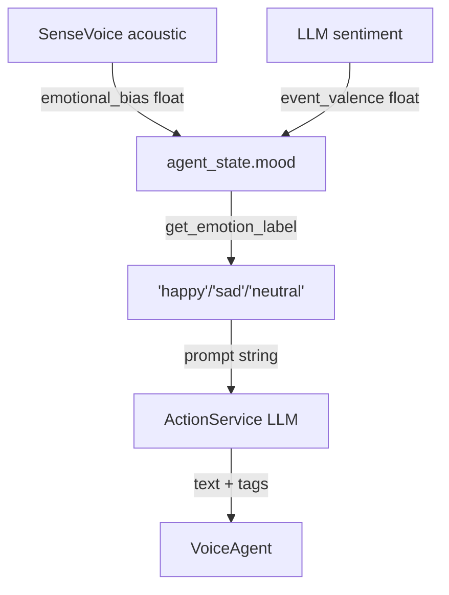
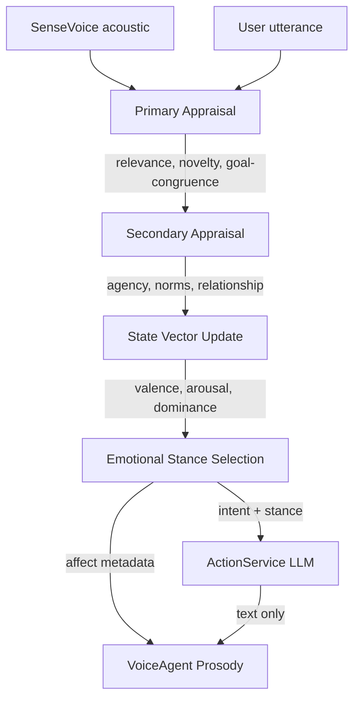

# CVS-1.0 — Research Feedback Gap Analysis

> **Purpose**: Evaluate the current system against the four feedback themes derived from the ACL Anthology appraisal-agent paper, the Google Patent on affective interaction, the stateful-memory-augmented-transformer paper, and the Amory narrative-memory paper.
>
> **Method**: Each section maps feedback → current code → gap → recommended change.
>
> **Related**: See [./psychological_layer.md](./psychological_layer.md) for the target equation sheet.

## 2026-04-20 Runtime Hardening Update (Status Note)

This gap analysis remains valid as a future-design document. Recent work improved runtime stability,
but did not complete the psychological architecture upgrades described below.

Implemented hardening relevant to this document:

- Live-only durable subscriptions were applied on critical runtime channels to reduce replay storms.
- Surfacing scheduling was hardened with no-overlap execution, minimum sweep interval throttling,
  and deterministic `system.tick` sweep triggering.
- Runtime bootstrap and NATS stream setup were hardened (including CI JetStream startup fixes).
- Throughput controls were added (`LLM_INTENT_CLASSIFICATION_ENABLED`, `REFLECTION_ENABLED`,
  `REFLECTION_MIN_INTERVAL_SECONDS`) to reduce background LLM contention under load.

Current interpretation of the four feedback themes is unchanged:

- Theme 1 (appraisal-first emotion): still not implemented end-to-end.
- Theme 2 (full dimensional state + prosody integration): still partial.
- Theme 3 (narrative episodic memory): still not implemented.
- Theme 4 (behavior-quality loop): still partial.

---

## Scoring Legend

| Score | Meaning |
|-------|---------|
| 🟢 | Already implemented or very close |
| 🟡 | Partial — scaffolding exists but the core idea is missing |
| 🔴 | Not present — requires new design |

---

## 1. Appraisal-Based Emotion (replace label-map with primary/secondary appraisal)

**Feedback core idea**: Emotion should come from *evaluating what happened* (primary appraisal: relevance, novelty, goal-congruence) and *what it means for identity/relationship* (secondary appraisal: coping potential, agency, norm compatibility) — not from mapping an acoustic signal directly to a mood scalar.

### Current code

| File | What it does | Gap |
|------|-------------|-----|
| [`state/agent_state.py`](../../backend/app/state/agent_state.py) — `apply_sensory_perception()` | Takes `emotional_bias` float from SenseVoice, confidence-scales it, and **overwrites** mood with a weighted blend. Acoustic events (laughter, applause) directly nudge energy/trust with hardcoded deltas. | 🔴 **No appraisal.** This is exactly the "acoustic → mood formula" the feedback says to replace. There is no evaluation of *what the event means for goals or identity*. |
| [`state/agent_state.py`](../../backend/app/state/agent_state.py) — `update_from_event()` | Takes a raw `event_valence` float and applies it with 0.7 weight, instantly overwriting 70% of the previous mood. | 🔴 **No appraisal.** Cognitive events also skip evaluation — the LLM sentiment number goes straight into state. |
| [`cognitive/core.py`](../../backend/app/cognitive/core.py) — `process_event()` steps 2-3 | Perception extracts intent (CHAT/REMEMBER/REFLECT), then Decision picks a goal (COMFORT/INFORM/ENGAGE/TEASE/PROTECT). The goal is chosen *without consulting emotional state or identity values*. | 🟡 The BDI structure and goal vocabulary exist, but there is no appraisal step between perception and decision that evaluates the event against goals/values/relationship before updating mood. |
| [`cognitive/perception.py`](../../backend/app/cognitive/perception.py) — `perceive()` | Keyword-based intent routing (`"remember" in content.lower()`). No emotional or situational evaluation. | 🔴 Perception is purely syntactic — it has no notion of relevance, novelty, or goal-congruence. |

### What's missing

1. **Primary appraisal step** after `perceive()` — before Decision, the system should evaluate:
   - *Relevance*: Does this event matter to my active goals?
   - *Novelty*: Have I seen this pattern before?
   - *Goal-congruence*: Does this help or hinder what I'm trying to do?

2. **Secondary appraisal step** — after primary, the system should evaluate:
   - *Agency*: Can I influence the outcome?
   - *Norm compatibility*: Does this conflict with my immutable values?
   - *Relationship context*: What does this mean for my bond with the user?

3. **Appraisal-driven state update** — mood/trust/energy should change based on the *appraisal outcome*, not the raw signal.

4. **Appraisal-driven pauses** — hesitation and pauses should emerge from appraisal (e.g., high novelty + low agency → hesitation), not from LLM-generated `<hesitate>` tags.

### Gap score: 🔴 Not present

---

## 2. Dimensional Emotion State Vector (not a single scalar)

**Feedback core idea**: Emotion should be stored as a multi-dimensional vector (`valence`, `arousal`, `dominance`) plus relational dimensions (`trust`, `attachment`). Acoustic signals should *bias* this state, not overwrite it. Voice rendering should map these dimensions to prosody parameters (pitch, pace, tone, volume).

### Current code

| File | What it does | Gap |
|------|-------------|-----|
| [`state/agent_state.py`](../../backend/app/state/agent_state.py) — `AgentState` dataclass | Stores `mood` (valence), `energy` (arousal), `trust`, `attachment`. | 🟡 **Partial.** The field names map reasonably to valence/arousal, but `dominance` is missing entirely. The naming is imprecise — `mood` conflates valence with emotion label. |
| [`state/agent_state.py`](../../backend/app/state/agent_state.py) — `get_emotion_label()` | Collapses the entire state vector into one of four strings: `happy`, `sad`, `excited`, `neutral`. | 🔴 **This is the exact anti-pattern the feedback targets.** The rich state is thrown away when it reaches the LLM via `get_context_snapshot()`, which includes the label. |
| [`state/agent_state.py`](../../backend/app/state/agent_state.py) — `get_behavioral_directive()` | Threshold-based string generation. Three mood buckets, two energy buckets, two trust buckets → concatenated prose. | 🟡 Better than the label, but still coarse. No dominance axis. No continuous mapping to prosody. |
| [`voice/agent.py`](../../backend/app/voice/agent.py) — `_handle_input()` | Receives `emotional_intensity` and `speaking_rate` from `chat.output` but **never reads the actual state vector**. These are whatever the Brain sends — not derived from the cognitive state. | 🔴 Voice layer is decoupled from the state vector. It cannot render dimensional emotion as prosody. |
| [`cognitive/action.py`](../../backend/app/cognitive/action.py) — prompt construction | Passes `emotion` (the label string) into the LLM prompt. The full vector (mood, energy, trust, attachment) is not exposed. | 🔴 The LLM only sees "neutral" or "happy" — not the continuous state. |

### What's missing

1. **Add `dominance`** (0.0–1.0) to `AgentState` — measures sense of control/agency.
2. **Remove `get_emotion_label()`** as the primary interface — expose the full vector.
3. **State-to-prosody mapping function** — a function that takes `(valence, arousal, dominance)` and outputs `(pitch_shift, speaking_rate, volume_gain, pause_tendency)` for the Voice layer.
4. **Side-channel affect metadata** — `chat.output` NATS messages should carry the state vector, not just a text emotion label.
5. **Rename `mood` → `valence`** for semantic clarity.

### Gap score: 🟡 Partial (structure exists, semantic integration missing)

---

## 3. Narrative Memory (not flat vector retrieval)

**Feedback core idea**: Memory should be organized as *episodic narratives* — events with cause, emotion, timestamp, relationship context, and temporal ordering. The surfacing agent should retrieve *episodes* not "relevant snippets." Offline consolidation should compress episodes into semantic memory.

### Current code

| File | What it does | Gap |
|------|-------------|-----|
| [`state/memory_store.py`](../../backend/app/state/memory_store.py) — `add_memory()` | Stores flat text with `importance_score`, `emotional_weight`, `certainty`, `source`, and a JSON `metadata` blob. No episode structure. | 🔴 Memories are **isolated text fragments** — no cause, no temporal sequence, no relationship context, no episode boundary. |
| [`state/memory_store.py`](../../backend/app/state/memory_store.py) — `search_memories()` | Cosine similarity → utility score (decay × importance × emotion boost). Returns flat `{content, score}` dicts. | 🔴 **Pure vector retrieval.** No episode reconstruction, no temporal graph traversal, no narrative coherence. |
| [`agents/surfacing_agent.py`](../../backend/app/agents/surfacing_agent.py) — `_surface_relevant_memories()` | Calls `search_memories()`, publishes the first novel result as `memory.surfaced`. | 🔴 Surfaces **a single snippet** — not an episode. No cause, no emotional context, no relationship framing. The cognitive layer receives it as if it were a search result, not a lived experience. |
| [`cognitive/learning.py`](../../backend/app/cognitive/learning.py) — `_consolidate()` | Extracts entity triples from recent interactions → Neo4j. This is *fact* consolidation, not narrative consolidation. | 🟡 The consolidation machinery exists but only produces `(subject, relation, object)` triples — no episode summaries, no temporal event graphs, no semantic memory compression. |
| [`cognitive/core.py`](../../backend/app/cognitive/core.py) — episode construction | Creates an `episode` dict with `id, content, intent, state, response` — but this is passed to `trigger_reflection()` and then discarded. It's never stored as a retrievable episodic memory. | 🟡 The word "episode" is used but it's a transient dict, not a persisted narrative entity. |

### What's missing

1. **Episode schema** — A structured `Episode` model: `{id, timestamp, user_utterance, agent_response, emotional_state, intent, goal, outcome, relationship_snapshot, cause_episode_id}`.
2. **Episode persistence** — Store episodes as first-class entities (in Postgres or Neo4j), linked by temporal ordering and causal chains.
3. **Episode retrieval** — Surfacing agent should reconstruct *episode sequences* ("the time we talked about X"), not isolated snippets.
4. **Narrative consolidation (idle-time)** — During `REFLECT`, compress recent episodes into semantic summaries: "User has been stressed about exams for the last 3 sessions."
5. **Temporal event graph** — Neo4j should store episode chains, not just entity triples.

### Gap score: 🔴 Not present

---

## 4. Humanness as Behavior-Quality (not just language-quality)

**Feedback core idea**: Humanness should be an architectural property — appraisal before generation, emotional stance selection, timing/prosody driven by internal state, immutable identity as a guardrail. The system should be a "controlled reasoning-and-expression loop," not "emotional hacks."

### Current code

| File | What it does | Gap |
|------|-------------|-----|
| [`cognitive/core.py`](../../backend/app/cognitive/core.py) — `process_event()` | The cognitive loop is: Perceive → Decide → Act → Validate → Learn. Identity validation and self-correction exist. | 🟡 The loop structure is right, but there's no **appraisal pass** between Perceive and Decide. The Brain doesn't "choose an emotional stance" — it reads whatever label `get_emotion_label()` returns. |
| [`cognitive/identity.py`](../../backend/app/cognitive/identity.py) — `get_persona_prompt()` | Immutable core values + adaptive traits + mood directive → system prompt. | 🟢 **This is strong.** The immutable core as guardrail pattern is exactly what the feedback recommends. |
| [`voice/agent.py`](../../backend/app/voice/agent.py) — timing markers | Pauses and hesitation come from `<pause=Nms>` and `<hesitate>` tags embedded in text. | 🟡 The mechanism works, but timing is **text-driven** (LLM decides when to hesitate), not **state-driven** (appraisal/emotion deciding when to hesitate). |
| [`cognitive/action.py`](../../backend/app/cognitive/action.py) — prompt | "The voice layer already carries emotion separately" — but it actually doesn't. The voice layer receives `emotion: "neutral"` and `intensity: 0.5` without any mapping from the cognitive state vector. | 🔴 **The expression loop is broken.** Brain thinks Voice handles affect; Voice receives no affect signal from Brain's cognitive state. |
| [`cognitive/decision.py`](../../backend/app/cognitive/decision.py) — `_classify_intent_and_goal()` | Uses LLM to pick intent + goal. Sends "Mood: happy (Valence: 0.3)" as context. | 🟡 The decision *sees* state but doesn't reason about it in an appraisal-like way. Goal selection is unstructured. |

### What's missing

1. **Appraisal pass before generation** — Between steps 2 and 3 in `process_event()`:
   - Primary appraisal: evaluate event against active goals.
   - Secondary appraisal: evaluate against identity/relationship.
   - Output: updated state vector + emotional stance + response intent.

2. **Emotional stance selection** — Brain should explicitly choose: "I'm going to respond with gentle concern" (not just goal=COMFORT), and this stance should propagate to Voice as structured affect metadata.

3. **State-driven timing** — Pauses/hesitation should be computed from appraisal output (uncertainty → hesitate, high arousal → fast pace), injected as side-channel metadata alongside text, not embedded in text.

4. **Expression loop closure** — Voice needs a real affect signal from Cognitive state, mapped to prosody parameters, not just text tags.

### Gap score: 🟡 Partial (identity guardrail is strong; appraisal and expression loop are missing)

---

## Summary Matrix

| Feedback Theme | Current Score | Key Gap | Primary Files |
|----------------|:---:|---------|---------------|
| 1. Appraisal-based emotion | 🔴 | No appraisal step exists; acoustic/cognitive signals go straight to state | [`agent_state.py`](../../backend/app/state/agent_state.py), [`core.py`](../../backend/app/cognitive/core.py), [`perception.py`](../../backend/app/cognitive/perception.py) |
| 2. Dimensional emotion vector | 🟡 | Fields exist but `dominance` missing; label reduction destroys richness; Voice decoupled | [`agent_state.py`](../../backend/app/state/agent_state.py), [`action.py`](../../backend/app/cognitive/action.py), [`voice/agent.py`](../../backend/app/voice/agent.py) |
| 3. Narrative memory | 🔴 | No episode structure; flat vector retrieval; no temporal graphs; no narrative consolidation | [`memory_store.py`](../../backend/app/state/memory_store.py), [`surfacing_agent.py`](../../backend/app/agents/surfacing_agent.py), [`learning.py`](../../backend/app/cognitive/learning.py) |
| 4. Humanness as behavior | 🟡 | Identity guardrail strong; appraisal pass and expression loop missing | [`core.py`](../../backend/app/cognitive/core.py), [`identity.py`](../../backend/app/cognitive/identity.py), [`voice/agent.py`](../../backend/app/voice/agent.py) |

---

## Architectural Diagnosis

The system has excellent **infrastructure** — the NATS mesh, the BDI loop skeleton, the identity guardrail, the speculative interruption pipeline, the streaming synthesis — but the **psychological layer** currently operates as a set of direct signal→state mappings rather than a reasoning system.

### Current Flow (Signal → State)

### Target Flow (Signal → Appraisal → State → Expression)

> **IMPORTANT**: The hardest gap is **Appraisal** (Themes 1 & 4) — it requires inserting a new reasoning step into the cognitive loop. The **Dimensional State** upgrade (Theme 2) is mostly surgical renaming + adding a prosody mapping function. **Narrative Memory** (Theme 3) is the largest engineering effort — it touches the data model, persistence, retrieval, and consolidation.

> **TIP**: A pragmatic implementation order would be:
>
> 1. **Theme 2** first (dimensional state vector) — smallest change, unlocks the others
> 2. **Theme 1 + 4** together (appraisal + expression loop) — the core psychological upgrade
> 3. **Theme 3** last (narrative memory) — largest scope, benefits from the appraisal infrastructure

---

## References

1. [Third-Person Appraisal Agent: Simulating Human Emotional Reasoning in Text with LLMs](https://aclanthology.org/2025.findings-emnlp.1288/) — ACL Anthology, EMNLP 2025
2. [US11226673B2 — Affective Interaction Systems](https://patents.google.com/?q=US11226673B2) — Google Patents
3. [Stateful Memory-Augmented Transformers for Efficient Dialogue Modeling](https://aclanthology.org/2024.findings-eacl.57/) — ACL Anthology, EACL 2024
4. [Amory: Building Coherent Narrative-Driven Agent Memory](https://aclanthology.org/2026.eacl-long.183/) — ACL Anthology, EACL 2026
5. [Projecting the End of a Speaker's Turn: A Cognitive Cornerstone of Conversation](https://doi.org/10.1353/lan.2006.0130) — de Ruiter, Mitterer & Enfield, 2006
6. [Google Duplex: An AI System for Accomplishing Real-World Tasks Over the Phone](https://research.google/blog/google-duplex-an-ai-system-for-accomplishing-real-world-tasks-over-the-phone/) — Google Research Blog, 2018
7. [A simplest systematics for the organization of turn-taking for conversation](https://doi.org/10.1353/lan.1974.0010) — Sacks, Schegloff & Jefferson, 1974
8. [Timing in Turn-Taking and Its Implications for Processing Models of Language](https://www.frontiersin.org/articles/10.3389/fpsyg.2015.00731/full) — Levinson & Torreira, 2015

---

## 5. Duplex Parallel Cognition (process while user is still speaking)

**Feedback core idea**: Human conversation is not strict turn-by-turn blocking. Listening and interpretation happen continuously while the other person is still speaking. The agent should run a low-latency partial-understanding path in parallel with deeper reasoning, then commit or revise once endpoint confidence is high.

> **Research/Patent grounding**:
>
> - **Turn-end projection** evidence (de Ruiter, Mitterer, & Enfield, 2006) supports processing incremental linguistic structure before final endpoint completion.
> - **Google Duplex** demonstrates practical real-time spoken interaction using incremental ASR/NLU updates and policy adaptation while the user is still speaking.
> - **US11226673B2** describes affective interaction loops that adapt to ongoing user signals, consistent with speculative interpretation + commit/revise behavior.

### Current code

| File | What it does | Gap |
|------|-------------|-----|
| [`stt/agent.py`](../../backend/app/stt/agent.py) | Streams audio perception and transcription events with queue-based workers. | 🟡 Streaming ingest exists, but speculative intent/context updates are not yet a first-class, continuously consumed cognitive contract. |
| [`cognitive/core.py`](../../backend/app/cognitive/core.py) — `process_event()` | Executes a sequential Perceive → Decide → Act loop for a received event payload. | 🔴 No explicit partial-hypothesis lane (`is_partial`, confidence trajectory, rolling commit) driving incremental plan updates before final transcript stabilization. |
| [`agents/brain_agent.py`](../../backend/app/agents/brain_agent.py) — `_on_chat_input()` | Begins response work after a discrete `chat.input` event and streams output chunks from action execution. | 🟡 Streaming output is present, but speculative pre-planning while user speech is in-flight is limited; start of cognition still mostly aligned to completed turn payloads. |
| [`agents/transport_agent.py`](../../backend/app/agents/transport_agent.py) | Handles transport-level queueing/backpressure and playback worker behavior. | 🟡 Real-time channel controls exist, but no explicit cognitive-priority scheduler separating reflex, speculative, and deep reasoning lanes. |

### What's missing

1. **Partial hypothesis schema** published at high cadence (100-200ms windows):
   - `partial_text`, `confidence`, `intent_candidates`, `is_endpoint`, `utterance_id`, `turn_id`.
2. **Speculative cognition lane** in `CognitiveService`:
   - continuously updates candidate goals/stance while speech is ongoing.
3. **Commit/revise gate**:
   - commits best candidate at endpoint; fast-correct on contradiction between partial and final transcript.
4. **Priority scheduler**:
   - hard-preemptive reflex tasks (`audio.stop`, barge-in) over deep generation tasks.

### Evidence-backed implementation notes

1. **Incremental NLU contract**:
   - publish partial hypotheses with confidence at fixed cadence; consume them in cognition with confidence weighting.
2. **Bounded speculative branching**:
   - maintain top-k candidate intents/goals (k=2..4), prune continuously to avoid runaway compute.
3. **Commit/revise thresholds**:
   - commit only above endpoint or consistency thresholds; fast-correct if final transcript contradicts partial plan.

### Gap score: 🔴 Not present end-to-end

---

## 6. Human-Like Timing and Turn-Taking Quality (perceived latency, not only final latency)

**Feedback core idea**: Human-like behavior is timing-correct, not always instant. The system should react quickly, allow interruption immediately, and still take deliberate time for deeper thought. Evaluation should separate first-reaction latency from full-turn completion latency.

> **Research/Patent grounding**:
>
> - **Sacks, Schegloff, Jefferson (1974)** establishes turn-taking as locally managed and tightly timed, requiring rapid ownership transitions.
> - **Levinson & Torreira (2015)** shows human conversational gaps are short, motivating strict sub-second first-reaction targets.
> - **Google Duplex** supports a two-speed pattern: immediate acknowledgments + deeper completion.

### Current code

| File | What it does | Gap |
|------|-------------|-----|
| [`agents/base.py`](../../backend/app/agents/base.py) | Tracks subject metrics (counts and average latency) for observed channels. | 🟡 Useful observability baseline, but lacks explicit SLO metrics for first-reaction, first-chunk, interruption-stop, and commit latency percentiles. |
| [`cognitive/action.py`](../../backend/app/cognitive/action.py) | Adds stream timeout guard and graceful fallback output. | 🟡 Prevents silent hangs, but does not enforce stage-wise latency budgets or dynamic degrade policy per conversational phase. |
| [`agents/brain_agent.py`](../../backend/app/agents/brain_agent.py) | Streams chunked outputs and fallback completion on generation failures. | 🟡 Streams help perceived responsiveness, but no dedicated reflex/backchannel output lane with strict sub-400ms target. |
| [`agents/surfacing_agent.py`](../../backend/app/agents/surfacing_agent.py) | Hardens sweep scheduling (no overlap, throttle, deterministic tick path). | 🟢 Stability improved; however this does not directly guarantee user-facing conversational timing quality. |

### What's missing

1. **Latency budget contract** with separate KPIs:
   - First reaction (<250-400ms), interruption stop (<120-300ms), first meaningful chunk (<500-900ms), final completion (variable).
2. **Reflex output lane**:
   - deterministic backchannel/ack outputs independent of deep LLM completion.
3. **Interruption ownership model**:
   - strict turn-generation fencing to avoid stale continuation after barge-in.
4. **Stage-wise degrade policy**:
   - if deep reasoning exceeds budget, emit short acknowledgment immediately and continue depth generation asynchronously.

### Evidence-backed implementation notes

1. **Two-class latency SLOs**:
   - `Reflex`: interruption-stop, first acknowledgment, turn-ownership update.
   - `Deliberation`: first meaningful chunk, full completion latency/quality.
2. **Hard guardrail budgets**:
   - enforce strict maximums on reflex path independent of deep LLM status.
3. **Percentile observability**:
   - track p50/p95 separately for interruption-stop and first meaningful chunk versus final completion.

### Gap score: 🟡 Partial (infrastructure present, behavior-quality contract missing)

---

## Addendum to Implementation Order

Given runtime hardening already completed, a practical next order is:

1. **Theme 5 first** (duplex partial cognition): unlocks simultaneous listen+think behavior.
2. **Theme 6 second** (timing contract + reflex lane): makes interaction feel human immediately.
3. **Theme 1 + 4** next (appraisal + behavior loop): upgrades reasoning quality.
4. **Theme 3 last** (narrative memory): largest persistence/retrieval scope.
