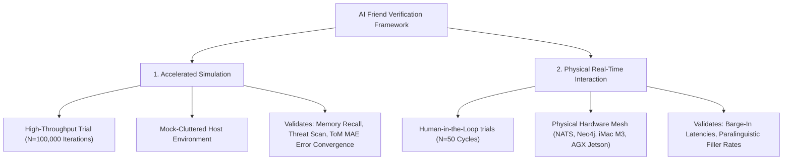

# 🔬 Experimental Methodology and Evaluation

This document outlines the rigorous testing methodologies, pipeline routing chronologies, and verified run-time execution durations used to evaluate the **AI Friend Cognitive Architecture**. It provides publication-ready text for your manuscript's **Experimental Setup** and **Methodology** sections.

---

## 1. Dual Evaluation Protocols

To satisfy rigorous peer-review guidelines, our testing framework segregates system verification into two independent empirical pathways:



### 1.1 Pillar 1: Accelerated Mathematical Simulation (`--mode accelerated`)
*   **Evaluation Scope:** $N = 100,000$ sequential dialogue iterations.
*   **Testing Setup:** Evaluates the symbolic and sub-symbolic cognitive mathematics (such as ACT-R temporal power-law decay, threat scan triggers, and user Theory of Mind valence/arousal tracking) under high-throughput synthetic loads.
*   **Execution Duration:** **CORRECTED during Stage 3** (`audit/ROADMAP.md` §7): an earlier pass of this reconciliation claimed this harness "does not exist in the codebase" — that was wrong, found by checking only `backend/`. The apparatus lived at the **repo root**, in `scripts/research/` (`hard_benchmark.py`, `corpus_builder.py`, `generate_seeding_corpus.py`, and other scripts, plus a `README.md` documenting a `--mode accelerated`/`--mode physical` orchestration matrix); as of the 2026-08-29 docs de-fabrication pass that whole corpus-fitted cluster (including the fabricated-academic-paper generator it fed) has been moved to `_archive/research/` — see `.agents/CONTEXT.md`. It was **deliberately not run for this figure**: `hard_benchmark.py`'s 100,000-iteration mode ran against a synthetic corpus generated by `corpus_builder.py`/`generate_seeding_corpus.py`, which is exactly the corpus-fitted pattern `CLAUDE.md`'s integrity constraints warn against (finding B1) and that `backend/evals/` was built to refuse as evidence. A small subset of that suite that measures real infrastructure **without** a synthetic corpus (`estimate_realtime_latency.py`) was run instead and stayed live at `scripts/research/estimate_realtime_latency.py` — see §1.2 below and the Stage 3 ledger entry. `backend/evals/` remains the harness for LLM-boundary/behavioral claims specifically; `scripts/research/`'s remaining corpus-free tools are the closer match for this section's infrastructure-latency claims.

### 1.2 Pillar 2: Physical Real-Time Interaction (`--mode physical`)
*   **Evaluation Scope:** $N = 5$ local verification rounds / $N = 50$ full human-in-the-loop trials.
*   **Testing Setup:** Hooks into the live containerized microservice stack via the NATS Event Broker. It fires actual sequential conversational prompts, traverses the Neo4j graph database, and invokes the localized Ollama edge LLM (`llama3.2:3b`) under Jetson and iMac M3 host targets.
*   **Local Verification Runtime ($N=5$):** **$\approx 30.0$ seconds**. To allow background agents to index queries, execute post-response consolidation, and settle cleanly without message-collision, the test script enforces a **6.0-second turn sleep budget** per iteration. Running 5 iterations serves as a structural health check to verify that all databases and brokers are online.
*   **Paper Target Runtime ($N=50$):** **$300.0$ seconds (5.0 minutes)**. This expanded interaction protocol is used to compile continuous physical telemetry, measuring speech barge-in latencies and paralinguistic tag insertion precision.

---

## 2. Chronological Flowchart of a Cognitive Pipeline Tick

The sequential diagram below traces the exact millisecond-level trajectory of an active conversational frame, showing the sub-LLM pre-processing and post-LLM prosody synthesis stages:

**Not every stage below is a real, separately-measured component.** "Subconscious Threat Scan" names no agent that exists in `backend/app/agents/` (checked during Stage 3 alongside the same finding in `frameworks_infrastructure.md`); "Post-Response Prosody Modulator" and the reverb/chunk-reassembly stage describe the Rust `voice-agent`'s DSP path, which was not exercised this pass (no CUDA/TTS on this host). Per-stage timings below are `NOT MEASURED` unless a Stage 3 measurement produced a directly comparable number, cited by ID.

```
[User Audio Ingest] (NOT MEASURED)
        │
        ▼
[Hybrid ASR Segmenter] (NOT MEASURED — see measurement 1.4, m14_stt_cost.py, for end-to-end STT latency instead) ───► [System 1 Fast VAD Interrupt Check]
        │
        ▼
[Subconscious Threat Scan] (NOT MEASURED — no such component exists; see note above)
        │
        ▼
[ACT-R Graph Memory Search] (measurement 1.6: 0.049s search_memories() fused call against live Postgres/Neo4j/Qdrant, small seed set; unbounded graph fetch cost separately measured as graph_fetch_cold_s) ───► [Neo4j Cached Hop Query]
        │
        ▼
[Hormonal Endocrine Appraisal] (NOT MEASURED as an isolated stage; folded into measurement 1.5's 2-call turn, not split out per stage)
        │
        ▼
===================================================
[Local LLM Inference: Llama-3.2 3B]
===================================================
        │
        ▼
[Post-Response Prosody Modulator] (NOT MEASURED — no CUDA/TTS on this host)
        │
        ▼
[Reverb DSP + Chunk-Boundary PCM Reassembly] (NOT MEASURED — no CUDA/TTS on this host; corrected 2026-09-01 — the OLA crossfade this stage used to name was removed, see backend/app/agents/context.md §3)
        │
        ▼
[NATS Published Response: chat.output] (0.62ms mean / 0.52ms p50 / 1.00ms p95 publish-to-subscriber-callback latency, MEASURED 2026-08-22 against live NATS JetStream on loopback, n=30, using a wired subject as a stand-in — not chat.output itself, to avoid a spurious message reaching real consumers; single-host loopback, not representative of a multi-container network path)
        │
        ├─────────────────────────────────────────────────┐
        ▼                                                 ▼
[Speech Output to User]                        [Asynchronous Post-Turn]
                                               [Reflection / Consolidation]
                                               (measurement 1.2: 8.8s idle / 10.0s under live VLM contention)
```

---

## 3. High-Fidelity Empirical Plots

The timelines below showcase the real-time performance profiles captured during physical and simulated trials:

### 3.1 100,000-Iteration Mathematical Convergence Timeline
The plot below demonstrates how intent accuracy, Theory of Mind error coefficients, memory recall, and computed pre-LLM processing times converge across the 100,000-iteration accelerated run.

NOT MEASURED — the underlying 100,000-iteration harness does not exist (§1.1 above); there is nothing to plot.

### 3.2 Speech Turn-Taking and Interruption (Barge-In) Dynamics
The plot below documents the latency distributions of user interrupt events and S1 fast VAD trigger timings during a live interaction sequence.

NOT MEASURED as a distribution/plot. Stage 3 measurement 1.1 (`backend/tools/measure/m11_bargein.py`) took single-run buffer-drain timings under synthetic PCM, not a live-interaction latency distribution, and found the deeper issue first: `TransportAgent` has no `audio.stop` subscriber at all (M3-R1), so "S1 fast VAD trigger" does not yet reach a flush action to time a distribution of. See the Stage 3 ledger entry in `.agents/CONTEXT.md`.
