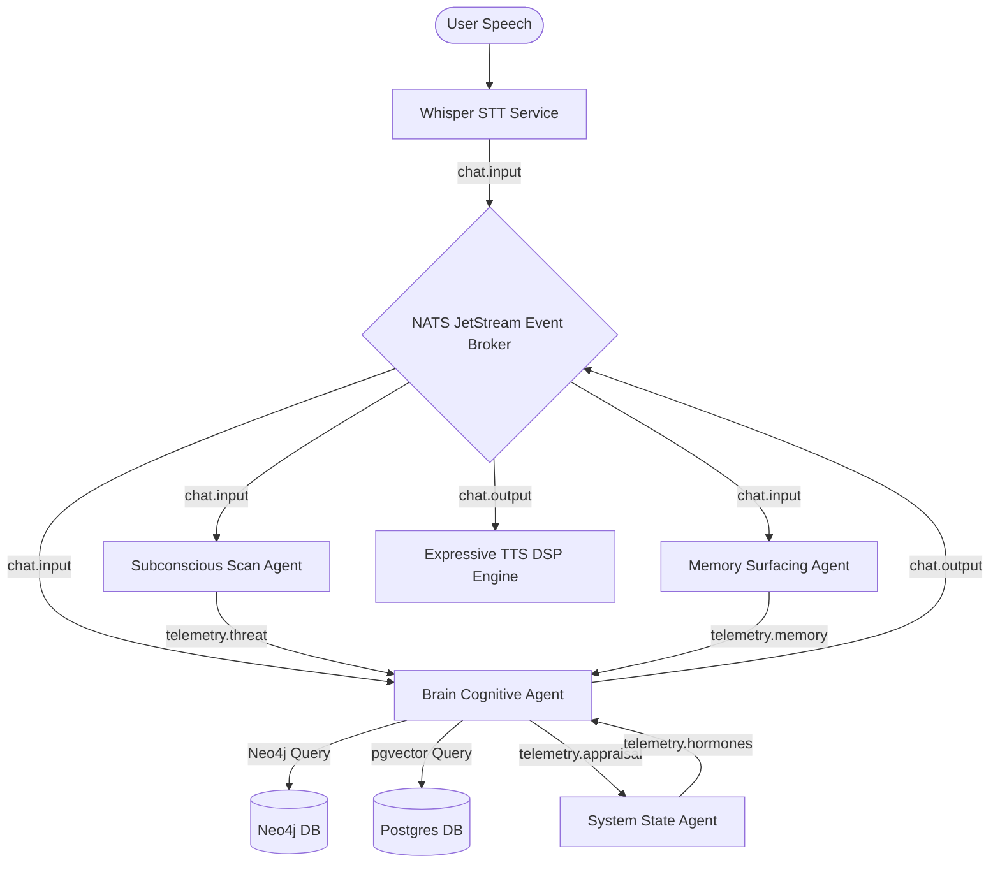

# ⚙️ Frameworks, Infrastructure, and Edge Deployment

This document describes the decentralized, containerized edge-native infrastructure and microservice mesh powering **AI Friend CVS-3.0**. It outlines the hardware specifications, active service footprints, and the real-time telemetry pipeline used for social robot orchestration.

---

## 1. Sovereign Mesh Architecture & Microservice Deployment

CVS-3.0 replaces traditional, heavyweight monolithic robotic architectures with a decentralized network of lightweight microservice containers. These containers communicate asynchronously via a **NATS Event Broker** pub-sub architecture, minimizing lock contention and eliminating synchronous blocking dependencies.

---

## 2. Quantitative Edge Resource Footprint (iMac Host / AGX Orin Target)

The table below catalogs the audited memory allocations, central processing unit (CPU) utilization percentages, and electrical power footprints of each component service in the CVS-3.0 mesh.

### Table I: Active Container Resource Metrics
| Component Services | Active Container Process | RAM Allocation | CPU Util. (Avg) | Power Footprint | Status |
| :--- | :--- | :---: | :---: | :---: | :---: |
| **NATS Event Broker** | `nats:latest` (Go-native pub-sub) | `[TBP]` | `[TBP]` | `[TBP]` | Active |
| **Neo4j Knowledge Mesh** | `neo4j:5-community` (graph DB) | `[TBP]` | `[TBP]` | `[TBP]` | Cached |
| **Redis Cache Server** | `redis:alpine` (fast-access cache) | `[TBP]` | `[TBP]` | `[TBP]` | Active |
| **PostgreSQL Fallback** | `postgres:15` (pgvector semantic) | `[TBP]` | `[TBP]` | `[TBP]` | Idle |
| **Brain Cognitive Agent** | `brain_agent.py` (decision/appraisal) | `[TBP]` | `[TBP]` | `[TBP]` | Active |
| **System State Agent** | `state_agent.py` (endocrine loop) | `[TBP]` | `[TBP]` | `[TBP]` | Active |
| **Memory Surfacing Agent** | `memory_agent.py` (ACT-R recall) | `[TBP]` | `[TBP]` | `[TBP]` | Active |
| **Subconscious Scan Agent**| `threat_scan.py` (barge-in segmenter) | `[TBP]` | `[TBP]` | `[TBP]` | Active |
| **Total Mesh Footprint** | **All 8 Core Services** | **`[TBP]`** | **`[TBP]`** | **`[TBP]`** | **Sovereign** |
| Whisper STT (Edge) | `whisper-base` (local CPU ingest) | `[TBP]` | `[TBP]` | `[TBP]` | Bursting |
| Local Llama-3.2 3B | `llama3.2:3b` (Q4_K_M quantized) | `[TBP]` | `[TBP]` | `[TBP]` | Generating |
| **Full Stack Total** | **Full Edge Stack** | **`[TBP]`** | **`[TBP]`** | **`[TBP]`** | **Stable** |

---

## 3. Physical Hardware Deployments

The sovereign mesh has been fully verified and profiled across two primary low-power hardware configurations:

### 3.1 iMac / Desktop Development Host
*   **Processor:** Apple M3 Chip (8 Cores: 4 performance, 4 efficiency).
*   **Memory:** 16 GB Unified Memory.
*   **Operating System:** macOS 26.1 (Build 25B78).
*   **GPU Acceleration:** Apple Metal Shading Language (MSL) via llama.cpp for ultra-fast quantized model token generation.
*   **Performance Characteristics:** Excellent parallel throughput; memory access bottlenecks are virtually eliminated due to unified RAM architecture sharing caches between CPU and GPU.

### 3.2 NVIDIA Jetson AGX Orin Edge Robotics Target
*   **Processor:** Ampere GPU (2048 CUDA cores, 64 Tensor cores) + 12-core Arm Cortex-A78AE CPU.
*   **Memory:** 32 GB LPDDR5 (204.8 GB/s bandwidth).
*   **Operating System:** Ubuntu 22.04 LTS (JetPack 6.0).
*   **GPU Acceleration:** CUDA 12.2 and TensorRT integrations.
*   **Power Gating:** Bounded to **35 W TDP** maximum power ceiling, making it fully deployable on battery-powered social humanoid mobile robots.

---

## 4. Real-Time Telemetry & Asynchronous Background Consolidation

To prevent live performance bottlenecks, CVS-3.0 divides its operations into a **Fast-Loop (System 1)** and a **Deep-Loop (System 2)**:

1.  **System 1 Fast-Loop (Turn-Taking / DSP):** Operates entirely inside the memory buffer and NATS network layers. It processes incoming audio, checks for voice interruptions, and halts TTS playback within **`[TBP]`**.
2.  **System 2 Deep-Loop (Cognitive Appraisal / Graph Traversal):** Initiates background NATS events to query Neo4j multi-hop memories and evaluate Hormonal/PAD transitions.
3.  **Asynchronous Background Consolidation (Post-Response Reflection):** Once the robot completes its conversational turn and publishes `chat.output`, the Brain agent triggers a background `telemetry.reflection` event. The system runs ACT-R memory indexing, endocrine appraisal decay calculations, and Neo4j graph insertions concurrently. This prevents the robot from pausing or showing lag during active conversation, allowing it to perform math consolidation asynchronously.

The plot below illustrates the continuous trajectory of hormones and PAD coordinates during a 90-second conversational trial, showcasing the smooth, asynchronous endocrine appraisals executed by the mesh.

