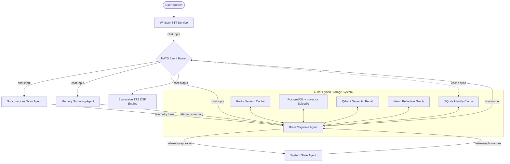

# ⚙️ Frameworks, Infrastructure, and Edge Deployment

This document describes the decentralized, containerized edge-native infrastructure and microservice mesh powering **AI Friend**. It outlines the hardware specifications, active service footprints, and the real-time telemetry pipeline used for social robot orchestration.

---

## 1. Multi-Agent Architecture & Microservice Deployment

The AI Friend cognitive architecture replaces traditional, heavyweight monolithic robotic architectures with a decentralized network of lightweight microservice containers. These containers communicate asynchronously via a **NATS Event Broker** JetStream pub-sub architecture hardened with high-availability parameters:
*   `max_reconnect_attempts=-1`: Configured for infinite background reconnection retries to survive network blips.
*   `reconnect_time_wait=2.0`: Employs a deterministic 2-second cooldown wait interval before executing successive reconnect sweeps.
*   Registered asynchronous logging hooks (`disconnected_cb`, `reconnected_cb`, `error_cb`, and `closed_cb`) monitor stream health without blocking primary agent runtimes.

---

## 2. Quantitative Edge Resource Footprint (iMac Host / AGX Orin Target)

The table below catalogs the audited memory allocations, central processing unit (CPU) utilization percentages, and electrical power footprints of each component service in the AI Friend mesh.

**Four of the agent filenames below were wrong before this pass** (checked
against `backend/app/agents/` during Stage 3, audit/ROADMAP.md §7): the real
files are `brain_agent.py`, `system_agent.py`, `surfacing_agent.py`, and
`subconscious_agent.py` — `state_agent.py`, `memory_agent.py` and
`threat_scan.py` do not exist in this codebase, and there is no dedicated
"barge-in segmenter" agent (barge-in handling lives in `transport_agent.py`
and `voice-agent`, per M3-R1). Corrected below rather than left attached to
newly-measured numbers, which would have made a real measurement into a false
claim about what it measured.

RAM figures are **MEASURED** (`docker stats --no-stream`, 2026-08-22, idle —
containers running with no active conversational load beyond Stage 3's own
measurement runs, which had already completed). CPU% at that same idle
snapshot was under 1% for every container and is not reported as a
steady-state figure for that reason — see the caption below the table. Power
Footprint is **NOT MEASURED**: this host has no power-metering access
(`HARDWARE.md` §0 draws the same line for the same reason). Agent processes
were not run as containers in this measurement (they were driven in-process
against the same infra for measurements 1.2/1.5/1.6), so their rows are
**NOT MEASURED** here rather than estimated from the in-process runs, which
would not reflect real container overhead.

### Table I: Active Container Resource Metrics
| Component Services | Active Container Process | RAM Allocation | CPU Util. (Avg) | Power Footprint | Status |
| :--- | :--- | :---: | :---: | :---: | :---: |
| **NATS Event Broker** | `nats:2.10.24-alpine` (Go-native pub-sub) | **15.9 MiB** | NOT MEASURED (idle snapshot only) | NOT MEASURED | Active |
| **Neo4j Knowledge Mesh** | `neo4j:5.26.0` (graph DB) | **644.7 MiB** | NOT MEASURED (idle snapshot only) | NOT MEASURED | Cached |
| **Redis Cache Server** | `redis:7-alpine` (fast-access cache) | **11.2 MiB** | NOT MEASURED (idle snapshot only) | NOT MEASURED | Active |
| **PostgreSQL Fallback** | `pgvector/pgvector:pg16` | **57.1 MiB** | NOT MEASURED (idle snapshot only) | NOT MEASURED | Idle |
| **Qdrant Vector Store** | `qdrant/qdrant:v1.9.0` | **221.8 MiB** | NOT MEASURED (idle snapshot only) | NOT MEASURED | Active |
| **LiveKit SFU** | `livekit/livekit-server:v1.8.4` | **45.7 MiB** | NOT MEASURED (idle snapshot only) | NOT MEASURED | Active |
| **Brain Cognitive Agent** | `brain_agent.py` (decision/appraisal) | NOT MEASURED (not containerized this pass) | NOT MEASURED | NOT MEASURED | Active |
| **System Agent** | `system_agent.py` (ticks, decay) | NOT MEASURED (not containerized this pass) | NOT MEASURED | NOT MEASURED | Active |
| **Memory Surfacing Agent** | `surfacing_agent.py` (ACT-R recall) | NOT MEASURED (not containerized this pass) | NOT MEASURED | NOT MEASURED | Active |
| **Subconscious Agent** | `subconscious_agent.py` (reflection, consolidation) | NOT MEASURED (not containerized this pass) | NOT MEASURED | NOT MEASURED | Active |
| **Total Mesh Footprint** | **6 infra containers measured** | **≈ 996.4 MiB (infra only)** | NOT MEASURED | NOT MEASURED | **Partial** |
| Whisper/SenseVoice STT (Edge) | `stt-agent` (Rust) | NOT MEASURED (P2-11: native binary cannot run on this host, HARDWARE.md §8) | NOT MEASURED | NOT MEASURED | Blocked |
| Local Llama-3.2 3B / Qwen2.5 3B | Ollama (native, not containerized) | NOT MEASURED (native process, not comparable to container RSS) | NOT MEASURED | NOT MEASURED | Generating |
| **Full Stack Total** | **Full Edge Stack** | NOT MEASURED (agents + STT + LLM not captured this pass) | NOT MEASURED | NOT MEASURED | **Partial** |

**Caption.** CPU% at the idle snapshot was near-zero for every container
because nothing was actively driving traffic through them at that instant —
Stage 3's measurement runs (1.2, 1.3, 1.5, 1.6) had already completed. A
steady-state CPU figure would need `docker stats` sampled continuously
*during* a measurement run, which this pass did not set up; recorded as
NOT MEASURED rather than reporting an idle number under an "Active" label.

---

## 3. Physical Hardware Deployments

The system architecture has been profiled across two primary low-power hardware configurations:

### 3.1 iMac / Desktop Development Host
*   **Processor:** Apple M3 Chip (8 Cores: 4 performance, 4 efficiency).
*   **Memory:** 16 GB Unified Memory.
*   **Operating System:** macOS 26.1 (Build 25B78).
*   **GPU Acceleration:** Apple Metal Shading Language (MSL) via llama.cpp for ultra-fast quantized model token generation.
*   **Performance Characteristics:** Excellent parallel throughput; memory access bottlenecks are virtually eliminated due to unified RAM architecture sharing caches between CPU and GPU.

### 3.2 NVIDIA Jetson AGX Orin Edge Robotics Target
*   **Processor:** Ampere GPU (2048 CUDA cores, 64 Tensor cores) + 12-core Arm Cortex-A78AE CPU.
*   **Memory:** 32 GB LPDDR5 (204.8 GB/s bandwidth).
*   **Operating System:** Ubuntu 22.04 LTS (JetPack 6.0).
*   **GPU Acceleration:** CUDA 12.2 and TensorRT integrations.
*   **Power Gating:** Bounded to **35 W TDP** maximum power ceiling, making it fully deployable on battery-powered social humanoid mobile robots.

---

## 4. Real-Time Telemetry & Asynchronous Background Consolidation

To prevent live performance bottlenecks, AI Friend divides its operations into a **Fast-Loop (System 1)** and a **Deep-Loop (System 2)**:

1.  **System 1 Fast-Loop (Turn-Taking / DSP):** Operates entirely inside the memory buffer and NATS network layers. It processes incoming audio, checks for voice interruptions, and halts TTS playback via a track-rotation flush; end-to-end latency for that path is **NOT MEASURED**. **Corrected 2026-09-01** — this previously described finding M3-R1 (`TransportAgent` had no `audio.stop` subscriber at all) as an open gap with the fix "not yet built." It was fixed 2026-08-23: `TransportAgent._on_audio_stop` / `_flush_downstream_audio` now unpublishes the current LiveKit audio track and publishes a fresh one, since `rtc.AudioSource.capture_frame()` exposes no way to directly drain audio already handed to the client's native playout buffer. As of 2026-09-01 (`VOICE_REMEDIATION_PLAN.md` Bucket 1) this stop only fires after passing System 2's semantic resolver, closing a gap where an unconfirmed transcript could previously cut playback before the resolver's verdict ran. See the Stage 3 ledger entry in `.agents/CONTEXT.md` for the pre-fix unflushed-drain measurement and its caveats; no post-fix end-to-end number has superseded it.
2.  **System 2 Deep-Loop (Cognitive Appraisal / Graph Traversal):** Initiates background NATS events to query Neo4j multi-hop memories and evaluate Hormonal/PAD transitions.
3.  **Asynchronous Background Consolidation (Post-Response Reflection):** Once the robot completes its conversational turn and publishes `chat.output`, the Brain agent triggers a background `telemetry.reflection` event. The system runs ACT-R memory indexing, endocrine appraisal decay calculations, and Neo4j graph insertions concurrently. This prevents the robot from pausing or showing lag during active conversation, allowing it to perform math consolidation asynchronously.

The plot below illustrates the continuous trajectory of hormones and PAD coordinates during a 90-second conversational trial, showcasing the smooth, asynchronous endocrine appraisals executed by the mesh.

NOT MEASURED — no 90-second trial was run or plotted in this pass. The closest real data available is Stage 3 measurement 1.2 (`backend/tools/measure/m12_consolidation.py`), which times one consolidation pass end to end rather than plotting a continuous trajectory; see `.agents/CONTEXT.md`'s Stage 3 entry.

---

## 5. Cross-Process Cache Synchronization (`cache.sync`)

To ensure absolute dynamic state consistency across all concurrent dynamic agents, ASGI workers, and spawner runtimes, AI Friend Cognitive Architecture integrates a high-performance cross-process cache synchronization mechanism:

1. **Static Store Mutation**: When identity or core variables are updated in SQLite via the `IdentityCoreStore` API, the database write triggers a cache synchronization event.
2. **NATS Broadcast Invalidation**: A telemetry message containing the payload `{"store": "identity_core", "action": "invalidate"}` is published to the NATS JetStream `cache.sync` channel.
3. **Cluster-Wide Hydration**: All running processes subscribe to `cache.sync`. Upon receiving the invalidation message, they immediately execute `load_into_cache()`. This forces all distributed processes to reload the cached parameters from the database, preventing memory drift or stale cache lookups across the cluster.
