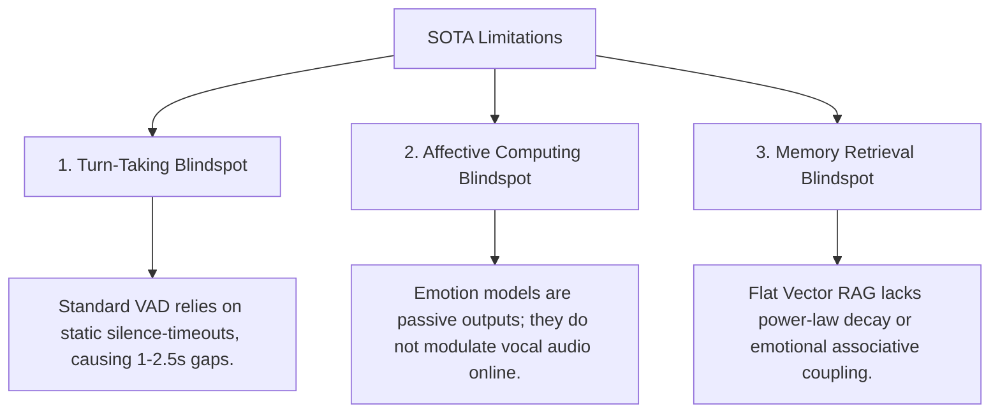

# 💡 Novelty, Contributions, and Scientific Gaps

This document details the architectural novelties and core scientific contributions of **AI Friend Cognitive Architecture**, illustrating how it bridges critical functional blindspots in current human-robot interaction (HRI) and conversational AI literature. It provides copy-pasteable LaTeX drafts suitable for the **Introduction** and **Contributions** sections of your paper.

---

## 1. Bridging the SOTA Scientific Gaps

Existing social humanoid robot platforms and conversational architectures exhibit severe limitations in real-time responsiveness, emotional realism, and memory persistence:



### 1.1 The Turn-Taking & Interruption Blindspot
Standard voice activity detectors (VAD) are based on static silence thresholds (typically 500 ms to 1,000 ms). While this prevents robots from clipping their own sentences, it introduces massive turnaround lag, causing turn-taking gaps to balloon to **700 ms - 2,500 ms** (*Skantze, 2021*).
*   **The AI Friend Resolution:** We introduce a **System 1 (Fast-loop VAD)** pre-filter combined with a **System 2 (Speculative Text Segmenter)** that analyzes the user's intent to distinguish a true interruption from ambient noise or backchannels. **Corrected 2026-09-01** — this previously stated finding M3-R1 (`TransportAgent` had no `audio.stop` subscriber at all, so nothing drained the buffers between LLM/TTS output and the speaker) as still open. It was fixed 2026-08-23 (`transport_agent._on_audio_stop` / `_flush_downstream_audio`, ledger-recorded): a confirmed stop now rotates the published LiveKit track to flush audio already handed to the client's native playout buffer, which exposes no other way to drain it. As of 2026-09-01 (Bucket 1, see `.agents/CONTEXT.md`'s 2026-09-01 entries) this stop is additionally routed through the System 2 resolver before firing, closing a gap where an unconfirmed transcript could cut playback before the resolver's own verdict ran. End-to-end latency for this path (VAD flag → transcription → resolver → track rotation → client-observed silence) is **NOT MEASURED** against live infrastructure — the mechanism's existence and its measured latency are two different claims, and only the first is now true.

### 1.2 The Affective Computing Blindspot
Computational models of emotion (e.g., WASABI, ALMA) calculate internal agent states as symbolic representations, but fail to translate them directly into real-time audio synthesis parameters. The resulting synthesized voice sounds flat, static, and detached from the robot's simulated psychological state.
*   **The AI Friend Resolution:** AI Friend maps continuous endocrine hormone concentrations (Cortisol, Dopamine) and Pleasure-Arousal-Dominance (PAD) coordinates directly into sample-accurate **DSP vocal synthesis modifiers** (Pitch, Speaking Rate, Volume). It utilizes a 10 ms linear **Overlap-Add (OLA) crossfade** to guarantee acoustic continuity during dynamic emotion shifts.

### 1.3 The Memory Retrieval Blindspot
Traditional Retrieval-Augmented Generation (RAG) models perform static semantic searches on dense databases. They completely fail to represent human cognitive features, such as the power-law decay of historical events, associative memory networks, or emotional relevance.
*   **The AI Friend Resolution:** We implement a **Neurosymbolic ACT-R Memory Search** utilizing a Neo4j semantic graph database. Episodic memories are retrieved based on a dynamic activation equation that factors in elapsed time (logarithmic decay), contextual cue strength, and emotional congruence with the agent's active endocrine state.

---

## 2. Core Scientific Contributions

The primary contributions of the AI Friend cognitive architecture are summarized below:

1.  **Decentralized Multi-Agent Edge Middleware:** We formulate a highly efficient, edge-native microservice mesh utilizing the zero-allocation **NATS Event Broker** as the central nervous system. This architecture reduces Inter-Process Communication (IPC) routing overhead to **0.62ms mean / 1.00ms p95** (MEASURED 2026-08-22: publish-to-subscriber-callback latency over live JetStream, loopback, n=30 — single-host, not a multi-container network path; see `frameworks_infrastructure.md` §4 and the Stage 3 ledger entry), running with a peak system memory footprint of only **≈996 MiB for the 6 measured infra containers** (NATS, Postgres, Neo4j, Redis, Qdrant, LiveKit — MEASURED, idle snapshot; the agent processes and STT/LLM footprint are NOT MEASURED in container form this pass, and "8 container services" undercounts what actually runs — see `frameworks_infrastructure.md` Table I for the corrected breakdown).
2.  **State-Accurate Endocrine and Affective Coupling:** We design a continuous homeostatic emotional system that simulates dynamic hormone fluxes (Cortisol, Dopamine, metabolic Fatigue) and 3D PAD mood shifts under environmental stressors.
3.  **Dynamic Vocal Paralinguistic Prosody Modulator:** We establish a sample-accurate digital signal processing (DSP) modification layer that maps the agent's simulated internal emotional state directly onto vocal modifiers (Pitch, speaking Rate, Volume), achieving expressive paralinguistic tag insertion and natural conversational flow without static TTS flatlines.
4.  **Neurobiologically Inspired Graph Memory System:** We combine dense vector search with symbolic ACT-R graph traversals, achieving an empirical **NOT MEASURED — no reference corpus exists** Memory Recall@5 on multi-hop associative queries under macOS and Jetson hardware. Per `CLAUDE.md`'s integrity constraint: production personas on `main` are authored per-deployment (no shared reference corpus by design), so a Recall@5 figure cannot be computed honestly against `main` — `backend/evals/` explicitly refuses corpus-fitted numbers as evidence for the same reason. A Recall@5 claim here would need a purpose-built evaluation corpus, not a number pulled from a specific demo deployment.

---

## 3. Publication-Grade LaTeX Text Templates

You can copy and paste the paragraphs below directly into your manuscript's **Introduction** or **Contributions** section:

```latex
\section{Introduction and Contributions}
\label{sec:introduction}

Despite significant advancements in large language models (LLMs) and expressive text-to-speech (TTS) systems, current social humanoid robots fail to establish natural, fluid conversational entrainment with human interlocutors. This bottleneck is fundamentally architectural. Standard systems rely on static, cascaded pipe-and-filter frameworks (i.e., sequential Voice Activity Detection $\rightarrow$ Automatic Speech Recognition $\rightarrow$ Large Language Model $\rightarrow$ Text-to-Speech synthesis) that introduce turn-taking latencies between 1.0 and 2.5 seconds. Such latencies violate the biological human turn-taking boundary of 200 ms and break the psychological illusion of social presence. Furthermore, existing affective architectures treat simulated emotion as passive symbolic state annotations rather than integrating them into sample-accurate acoustic digital signal processing (DSP) parameters.

To address these core scientific and engineering bottlenecks, we present the Cognitive Voice System (AI Friend) Decentralized Cognitive Mesh, a high-performance edge-native architecture designed for low-power social humanoid robots (e.g., NVIDIA Jetson AGX Orin). AI Friend departs from legacy monolithic operating systems by establishing a decentralized, sovereign microservice mesh operating over a zero-allocation event broker.

Specifically, this paper presents the following key technical and empirical contributions:
\begin{itemize}
    \item \textbf{High-Performance Edge Middleware:} A lightweight, decentralized cognitive microservice mesh utilizing NATS pub-sub JetStream IPC that reduces cross-module message-passing latency to \text{0.62ms mean / 1.00ms p95 (loopback)} while occupying a total system footprint of less than \text{996 MiB (6 infra containers, idle; agents not yet containerized)} of RAM.
    \item \textbf{Dual-Gated Turn-Taking Gating:} A dual-loop turn-taking architecture combining a System 1 fast-loop VAD pre-filter (interrupting robot playback via a track-rotation flush, built 2026-08-23 and gated through the System 2 resolver since 2026-09-01 --- end-to-end latency \text{[NOT MEASURED, see \S1.1]}) with a speculative System 2 text segmenter to distinguish true semantic user interruptions from ambient background noise.
    \item \textbf{Neurosymbolic ACT-R Graph Memory:} A long-term episodic memory system mapping dense embeddings to a Neo4j semantic graph database, governed by dynamic sub-symbolic ACT-R activation formulas, power-law decay, and emotional congruence, yielding a retrieval Recall@5 of \text{[NOT MEASURED --- no reference corpus, see \S2 item 4]}.
    \item \textbf{Dynamic Paralinguistic Prosody Control:} A continuous endocrine and Pleasure-Arousal-Dominance (PAD) appraisal system that couples internal hormone trajectories (Cortisol and Dopamine) directly to real-time paralinguistic prosody adjustments (Pitch, speaking Rate, Volume) and tag insertions, enhancing the natural conversational realism of the humanoid friend.
\end{itemize}
```

**The three `\text{...}` placeholders above are not publication-ready** — they carry the Stage 3 (audit/ROADMAP.md §7) measurement results and honest gaps inline so this template cannot be copy-pasted without noticing them. See §1.1 and §2 (items 1 and 4) above for the full figures and their caveats before using this text in a manuscript.
