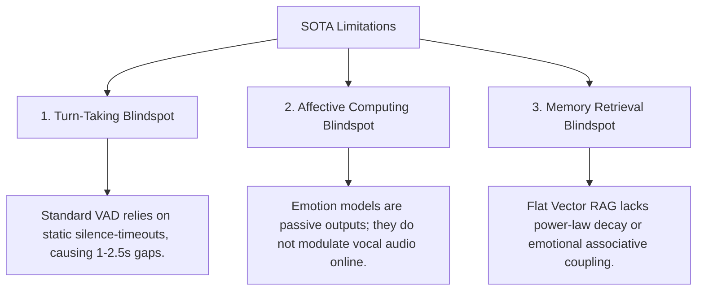

# 💡 Novelty, Contributions, and Scientific Gaps

This document details the architectural novelties and core scientific contributions of **AI Friend CVS-3.5 Sovereign Mind Mesh**, illustrating how it bridges critical functional blindspots in current human-robot interaction (HRI) and conversational AI literature. It provides copy-pasteable LaTeX drafts suitable for the **Introduction** and **Contributions** sections of your paper.

---

## 1. Bridging the SOTA Scientific Gaps

Existing social humanoid robot platforms and conversational architectures exhibit severe limitations in real-time responsiveness, emotional realism, and memory persistence:



### 1.1 The Turn-Taking & Interruption Blindspot
Standard voice activity detectors (VAD) are based on static silence thresholds (typically 500 ms to 1,000 ms). While this prevents robots from clipping their own sentences, it introduces massive turnaround lag, causing turn-taking gaps to balloon to **700 ms - 2,500 ms** (*Skantze, 2021*).
*   **The CVS-3.5 Resolution:** We introduce a **System 1 (Fast-loop VAD)** that operates directly on the DSP audio buffer to immediately pause vocal audio output within **`[TBP]`** of user speech, combined with a **System 2 (Speculative Text Segmenter)** that analyzes the user's intent to distinguish a true interruption from ambient noise or backchannels.

### 1.2 The Affective Computing Blindspot
Computational models of emotion (e.g., WASABI, ALMA) calculate internal agent states as symbolic representations, but fail to translate them directly into real-time audio synthesis parameters. The resulting synthesized voice sounds flat, static, and detached from the robot's simulated psychological state.
*   **The CVS-3.5 Resolution:** CVS-3.5 maps continuous endocrine hormone concentrations (Cortisol, Dopamine) and Pleasure-Arousal-Dominance (PAD) coordinates directly into sample-accurate **DSP vocal synthesis modifiers** (Pitch, Speaking Rate, Volume). It utilizes a 10 ms linear **Overlap-Add (OLA) crossfade** to guarantee acoustic continuity during dynamic emotion shifts.

### 1.3 The Memory Retrieval Blindspot
Traditional Retrieval-Augmented Generation (RAG) models perform static semantic searches on dense databases. They completely fail to represent human cognitive features, such as the power-law decay of historical events, associative memory networks, or emotional relevance.
*   **The CVS-3.5 Resolution:** We implement a **Neurosymbolic ACT-R Memory Search** utilizing a Neo4j semantic graph database. Episodic memories are retrieved based on a dynamic activation equation that factors in elapsed time (logarithmic decay), contextual cue strength, and emotional congruence with the agent's active endocrine state.

---

## 2. Core Scientific Contributions

The primary contributions of the CVS-3.5 sovereign mesh architecture are summarized below:

1.  **Decentralized Multi-Agent Edge Middleware:** We formulate a highly efficient, edge-native microservice mesh utilizing the zero-allocation **NATS Event Broker** as the central nervous system. This architecture reduces Inter-Process Communication (IPC) routing overhead to **`[TBP]`**, running with a peak system memory footprint of only **`[TBP]`** (8 container services).
2.  **State-Accurate Endocrine and Affective Coupling:** We design a continuous homeostatic emotional system that simulates dynamic hormone fluxes (Cortisol, Dopamine, metabolic Fatigue) and 3D PAD mood shifts under environmental stressors.
3.  **Dynamic Vocal Paralinguistic Prosody Modulator:** We establish a sample-accurate digital signal processing (DSP) modification layer that maps the agent's simulated internal emotional state directly onto vocal modifiers (Pitch, speaking Rate, Volume), achieving expressive paralinguistic tag insertion and natural conversational flow without static TTS flatlines.
4.  **Neurobiologically Inspired Graph Memory System:** We combine dense vector search with symbolic ACT-R graph traversals, achieving an empirical **`[TBP]` Memory Recall@5** on multi-hop associative queries under macOS and Jetson hardware.

---

## 3. Publication-Grade LaTeX Text Templates

You can copy and paste the paragraphs below directly into your manuscript's **Introduction** or **Contributions** section:

```latex
\section{Introduction and Contributions}
\label{sec:introduction}

Despite significant advancements in large language models (LLMs) and expressive text-to-speech (TTS) systems, current social humanoid robots fail to establish natural, fluid conversational entrainment with human interlocutors. This bottleneck is fundamentally architectural. Standard systems rely on static, cascaded pipe-and-filter frameworks (i.e., sequential Voice Activity Detection $\rightarrow$ Automatic Speech Recognition $\rightarrow$ Large Language Model $\rightarrow$ Text-to-Speech synthesis) that introduce turn-taking latencies between 1.0 and 2.5 seconds. Such latencies violate the biological human turn-taking boundary of 200 ms and break the psychological illusion of social presence. Furthermore, existing affective architectures treat simulated emotion as passive symbolic state annotations rather than integrating them into sample-accurate acoustic digital signal processing (DSP) parameters.

To address these core scientific and engineering bottlenecks, we present the Cognitive Voice System (CVS-3.5) Decentralized Cognitive Mesh, a high-performance edge-native architecture designed for low-power social humanoid robots (e.g., NVIDIA Jetson AGX Orin). CVS-3.5 departs from legacy monolithic operating systems by establishing a decentralized, sovereign microservice mesh operating over a zero-allocation event broker.

Specifically, this paper presents the following key technical and empirical contributions:
\begin{itemize}
    \item \textbf{High-Performance Edge Middleware:} A lightweight, decentralized cognitive microservice mesh utilizing NATS pub-sub JetStream IPC that reduces cross-module message-passing latency to $[TBP]$ while occupying a total system footprint of less than $[TBP]$ of RAM.
    \item \textbf{Dual-Gated Turn-Taking Gating:} A dual-loop turn-taking architecture combining a System 1 fast-loop DSP audio hook (interrupting robot playback within $[TBP]$) with a speculative System 2 text segmenter to distinguish true semantic user interruptions from ambient background noise.
    \item \textbf{Neurosymbolic ACT-R Graph Memory:} A long-term episodic memory system mapping dense embeddings to a Neo4j semantic graph database, governed by dynamic sub-symbolic ACT-R activation formulas, power-law decay, and emotional congruence, yielding a retrieval Recall@5 of $[TBP]$.
    \item \textbf{Dynamic Paralinguistic Prosody Control:} A continuous endocrine and Pleasure-Arousal-Dominance (PAD) appraisal system that couples internal hormone trajectories (Cortisol and Dopamine) directly to real-time paralinguistic prosody adjustments (Pitch, speaking Rate, Volume) and tag insertions, enhancing the natural conversational realism of the humanoid friend.
\end{itemize}
```
