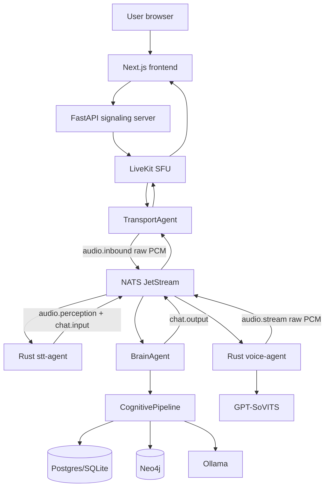
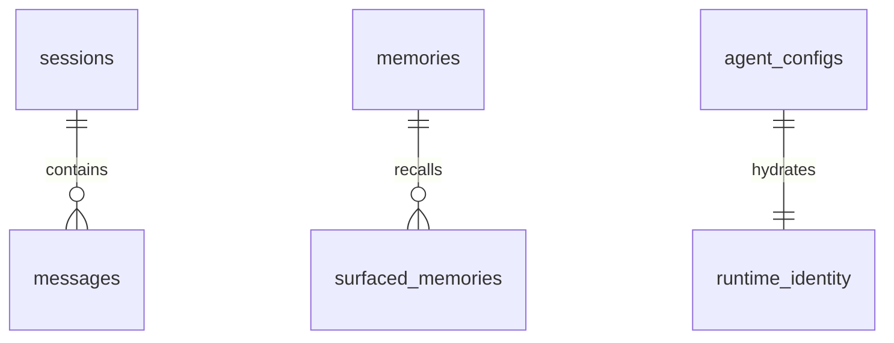

# Pankudi_ai Codebase Knowledge

Generated from direct repository inspection on 2026-05-25.

This document is a standalone brain dump for future LLM agents and engineers. It explains what the system does, how the active code paths are wired, what contracts must be preserved, and where feature work should start.

All file references are relative to the repository root. Stable anchors use this form:

`[[F:path#line-range#hash8]]`

The hash is the first 8 characters of the file SHA-256 at the time of this analysis.

## Executive Summary

Pankudi_ai is a local-first, real-time cognitive voice companion. The user-facing product is a browser-based voice interface that connects to a LiveKit room; a mesh of backend agents then transcribes user audio, updates emotional and relational state, generates a response with local LLMs, synthesizes speech with GPT-SoVITS, and streams raw PCM audio back to the user.

The architecture is not a monolith. It is a NATS JetStream event mesh with separate agents for signaling, transport, STT, cognition, memory surfacing, subconscious/background cognition, heartbeat, vision, and voice synthesis.

Primary business purpose:

- Provide a conversational AI friend with low-latency voice interaction.
- Preserve long-term identity continuity across sessions.
- Use affective state, memory, and visual/acoustic context to make replies feel more human.
- Keep the runtime sovereign/local: LiveKit, NATS, Postgres/pgvector, Neo4j, Redis, Ollama, GPT-SoVITS, and Qdrant are expected to run locally or in controlled infrastructure.

Verified active code anchors:

- FastAPI signaling and LAN gate: [[F:backend/main.py#1-144#7067c4b6]]
- Settings and runtime constants: [[F:backend/app/config.py#1-145#416797cc]]
- Pydantic/NATS contracts: [[F:backend/app/contracts.py#1-210#4b17b998]]
- Base NATS agent wrapper: [[F:backend/app/agents/base.py#1-357#ff13163b]]
- Brain/cognition mesh agent: [[F:backend/app/agents/brain_agent.py#1-496#52698d58]]
- Cognitive pipeline: [[F:backend/app/cognitive/pipeline.py#1-342#742c57b6]]
- State and affect persistence: [[F:backend/app/state/agent_state.py#1-918#f956b336]]
- Memory retrieval and consolidation store: [[F:backend/app/state/memory_store.py#1-947#e94838eb]]
- Rust/Python shared contracts: [[F:backend/crates/contracts/src/lib.rs#1-385#3289512a]]
- Rust STT agent: [[F:backend/crates/stt-agent/src/main.rs#1-353#2f43a121]]
- Rust voice agent: [[F:backend/crates/voice-agent/src/main.rs#1-836#7d36a906]]
- Next.js voice UI: [[F:frontend/app/page.js#1-134#be72cc0a]]
- LiveKit browser hook: [[F:frontend/hooks/useWebRTCVoice.js#1-141#f9562cb2]]

## FILE INDEX

Priority legend:

- P0: must understand before changing behavior.
- P1: important feature or persistence module.
- P2: tests, docs, tools, or supporting infra.
- P3: archived/research/background material.

| # | Priority | Path | Type | Lines | Hash8 | Notes |
|---|---|---|---:|---:|---|---|
| 1 | P0 | `backend/main.py` | FastAPI entry | 144 | `7067c4b6` | REST control plane, LiveKit token, LAN gate, vision toggle |
| 2 | P0 | `backend/app/config.py` | settings | 145 | `416797cc` | Pydantic settings, NATS/LiveKit/Ollama/voice/state defaults |
| 3 | P0 | `backend/app/contracts.py` | contracts | 210 | `4b17b998` | Pydantic mesh topics and payload schemas |
| 4 | P0 | `backend/app/agents/base.py` | agent base | 357 | `ff13163b` | NATS connect, stream bootstrap, publish/subscribe serialization |
| 5 | P0 | `backend/app/agents/brain_agent.py` | agent | 496 | `52698d58` | Cognitive orchestrator and `chat.input` -> `chat.output` loop |
| 6 | P0 | `backend/app/cognitive/pipeline.py` | pipeline | 342 | `742c57b6` | Perception/appraisal/state/decision/action/learning flow |
| 7 | P0 | `backend/crates/contracts/src/lib.rs` | Rust contracts | 385 | `3289512a` | Rust mirror of mesh schemas and audio/prosody helpers |
| 8 | P0 | `backend/crates/stt-agent/src/main.rs` | Rust service | 353 | `2f43a121` | `audio.inbound` consumer, partial perception, final transcript |
| 9 | P0 | `backend/crates/voice-agent/src/main.rs` | Rust service | 836 | `7d36a906` | `chat.output` consumer, GPT-SoVITS stream, `audio.stream` publisher |
| 10 | P0 | `frontend/hooks/useWebRTCVoice.js` | React hook | 141 | `f9562cb2` | Browser LiveKit connect/publish/subscribe |
| 11 | P1 | `backend/app/agents/transport_agent.py` | agent | 219 | `8047ede7` | LiveKit <-> NATS audio bridge |
| 12 | P1 | `backend/app/agents/surfacing_agent.py` | agent | 596 | `5e5f8e50` | Episodic and semantic memory surfacing |
| 13 | P1 | `backend/app/agents/subconscious_agent.py` | agent | 461 | `7998bba1` | Proactive thought, monologue, dream, consolidation |
| 14 | P1 | `backend/app/agents/system_agent.py` | agent | 60 | `d4ab4816` | Periodic `system.tick` heartbeat |
| 15 | P1 | `backend/app/cognitive/core.py` | service | 324 | `68d43687` | CognitiveService wrapper around pure pipeline and mesh signals |
| 16 | P1 | `backend/app/cognitive/perception.py` | service | 52 | `c90620df` | Raw event -> CognitiveEvent, simple intent defaults |
| 17 | P1 | `backend/app/cognitive/appraisal.py` | service | 238 | `243e92f1` | Rust-backed appraisal and LLM semantic drift |
| 18 | P1 | `backend/app/cognitive/decision.py` | service | 370 | `a48f67ad` | Behavior tree, LLM intent classification, MAUT goal scoring |
| 19 | P1 | `backend/app/cognitive/action.py` | service | 477 | `781e3ceb` | Prompt assembly, streaming, guardrails, memory command action |
| 20 | P1 | `backend/app/cognitive/learning.py` | service | 253 | `daae3389` | Reflection, graph triplets, persona evolution, memory consolidation |
| 21 | P1 | `backend/app/cognitive/identity.py` | service | 177 | `dffc4418` | Hybrid identity, persona prompt, validation |
| 22 | P1 | `backend/app/state/agent_state.py` | state | 918 | `f956b336` | PAD/trust/attachment/fatigue state, Redis/SQLite/Neo4j hydration |
| 23 | P1 | `backend/app/state/conversation_store.py` | persistence | 429 | `7058f2aa` | Sessions/messages/agent config storage with SQLite fallback |
| 24 | P1 | `backend/app/state/memory_store.py` | persistence | 947 | `e94838eb` | Embeddings, Qdrant/Postgres/SQLite retrieval, ACT-R scoring |
| 25 | P1 | `backend/app/state/graph_db.py` | persistence | 227 | `61d1cfac` | Neo4j async driver, safe labels/relations, cache invalidation |
| 26 | P1 | `backend/app/state/sqlite_fallback.py` | persistence | 281 | `3792b8b4` | Asyncpg-like local SQLite adapter |
| 27 | P1 | `backend/app/vision/agent.py` | agent | 159 | `a0220c9b` | Screen/camera capture and VLM description publishing |
| 28 | P1 | `backend/app/runtime_bootstrap.py` | bootstrap | 186 | `b1eef7c5` | DB schema, NATS streams, Ollama model readiness |
| 29 | P1 | `backend/db/schema.sql` | schema | 152 | `767a5bb1` | Canonical Postgres schema and pgvector functions |
| 30 | P1 | `frontend/app/page.js` | UI | 134 | `be72cc0a` | Main interaction screen and vision toggle |
| 31 | P1 | `frontend/components/AssistantCircle.jsx` | UI | 114 | `38d6268f` | Animated state indicator |
| 32 | P1 | `docker-compose.infra.yml` | infra | 199 | `16ecaf55` | NATS/Postgres/Neo4j/Redis/LiveKit/Ollama/SoVITS/Qdrant |
| 33 | P1 | `docker-compose.prod.yml` | infra | 265 | `3abac70b` | Agent services and env wiring |
| 34 | P2 | `backend/tests/test_regressions.py` | tests | 376 | `350928d3` | Main regression guardrail for mesh contracts |
| 35 | P2 | `backend/tests/test_pipeline.py` | tests | 93 | `21640f8d` | Cognitive pipeline flow and interruption tests |
| 36 | P2 | `backend/tests/test_mesh_surfacing_integration.py` | tests | 125 | `65becba7` | In-memory mesh integration for memory surfacing |
| 37 | P2 | `backend/tests/test_rust_contract_fixtures.py` | tests | 58 | `8bb46c73` | Rust/Pydantic fixture compatibility |
| 38 | P2 | `frontend/prisma/schema.prisma` | schema | 32 | `55f51887` | Frontend Prisma subset of backend DB schema |
| 39 | P2 | `backend/scripts/db/init_db.py` | script | 92 | `d5a00ed7` | Manual DB init, non-destructive by default |
| 40 | P2 | `docs/ARCHITECTURE.md` | docs | 164 | `f87c66cb` | Useful system narrative, must be revalidated |
| 41 | P2 | `docs/API_SPEC.md` | docs | 238 | `ec2b022f` | API and subject dictionary |
| 42 | P2 | `README.md` | docs | 514 | `1d5c5568` | Product narrative and run guidance |
| 43 | P3 | `_archive/**` | archive | mixed | n/a | Historical code/docs, not active runtime |
| 44 | P3 | `scripts/research/**` | research | mixed | n/a | Benchmark/research utilities, not request path |
| 45 | P3 | `academic_benchmarks/**` | docs/data | mixed | n/a | Academic benchmark material |

## PHASE 1 - Initial Context Scan

### What The Application Is

The application is an "AI Friend" cognitive voice system. In live code, the product is a local browser experience backed by a real-time voice mesh:

1. The frontend connects to the FastAPI signaling server for a LiveKit token and joins a LiveKit room. See `useWebRTCVoice()` in [[F:frontend/hooks/useWebRTCVoice.js#1-141#f9562cb2]] and token endpoints in [[F:backend/main.py#97-125#7067c4b6]].
2. The `TransportAgent` joins the same LiveKit room, publishes an AI audio track, forwards user PCM frames to NATS on `audio.inbound`, and forwards `audio.stream` PCM back to LiveKit. See [[F:backend/app/agents/transport_agent.py#1-219#8047ede7]].
3. The Rust `stt-agent` consumes raw PCM, derives user voice features, emits partial `audio.perception`, emits speculative `audio.stop` when stop-like keywords appear, and emits final `chat.input`. See [[F:backend/crates/stt-agent/src/main.rs#1-353#2f43a121]].
4. `BrainAgent` consumes `chat.input`, runs the cognitive pipeline, publishes `chat.output` chunks, and persists the conversation. See [[F:backend/app/agents/brain_agent.py#1-496#52698d58]].
5. The Rust `voice-agent` consumes `chat.output`, calls GPT-SoVITS, applies prosody/timing/audio effects, and publishes raw PCM to `audio.stream`. See [[F:backend/crates/voice-agent/src/main.rs#1-836#7d36a906]].

### Domain And Target Users

The domain is real-time affective conversational AI. Target users are people running a local AI friend/voice companion with a private local stack. The repository also serves researchers/developers experimenting with cognitive architectures, memory retrieval, turn-taking, and voice realism.

### Tech Stack

- Backend app: Python, FastAPI, Pydantic, asyncpg, Neo4j async driver, Redis, Qdrant, httpx, NATS, LiveKit Python SDK.
- Cognitive accelerators and audio agents: Rust crates, PyO3 module `cognitive_rust`, async-nats, reqwest.
- Frontend: Next.js 16, React 19, LiveKit client, Framer Motion, Tailwind CSS 4.
- Stores: Postgres with pgvector, SQLite fallback, Redis, Neo4j, Qdrant.
- Model integrations: local Ollama for LLM/embedding/VLM; GPT-SoVITS for TTS.
- Infra: Docker Compose for NATS, Postgres, Neo4j, Redis, LiveKit, Ollama, GPT-SoVITS, Qdrant, and agent services.

### Main Features And Business Purpose

| Feature | Business purpose | Primary code |
|---|---|---|
| Browser voice session | Gives users one screen to speak with the AI friend. | [[F:frontend/app/page.js#1-134#be72cc0a]], [[F:frontend/hooks/useWebRTCVoice.js#1-141#f9562cb2]] |
| LiveKit signaling | Creates controlled real-time audio sessions without exposing mesh internals to the browser. | [[F:backend/main.py#1-144#7067c4b6]] |
| Transport bridge | Converts browser audio into mesh PCM and mesh PCM into browser playback. | [[F:backend/app/agents/transport_agent.py#1-219#8047ede7]] |
| Speech-to-text and interruption | Turns raw PCM into final text plus low-latency partial interruption cues. | [[F:backend/crates/stt-agent/src/main.rs#1-353#2f43a121]] |
| Cognitive response generation | Updates affect/state, chooses a response goal, generates identity-aware speech text. | [[F:backend/app/cognitive/pipeline.py#1-342#742c57b6]] |
| Voice synthesis | Produces expressive PCM with pause/hesitation/vocalization support. | [[F:backend/crates/voice-agent/src/main.rs#1-836#7d36a906]] |
| Memory surfacing | Recalls relevant episodic or semantic context into the active cognitive loop. | [[F:backend/app/agents/surfacing_agent.py#1-596#5e5f8e50]] |
| Identity continuity | Persists persona, relationship, values, and learned evolution across sessions. | [[F:backend/app/cognitive/identity.py#1-177#dffc4418]], [[F:backend/app/state/conversation_store.py#1-429#7058f2aa]] |
| Affective state | Maintains PAD mood, trust, attachment, fatigue, and user mental model. | [[F:backend/app/state/agent_state.py#1-918#f956b336]] |
| Subconscious/autonomy | Generates internal/proactive thoughts and consolidates memories during idle periods. | [[F:backend/app/agents/subconscious_agent.py#1-461#7998bba1]] |
| Vision context | Adds visual scene descriptions and user-distance estimates to the mesh. | [[F:backend/app/vision/agent.py#1-159#a0220c9b]] |
| Runtime bootstrap | Makes local/deployed runtime self-initializing for DB, NATS streams, and models. | [[F:backend/app/runtime_bootstrap.py#1-186#b1eef7c5]] |

### STATE BLOCK - Phase 1

INDEX_VERSION: `2026-05-25-pankudi-ai-v1`

FILE_MAP_SUMMARY:

- Active backend: `backend/main.py`, `backend/app/**`
- Active Rust crates: `backend/crates/contracts`, `backend/crates/stt-agent`, `backend/crates/voice-agent`, `backend/crates/cognitive-rust`
- Active frontend: `frontend/app`, `frontend/hooks`, `frontend/components`
- Infra: `docker-compose.infra.yml`, `docker-compose.prod.yml`, `livekit.yaml`, `.env.example`
- Canonical schema: `backend/db/schema.sql`
- Regression tests: `backend/tests/test_regressions.py`, `backend/tests/test_pipeline.py`, `backend/tests/test_rust_contract_fixtures.py`

OPEN_QUESTIONS:

- Whether production STT is currently implemented elsewhere or intentionally mocked: live Rust STT requires `RUST_STT_MOCK_TRANSCRIPT` and bails if it is empty.
- Whether the frontend Prisma schema is intentionally a minimal subset of backend schema.

KNOWN_RISKS:

- Subject/payload drift can break the mesh even when individual modules pass unit tests.
- The voice/STT Rust services and Python Pydantic models must evolve together.
- Archived docs/code can contradict active runtime.

GLOSSARY_DELTA:

- Sovereign Mesh: NATS-based local agent mesh.
- PAD: Pleasure/valence, arousal, dominance affect state.
- ACT-R: memory activation and decay model.
- APRA: affect-to-prosody trajectory used for voice modulation.

## PHASE 2 - System Architecture Deep Dive

### Architecture Type

The architecture is an event-driven micro-agent mesh. FastAPI is not the main cognition runtime; it is a signaling/control gateway. NATS JetStream is the runtime backbone.

Text diagram asset: [`codebase-analysis-docs/assets/architecture-overview.mmd`](assets/architecture-overview.mmd)



### Component Map

#### FastAPI Signaling Server

`AIBackend` manages readiness, NATS connection, LiveKit token creation, and vision control. It does not run the cognitive pipeline. Routes:

- `GET /`: returns online identity/readiness.
- `GET /status`: returns `status` and `ready`.
- `GET /token`: returns LiveKit token and URL.
- `POST /start-session`: legacy alias for token generation.
- `POST /vision/toggle`: publishes `vision.control`.
- `GET /health`: returns health and NATS readiness.

The entire FastAPI app has a dependency on `require_lan_client()`, which checks direct client host when `Config.LAN_ONLY` is true. See [[F:backend/main.py#56-144#7067c4b6]] and LAN logic in [[F:backend/app/network.py#1-19#4a30d589]].

#### NATS Base Agent Layer

`BaseAgent` centralizes:

- NATS connection with infinite reconnects.
- JetStream stream bootstrap for `AI_MESSAGES` and `AI_AUDIO`.
- JSON vs binary publish logic.
- Latency metadata propagation.
- Subscription decoding with binary-header handling.
- NACK for failing `chat.*` and `state.*` handlers; ACK for fast media failures.
- `cache.sync` auto-subscription for identity cache invalidation.

Changing `BaseAgent.publish()` affects all Python agents because it mutates dict payloads by adding `latency_metadata`. See [[F:backend/app/agents/base.py#1-357#ff13163b]].

#### Contracts

`backend/app/contracts.py` defines the canonical Python contract objects and topic enum. Rust mirrors them in `backend/crates/contracts/src/lib.rs`. Contract tests ensure fixture compatibility.

Important subjects:

- `audio.inbound`: raw PCM bytes from transport to STT.
- `audio.perception`: partial/acoustic perception from STT to brain/state.
- `chat.input`: final transcript or subconscious thought to brain.
- `chat.output`: brain output chunks to voice.
- `audio.stop` / `audio.resume`: interruption control to voice.
- `audio.stream`: raw PCM from voice to transport.
- `state.update`: UI/log/memory state broadcast.
- `state.broadcast`: internal state persistence broadcast to subconscious Neo4j sync.
- `memory.surfaced`: retrieved episodic/semantic memory.
- `system.tick`: heartbeat.
- `agent.voice.modulation`: APRA voice modulation trajectory.

See [[F:backend/app/contracts.py#1-210#4b17b998]] and [[F:backend/crates/contracts/src/lib.rs#1-385#3289512a]].

### Main Data Flow

Voice turn sequence asset: [`codebase-analysis-docs/assets/voice-turn-sequence.mmd`](assets/voice-turn-sequence.mmd)

1. Browser loads `frontend/app/page.js`.
2. `useWebRTCVoice()` fetches `GET /token`, connects to LiveKit, publishes a microphone track, and attaches subscribed AI audio tracks to hidden audio elements.
3. `TransportAgent` joins LiveKit as `transport-agent`, publishes local AI audio track, subscribes to remote user audio, and publishes raw PCM bytes to `audio.inbound` with metadata.
4. Rust `stt-agent` normalizes PCM to mono, calculates voice properties, emits `user.voice.properties`, streams partial `audio.perception`, emits speculative `audio.stop` when stop-like keywords appear, then emits final `chat.input`.
5. `BrainAgent` receives `chat.input`, cancels any active generation task, emits final `audio.stop` for real user speech, and starts `_process_chat_input_flow()`.
6. `CognitivePipeline.execute()` resolves speculative interruptions, perceives the event, appraises it, updates state, selects a goal/action, streams response chunks, validates identity, and schedules learning.
7. `BrainAgent._stream_to_speech()` segments LLM output into `chat.output` chunks with affect/prosody metadata and sends a final done message.
8. Rust `voice-agent` consumes chunks, maps affect to prosody, splits timing tags (`<pause=...>`, `<hesitate>`, `<breath_fast>`, `<sigh_soft>`), calls GPT-SoVITS for text segments, applies effects/attenuation, and publishes raw PCM on `audio.stream`.
9. `TransportAgent` converts `audio.stream` PCM into LiveKit `AudioFrame`s and captures them into the AI audio source.
10. Browser hears the remote LiveKit audio track.

### Persistence Architecture

Database ER asset: [`codebase-analysis-docs/assets/db-er.mmd`](assets/db-er.mmd)



Stores:

- Postgres/pgvector: `memories`, `sessions`, `messages`, `agent_configs`; canonical schema in [[F:backend/db/schema.sql#1-152#767a5bb1]].
- SQLite fallback: local asyncpg-like adapter in [[F:backend/app/state/sqlite_fallback.py#1-281#3792b8b4]].
- Redis: hot state hydration/persistence in `StateService`.
- Neo4j: knowledge graph and optional state fallback via [[F:backend/app/state/graph_db.py#1-227#61d1cfac]].
- Qdrant: semantic vector recall path inside `MemoryStore`.
- Local JSON: seed identity in `backend/app/personality.json` and `backend/app/history.json`, loaded by `IdentityManager` but superseded by durable config when present.

### Cross-Cutting Concerns

Security:

- LAN-only default is enforced at FastAPI dependency level. It ignores spoofable forwarded headers and checks direct client host. See [[F:backend/main.py#56-65#7067c4b6]] and [[F:backend/app/network.py#1-19#4a30d589]].
- Neo4j placeholder/default passwords are rejected in `GraphDB.__init__()`. See [[F:backend/app/state/graph_db.py#14-43#61d1cfac]].
- Dynamic Cypher labels and relationship types are validated by `_safe_label()` and `_safe_relation()`. Regression coverage is in [[F:backend/tests/test_regressions.py#318-357#350928d3]].

Observability:

- `BaseAgent` tracks selected subject publish/consume counts and latency.
- `CognitiveService` records local mesh signal metrics.
- `SurfacingAgent` records surfacing metrics.
- `SubjectMetrics` exists as a reusable async threaded metrics helper but is not fully wired everywhere. See [[F:backend/app/metrics.py#1-200#c135b1c7]].

Runtime bootstrap:

- `bootstrap_runtime()` ensures DB schema, NATS streams, and Ollama models when `RUNTIME_AUTO_BOOTSTRAP` is true for `BrainAgent.main()`. See [[F:backend/app/runtime_bootstrap.py#1-186#b1eef7c5]].
- Manual `backend/scripts/db/init_db.py` is non-destructive unless `ALLOW_DESTRUCTIVE_DB_RESET=true`, but it creates an older subset of the schema compared with `backend/db/schema.sql`. Treat `schema.sql` plus runtime migrations as canonical.

### STATE BLOCK - Phase 2

INDEX_VERSION: `2026-05-25-pankudi-ai-v1`

FILE_MAP_SUMMARY:

- Signal path: `frontend/hooks/useWebRTCVoice.js` -> `backend/main.py` -> LiveKit -> `transport_agent.py` -> NATS.
- Audio input path: `audio.inbound` -> Rust `stt-agent` -> `audio.perception` and `chat.input`.
- Cognitive path: `brain_agent.py` -> `CognitiveService` -> `CognitivePipeline`.
- Audio output path: `chat.output` -> Rust `voice-agent` -> `audio.stream` -> `transport_agent.py`.
- State/memory path: `agent_state.py`, `conversation_store.py`, `memory_store.py`, `graph_db.py`.

OPEN_QUESTIONS:

- Whether `SubjectMetrics` should replace duplicate per-agent metric implementations.
- Whether `state.broadcast` should be formalized in `Topics`.

KNOWN_RISKS:

- The mesh has multiple state subjects; `state.update` is the public/canonical current-state broadcast while `state.broadcast` is used for Neo4j sync.
- `BaseAgent.subscribe()` calls callbacks differently for binary messages (`callback(data, metadata=meta)`) than JSON messages (`callback(data)`).

GLOSSARY_DELTA:

- Speculative stop: early STT partial signal that can duck/stop voice before final transcript.
- Durable identity: runtime persona loaded from relational `agent_configs`.
- Surfaced memory: memory retrieved asynchronously and injected into the cognitive loop.

## PHASE 3 - Feature-By-Feature Analysis

### 1. Browser Voice Interface

Business need:

- Let the user speak with the AI friend from one immersive screen.

Entry points:

- `frontend/app/page.js` renders the UI, status bar, vision controls, camera preview, `AssistantCircle`, and status text.
- `frontend/hooks/useWebRTCVoice.js` connects to backend `/token`, joins LiveKit, publishes microphone audio, and attaches remote audio.

Technical flow:

- On mount, `useWebRTCVoice()` fetches token from `BACKEND_URL`, creates a LiveKit `Room`, registers connection and track events, connects to returned URL, and publishes a local microphone track.
- `page.js` automatically calls `startRecording()` when connected and idle. This currently only sets UI state to `listening`; actual audio publishing happens in the LiveKit hook.
- Vision toggle calls `POST /vision/toggle?source=screen|camera`, updates local state, and optionally starts/stops webcam preview.

Interactions:

- Depends on FastAPI `/token`.
- Depends on LiveKit room and transport agent for actual AI voice playback.
- Does not directly consume NATS or backend state events.

Edge cases:

- Browser autoplay policy requires user interaction; the hook calls `room.startAudio()` on click/keydown.
- Remote audio elements are attached to `document.body` and cleaned up on unmount.
- UI state `speaking` is set when an audio track is subscribed, not necessarily when the voice agent is actively talking.

### 2. FastAPI Signaling And Control

Business need:

- Keep browser-facing API small and local-safe: health, LiveKit token, session alias, and vision control.

Entry points:

- `backend/main.py` defines the app and routes.

Technical flow:

- Startup calls `ensure_models_provisioned()` and attempts NATS connection.
- `get_livekit_token()` builds LiveKit JWT for room `ai-friend-room`.
- `toggle_vision_source()` publishes JSON to `vision.control`.
- `require_lan_client()` blocks non-LAN clients when `LAN_ONLY=true`.

Interactions:

- Provides URL/token consumed by `useWebRTCVoice()`.
- Publishes vision control consumed by `VisionAgent`.
- Shares `Config` with all agents.

Edge cases:

- Startup does not crash if NATS fails; `backend.is_ready` remains false.
- CORS allows configured origins; when `LAN_ONLY` and wildcard origins are configured, it uses a private/loopback regex instead.

### 3. LiveKit Transport Bridge

Business need:

- Isolate browser/WebRTC complexity from cognition/audio services.

Entry points:

- `python -m app.agents.transport_agent` in `docker-compose.prod.yml`.

Technical flow:

- Joins LiveKit with identity `transport-agent`.
- Publishes a local audio track named `ai-voice`.
- Converts remote audio frames to bytes and publishes `audio.inbound` with sample rate, channels, participant, and capture timestamp metadata.
- Consumes `audio.stream` as raw bytes or legacy dict/base64, strips WAV headers if present, queues PCM, and captures frames into the LiveKit audio source.

Interactions:

- Receives user audio from LiveKit.
- Publishes to STT via NATS.
- Receives AI audio from Rust voice agent.

Edge cases:

- Output queue drops oldest frames when overloaded to keep playback near real time.
- It still accepts legacy dict/base64 `audio.stream` payloads, but the optimized contract is raw PCM bytes.

### 4. Rust STT And Interruption

Business need:

- Provide low-latency partial perception and final transcript events with voice features.

Entry points:

- `stt-agent` binary in `docker-compose.prod.yml`.

Technical flow:

- Subscribes to `audio.inbound`.
- Reads latency metadata from NATS headers.
- Downmixes multichannel PCM to mono.
- Computes RMS energy, pitch F0, and tempo estimate, then publishes `user.voice.properties`.
- Emits partial `audio.perception` messages with `metadata.is_partial=true`.
- Emits speculative `audio.stop` for stop-like keywords.
- Emits final `chat.input` with `source="whisper"` and propagated latency metadata.

Interactions:

- `BrainAgent._on_audio_perception()` can publish confirmed `audio.stop` or `audio.resume` based on partial semantic interruption.
- `CognitiveService._on_audio_perception()` applies sensory state and stores `last_speculative_intent`.
- `BrainAgent._on_user_voice_properties()` injects voice features into appraisal for the next turn.

Edge cases:

- Current Rust STT bails at startup if `RUST_STT_MOCK_TRANSCRIPT` is empty and no live STT backend exists. This is a major implementation nuance.
- JSON/base64 payloads on `audio.inbound` are not parsed as text; tests assert PCM-only behavior.

### 5. Brain Agent And Cognitive Pipeline

Business need:

- Convert user input into a coherent, emotionally/state-aware conversational response.

Entry points:

- `python -m app.agents.brain_agent`.
- Main NATS input: `chat.input`.

Technical flow:

- On start, connects to NATS, initializes conversation store, initializes cognitive core, starts a DB session, then subscribes to `chat.input`, vision, feedback, audio perception, and voice properties.
- On non-subconscious `chat.input`, cancels active generation, publishes a confirmed `audio.stop`, records user interaction, builds a raw cognitive event, and starts the pipeline.
- `CognitivePipeline.execute()`:
  - resolves speculative stop conflict before expensive work;
  - perceives event;
  - appraises using Rust-backed heuristics;
  - updates PAD/trust/attachment state;
  - publishes `state.update`;
  - runs decision service;
  - executes action streaming;
  - validates response against identity;
  - emits reflection work for learning.
- `BrainAgent._stream_to_speech()` segments text into short chunks with affect and prosody metadata, publishes `chat.output`, and emits a final `done=true` message.

Interactions:

- Reads surfaced memories accumulated by `CognitiveService`.
- Uses vision description as raw event metadata.
- Uses user voice properties for appraisal.
- Writes conversation history asynchronously.
- Kicks reflection through `ReflectionService`.

Edge cases:

- Empty/error LLM stream yields fallback text: "I'm having trouble thinking right now..."
- Active generation is cancellable on new user input or semantic interruption.
- `_publish_speech_chunk()` uses `SpeechCoordinator` and state snapshot to populate `ChatOutputAffect`.

### 6. Decision, Action, And Guardrails

Business need:

- Make the AI feel less like a stateless assistant by selecting social goals and enforcing persona boundaries.

Technical flow:

- `PerceptionService` assigns intent: `REMEMBER` for remember/memorize keywords, `CHAT` otherwise.
- `DecisionService` uses a behavior tree for `REFLECT`, `REMEMBER`, and `CHAT`.
- For chat, MAUT scores `ENGAGE`, `COMFORT`, `INFORM`, `TEASE`, and `PROTECT` using appraisal and state.
- Optional LLM classification enriches intent/goal plus Theory of Mind inferences.
- `ActionService` builds the prompt with identity, current goal, active memories, ToM, and endocrine generation options.
- Streaming guardrails strip emotion XML wrappers, preserve timing tags, strip CoT thought blocks, reject JSON/Markdown starts and forbidden AI-persona phrases, and retry/self-correct on violations.

Interactions:

- `ActionService` stores explicit remember commands through `MemoryStore.add_memory()`.
- `IdentityManager.validate_response()` can trigger a second generation pass in the pipeline.

Edge cases:

- There is a prompt conflict: `IdentityManager.get_persona_prompt()` rule 3 says "Maintain Hinglish", while `ActionService` system instruction says "Respond only in English. Do not use Hindi, Hinglish..." This is a real subtlety to resolve before changing persona or language behavior.

### 7. Voice Synthesis And Playback Control

Business need:

- Turn text chunks into expressive low-latency audio and handle interruptions naturally.

Entry points:

- `voice-agent` binary.

Technical flow:

- Consumes `chat.output`.
- Subscribes to `vision.description` for distance, `audio.stop`, `audio.resume`, and `agent.voice.modulation`.
- Maps affect to prosody via Rust contract helper `vad_to_prosody()`.
- Splits text into `TemporalPart`s:
  - text -> GPT-SoVITS `/tts` streaming call;
  - `<pause=Nms>` -> silence PCM;
  - `<hesitate>` -> synthetic hesitation audio;
  - `<breath_fast>` / `<sigh_soft>` -> loaded or synthetic vocalizations.
- Applies reverb based on distance, OLA crossfade on prosody shifts, attenuation during speculative stops, and viseme telemetry.
- Publishes raw PCM to `audio.stream` with NATS headers.

Interactions:

- `audio.stop` speculative reduces volume to 30 percent; confirmed stop sets abort flag.
- `audio.resume` restores attenuation to 1.0.
- `TransportAgent` is the downstream audio sink.

Edge cases:

- Final `chat.output.done=true` clears voice interruption state.
- New `turn_id` also resets interruption/attenuation.
- Pause duration is clamped to 5000ms.

### 8. State, Mood, Trust, Fatigue, And Theory Of Mind

Business need:

- Preserve a continuous internal personality/relationship state across turns and idle time.

Technical flow:

- `AgentState` stores mood/valence, energy/arousal, dominance, trust components, attachment, interaction count, fatigue, active goals, and user mental model.
- `StateService.hydrate_state()` tries Redis, then SQLite, then Neo4j fallback.
- `persist_state()` writes Redis and SQLite, then fire-and-forgets `state.broadcast`.
- `update_from_appraisal()` applies ALMA-style mood pull and trust/attachment updates.
- `apply_sensory_perception()` applies confidence-scaled acoustic emotion and event nudges.
- `handle_system_tick()` applies fatigue update and exponential drift back to baseline.
- `check_proactive_eligibility()` uses idle threshold, cooldown, and minimum energy.

Interactions:

- `CognitiveService` calls state update methods.
- `SubconsciousAgent` can persist `state.broadcast` to Neo4j.
- `SurfacingAgent` tracks `state.update` for mood-congruent recall and APRA voice modulation.

Edge cases:

- Low-confidence acoustic perceptions are ignored unless events are present.
- Sensory persistence is debounced by `STATE_SENSORY_PERSIST_INTERVAL`.
- Redis failures silently fall back to SQLite.

### 9. Memory Surfacing

Business need:

- Let the AI recall relevant shared history or facts at the right time.

Technical flow:

- `SurfacingAgent` subscribes to `chat.input`, `system.tick`, and `state.update`.
- It tracks last context and current valence/arousal/cortisol.
- It alternates between episodic and semantic channels.
- Episodic path calls `MemoryStore.search_memories()` with ACT-R, mood congruence, and novelty suppression.
- Semantic path extracts capitalized entity candidates and queries Neo4j relationships.
- It publishes `memory.surfaced` with `MemorySurfaced`/`SurfacedMemory`.

Interactions:

- `CognitiveService._on_memory_surfaced()` keeps the last five surfaced memories.
- `ActionService` injects those memories into the response prompt.
- `state.update` triggers `agent.voice.modulation` APRA trajectory publication.

Edge cases:

- Recently surfaced content is suppressed for `surface_novelty_window`.
- `memory.surfaced` payload is structured as `memories=[...]`, but `CognitiveService._on_memory_surfaced()` currently also looks for top-level `content`. If no adapter flattens it, surfaced memories may not be appended. This is a change-sensitive contract to verify before feature work.

### 10. Long-Term Memory Store

Business need:

- Store explicit and consolidated memories with retrieval based on relevance, emotional fit, and recency/frequency.

Technical flow:

- `MemoryStore.add_memory()` gets an Ollama embedding, inserts into Postgres/SQLite, and upserts to Qdrant if available.
- `search_memories()` first checks an L1 cache, then Qdrant if online, otherwise DB fallback:
  - SQLite fetches rows and scores with `cognitive_rust.score_memories_actr_sqlite()`;
  - Postgres uses `surface_actr_memories()` from `backend/db/schema.sql`, then recalculates with neuromodulatory gating.
- Direct cue boost and spreading activation are hardcoded for several terms.
- `_refresh_memories()` increments recall count and last recalled timestamp.
- `apply_actr_decay()` prunes or decays older/consolidated memories.

Interactions:

- Explicit "remember" commands use `ActionService`.
- Reflection uses `MemoryStore.add_memory()` for consolidated episodic summaries.
- Surfacing uses `search_memories()`.

Edge cases:

- Embedding failures return `False` or empty results; they do not raise to callers.
- L1 cache is keyed by query, scope, thresholds, current affect, and excluded contents.
- Hardcoded cue list currently includes `kolkata`, `bangalore`, `priya`, `rasgulla`, `cognitive architectures`, and `affective`.

### 11. Reflection, Identity Evolution, And Subconscious Agent

Business need:

- Grow the AI's memory and relationship model while the user is idle, without blocking live turns.

Technical flow:

- `ReflectionService.trigger_reflection()` gates concurrent reflections and minimum interval.
- `_consolidate()` summarizes episodes, extracts high-confidence graph facts, evolves persona when confidence >= 0.8, and stores a consolidated episodic memory.
- `SubconsciousAgent` listens to `system.tick`, `chat.input`, `state.broadcast`, and `audio.perception`.
- On tick, it can generate a proactive thought and publish it as `chat.input` with `metadata.source="subconscious"`.
- It performs consolidation only after 300 seconds of user inactivity unless test bypass is enabled.
- It runs a continuous monologue/dreaming loop after 30 seconds of silence, publishing `state.subconscious` or storing dream insight memory.

Interactions:

- Brain treats subconscious `chat.input` differently: it does not emit confirmed user-speech stop.
- Subconscious cancels active thoughts/dreams when user activity is detected.
- Graph fact writes use `GraphDB.create_triplet()`.

Edge cases:

- `SubconsciousAgent._on_state_broadcast()` subscribes to `state.broadcast`, a subject not currently listed in `Topics`.
- Consolidation pairs chronological user/assistant messages and marks them consolidated.

### 12. Vision Context

Business need:

- Add nonverbal/visual grounding and distance-aware voice behavior.

Technical flow:

- FastAPI `/vision/toggle` publishes `vision.control`.
- `VisionAgent` switches between `ScreenLink` and `CameraLink`.
- It captures frames, optionally base64-encodes them, and runs `VisualAppraisalService`.
- Raw `vision.frames` publication is commented out for diagnostics; semantic `vision.description` is active.
- Distance is estimated with OpenCV Haar face detection when OpenCV/NumPy are installed; otherwise falls back to `1.0`.

Interactions:

- `BrainAgent` stores latest visual context and user distance.
- `voice-agent` also subscribes to `vision.description` and uses user distance for reverb/prosody decisions.

Edge cases:

- Vision capture is host-native oriented in docs, but active agent imports screen/camera link classes and can run as Python agent if dependencies are present.
- VLM appraisal is rate-limited and habituation-aware in `backend/app/vision/appraisal.py`.

### Cross-Feature Interaction Map

| Producer | Subject/API | Consumer | Why it matters |
|---|---|---|---|
| Frontend | `GET /token` | FastAPI | Browser gets LiveKit credentials |
| FastAPI | `vision.control` | VisionAgent | UI switches screen/camera source |
| TransportAgent | `audio.inbound` | Rust STT | Raw user PCM enters mesh |
| Rust STT | `user.voice.properties` | BrainAgent | Voice features affect appraisal |
| Rust STT | `audio.perception` | BrainAgent, CognitiveService, SubconsciousAgent | Partial interruption, sensory state, task cancellation |
| Rust STT | `chat.input` | BrainAgent, SurfacingAgent, SubconsciousAgent | Final transcript and context trigger |
| SystemAgent | `system.tick` | CognitiveService, SurfacingAgent, SubconsciousAgent | Idle state evolution and background work |
| SurfacingAgent | `memory.surfaced` | CognitiveService | Active memory influence |
| StateService/CognitivePipeline | `state.update` | SurfacingAgent/UI/logs | Current mood/energy/trust broadcast |
| StateService | `state.broadcast` | SubconsciousAgent | Neo4j state persistence |
| BrainAgent | `chat.output` | Rust voice-agent | Text chunks become speech |
| BrainAgent/STT | `audio.stop` | Rust voice-agent | Interrupt/duck/abort playback |
| BrainAgent | `audio.resume` | Rust voice-agent | Recover from false speculative stop |
| Rust voice-agent | `audio.stream` | TransportAgent | AI PCM goes back to browser |

### STATE BLOCK - Phase 3

INDEX_VERSION: `2026-05-25-pankudi-ai-v1`

FILE_MAP_SUMMARY:

- Feature entry points: `frontend/app/page.js`, `backend/main.py`, `backend/app/agents/*.py`, Rust `stt-agent` and `voice-agent`.
- Feature services: `backend/app/cognitive/*.py`, `backend/app/state/*.py`, `backend/app/vision/*.py`.

OPEN_QUESTIONS:

- Confirm intended `memory.surfaced` payload shape consumed by `CognitiveService`.
- Confirm whether production should use a real STT backend instead of mock transcript env.
- Confirm language policy: English-only vs natural Hinglish.

KNOWN_RISKS:

- Tests cover many contracts but do not prove the full Docker/LiveKit/audio path is live.
- Some docs describe future/ideal architecture; this document prioritizes inspected code.

GLOSSARY_DELTA:

- User voice properties: RMS, pitch, tempo published by STT.
- Endocrine options: LLM generation parameters derived from cortisol/dopamine/fatigue.
- OLA crossfade: audio smoothing across prosody shifts.

## PHASE 4 - Things You Must Know Before Changing Code

### Contract Gotchas

1. `audio.inbound` is raw PCM bytes, not JSON/base64. `TransportAgent` publishes bytes, `BaseAgent` treats `audio.inbound` as binary, and Rust STT tests assert JSON-style audio is not parsed as text.
2. `audio.stream` is raw PCM bytes with NATS headers in the optimized path. `TransportAgent` still accepts legacy dict/base64 for compatibility.
3. `state.update` is the current public state broadcast subject. Regression tests explicitly assert `SurfacingAgent` subscribes to `state.update` and not stale `agent.state`.
4. `state.broadcast` exists as an implementation subject for Neo4j state sync but is not included in `Topics`.
5. `GraphDB.create_relationship()` requires subject name, subject label, relation, target name, target label, and optional properties. Use `create_triplet()` for simple Entity-Entity facts.
6. `BaseAgent.publish()` may mutate the dict passed into it by adding `latency_metadata`.
7. `BaseAgent.subscribe()` callback signature differs for binary messages with metadata.

### Performance And Bottlenecks

- Hot path appraisal uses Rust `cognitive_rust.compute_appraisal()` instead of LLM calls.
- Memory retrieval uses Qdrant if available, Postgres pgvector function if not, and Rust-accelerated SQLite scoring for fallback.
- `TransportAgent` uses a bounded queue and drops oldest frames under pressure.
- `voice-agent` streams GPT-SoVITS chunks rather than waiting for full synthesis.
- `ActionService` has a bounded LLM stream budget (`LLM_STREAM_MAX_SECONDS`).
- `SubjectMetrics` batches metrics in a daemon thread, but some agents still have local metric code.

### Security Implications

- Keep `LAN_ONLY=true` for local deployments unless you add authentication.
- Do not trust `x-forwarded-for`; current LAN guard correctly checks direct client host.
- Do not weaken Neo4j password validation.
- Do not interpolate raw labels or relationship names into Cypher; use `GraphDB` safe helpers.
- `.env` contains secrets and must not be committed; `.env.example` documents required variables.

### Hardcoded Business Rules

- LiveKit room is hardcoded as `ai-friend-room`.
- Browser participant defaults to `user`; transport identity is `transport-agent`.
- Proactive idle threshold defaults to 7200s and cooldown to 3600s.
- Subconscious consolidation requires 300s inactivity.
- Monologue/dream loop uses 30s silence windows.
- STT speculative keywords include `stop`, `wait`, `hold`, `no`, `wrong`, `quiet`, `alex`, `friend`.
- Decision goals are fixed: `ENGAGE`, `COMFORT`, `INFORM`, `TEASE`, `PROTECT`.
- Memory cue boosts include specific demo/research terms.
- Voice timing tags are a small fixed set.

### Counterintuitive Code

- FastAPI is not the chat API. It only gates/signals; the chat loop is NATS-based.
- `startRecording()` in the frontend only changes UI state; the microphone is already published by the LiveKit hook after connection.
- `VisionAgent` currently does not publish raw `vision.frames` because that code is commented out.
- `IdentityManager` saves local JSON files, but can hydrate from durable `agent_configs`; durable config is active runtime source when present.
- `runtime_bootstrap.py` is safer than the manual DB init script for current schema alignment.
- `frontend/prisma/schema.prisma` is a subset of backend schema; do not assume Prisma reflects all backend columns.
- Rust STT currently uses `RUST_STT_MOCK_TRANSCRIPT` as final transcript; without a live STT backend, clearing that value stops the agent.

### STATE BLOCK - Phase 4

INDEX_VERSION: `2026-05-25-pankudi-ai-v1`

FILE_MAP_SUMMARY:

- Gotcha-heavy files: `backend/app/agents/base.py`, `backend/app/contracts.py`, `backend/crates/stt-agent/src/main.rs`, `backend/crates/voice-agent/src/main.rs`, `backend/app/state/memory_store.py`, `backend/app/cognitive/action.py`.

OPEN_QUESTIONS:

- Should `state.broadcast` become a formal contract?
- Should language policy be English-only or Hinglish?
- Should mock STT be replaced or renamed to make production behavior explicit?

KNOWN_RISKS:

- Schema drift between `backend/db/schema.sql`, `backend/scripts/db/init_db.py`, and `frontend/prisma/schema.prisma`.
- Prompt-level policy conflict can create inconsistent speech behavior.

GLOSSARY_DELTA:

- LAN gate: direct-client host allowlist for local/private/link-local IPs.
- Durable config: DB-backed runtime persona record.

## PHASE 5 - Technical Reference And Glossary

### Public REST API

| Method | Path | Purpose | Code |
|---|---|---|---|
| GET | `/` | Online/readiness payload | [[F:backend/main.py#94-101#7067c4b6]] |
| GET | `/status` | Simple status and readiness | [[F:backend/main.py#103-106#7067c4b6]] |
| GET | `/token?participant=user` | LiveKit token + URL | [[F:backend/main.py#108-116#7067c4b6]] |
| POST | `/start-session?participant=user` | Legacy alias for token | [[F:backend/main.py#119-127#7067c4b6]] |
| POST | `/vision/toggle?source=screen` | Publish `vision.control` | [[F:backend/main.py#130-134#7067c4b6]] |
| GET | `/health` | Health and NATS readiness | [[F:backend/main.py#137-139#7067c4b6]] |

### Internal API Examples

`chat.input` final transcript:

```json
{
  "text": "hello there",
  "utterance_id": "utt-1",
  "metadata": {
    "source": "whisper",
    "confidence": 0.9,
    "utterance_id": "utt-1"
  },
  "latency_metadata": {
    "start_time": 1713330000.0,
    "hops": [],
    "source": "transport_agent"
  }
}
```

`chat.output` speech chunk:

```json
{
  "content": "Hey there<pause=20ms>friend",
  "done": false,
  "turn_id": "turn-1",
  "affect": {
    "valence": 0.8,
    "arousal": 0.7,
    "dominance": 0.6,
    "trust": 0.5,
    "attachment": 0.1,
    "emotion": "happy",
    "fatigue": 0.0
  }
}
```

`audio.stop` speculative:

```json
{
  "interrupt": true,
  "speculative": true,
  "intent": "SPECULATIVE_STOP",
  "intent_type": "VOICE_INTERRUPTION",
  "keywords": ["stop"],
  "confidence": 0.9,
  "perception_text": "stop",
  "utterance_id": "utt-1"
}
```

### Key Classes And Functions

| Symbol | Summary |
|---|---|
| `AIBackend` | FastAPI-side NATS/LiveKit control wrapper. |
| `require_lan_client()` | Local/private/link-local request gate. |
| `Config` / `AppSettings` | Runtime settings facade backed by Pydantic settings. |
| `Topics` | Python enum for mesh subjects. |
| `BaseAgent.connect()` | NATS connect plus stream bootstrap. |
| `BaseAgent.publish()` | JSON/binary publish plus latency metadata. |
| `BaseAgent.subscribe()` | Durable JetStream subscription wrapper. |
| `BrainAgent._on_chat_input()` | Main user/subconscious input handler. |
| `BrainAgent._stream_to_speech()` | Converts generator output to speech chunks. |
| `CognitiveService.process_event()` | Mesh-aware wrapper around pure pipeline. |
| `CognitivePipeline.execute()` | Core cognitive loop. |
| `DecisionService.decide()` | Intent/goal plan selection. |
| `ActionService.execute()` | LLM response generation and memory command execution. |
| `StateService.update_from_appraisal()` | PAD/trust/attachment update. |
| `StateService.handle_system_tick()` | Idle decay and fatigue update. |
| `MemoryStore.add_memory()` | Embed and store a memory in SQL/Qdrant. |
| `MemoryStore.search_memories()` | ACT-R and mood-congruent retrieval. |
| `ReflectionService.trigger_reflection()` | Async consolidation gate. |
| `GraphDB.create_triplet()` | Safe semantic relationship helper. |
| `SurfacingAgent._surface_relevant_memories()` | Alternating episodic/semantic recall. |
| `SubconsciousAgent._on_system_tick()` | Proactive thought and consolidation trigger. |
| `VisionAgent._run_appraisal()` | VLM description and distance publishing. |
| `TransportAgent._process_remote_audio()` | LiveKit user audio -> `audio.inbound`. |
| `TransportAgent._on_nats_audio()` | `audio.stream` -> LiveKit AudioFrame queue. |
| Rust `handle_audio_inbound()` | STT processing path. |
| Rust `handle_chat_output()` | TTS/audio rendering path. |
| Rust `vad_to_prosody()` | Affect vector to prosody values. |
| Rust `generate_apra_trajectory()` | State-to-voice modulation trajectory. |

### Database Schema

Canonical Postgres schema is in `backend/db/schema.sql`.

Primary relational tables:

- `memories`: long-term memory with `embedding vector(768)`, scope (`wing`, `room`), ACT-R fields, emotional metadata, and developmental metadata.
- `sessions`: conversation sessions plus trust component snapshots.
- `messages`: user/assistant messages with `consolidated` flag.
- `agent_configs`: persona, background history, evolved learnings.

Postgres functions:

- `match_memories(query_embedding, match_threshold, match_count)`
- `surface_actr_memories(query_embedding, wing, room, decay_rate, spread_weight, emotion_weight, current_valence, threshold, limit)`

SQLite fallback mirrors the core tables and translates common Postgres syntax. It cannot provide true pgvector; vector similarity is done in Python/Rust fallback.

Neo4j model:

- Nodes: `Agent`, `Entity`, and dynamic safe labels.
- Relationships: safe UPPER_SNAKE relation types, usually from reflection/triple extraction.
- Constraints: unique `Agent.name`, unique `Entity.name`, and entity name index.

### Glossary

- ACT-R: Cognitive memory activation model used for recall scoring and decay.
- Agent: Independent process that communicates through NATS subjects.
- Appraisal: Evaluation of an event along relevance, novelty, goal congruence, agency, norm alignment, and relationship impact.
- APRA: Affect/prosody trajectory emitted as `agent.voice.modulation`.
- BrainAgent: Python agent that owns the main cognition flow.
- ChatInput: Final transcript or internal thought event consumed by BrainAgent.
- ChatOutput: Brain output chunk consumed by voice agent.
- CognitivePipeline: Pure transport-agnostic cognition sequence.
- Endocrine modulation: Mapping cortisol/dopamine/fatigue to LLM options.
- GPT-SoVITS: Local TTS API used by Rust voice agent.
- JetStream: NATS persistence/streaming layer.
- LiveKit: WebRTC SFU used by browser and transport agent.
- Memory surfacing: Asynchronous recall event that influences the next response.
- NATS subject: Topic name for mesh events.
- PAD: Valence/mood, arousal/energy, dominance.
- Speculative stop: Early partial-STT stop hypothesis.
- State update: Current emotional/relational broadcast.
- TransportAgent: Bridge between LiveKit tracks and NATS audio subjects.
- VLM: Vision-language model used for scene descriptions.

### ASSUMPTIONS

| Assumption | Confidence | Basis |
|---|---:|---|
| The active user product is the Next.js/LiveKit voice interface. | High | Frontend + FastAPI + transport path inspected. |
| The current Rust STT is mock-transcript based unless extended elsewhere. | High | `stt-agent` bails without `RUST_STT_MOCK_TRANSCRIPT`; no other active STT module under `backend/app/stt`. |
| Postgres schema in `backend/db/schema.sql` is more canonical than `backend/scripts/db/init_db.py`. | High | Runtime bootstrap executes `schema.sql`; regression test guards runtime columns. |
| `_archive/**` is not active runtime. | Medium | Active compose/code paths do not reference it in inspected files. |
| Vision raw frame publication is intentionally disabled. | Medium | Code comment says temporarily disabled for diagnostics. |

### STATE BLOCK - Phase 5

INDEX_VERSION: `2026-05-25-pankudi-ai-v1`

FILE_MAP_SUMMARY:

- API reference source: `backend/main.py`.
- Contract reference source: `backend/app/contracts.py` and `backend/crates/contracts/src/lib.rs`.
- DB reference source: `backend/db/schema.sql` and `backend/app/state/sqlite_fallback.py`.

OPEN_QUESTIONS:

- Whether to document `state.broadcast` and `state.subconscious` in `docs/API_SPEC.md`.
- Whether to generate an updated Prisma schema from backend canonical schema.

KNOWN_RISKS:

- External docs can be ahead of active code.
- Some feature names use CVS version labels inconsistently across README/docs/code.

GLOSSARY_DELTA:

- Cognitive event: internal pipeline representation from `PerceptionService`.
- Behavioral directive: state-derived natural language instruction for persona prompt.

## PHASE 6 - Final Assembly Notes

This document merges high-level overview, mid-level technical notes, and deep reference. The Mermaid assets are stored in `codebase-analysis-docs/assets/`.

### Recommended Starting Points For Future Work

For new frontend/voice UX work:

1. Read `frontend/app/page.js`.
2. Read `frontend/hooks/useWebRTCVoice.js`.
3. Read `backend/main.py`.
4. Verify LiveKit and transport behavior in `backend/app/agents/transport_agent.py`.

For new cognition behavior:

1. Read `backend/app/agents/brain_agent.py`.
2. Read `backend/app/cognitive/pipeline.py`.
3. Read `backend/app/cognitive/decision.py` and `backend/app/cognitive/action.py`.
4. Read `backend/app/state/agent_state.py`.
5. Add focused tests in `backend/tests/test_pipeline.py` or `backend/tests/test_regressions.py`.

For memory or identity changes:

1. Read `backend/app/state/memory_store.py`.
2. Read `backend/app/agents/surfacing_agent.py`.
3. Read `backend/app/cognitive/learning.py`.
4. Read `backend/app/cognitive/identity.py`.
5. Check `backend/db/schema.sql`, `backend/app/state/sqlite_fallback.py`, and regression tests.

For audio/STT/TTS contracts:

1. Read `backend/app/contracts.py`.
2. Read `backend/crates/contracts/src/lib.rs`.
3. Read `backend/crates/stt-agent/src/main.rs`.
4. Read `backend/crates/voice-agent/src/main.rs`.
5. Run Python and Rust contract tests if the toolchain is healthy.

### Verification Commands To Prefer

Python regression focus:

```powershell
.\.venv\Scripts\python.exe -m pytest backend/tests/test_regressions.py -q
```

Python cognitive/contract focus:

```powershell
.\.venv\Scripts\python.exe -m pytest backend/tests/test_pipeline.py backend/tests/test_rust_contract_fixtures.py -q
```

Rust contracts/audio:

```powershell
cargo test --manifest-path backend/Cargo.toml
```

Frontend lint/build:

```powershell
cd frontend
npm run lint
npm run build
```

Known local caveat from prior work: npm or native Python wheels may be broken in this workspace; distinguish environment/toolchain failures from code failures.

### Final STATE BLOCK

INDEX_VERSION: `2026-05-25-pankudi-ai-v1`

FILE_MAP_SUMMARY:

- Top 50 active files are represented in the file index.
- Primary runtime is under `backend/app`, `backend/crates`, and `frontend`.
- Primary docs/assets generated here are under `codebase-analysis-docs`.

OPEN_QUESTIONS:

- Is mock STT acceptable for current release, or should live STT be implemented/wired?
- Should language policy prefer English-only or Hinglish?
- Should `memory.surfaced` consumer shape be normalized?
- Should schema sources be consolidated into one generator or migration path?

KNOWN_RISKS:

- Mesh contract drift is the highest blast-radius risk.
- Audio binary/JSON compatibility paths can hide contract mistakes.
- Multiple stores create consistency risks: Redis, SQLite, Postgres, Neo4j, Qdrant, JSON identity files.
- Prompt and docs version labels can mislead future agents if not tied back to active code.

GLOSSARY_DELTA:

- Master knowledge doc: this file.
- Assets: text-friendly Mermaid diagrams in `codebase-analysis-docs/assets`.

## Appendix - Source Documents Read

The analysis read or inspected the following active sources directly:

- `README.md`
- `docs/ARCHITECTURE.md`
- `docs/API_SPEC.md`
- `backend/main.py`
- `backend/app/config.py`
- `backend/app/contracts.py`
- `backend/app/agents/base.py`
- `backend/app/agents/brain_agent.py`
- `backend/app/agents/transport_agent.py`
- `backend/app/agents/surfacing_agent.py`
- `backend/app/agents/subconscious_agent.py`
- `backend/app/agents/system_agent.py`
- `backend/app/cognitive/core.py`
- `backend/app/cognitive/pipeline.py`
- `backend/app/cognitive/perception.py`
- `backend/app/cognitive/appraisal.py`
- `backend/app/cognitive/decision.py`
- `backend/app/cognitive/action.py`
- `backend/app/cognitive/learning.py`
- `backend/app/cognitive/identity.py`
- `backend/app/state/agent_state.py`
- `backend/app/state/conversation_store.py`
- `backend/app/state/memory_store.py`
- `backend/app/state/graph_db.py`
- `backend/app/state/sqlite_fallback.py`
- `backend/app/state/identity_core_store.py`
- `backend/app/vision/agent.py`
- `backend/app/vision/appraisal.py`
- `backend/app/network.py`
- `backend/app/logging_config.py`
- `backend/app/metrics.py`
- `backend/app/runtime_bootstrap.py`
- `backend/db/schema.sql`
- `backend/scripts/db/init_db.py`
- `backend/scripts/bootstrap/runtime_bootstrap.py`
- `backend/scripts/bootstrap/setup_nats_streams.py`
- `backend/crates/contracts/src/lib.rs`
- `backend/crates/stt-agent/src/main.rs`
- `backend/crates/voice-agent/src/main.rs`
- `backend/crates/cognitive-rust/src/lib.rs`
- `frontend/package.json`
- `frontend/app/page.js`
- `frontend/hooks/useWebRTCVoice.js`
- `frontend/components/AssistantCircle.jsx`
- `frontend/app/globals.css`
- `frontend/prisma/schema.prisma`
- `docker-compose.infra.yml`
- `docker-compose.prod.yml`
- `backend/tests/conftest.py`
- `backend/tests/test_regressions.py`
- `backend/tests/test_pipeline.py`
- `backend/tests/test_mesh_surfacing_integration.py`
- `backend/tests/test_rust_contract_fixtures.py`
- `backend/tests/test_voice_modulation.py`
- `backend/tests/test_vision.py`
