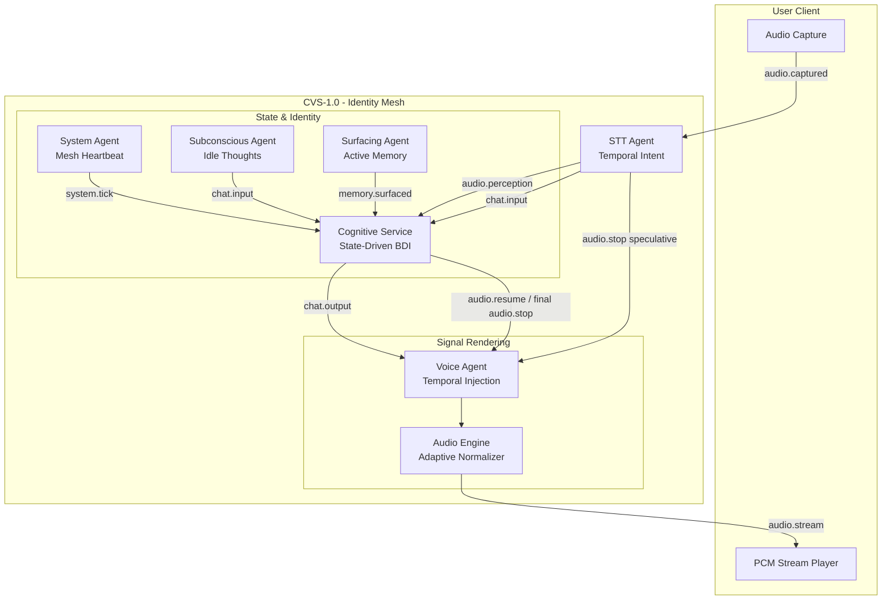

# 🏗️ Architecture Documentation - CVS-1.0

> **Deep dive into the AI Friend platform architecture, design decisions, and the Cognitive Voice System (CVS-1.0)**

---

## Table of Contents

1. [System Overview](#system-overview)
2. [CVS-1.0 Architecture (Perceptual Mastery)](#cvs-10-architecture-perceptual-mastery)
3. [Cognitive Layer (Brain)](#1-cognitive-layer-brain)
4. [Temporal Orchestration (Voice Controller)](#2-temporal-orchestration-voice-controller)
5. [Signal Rendering (Audio Engine)](#3-signal-rendering-audio-engine)
6. [The Feedback Mesh](#4-the-feedback-mesh)
7. [System Flow Diagram](#system-flow-diagram)

---

## System Overview

AI Friend is built on the **Sovereign Mesh Architecture**. It uses a decentralized ecosystem of specialized micro-agents coordinated via a high-performance **NATS JetStream** event bus. In the **Solid State Hardening (Apr 2026)**, the signal bus was expanded to include 9 core subjects covering system heartbeats, active memory recall, and identity synchronization.

In **CVS-1.0 Hardened**, we have achieved **Identity Continuity**. The system is no longer a reactive "Think-Speak" pipeline; it is now a **State-Driven Identity Mesh** coached by a continuous NATS heartbeat. It anticipates context through memory surfacing and expresses emotion through deterministic temporal markers.

The architecture should be evaluated by conversational realism rather than only by model intelligence. A technically correct answer that arrives with unnatural timing, forgets recent emotional state, repeats memories mechanically, or fails to recover from a false interruption is considered a behavioral failure. Every layer exists to preserve the illusion of a continuous person: perception, state, memory, decision, and voice all contribute to that outcome.

---

## 🏗️ CVS-1.0 Hardened Architecture

### 🧠 1. Cognitive Layer (Identity & State)

The BrainAgent orchestrates a **State-Driven Identity** with a hardened relational foundation.

- **Neo4j State Persistence**: Mood, energy, trust, and attachment are persistent and evolve via mesh heartbeats.
- **Live State Safety**: Live emotional state is hydrated without TTL cache and graph cache is invalidated after writes, preventing recent mood/trust updates from being rewound by stale reads.
- **Relational Seeding (Prisma 7.7.0)**: On first-boot, the identity mesh hydrates the PostgreSQL relational store with the AI's "Seed Genome" (Personality & History), ensuring zero-drift identity across restarts.
- **Identity Heartbeat (`system.tick`)**: A 60s NATS pulse ensures the agent's internal state matures even when user interaction is idle.
- **Hybrid Identity Model**: Separates an **Immutable Core** (base tone, values) from **Adaptive Variables** (habits, relationship status).
- **Single Identity Owner**: Reflection and response generation share the same `IdentityManager`, so adaptive evolution affects the active personality without requiring restart.
- **Endocrine Modulation**: LLM generation parameters (temperature, top_p, frequency_penalty) are dynamically adjusted based on the agent's current PAD state (e.g., high cortisol/stress → lower temperature for more focused/rigid responses).

### 💭 2. Subconscious Engine (Tier-5 Autonomy)

Introduced the **Subconscious Agent** to manage background cognition during periods of inactivity.

- **Internal Monologue**: Generates proactive "thoughts" based on the current context, recent memories, and emotional state when the system is idle.
- **Cognitive Injection**: Subconscious thoughts are published to `chat.input` (source: `subconscious`), allowing the Brain Agent to process them as internal prompts without contaminating the external chat history.
- **Idle-State Proactivity**: Triggers reflection or proactive reaching out based on the psychological state (e.g., high "Attachment" + high "Energy" → reaching out to the user).

### 📖 3. Proactive Memory Surfacing

The system anticipates conversational context through an asynchronous dual-channel recall layer that merges Relational (Postgres) and Graph (Neo4j) knowledge.

- **`SurfacingAgent`**: Background process that alternates between two recall channels:
  - **Episodic Channel (pgvector)**: ACT-R scored, mood-congruent recall of past events.
  - **Semantic Channel (Neo4j)**: Structured facts and relationship extraction (e.g., "User -> LIKES -> Coffee").
- **Narrative Formatting**: Episodic memories are not surfaced as flat strings, but constructed into narrative episodes with temporal labels ("last week") and emotional context, allowing the LLM to bond over shared history ("Remember when we...").
- **Novelty Suppression**: Recently surfaced memories are suppressed for a short window, preventing the agent from repeating the same recollection.
- **Passive Recall Safety**: Surfacing does not refresh `last_recalled_at`, preventing memory relevance from becoming self-reinforcing only because a memory was surfaced.
- **Signal Bus Expansion**: The mesh monitors 9 core subjects: `chat.*`, `vision.*`, `state.*`, `cmd.*`, `voice.*`, `system.*`, `memory.*`, `identity.*`, and `knowledge.*`.

### ⏱️ 3. Perceptual Intelligence (STT Agent)

Interruption is now handled as a **Temporal Intent Problem** powered by binary PCM transport.

- **Dual-STT Pipeline**: Uses Whisper for deep context and `sherpa-onnx` (SenseVoice) for low-latency temporal intent.
- **Speculative Intent Object**: SenseVoice publishes a structured hypothesis with intent name, keywords, confidence, text, timestamp, and utterance id.
- **Whisper Validation**: Whisper final transcript confirms or rejects the speculative stop. Rejected false positives publish `audio.resume`; confirmed commands publish final `audio.stop`.
- **Human Turn-Taking Goal**: The system favors quick reversible pause over late irreversible interruption, because a brief recoverable pause feels more natural than talking over the user.

### 🔊 4. Signal Rendering (Voice Agent)

A persistent synthesis runtime with direct binary transport and expressive behavior.

- **Expressive Temporal Layer**: Interprets `<pause>` and `<hesitate>` tags by injecting silent PCM buffers directly into the 32kHz stream.
- **Streaming First Audio**: GPT-SoVITS chunks are queued as they arrive rather than buffered until full synthesis completion.
- **Expression Sanitization**: Legacy `<emotion ...>` wrappers are stripped before TTS while timing markers are preserved. Affect should move as metadata rather than spoken text.
- **Direct Binary Bus**: Publishes raw PCM bytes via NATS Headers (Phase 2).
- **Backpressure Guard**: Bounded queue and synthesis semaphore protect GPU health.

---

## 📊 System Flow Diagram



---

## 🔁 Real-Time Turn-Taking Flow

The interruption loop is deliberately two-phase:

1. **Fast perception**: SenseVoice sees a possible stop/wait/quiet command and publishes `audio.stop` with `speculative=true`.
2. **Voice behavior**: VoiceAgent enters a reversible `SPECULATIVE_PAUSE` and holds output rather than clearing all buffers immediately.
3. **Backbone validation**: Whisper produces the final transcript and BrainAgent checks whether the stop keyword was actually a command or just conversational context.
4. **Resolution**: False positives publish `audio.resume`; confirmed commands publish final `audio.stop` with `speculative=false`.

This is closer to human overlap behavior: people often pause briefly when another person starts speaking, then continue if the interjection was not meant to stop them.

---

## 🧭 Agent Handoff Context

Future agents should read [../.agents/CONTEXT.md](../.agents/CONTEXT.md) before changing the architecture. It records durable project intent, recent runtime changes, verification commands, and next recommended work. Update it after architecture, behavior, or test changes so context survives beyond any single conversation window.

## ⚙️ Resource Matrix (CVS-1.0)

| Agent | Context | CPU (Min) | RAM (Target) | Notes |
| :--- | :--- | :--- | :--- | :--- |
| **Brain Agent** | Cognitive Core | 1.0 Cores | 2.0 GiB | Increased for Segmenter heuristics. |
| **STT Agent** | Whisper Core | 2.0 Cores | 2.0 GiB | Local realtime inference. |
| **Voice Agent** | CVS Runtime | 1.5 Cores | 4.0 GiB | Includes Normalizer & Cache Clustering. |
| **Vision Agent** | Vision Mesh | 1.0 Cores | 1.0 GiB | Multi-sourceframe sync. |

---

## 🍏 Latest iMac Optimization Audit (Backend + Docker + Architecture)

### Verdict

The current system design is **architecturally strong** for a latest iMac (decoupled agents, asynchronous NATS mesh, tiered backend images), but it is **not fully optimized out-of-the-box** for smooth Mac-first operation.

### What is already optimized well

- **Decoupled mesh topology** keeps CPU-bound and I/O-heavy workloads isolated by agent.
- **Tiered backend Docker build** (`slim` and `full`) avoids shipping heavy AI dependencies where not required.
- **Non-root containers + healthchecks** improve runtime safety and recovery behavior.

### Gaps for iMac smoothness

- Heavy voice/STT services are still CPU-expensive on macOS and should be started only when needed for real-time audio sessions.

### Implemented hardening for macOS stability

1. Infra image tags were pinned (via `.env` variables) to remove `latest` drift across environments.
2. Added `docker-compose.macos.light.yml` for lightweight Mac runs (heavy voice/STT services disabled by default).
3. Added `docker-compose.macos.heavy.yml` for full Mac runs (CPU-safe defaults for Ollama/STT/SoVITS).

### macOS run profiles

```bash
# Light profile (faster boot, lower RAM/CPU pressure)
docker compose \
  -f docker-compose.infra.yml \
  -f docker-compose.prod.yml \
  -f docker-compose.macos.light.yml \
  up -d

# Heavy profile (full voice + STT stack)
docker compose \
  -f docker-compose.infra.yml \
  -f docker-compose.prod.yml \
  -f docker-compose.macos.heavy.yml \
  up -d --build
```

---

**For implementation details, see:**

- [LATENCY_IMPROVEMENT.md](../_archive/docs/LATENCY_IMPROVEMENT.md) - Timing deep-dive
- [VOICE_CLONING.md](../_archive/docs/VOICE_CLONING.md) - Voice identity guide
- [DEPLOYMENT.md](../_archive/docs/DEPLOYMENT.md) - Infrastructure setup
