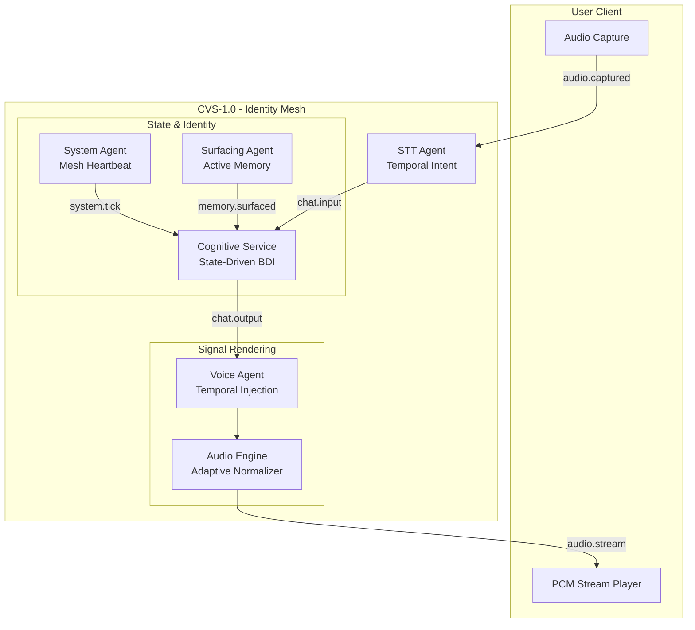

# 🏗️ Architecture Documentation - CVS-1.0

> **Deep dive into the AI Friend platform architecture, design decisions, and the Cognitive Voice System (CVS-1.0)**

---

## Table of Contents

1. [System Overview](#system-overview)
2. [CVS-1.0 Architecture (Perceptual Mastery)](#cvs-10-architecture-perceptual-mastery)
3. [Cognitive Layer (Brain)](#1-cognitive-layer-brain)
4. [Temporal Orchestration (Voice Controller)](#2-temporal-orchestration-voice-controller)
5. [Signal Rendering (Audio Engine)](#3-signal-rendering-audio-engine)
6. [The Feedback Mesh](#4-the-feedback-mesh)
7. [System Flow Diagram](#system-flow-diagram)

---

## System Overview

AI Friend is built on the **Sovereign Mesh Architecture**. It uses a decentralized ecosystem of specialized micro-agents coordinated via a high-performance **NATS JetStream** event bus. In the **Solid State Hardening (Apr 2026)**, the signal bus was expanded to include 9 core subjects covering system heartbeats, active memory recall, and identity synchronization.

In **CVS-1.0 Hardened**, we have achieved **Identity Continuity**. The system is no longer a reactive "Think-Speak" pipeline; it is now a **State-Driven Identity Mesh** coached by a continuous NATS heartbeat. It anticipates context through memory surfacing and expresses emotion through deterministic temporal markers.

---

## 🏗️ CVS-1.0 Hardened Architecture

### 🧠 1. Cognitive Layer (Identity & State)
The BrainAgent orchestrates a **State-Driven Identity** with a hardened relational foundation.
- **Neo4j State Persistence**: Mood, energy, trust, and attachment are persistent and evolve via mesh heartbeats.
- **Relational Seeding (Prisma 7.7.0)**: On first-boot, the identity mesh hydrates the PostgreSQL relational store with the AI's "Seed Genome" (Personality & History), ensuring zero-drift identity across restarts.
- **Identity Heartbeat (`system.tick`)**: A 60s NATS pulse ensures the agent's internal state matures even when user interaction is idle.
- **Hybrid Identity Model**: Separates an **Immutable Core** (base tone, values) from **Adaptive Variables** (habits, relationship status).

### 📖 2. Proactive Memory Surfacing
The system anticipates conversational context through an asynchronous recall layer that merges Relational (Postgres) and Graph (Neo4j) knowledge.
- **`SurfacingAgent`**: Background process that evaluates shared history vs. current intent.
- **Signal Bus Expansion**: The mesh now monitors 9 core subjects: `chat.*`, `vision.*`, `state.*`, `cmd.*`, `voice.*`, `system.*`, `memory.*`, `identity.*`, and `knowledge.*`.

### ⏱️ 3. Perceptual Intelligence (STT Agent)
Interruption is now handled as a **Temporal Intent Problem** powered by binary PCM transport.
- **Dual-STT Pipeline**: Uses Whisper for deep context and `sherpa-onnx` (SenseVoice) for low-latency temporal intent.
- **Temporal Intent Model**: Evaluates intent stability over a rolling 250ms window.
- **Stability Gating**: Only consistent "Stop/Wait" intent (score > 0.75) triggers an interrupt signal.

### 🔊 4. Signal Rendering (Voice Agent)
A persistent synthesis runtime with direct binary transport and expressive behavior.
- **Expressive Temporal Layer**: Interprets `<pause>` and `<hesitate>` tags by injecting silent PCM buffers directly into the 32kHz stream.
- **Direct Binary Bus**: Publishes raw PCM bytes via NATS Headers (Phase 2).
- **Backpressure Guard**: Bounded queue and synthesis semaphore protect GPU health.

---

## 📊 System Flow Diagram

---

## ⚙️ Resource Matrix (CVS-1.0)

| Agent | Context | CPU (Min) | RAM (Target) | Notes |
| :--- | :--- | :--- | :--- | :--- |
| **Brain Agent** | Cognitive Core | 1.0 Cores | 2.0 GiB | Increased for Segmenter heuristics. |
| **STT Agent** | Whisper Core | 2.0 Cores | 2.0 GiB | Local realtime inference. |
| **Voice Agent** | CVS Runtime | 1.5 Cores | 4.0 GiB | Includes Normalizer & Cache Clustering. |
| **Vision Agent** | Vision Mesh | 1.0 Cores | 1.0 GiB | Multi-sourceframe sync. |

---

**For implementation details, see:**
- [LATENCY_IMPROVEMENT.md](./LATENCY_IMPROVEMENT.md) - Timing deep-dive
- [VOICE_CLONING.md](./VOICE_CLONING.md) - Voice identity guide
- [DEPLOYMENT.md](./DEPLOYMENT.md) - Infrastructure setup
