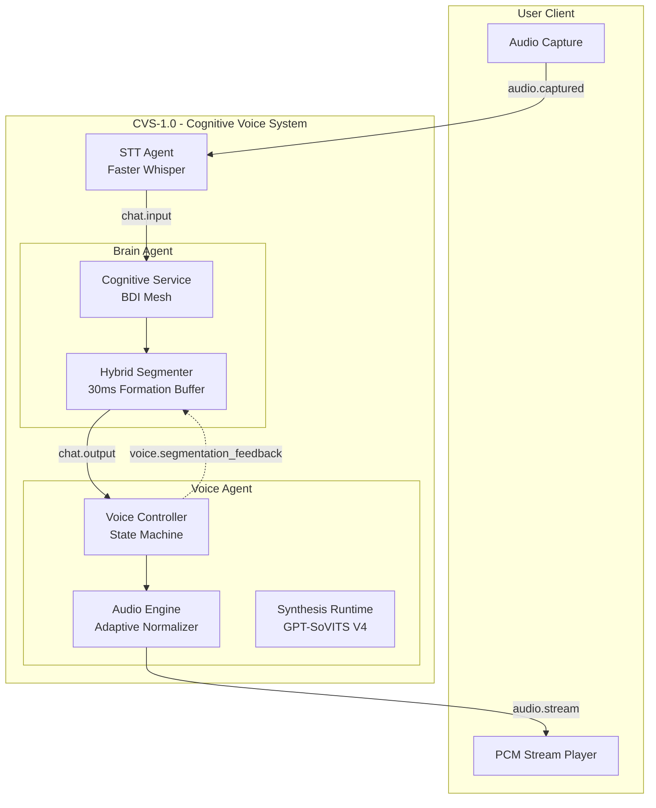

# 🏗️ Architecture Documentation - CVS-1.0

> **Deep dive into the AI Friend platform architecture, design decisions, and the Cognitive Voice System (CVS-1.0)**

---

## Table of Contents

1. [System Overview](#system-overview)
2. [CVS-1.0 Architecture (Perceptual Mastery)](#cvs-10-architecture-perceptual-mastery)
3. [Cognitive Layer (Brain)](#1-cognitive-layer-brain)
4. [Temporal Orchestration (Voice Controller)](#2-temporal-orchestration-voice-controller)
5. [Signal Rendering (Audio Engine)](#3-signal-rendering-audio-engine)
6. [The Feedback Mesh](#4-the-feedback-mesh)
7. [System Flow Diagram](#system-flow-diagram)

---

## System Overview

AI Friend is built on the **Sovereign Mesh Architecture**. It uses a decentralized ecosystem of specialized micro-agents coordinated via a high-performance **NATS JetStream** event bus.

In **CVS-1.0 Hardened**, we have eliminated the JSON/Base64 transport layer in favor of a **Direct Binary Path**, reducing serialization overhead by 15-20% and enabling sub-250ms perceptual latency.

---

## 🏗️ CVS-1.0 Hardened Architecture

### 🧠 1. Cognitive Layer (Brain & Memory)
The BrainAgent generates **Behavioral Payloads** stabilized by alpha-damped feedback.
- **Neo4j TTL Cache**: High-speed belief caching (300s TTL) reduces context lookup latency.
- **Alpha-Damped Smoothing (α=0.7)**: Prevents segmenter jitter during rapid turn-taking.

### ⏱️ 2. Perceptual Intelligence (STT Agent)
Interruption is now handled as a **Temporal Intent Problem**.
- **Temporal Intent Model**: Evaluates intent stability over a rolling 250ms window.
- **Stability Gating**: Only consistent "Stop/Wait" intent (score > 0.75) triggers an interrupt signal.

### 🔊 3. Signal Rendering (Voice Agent)
A persistent synthesis runtime with direct binary transport.
- **Direct Binary Bus**: Publishes raw PCM 32kHz bytes via NATS Headers (Phase 2).
- **Backpressure Guard**: Bounded queue and synthesis semaphore protect GPU health.

---

## 📊 System Flow Diagram

---

## ⚙️ Resource Matrix (CVS-1.0)

| Agent | Context | CPU (Min) | RAM (Target) | Notes |
| :--- | :--- | :--- | :--- | :--- |
| **Brain Agent** | Cognitive Core | 1.0 Cores | 2.0 GiB | Increased for Segmenter heuristics. |
| **STT Agent** | Whisper Core | 2.0 Cores | 2.0 GiB | Local realtime inference. |
| **Voice Agent** | CVS Runtime | 1.5 Cores | 4.0 GiB | Includes Normalizer & Cache Clustering. |
| **Vision Agent** | Vision Mesh | 1.0 Cores | 1.0 GiB | Multi-sourceframe sync. |

---

**For implementation details, see:**
- [LATENCY_IMPROVEMENT.md](./LATENCY_IMPROVEMENT.md) - Timing deep-dive
- [VOICE_CLONING.md](./VOICE_CLONING.md) - Voice identity guide
- [DEPLOYMENT.md](./DEPLOYMENT.md) - Infrastructure setup
