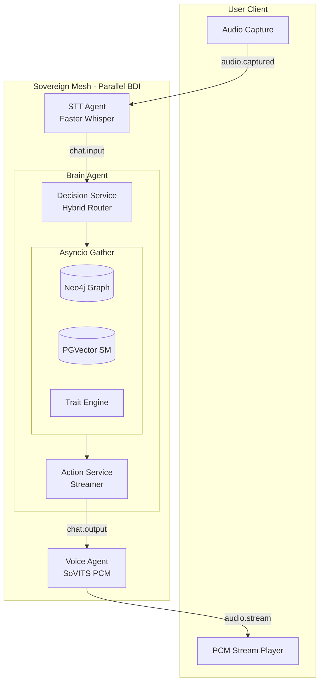

# 🏗️ Architecture Documentation

> **Deep dive into the AI Friend platform architecture, design decisions, and technical implementation**

---

## Table of Contents

1. [System Overview](#system-overview)
2. [v3.1 Architecture (Parallel Sovereign Mesh)](#v31-architecture-parallel-sovereign-mesh)
3. [Cognitive Mesh Lifecycle](#cognitive-mesh-lifecycle)
4. [The Parallel BDI Loop](#the-parallel-bdi-loop)
5. [Hybrid Brain Strategy](#hybrid-brain-strategy)
6. [Data Flow & PCM Optimization](#data-flow--pcm-optimization)
7. [Identity Evolution](#identity-evolution)

---

## System Overview

AI Friend is built on the **Sovereign Mesh Architecture**. Unlike traditional monolithic backends, it uses a decentralized ecosystem of specialized micro-agents coordinated via a high-performance **NATS JetStream** event bus.

This architecture enables:
- **Dynamic Scaling**: Independent scaling of STT, Brain, and Voice agents.
- **Microsecond Latency**: Direct agent choreography via nats-server.
- **Sovereign Privacy**: Total local inference capability.

---

## 🏗️ v3.1 Architecture (Parallel Sovereign Mesh)

### 🚀 The Parallel BDI Loop

In v3.1, we've transitioned from sequential processing to a **Parallelized Cognitive Mesh**. This architecture pozwala the agent to hydrate its world model while simultaneously processing user intent.

1. **Async Perception**: User audio is transcribed in real-time by the STT Agent and published to `chat.input`.
2. **Parallel Hydration**: The Brain fires three concurrent tasks via `asyncio.gather`:
   - **State Hydration**: Pulling the latest emotional and physical traits.
   - **Semantic Recall**: Querying PGVector for contextually relevant conversation snippets.
   - **Relational Traversal**: Querying Neo4j for entities (Who/What/Where).
3. **Hybrid Routing**: Intent is classified using a "Fast Path" logic before generating a response.

---

### 🧠 Hybrid Brain Strategy

To achieve sub-300ms latency without sacrificing depth, we use a two-tier inference strategy:

| Path | Model | Detection | Latency Target | Use Case |
| :--- | :--- | :--- | :--- | :--- |
| **Fast Path** | Llama 3.2 1B | Regex / Keyword | <150ms | Basic greetings and confirmations. |
| **Smart Path** | Qwen 2.5 7B | LLM Classification | <350ms | Deep reasoning, emotional support. |

---

### 🔊 Audio Pipeline Optimization (PCM)

We have eliminated the "WAV Header Tax" in v3.1.
- **Legacy**: WAV headers required client parsing and buffering.
- **V3.1 (PCM)**: Raw 16-bit, **48kHz** PCM buffers are streamed. This reduces Voice Agent overhead by **~80ms** and enables high-fidelity, studio-quality playback without header parsing delays.

---

### Cognitive Mesh Design

---

## 🎭 Identity Evolution

AI Friend maintains a persistent persona through a dedicated identity layer:
- **Core Traits**: Strictly immutable values that define the foundation of the identity.
- **Dynamic Moods**: Valence and Arousal levels that adjust in real-time based on conversation tone.
- **Autonomous Consolidation**: During idle cycles, the agent reflects on the day's experiences and updates the Neo4j graph relationships.

---

## ⚙️ Resource Matrix (Estimates)

| Agent | Target Image | CPU (Min) | RAM (Target) | Notes |
| :--- | :--- | :--- | :--- | :--- |
| **Brain Agent** | `slim`| 0.5 Cores | 1.0 GiB | High RAM if local embeddings used. |
| **STT Agent** | `full` | 2.0 Cores | 2.0 GiB | Heavy Whisper inference. |
| **Voice Agent** | `full` | 1.0 Cores | 4.0 GiB | High-fidelity V4 synthesis (48kHz). |
| **Vision Agent** | `full` | 1.0 Cores | 1.0 GiB | Synchronizes screen/camera frames. |

---

**For implementation details, see:**
- [README.md](../README.md) - Getting started guide
- [API_SPEC.md](./API_SPEC.md) - API documentation
- [DEPLOYMENT.md](./DEPLOYMENT.md) - Production deployment
