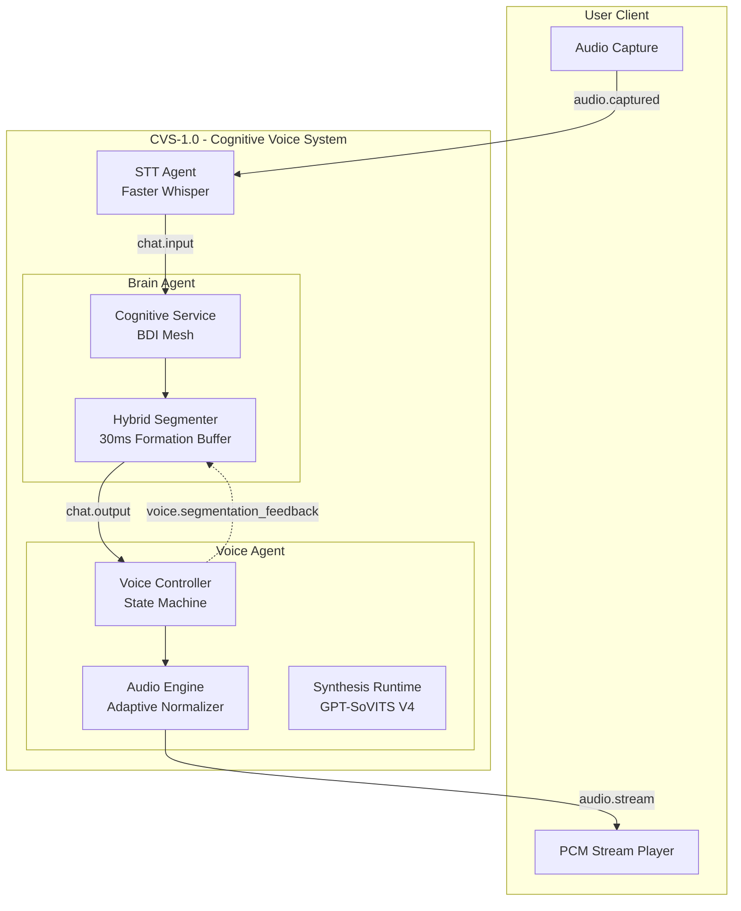

# 🏗️ Architecture Documentation - CVS-1.0

> **Deep dive into the AI Friend platform architecture, design decisions, and the Cognitive Voice System (CVS-1.0)**

---

## Table of Contents

1. [System Overview](#system-overview)
2. [CVS-1.0 Architecture (Perceptual Mastery)](#cvs-10-architecture-perceptual-mastery)
3. [Cognitive Layer (Brain)](#1-cognitive-layer-brain)
4. [Temporal Orchestration (Voice Controller)](#2-temporal-orchestration-voice-controller)
5. [Signal Rendering (Audio Engine)](#3-signal-rendering-audio-engine)
6. [The Feedback Mesh](#4-the-feedback-mesh)
7. [System Flow Diagram](#system-flow-diagram)

---

## System Overview

AI Friend is built on the **Sovereign Mesh Architecture**. It uses a decentralized ecosystem of specialized micro-agents coordinated via a high-performance **NATS JetStream** event bus.

In version **CVS-1.0**, we have moved beyond a sequential pipeline into a **Perception-Aligned Cognitive Architecture** where reasoning, timing, and signal rendering are tightly coupled via closed-loop feedback.

---

## 🏗️ CVS-1.0 Architecture (Perceptual Mastery)

### 🧠 1. Cognitive Layer (Brain)
The BrainAgent does not just generate text; it generates **Behavioral Payloads**.
- **Metadata-Rich Events**: Every output includes `emotion_vector`, `intensity`, `confidence`, and `speaking_rate`.
- **Hybrid Heuristic Segmenter**: Uses semantic scoring (conjunctions, punctuation, breath markers) to produce coherent speech chunks.
- **Formation Buffer**: A 30ms "look-ahead" window ensures chunks are semantically complete before synthesis.

### ⏱️ 2. Temporal Orchestration (Voice Controller)
The VoiceAgent contains an internal **VoiceController** state machine that manages conversational flow.
- **Priority Scheduling**: High-priority fillers and acknowledgments are interjected at "Safe Boundaries" (low-energy regions) identified in the audio stream.
- **Perception-Driven Timing**: Fillers (e.g., "hmm...") are triggered by **elapsed silence (>250ms)** rather than raw backend latency.
- **Adaptive Jitter Buffer**: Dynamically scales (10ms–25ms) based on drift and decays exponentially to maintain ultra-low latency.

### 🔊 3. Signal Rendering (Audio Engine)
A persistent synthesis runtime that masters audio in real-time.
- **Adaptive Normalization**: A **100ms rate-aware RMS window** ensures loudness stability across emotional peaks.
- **Inter-Chunk Gain Matching**: Aligns the energy of phrase transitions to prevent audible "pops."
- **Stylistic Cache Clustering**: A non-linear perceptual distance metric $(\alpha(EmotionDiff)^2 + \beta|RateDiff|)$ allows for style-safe audio reuse.

### 🔁 4. The Feedback Mesh
The system self-optimizes via a closed-loop telemetry stream:
- **Segmentation Feedback**: The VoiceAgent publishes `voice.segmentation_feedback` when it overrides poor BrainAgent chunking.
- **Recursive Learning**: The BrainAgent consumes this feedback to improve its internal scoring heuristics.

---

## 📊 System Flow Diagram

---

## ⚙️ Resource Matrix (CVS-1.0)

| Agent | Context | CPU (Min) | RAM (Target) | Notes |
| :--- | :--- | :--- | :--- | :--- |
| **Brain Agent** | Cognitive Core | 1.0 Cores | 2.0 GiB | Increased for Segmenter heuristics. |
| **STT Agent** | Whisper Core | 2.0 Cores | 2.0 GiB | Local realtime inference. |
| **Voice Agent** | CVS Runtime | 1.5 Cores | 4.0 GiB | Includes Normalizer & Cache Clustering. |
| **Vision Agent** | Vision Mesh | 1.0 Cores | 1.0 GiB | Multi-sourceframe sync. |

---

**For implementation details, see:**
- [LATENCY_IMPROVEMENT.md](./LATENCY_IMPROVEMENT.md) - Timing deep-dive
- [VOICE_CLONING.md](./VOICE_CLONING.md) - Voice identity guide
- [DEPLOYMENT.md](./DEPLOYMENT.md) - Infrastructure setup
