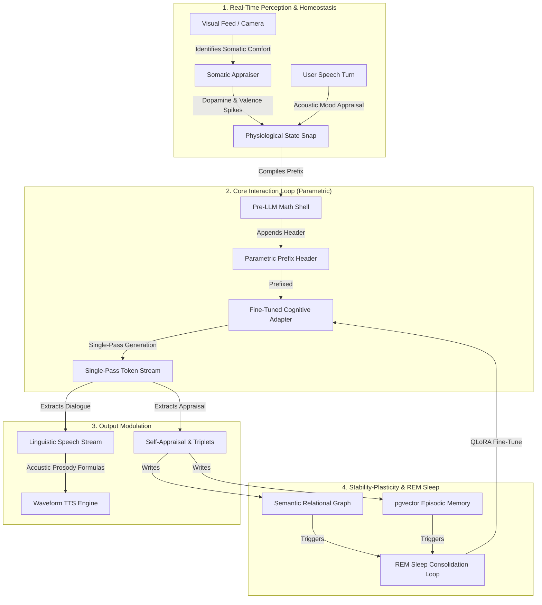

# Future Architecture Exploration: A Fine-Tuned Cognitive Adapter

> **Status: roadmap-only, unbuilt.** Nothing in this document is implemented.
> The community roadmap's own "Explicitly not doing" list names this
> explicitly: *"Fine-tuned models / QLoRA / Fine-Tuned Adapter consolidation. Roadmap-only,
> and the whole point of 'generic models only' is that it works without
> them."* This document was previously titled "AI Friend CVS v4.0" and
> written as an approved specification ("Document Status: Approved for...
> Implementation... the definitive architectural blueprint") — that framing
> was wrong and has been corrected here. Treat this as design notes for a
> possible future direction, not a description of anything shipping.
>
> **One part of this document is stale in a specific, important way:**
> Section D below (prosody mapped from physiological state) describes that
> mapping as something a *fine-tuned model's weights* would need to learn.
> That's no longer true of the underlying idea — prosody modulation from
> real PAD/endocrine state is **already shipped today**, via a completely
> different mechanism: `action.py::_compute_endocrine_options` maps
> cortisol/dopamine/fatigue straight onto LLM sampling parameters
> (temperature/top_p/num_predict) on a generic, non-fine-tuned model. If you
> are looking for how prosody actually works in the current system, read
> `docs/ARCHITECTURE.md`'s Signal Rendering section and `CLAUDE.md`'s
> "Endocrine layer" section, not this document.

This document outlines one possible future architectural direction: fusing
physiological/affective state directly into a fine-tuned model's weights,
rather than injecting it as prompt context on a generic model — the
approach this project actually uses today.

---

## 🌟 Architectural Overview (proposed, unbuilt)



---

## 1. 🔍 WHY: The Limitations of the Current (Prompt-and-Parse) Approach

The case for exploring this direction at all:

### A. Instruction and Persona Drift
Relying entirely on long system prompts instructing the LLM to *"Be a specific persona, born in City X, raised in City Y"* is fragile. Over extended, high-turn conversations, general-purpose LLMs can suffer from attention decay and persona drift, falling back to generic, over-polite "AI assistant" vocabulary. (Note: `docs/FUTURE_WORK.md` and `.agents/CONTEXT.md`'s Phase 3.2 friction audit are the places to check whether this is currently observed in practice, rather than assuming it from first principles.)

### B. Input Token Context Bloat
A long biographical/relational persona description spent as system-prompt tokens on every turn is a real cost, currently paid by this project's actual prompt-injection approach.

### C. High Latency Post-LLM Parsing
Running asynchronous reflection agents and parsers to extract knowledge-graph triplets and self-appraise emotional valence adds background computation after generation.

### D. The Stability-Plasticity Dilemma
A model that stays completely static is rigid; one that fine-tunes continuously risks catastrophic forgetting of its foundational identity.

---

## 🧠 2. WHAT: The Proposed Adapter Architecture

### A. Parametric Gating (Pre-LLM Direct Weight Modulation)
Instead of describing emotional states in English, pre-LLM mathematical appraisals — PAD, cortisol, dopamine — would compile into a compact numerical prefix (e.g., `[PAD: 0.15,0.40,-0.20] [Endocrine: C=0.85,D=0.20,F=0.10]`). A model fine-tuned on this format would, in principle, adapt vocabulary and syntax to reflect stress/excitement/calm without prose descriptions in the prompt.

### B. Implicit Parametric Biography
Biographical/relational history baked into model weights rather than described in prompt text, leaving episodic databases free for transient day-to-day detail.

### C. Single-Pass Generation & Appraisal
The fine-tuned model would generate both the linguistic response and a trailing structured self-appraisal block in one forward pass:

```text
Hey! I was thinking about our cricket match. Let's play today.
<cognitive_appraisal>
- valence_shift: +0.20
- arousal_shift: +0.10
- triplets: [("User", "PLAYED_WITH", "Friend")]
</cognitive_appraisal>
```

### D. The Three-Tier Memory Loop (proposed)
1.  **Tier 1: Immediate Relational Graph (Neo4j) [High Plasticity]**: Instantly captures changed values, updated relationships, and new entities — this tier is real today, independent of this document.
2.  **Tier 2: Mid-Term REM Sleep Adapter (QLoRA) [Mid Plasticity]** — unbuilt: periodically consolidating high-frequency graph changes into model weights via offline fine-tuning.
3.  **Tier 3: Permanent Core Model [Zero Plasticity]** — unbuilt: foundational milestones and cognitive rules locked into base model weights rather than the current `IMMUTABLE_CORE` tier system (`backend/app/persona/profile.py`), which already does the "permanent floor" job today without fine-tuning.

### E. Somatic Vision-Homeostasis Pipeline
This part **is already real**: `SomaticAppraiser` (`backend/app/cognitive/somatic.py`) matches a vision description against learned comfort objects and lifts dopamine/valence through `StateService.apply_somatic_perception` today, on the generic-model path — see `docs/ARCHITECTURE.md`'s Visual Appraisal section for the actual mechanism.

### F. Closed-Loop Acoustic Prosody & Parametric Paralanguage — see the status note at the top of this document. The mapping from state to speaking-rate/intensity/pause-bias is real and shipped; doing it by fine-tuning the model to natively emit paralinguistic tags, rather than the current sampling-parameter approach, remains unbuilt.

---

## 🛠️ 3. HOW: Mathematical Foundations (proposed)

### A. The Cognitive Sleep Equation (Experience Replay)
A regularized loss for the proposed offline consolidation loop:

$$\mathcal{L}_{\text{sleep}}(\theta) = \mathcal{L}_{\text{new-consolidations}}(\theta) + \lambda \cdot \mathcal{L}_{\text{biographical-anchors}}(\theta)$$

Where $\lambda \ge 0.5$ is a stability-gating coefficient meant to keep foundational memories from being overwritten during learning.

### B. Dual-Threshold Forgetting Curve
A proposed three-tier importance/decay scheme for episodic pruning:

| Category | Importance Score | ACT-R Pruning Threshold | Survival Characteristics |
| :--- | :--- | :--- | :--- |
| `distractor` | $I < 0.5$ | $A < -3.5$ (~45 days) | Prunes rapidly. |
| `anecdote` | $0.5 \le I < 0.7$ | $A < -4.5$ (~11 months) | Decays slowly. |
| `milestone` | $I \ge 0.7$ | Never pruned | Permanent landmarks. |

**Verify against the current, real decay implementation** (`state/memory_store.py`'s `_compute_actr_decay`) before assuming this table matches shipped behavior — this document predates that extraction and was not re-verified against it.

### C. Visual Somatic Homeostasis Equations (design sketch, real values may differ)
$$D_t = \min(1.0, D_{t-1} + 0.25)$$
$$V_t = \min(1.0, V_{t-1} + 0.15)$$

The real, shipped constants live in `backend/app/cognitive/somatic.py` — check there, not here, for current values.

### D. Acoustic Prosody Mappings (design sketch — the real, shipped formulas live in `action.py`/the voice-agent, not here)
$$\text{Speaking Rate} = \max\left(0.6, \min\left(1.8, 1.0 + 0.20 \cdot \text{Arousal} - 0.10 \cdot \text{Valence} - 0.25 \cdot \text{Fatigue}\right)\right)$$
$$\text{Intensity} = |\text{Valence}| \cdot \text{Arousal}$$
$$\text{Pause Bias} = \max\left(0.0, \min\left(1.0, 1.0 - \text{Arousal}\right)\right)$$

### E. Spatial Graph Coherence and Traversal (Cypher, design sketch)
```cypher
MATCH (l:Somatic {name: $place_name})<-[:OCCURRED_AT]-(m:Milestone)-[:INVOLVED]->(e:Entity)
RETURN m.content AS milestone_content, e.name AS entity_name, m.importance AS importance
ORDER BY m.importance DESC
LIMIT 5
```

---

## 📅 4. Rough Milestone Sketch (unscheduled — not on the active roadmap)

1.  **Synthetic dataset generation** — compile training conversations mapping the persona's history with compiled prefix headers and appraisal tags.
2.  **QLoRA adapter fine-tuning & quantization** — train on a local GPU, merge weights, register in Ollama.
3.  **Core production integration** — refactor `decision.py` for prefix compilation, `action.py` for single-pass appraisal parsing.
4.  **REM sleep consolidation** — build the background consolidation trainer.

None of this has a target date, an owner, or a place on the active roadmap (`~/.claude/plans/async-stirring-clarke.md`). It's recorded here as design thinking that could inform a real proposal later, not a plan in motion.
