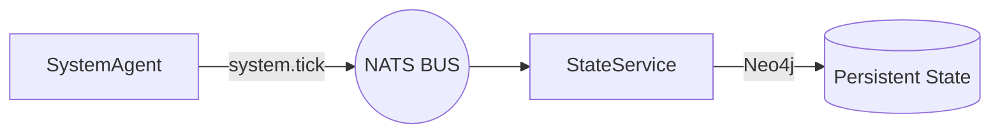

# 🎭 Identity Continuity System (CVS-1.0)

> **"Identity is not a reaction; it is a trajectory."**

The CVS-1.0 Identity System is designed to create the illusion of a continuous, human-like presence. It shifts the agent from a reactive "Think-Speak" pipeline to a persistent **State-Driven Identity Mesh**.

---

## 1. The Mesh Heartbeat (`system.tick`)

Identity maturation occurs continuously, even when conversation is inactive. This is orchestrated via a NATS-level broadcast.

- **`SystemAgent`**: Emits a `system.tick` every 60s (configurable).
- **Idle Evolution**: The `StateService` listens for these ticks to apply incremental decay to internal variables.
  - **Mood**: Drifts slowly towards a neutral baseline.
  - **Energy**: Recovers gradually during periods of rest.
  - **Trust/Attachment**: Moves as a function of time and recent interaction valence.

---

## 2. Hybrid Identity Model

To prevent personality drift while allowing for growth, the identity is split into two behavioral layers.

### 🛡️ Immutable Core
Stored in `self.immutable_core`, these traits represent the agent's "DNA." They are never modified by the autonomous reflection loop.
- **Values**: (e.g., Privacy, Curiosity, Empathy).
- **Boundaries**: Hard constraints on behavior and data safety.
- **Base Tone**: The fundamental frequency of the agent's personality.

### 🎭 Adaptive variables
These traits are "soft" and evolve based on user interaction history.
- **Speaking Style**: Vocabulary (Hinglish), sentence length, and pacing.
- **Familiarity**: Level of formality adjusted by the `trust` state.
- **Preferences**: Topics identified as high-relevance during reflection.

---

## 3. Active Memory Surfacing

CVS-1.0 uses **Proactive Recall** rather than passive retrieval. 

The **`SurfacingAgent`** runs in the background, matching recent conversational context against the long-term `GraphRAG` and `Vector Store`.
- **Asynchronous Triggers**: Relevant memories are published as `memory.surfaced` mesh events.
- **Decision Blackboard**: The `CognitiveService` buffers these "surfaced" thoughts and injects them into the current decision loop, allowing the agent to "spontaneously" bring up past moments.

---

## 4. Expressive Temporal Layer (Timing markers)

Timing is a first-class cognitive citizen in CVS-1.0. The agent communicates cognitive load and emotional weight through intentional silence.

### Temporal Tags
The BrainAgent injects structured tags into the LLM stream:
- `<pause=ms>`: Adds a deterministic silence duration (e.g., `<pause=500ms>`).
- `<hesitate>`: Adds a randomized 250-450ms hesitation buffer.

### Signal Execution
The **VoiceAgent** parses these tags and, instead of synthesizing them as text, injects **zeroed PCM buffers** directly into the 32kHz audio stream. This ensures that the pause is physically part of the audio signal, not just a playback delay.

---

## 5. Configuration & Tuning

All identity parameters are centralized in `config.py`:
- `SYSTEM_TICK_INTERVAL`: Frequency of mesh-wide maturation.
- `INTENT_THRESHOLD`: Sensitivity for interruption intent.
- `GRAPH_CACHE_TTL`: Freshness of belief hydration.

---

**Designed for Perseverance. Built for Identity.**
