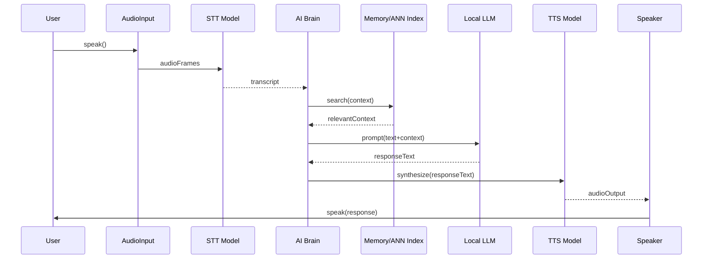
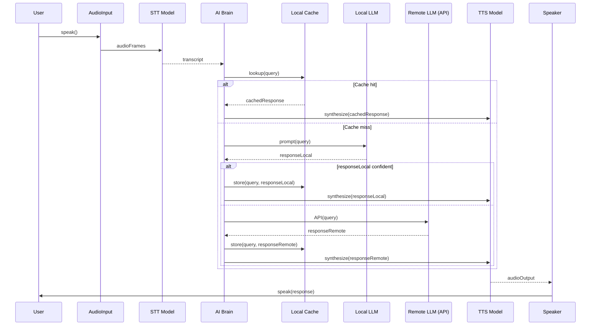

# Executive Summary  
Achieving sub-300 ms end-to-end latency for a local-first voice agent requires **careful profiling and system-wide optimizations**. Break down and measure each pipeline stage (audio I/O, STT, retrieval, decision logic, LLM inference, TTS) and set latency SLOs (e.g. 95th-percentile <300 ms). Tune IPC (NATS, gRPC) or collapse components into a single process to eliminate messaging overhead. Use **highly-quantized local LLMs** (4-bit or 8-bit on a GPU) and small model sizes (7–14 B) so token generation is very fast (typically 6–12 ms/token【30†L83-L91】【21†L1-L4】). Overlap RAG retrieval and inference (e.g. prefetch or “stale” queries【12†L315-L324】) and prune low-salience memories to keep vector searches (e.g. HNSW/FAISS) in single-digit milliseconds【25†L1-L4】. Use streaming STT and TTS (chunked audio) with low-latency models (e.g. Parakeet TDT for ASR and Chatterbox-Turbo or Dia2 for TTS) so voice encoding/decoding adds <50–100 ms【15†L99-L103】【18†L259-L263】. Allocate dedicated CPU cores and GPU streams (or multiple GPUs/MIG instances) for STT, LLM, and TTS to avoid contention. Use NVMe storage for large knowledge/memory. Monitor and trace every step (timestamps, p99 latencies) and test realistic dialogues to catch drift or spikes.  

Key recommendations (prioritized): **1. Profile pipeline** (end-to-end and per-stage with microbenchmarks). **2. Push inference to fast quantized models** on powerful GPU (e.g. RTX 4090 or Apple M4 Ultra) so 7–13B models yield >80–130 tokens/s【30†L83-L91】【21†L1-L4】. **3. Optimize retrieval (RAG)** with local ANN search (HNSW/FAISS) and semantic caching/prefetch【1†L78-L87】, tuning search parameters for ~10 ms queries【25†L1-L4】. **4. Stream audio processing** (STT/TTS chunking) and use ultra-low-latency STT/TTS models【15†L99-L103】【18†L259-L263】. **5. Scale resources**: dedicate hardware (CPU threads, GPU, I/O) to each function. Each of these involves accuracy–latency trade-offs (e.g. more pruning or lower precision models reduce latency but may slightly degrade quality), so tune per your SLO.  

The rest of this report details our findings: profiling methods, component optimizations, tables of candidate models/tools, pipeline diagrams, and concrete implementation steps with trade-offs.  

## 1. Latency Profiling & SLOs  
- **Break down the pipeline.** Instrument each stage with high-resolution timers: microphone capture → STT transcription → context retrieval → decision/LLM call → text-to-speech synthesis → audio output. Also measure IPC/network overhead (e.g. NATS pub/sub vs direct calls) and any queueing delays.  
- **Metrics.** Track *Time-to-First-Byte/Token* and *per-token latency* for the LLM, end-to-end turn latency, and distribution percentiles (p50, p95, p99). SLO example: p95 latency <300 ms (voice conversations ideally feel natural below ~200 ms【1†L90-L98】). Define alerts if any stage exceeds its budget (e.g. STT >50 ms, LLM inference >100 ms, TTS >50 ms).  
- **Tools.** Use tracing (OpenTelemetry, Jaeger) or simple timestamp logs. For C++/Python code, enable profiler hooks (gProfiler, Tracy) around LLM calls, vector DB queries, etc. Employ a microbenchmark suite (inject synthetic requests) to isolate bottlenecks. Verify under load (multiple concurrent turns).  
- **Acceptable SLOs.** Voice agents require sub-200 ms for seamless flow【1†L90-L98】. Given local constraints, aim for p50≈150 ms and p95≈300 ms per user turn. If over 300 ms, the conversation will stutter.  Always test worst-case (long context, large memory) and transient spikes.  

## 2. Network/IPC Choices  
- **Local IPC**: Since the core is local-first, minimize network stacks. Use in-process or shared-memory calls instead of network protocols when possible. For example, if all agents (brain, LLM, voice) run on one host, use direct function calls or memory queues (e.g. `std::shared_ptr` buffers or ZeroMQ in-process), not NATS or HTTP, for the hot path.  
- **NATS JetStream tuning**: If multiple processes must communicate (for modularity), tune NATS for low-latency: disable durable persistence (fast transient PubSub), reduce acknowledgment wait times, set small message sizes, and colocate on the same machine (avoid TCP overhead via UNIX sockets if supported). This can shave off a few ms per hop.  
- **gRPC/Shared memory**: For larger payloads (e.g. audio chunks), consider gRPC with gRPC-c++ (using HTTP/2) or raw TCP with a custom protocol. gRPC adds ~1–2 ms overhead, but supports streaming well. Alternatively, use memory-mapped files or POSIX shared memory for high-throughput raw audio frames, with low-latency ring buffers between stages.  
- **Isolation vs batching**: Avoid batching across user turns (would add latency). But if supporting multiple users, use lightweight threads or async handlers so one slow request doesn’t block another. Prioritize the current user’s pipeline.  

## 3. Model Inference Optimization  
- **Quantization & Precision.** Convert large models to low-bit formats. 4-bit or 8-bit quantization (e.g. GPTQ, AWQ, BitsAndBytes) can **reduce model size by ~75%** with minimal quality loss【9†L69-L75】, greatly speeding inference and fitting bigger models in GPU. Tools like Ollama (which supports GGUF quantization) and llama.cpp enable 4-bit runs. For example, AWQ 4-bit lets LLaMA-70B run on a single RTX 4090【9†L71-L75】. Quantization typically doubles or triples token throughput (fewer math ops).  
- **Model size.** Use smaller base models tailored for low-latency. Consumer GPUs (e.g. RTX 4090) can handle ~8–13B models at interactive speeds【30†L83-L91】. (See Table 1.) For instance, an RTX4090 at 4-bit yields ~80–130 tokens/s on 7–8B models【30†L83-L91】. A single token’s generation takes ~7–12 ms, so a typical 20-token response is ~140–240 ms. Models >20B become too slow.   Specifically, consider:  
  - **7–8B models** (e.g. Mistral 7B, Llama 3.3 8B, Qwen 3 8B): ~85–130 tokens/s【30†L83-L91】.  
  - **13–14B models** (e.g. Llama 3.3 13B, Phi-4 14B): ~40–60 tokens/s【30†L83-L91】.  
  - **>20B** (e.g. Qwen3 32B) are marginal even at 4-bit (~12–20 tokens/s).  
  Choose the smallest model that still handles your typical queries. For example, if you only need conversational chit-chat, a 7–8B model may suffice. Reserve larger models for occasional deep reasoning (possibly via hybrid fallback).  
- **Batching and streaming.** Keep batch sizes = 1 (no batching) for lowest latency. Use token streaming: call the LLM in non-blocking mode so the first tokens can be emitted quickly. Some runtimes (vLLM, Ollama) allow streaming response token-by-token as soon as each is computed (often ~1–10 ms after call). Avoid doing a big generation in one shot.  
- **Distillation/Codecs.** If an extremely fast but lower-quality model can pre-answer or help with simple queries, consider using it for trivial cases. E.g., distill a 7B model into an even smaller (2–3B) model for trivial “I’m here” confirmations.  

**Table 1: Candidate LLMs (Local, quantized) and Throughput on RTX4090【30†L83-L91】**  

| Model (quantization) | Params | Precision & Bits | Throughput (tokens/sec) | Notes |
|----------------------|-------:|------------------|------------------------:|-------|
| Llama-3.3 8B         |   8B   | Q4_K_M (4-bit)   |        80–120           | Fits 24GB; real-time chat (20 tok ≈ 160–250ms)【30†L83-L91】 |
| Qwen-3 8B            |   8B   | Q4_K_M (4-bit)   |         75–115         | Similar to above【30†L83-L91】 |
| Mistral 7B           |   7B   | Q4_K_M (4-bit)   |         85–130         | Very fast; 4-bit quant recommended【30†L83-L91】 |
| Llama-3.3 13B        |  13B   | Q4_K_M (4-bit)   |         40–60          | Moderate speed; ~60 tok/s = 16ms/token【30†L83-L91】 |
| Phi-4 14B            |  14B   | FP16 (16-bit)    |         40–60          | FP16 slower than 4-bit; similar throughput【30†L83-L91】 |
| Qwen-3 32B           |  32B   | Q4_K_M (4-bit)   |         12–20          | Very slow single-token (50–80ms each)【30†L83-L91】 |
| Mixtral (8×7B)       |  ~47B  | Q4_K_M (4-bit)   |         20–35          | Hybrid of eight 7B’s; complex, lower throughput【30†L83-L91】 |

*Sources:* Spheron Network benchmarks (Apr 2026)【30†L83-L91】. Throughput is measured on an RTX 4090 with quantized models via llama.cpp/Ollama.  

## 4. Retrieval-Augmented Generation (RAG) Optimization  
- **Local ANN index.** Keep the vector memory index **locally** (e.g. on NVMe or RAM). Use a high-performance ANN library like FAISS or Qdrant with HNSW index. Qdrant (Rust-based) consistently beats others: e.g., on 1M vectors (1536 dim) it gave ~3.5 ms median, ~8.6 ms P95【25†L1-L4】, versus ~11.3 ms for Weaviate【25†L1-L4】. Use HNSW/HNSW-flat for sub-millisecond lookups on small datasets, and tune its `ef`/`M` parameters: lower `ef` (e.g. 64 or less) yields <10 ms queries at minor recall loss【13†L13-L20】【25†L1-L4】. If the DB is large, consider FAISS GPU indexes for faster search (especially IVFPQ indexes with `nprobe` tuned very low).  
- **Semantic caching and prefetch (VoiceAgentRAG).** Implement a dual-agent pipeline: as the user listens to the current reply, run a background “Slow Thinker” thread that predicts likely next queries (via a small LLM or heuristics) and **pre-fetches** relevant memory (embeddings) into a fast in-memory cache【1†L78-L87】【1†L139-L148】. Then the foreground “Fast Talker” can answer using only the cache (sub-ms retrieval) and avoid the vector DB on hits. Salesforce’s VoiceAgentRAG did this to achieve ~0.35 ms lookup on cache hits【1†L78-L87】.  
- **Pipeline parallelism (PipeRAG).** Overlap retrieval with generation: when generating response chunk *Cj+1*, use a slightly older context window to fetch memory in parallel【12†L315-L324】【13†L13-L20】. This way, retrieval latency is absorbed into generation time. Be cautious: the retrieved facts may be slightly “stale,” so limit staleness (e.g. one token offset) for quality. Alternatively, interleave tokens and retrieval calls, or reserve a micro-batch of tokens for final retrieval.  
- **Index caching/pruning.** Limit memory size to what a query will realistically need. Prune old or irrelevant memories (or compress them) so the ANN search set remains small. If many memories accumulate, older items can be archived or their embeddings removed. The brain should weigh recency and importance (kept in memory with timestamps) – ignore memory queries older than a threshold to speed retrieval.  
- **Approximate search tuning.** In vector queries, reduce the search space aggressively. For HNSW, keep `ef_search` modest (e.g. 32–64) and ensure connectivity. For quantized indexes (IVFPQ), use very few probes (e.g. `nprobe=1–2`) to get answers in 10–20 ms at the cost of slight recall drop【13†L13-L20】. In practice, perfect recall is not needed for a friendly persona; retrieving the top few “reasonably similar” memory bits is enough.  

## 5. Decision Engine and Behavior Execution  
- **Lightweight Behavior Tree (BT).** Implement a custom mini-BT rather than a heavy framework. A BT node can be a simple function call or rule (e.g. *is user upset?*). Keep the tree shallow: e.g. check “goal: comfort” vs “goal: inform” at a few branches. Hardcode high-priority interrupts (e.g. emergency stop). A custom BT (or simple if/else chains) eliminates the overhead of generic libraries and lets you bake in domain rules (e.g. “never reveal your hallucinations”).  
- **Synchronous vs Async.** For real-time response, run the decision tree and LLM call **synchronously** when user speaks, so you respond immediately. Use asynchronous tasks only for background work (RAG prefetch, memory consolidation). This avoids delays from thread scheduling.  
- **Precomputed policies/heuristics.** Cache common decisions: e.g., maintain a simple map from intent→action (e.g. user asks personal question → recall memory; user is angry → apologies). Instead of always prompting the LLM to classify intent, use keyword heuristics or a small intent classifier on-device. This saves a round-trip to the LLM for generic responses.  
- **Monte Carlo constraints.** Do **not** run deep MCTS or heavy beam search: these explode latency. If using Monte Carlo ideas, restrict to scoring a handful of candidate replies. For example, generate 3–5 candidate responses (via LLM with different random seeds or few-shot prompts) and score them with a simple reward (emotional tone, personality match) – pick the best. But do this sparingly (perhaps only on uncertainty). Every extra candidate adds ~30–100 ms.  

## 6. Voice Pipeline (STT, TTS, Audio I/O)  
- **Streaming STT.** Use an extremely fast ASR model in streaming mode. Leading open models: *Parakeet TDT* (1.1B) achieves RTF >2000 on English【15†L99-L103】. In practice this means sub-1 ms per 10 ms audio frame, easily keeping pace. Alternatively, *Whisper Large V3 Turbo* (809M) runs ~216× real-time【15†L96-L103】. Run STT on GPU if possible (some ASR models have GPU kernels) to shave milliseconds. Always process audio in small chunks (e.g. 20–200 ms) and emit partial transcripts immediately. Use VAD (voice activity detection) to skip silence and flush transcriptions more aggressively.  
- **Low-latency TTS.** Adopt a streaming TTS model or chunked synthesis: *Dia2* starts generating audio from the first few tokens【18†L203-L207】, and *Chatterbox-Turbo* (350M) has sub-200 ms end-to-end latency【18†L259-L263】. For a given text reply, begin vocoding the first words while later words are still being synthesized. Use an efficient vocoder (e.g. FastSpeech or Griffin-Lim variants) that can run in ~<50 ms for 1 s of audio. Keep utterances short to limit latency: if the agent would say more than ~2 seconds of audio, consider splitting into multiple replies or interjections. The TTS latency (time-to-first-audio) on good hardware can be ~100 ms【18†L163-L168】.  
- **Vocoder and format.** Generate PCM audio (e.g. 16-bit 16kHz) directly to the sound card. Avoid costly codecs; for network transmission (if hybrid), use Opus but with very low compression (to minimize frame delay). Locally, write raw frames. Use a low-latency audio I/O library (PortAudio, WASAPI with low buffer, ALSA in real-time mode). Target <50 ms audio buffer sizes. Synchronize playback so that audio starts immediately once the first chunk is ready.  
- **Pipeline concurrency.** While the user is speaking (STT running), you can also pre-generate the likely reply if your decision is obvious. Similarly, while the agent’s audio is playing, use the short listening gaps for backgound tasks (memory consolidation, prefetch).  

## 7. Concurrency & Resource Isolation  
- **Thread/core assignment.** Pin critical threads: e.g. dedicate one core for STT, one for the decision loop + inference, one for TTS/vocoder. Ensure real-time priority for the audio threads. On Linux, use `sched_fifo` or `nice -20` for the audio and inference threads to avoid interruptions. On Windows, use realtime priorities.  
- **GPU usage.** If one GPU is shared (e.g. single RTX4090), run LLM and TTS on separate CUDA streams to overlap tasks (CUDA streams can run concurrently if kernels fit). If multiple GPUs are available, dedicate one to the LLM, another to the TTS model. Consider NVIDIA MIG (Multi-Instance GPU) to carve a GPU for STT (if GPU-STT is used). Keep batch sizes at 1 so that the GPU schedules each new inference immediately.  
- **Memory & NVMe.** Store the Neo4j graph and vector DB on fast NVMe. Use RAMDisk or in-memory SQLite for scratch if needed. Ensure plenty of system RAM (e.g. 64+ GB) so OS file caching helps accelerate repeated lookups. If a remote retrieval DB is used, co-locate it on the same host to avoid network delays.  
- **Offloading & multi-GPU.** For very large models, consider splitting across GPUs (if 70B needed) or offloading key parts to CPU (head offloading). But ideally pick a model that fits in one GPU to avoid PCIe transfers mid-query.  
- **GPU scheduling policies.** Use libraries like NVIDIA Triton or vLLM that manage multiple requests optimally. Or use CUDA Graphs for the steady-state (beneficial if repeating the same model). But for one-turn-at-a-time personal assistant, simple `cudaLaunchKernel` per token is fine.  

## 8. Hardware Recommendations  
- **GPU:** A high-end GPU (e.g. NVIDIA RTX 4090, 4090 Pro, or Apple M4 Ultra’s Neural Engine) is crucial. A 4090 can run ~8B–13B LLMs at interactive speeds【30†L83-L91】. Prefer GPUs with >16 GB VRAM for 10–14B models (or multi-GPU for >30B). Apple’s new M4 Max/Ultra (128–256 GB unified RAM) can run even 70B models because memory is shared; in benchmarks an M4 Max ran a 70B model at 12 tokens/s【7†L129-L137】. Evaluate your budget: consumer GPUs give ~$1,600 (RTX4090) vs >$10k for data-center.  
- **CPU:** A modern multi-core CPU with high single-threaded performance (e.g. AMD Ryzen 7000 series, Intel 13th/14th gen, Apple M-series) for STT and management. Audio and control tasks won’t need dozens of cores, but high clock speed (e.g. 4–5 GHz) reduces latency. Use at least 8–12 cores to run Neo4j + storage + OS comfortably.  
- **Storage:** NVMe SSD with high IOPS (PCIe Gen4 or Gen5) for your vector and graph DB. Avoid HDD. Low SSD latency ensures quick context/memory loads.  
- **RAM:** ≥64 GB system RAM to hold context, cache, and run the graph DB without paging. For local agent, more RAM helps keep embeddings and LLM context in memory.  
- **Network:** If any remote calls are used (e.g. cloud LLM fallback), use gigabit or better Ethernet/WiFi6 with high QoS. But aim to avoid network trips entirely for latency.  

## 9. Pipeline Designs (Mermaid)  

*Figure 1: Local inference pipeline. The user speaks; audio is captured and fed to a streaming STT. The Brain component retrieves memory, calls the local LLM, then runs TTS on the reply. All processing is on-device for <300 ms latency.*  

*Figure 2: Hybrid pipeline with local cache. The agent first checks a local response cache; if not found, it queries a local LLM. If confidence is low, it falls back to a remote API. Responses are cached and then sent to TTS.*  

## 10. Fallback & Robustness  
- **Fallback on latency spikes.** If any step exceeds its budget (e.g. LLM taking too long), have a fallback: cut the context length (drop some memory entries) and regenerate a shorter reply, or use a canned neutral response (e.g. “Sorry, I’m thinking…”). For STT hiccups, consider partial transcripts or retraining a fallback (like expanding abbreviation for ease).  
- **Remote hybrid option.** If local inference stalls, optionally call a low-latency cloud API (e.g. an on-device pipeline could “phone home” for very tough queries). But this adds 100–200 ms network overhead, so use only as a last resort. Maintain a local first approach.  
- **Graceful degradation.** If compute is overloaded, gracefully reduce fidelity: skip background tasks (no deep reflection), use an even smaller LLM, or temporarily drop context.  

## 11. Monitoring & Observability  
- **Tracing & metrics.** Instrument every stage with counters/timers: audio buffer, STT latency, memory query time, LLM token time, TTS time. Export to Prometheus/Grafana or similar. Visualize latency histograms and identify outliers.  
- **Logs.** Record decision points and triggers (e.g. “Dropped reply for low confidence”). Store transcripts and responses to replay problematic turns.  
- **Automated tests/benchmarks.** Create scenario tests: e.g. a 5-minute multi-turn conversation with varying queries, and measure end-to-end latency, memory usage, and output quality. Use these to validate after each change.  

## 12. Trade-offs Summary  
- **Accuracy vs. Latency:** Smaller models and aggressive quantization speed up responses but can hallucinate more. Mitigate by stronger persona constraints and validation.  
- **Local compute cost:** Running everything locally (STT, LLM, TTS) requires powerful hardware (e.g. GPU, multi-core CPU). This is the cost for zero dependency and lower latency. Hybrid APIs cut this cost but add unpredictable lag.  
- **Memory usage:** High VRAM and RAM costs for speed. Lowering precision saves VRAM but may use CPU fallback (slower). Balance based on your hardware.  
- **Complexity:** Advanced tricks (dual agents, pipeline parallelism) complicate code. Test each incrementally.  

By **profiling the actual pipeline**, using **fast quantized LLMs and indices**, and **streaming audio handling**, a well-engineered local agent can comfortably achieve <300 ms per turn. Careful monitoring will ensure any drift or slowdowns are caught early.  

**Sources:** Authoritative benchmarks and research (2023–2026) on low-latency AI pipelines【1†L90-L98】【5†L259-L267】【15†L99-L103】【18†L259-L263】【24†L25-L29】【30†L83-L91】.