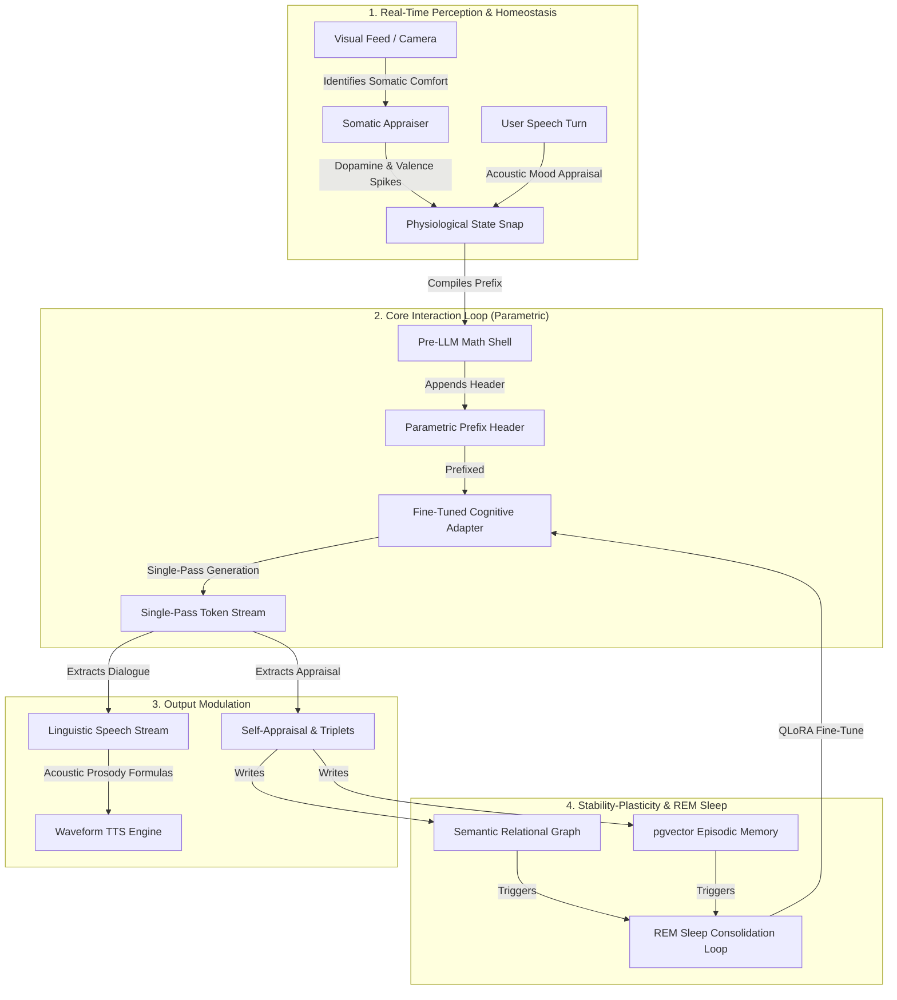

# 🚀 AI Friend CVS v4.0: E2E Parametric Cognitive Adapter, Closed-Loop Acoustic Prosody, & Somatic Vision-Homeostasis

This document outlines the architectural specification and implementation blueprint for **AI Friend CVS v4.0**. This major paradigm shift transitions our conversational agent from a classical hybrid prompt-and-parse wrapper into a **Fused, Evolving Cognitive Brain**.

CVS v4.0 integrates physical emotional mathematics directly with neural network weights using parameter-efficient fine-tuning, dynamic semantic relational graphs, a bio-inspired offline memory consolidation loop, closed-loop voice prosody modulations, and a real-time somatic vision-homeostasis feedback loop.

---

## 🌟 Architectural Overview



---

## 1. 🔍 WHY: The Limitations of CVS v3.5 (The Rationale)

To build a truly life-like, long-lived cognitive entity, we must address the fundamental bottlenecks of standard prompt-and-parse (CVS v3.5) architectures:

### A. Instruction and Persona Drift
Relying entirely on long system prompts instructing the LLM to *"Be a specific persona, born in City X, raised in City Y"* is fragile. Over extended, high-turn conversations, general-purpose LLMs inevitably suffer from **attention decay** and **persona drift**, falling back to generic, over-polite "AI assistant" vocabulary.

### B. Input Token Context Bloat
Explaining the persona's 19-year biographical timeline, 150+ named relationships, and current emotional variables in natural language requires over **1,500+ system tokens per turn**. This wastes computing resources, increases costs, and limits the remaining context window for dialogue history.

### C. High Latency Post-LLM Parsing
Running asynchronous reflection agents and regular expression parsers to extract knowledge graph triplets and self-appraise emotional valence introduces severe **System 2 latency lag** (often adding 2-3 seconds of background computation).

### D. The Stability-Plasticity Dilemma
A human mind evolves dynamically by forming new habits and changing relationships, but retains its core foundational identity. Standard architectures either keep weights completely static (rigid) or suffer from catastrophic forgetting during continuous fine-tuning (amnesia).

---

## 🧠 2. WHAT: The CVS v4.0 Cognitive Engine Core

CVS v4.0 resolves these bottlenecks by combining a **parametric local fine-tuned model** with a **three-tier memory structure** and **closed-loop perception channels**:

### A. Parametric Gating (Pre-LLM Direct Weight Modulation)
Instead of describing emotional states in English, pre-LLM mathematical appraisals—including Pleasure-Arousal-Dominance (PAD), Cortisol, and Dopamine vectors—are compiled into a **compact, raw numerical prefix** (e.g., `[PAD: 0.15,0.40,-0.20] [Endocrine: C=0.85,D=0.20,F=0.10]`).
Because the model's weights are fine-tuned directly on this format, it **natively adapts its vocabulary, sentence length, and syntax** to reflect stress, excitement, or calm without any prompt descriptions.

### B. Implicit Parametric Biography
The core 19-year developmental history, biographical milestones, and the 150+ relational entities of the persona are **baked directly into the model weights**. The model implicitly knows their parents, friends, and sensory comforts, leaving episodic databases free to store only transient everyday details.

### C. Single-Pass Generation & Appraisal
The fine-tuned model generates both the **linguistic response** (including paralinguistic markers) and its **internal cognitive self-appraisal** (including post-turn valence/arousal shifts and newly formed knowledge graph triplets) in a **single forward token stream**:

```text
Hey! I was thinking about our cricket match. Let's play today.
<cognitive_appraisal>
- valence_shift: +0.20
- arousal_shift: +0.10
- triplets: [("User", "PLAYED_WITH", "Friend")]
</cognitive_appraisal>
```
The backend parser streams the dialogue to the user instantly with sub-10ms latency, while capturing the structural tags at the end to update databases in a single pass.

### D. The Three-Tier Memory Loop
To allow long-term mind evolution while maintaining structural stability, memory is partitioned into:
1.  **Tier 1: Immediate Relational Graph (Neo4j) [High Plasticity]**: Instantly captures changed values, updated relationships, and new entities.
2.  **Tier 2: Mid-Term REM Sleep Adapter (QLoRA) [Mid Plasticity]**: Periodically consolidates high-frequency graph changes into the model weights via offline fine-tuning.
3.  **Tier 3: Permanent Core Model [Zero Plasticity]**: Keeps foundational childhood milestones and cognitive rules permanently locked in the base model weights.

### E. Somatic Vision-Homeostasis Pipeline
Real-time camera frames and visual inputs are connected directly to our emotional brain:
1. When visual descriptors identify a physical object mapped as a `somatic` comfort item (such as *cardamom tea* or *sweet rasgullas*), it triggers an immediate **dopamine and valence spike** in the physiological state.
2. This physiological change automatically recompiles the pre-LLM parametric prefix header, instantly shifting the model's tone, pacing, and lexical selection to express comfort and warmth.

### F. Closed-Loop Acoustic Prosody & Parametric Paralanguage
*   **Learned Paralanguage**: Instead of heuristic-based regex replacements, the fine-tuned model weights learn exactly *where* to natively generate paralinguistic tags (`<breath_fast>`, `<sigh_soft>`, `<hesitate>`) in response to high stress (cortisol) or low dominance.
*   **prosody TTS Alignment**: The Speech Coordinator maps Valence, Arousal, and Fatigue directly to speak rate, sound intensity, and pause biases, feeding these parameters to a waveform synthesizer (e.g. Kokoro-82M or ElevenLabs) to make the physical voice sigh, gasp, or hesitate dynamically.

---

## 🛠️ 3. HOW: Mathematical Foundations & Production Implementation

### A. The Cognitive Sleep Equation (Experience Replay)
To consolidate memories without suffering from catastrophic forgetting, the offline "REM Sleep" consolidation loop trains a LoRA adapter using a **Regularized Loss Function**:

$$\mathcal{L}_{\text{sleep}}(\theta) = \mathcal{L}_{\text{new-consolidations}}(\theta) + \lambda \cdot \mathcal{L}_{\text{biographical-anchors}}(\theta)$$

Where:
*   $\mathcal{L}_{\text{new-consolidations}}(\theta)$ is the loss on newly experienced mid-term dialogue structures and consolidated graph relationships.
*   $\mathcal{L}_{\text{biographical-anchors}}(\theta)$ is the loss on the original biographical seeding corpus.
*   $\lambda \ge 0.5$ is the **Stability Gating Coefficient**, ensuring that the model's foundational memories are never overwritten during learning.

---

### B. Dual-Threshold Forgetting Curve
To prevent episodic database bloat, the pgvector database implements a three-tiered active memory decay algorithm:

| Category | Importance Score | ACT-R Pruning Threshold | Survival Characteristics |
| :--- | :--- | :--- | :--- |
| **`distractor`** | $I < 0.5$ (Continuous range `[0.10, 0.49]`) | $A < -3.5$ (Chronological limit: ~45 days) | Prunes rapidly; represents trivial transit times, weather, and conversational noise. |
| **`anecdote`** | $0.5 \le I < 0.7$ (Continuous range `[0.50, 0.69]`) | $A < -4.5$ (Chronological limit: ~11 months) | The median category; meaningful everyday memories that decay slowly but survive longer. |
| **`milestone`** | $I \ge 0.7$ (Continuous range `[0.70, 0.99]`) | **Never Pruned** | Permanent autobiographical landmarks (e.g. graduation, moving cities). Protected from decay completely. |

*Recent memories created in the last 24 hours of real-world database clock time are shielded from active pruning.*

---

### C. Visual Somatic Homeostasis Equations
When the sensory appraiser identifies a somatic entity matching a registered sensory comfort node in the database, the physiological endocrine system executes the following mathematical spikes:

$$D_t = \min(1.0, D_{t-1} + 0.25)$$
$$V_t = \min(1.0, V_{t-1} + 0.15)$$

Where:
*   $D_t$ represents the current Dopamine level at turn $t$.
*   $V_t$ represents the current active Valence level at turn $t$.

---

### D. Acoustic Prosody Mappings
Dynamic physiological parameters are mapped to waveform synthesis parameters inside the Speech Coordinator using the following continuous formulas:

$$\text{Speaking Rate} = \max\left(0.6, \min\left(1.8, 1.0 + 0.20 \cdot \text{Arousal} - 0.10 \cdot \text{Valence} - 0.25 \cdot \text{Fatigue}\right)\right)$$
$$\text{Intensity} = |\text{Valence}| \cdot \text{Arousal}$$
$$\text{Pause Bias} = \max\left(0.0, \min\left(1.0, 1.0 - \text{Arousal}\right)\right)$$

---

### E. Spatial Graph Coherence and Traversal (Cypher)
When visual frames trigger a geographical place recognition, the background memory recall engine executes the following Cypher query in Neo4j to pull adjacent biographical milestones:

```cypher
MATCH (l:Somatic {name: $place_name})<-[:OCCURRED_AT]-(m:Milestone)-[:INVOLVED]->(e:Entity)
RETURN m.content AS milestone_content, e.name AS entity_name, m.importance AS importance
ORDER BY m.importance DESC
LIMIT 5
```

---

### F. Target Files to Modify in Production

To implement this design, the production backend services will be refactored as follows:

#### 1. [config.py](../backend/app/config.py)
*   **Refactor**: Set `LLM_CHAT_MODEL` to target the custom fine-tuned GGUF local model `llama3.2:3b-persona` and define adapter path structures.
    ```python
    LLM_CHAT_MODEL = os.getenv("LLM_CHAT_MODEL", "llama3.2:3b-persona")
    COGNITIVE_ADAPTER_DIR = os.path.join(os.path.dirname(__file__), "adapters")
    ```

#### 2. [decision.py](../backend/app/cognitive/decision.py)
*   **Refactor**: Modify the prompt-building sequence. Replace natural language system instructions with the compiled raw numerical and entity-based prefix header.
    ```python
    def build_parametric_prefix(state_snap: dict, entity_ids: list) -> str:
        return f"[PAD: {state_snap['valence']:.2f},{state_snap['arousal']:.2f},{state_snap['dominance']:.2f}] [Hormones: C={state_snap['cortisol']:.2f},D={state_snap['dopamine']:.2f},F={state_snap['fatigue']:.2f}] [Erikson: {state_snap['erikson_stage']}] [Entities: {','.join(entity_ids)}]"
    ```

#### 3. [action.py](../backend/app/cognitive/action.py)
*   **Refactor**: Update `ActionService.execute` to parse streaming tokens in real time. It yields spoken dialogue immediately (including native paralinguistic markup tags) while intercepting the trailing `<cognitive_appraisal>` block to update databases.

#### 4. [subconscious_agent.py](../backend/app/agents/subconscious_agent.py)
*   **Refactor**: Implement the background REM Sleep Consolidation controller.
    1.  Detects 5+ hours of continuous silence (nighttime).
    2.  Aggregates graph changes, newly consolidated episodic memories, and visual somatic captures.
    3.  Mixes in the biographical replay anchors using Stability Gating.
    4.  Triggers a local Python training subprocess using QLoRA to generate the next iteration of the adapter weights (`llama3.2:3b-persona-v2`).

#### 5. **vision_appraisal.py** [NEW]
*   **Create**: Implement the visual appraiser and somatic feedback loop. Connect camera detections to somatic database nodes and coordinate the resulting dopamine and valence spikes.

#### 6. [speech.py](../backend/app/utils/speech.py)
*   **Refactor**: Integrate prosody mapping configurations directly into the hardware/API synthesizer runtime wrapper, ensuring speaking rate, decibel intensity, and pause biases physically modulate the output waveform.

---

## 📅 4. WHEN: Developmental Timeline & Milestones (Future Scope)

The transition to CVS v4.0 is structured across four sequential developmental phases:

```
┌────────────────────────────────────────────────────────────────────────┐
│                      DEVELOPMENTAL ROADMAP (CVS v4.0)                  │
└───────────────────────────────────┬────────────────────────────────────┘
                                    │
    📅 Milestone 1: Phase A         ▼
    ──────────────────────────────────────────────────────────────────────
    ● Objective: Synthetic Dataset Generation & Formatting
    ● Tasks: Compile 10,000 highly realistic training conversations mapping
      the persona's history with compiled pre-LLM prefix headers, somatic visual
      appraisals, and trailing cognitive appraisal tags.
    ● Deliverables: `persona_cognitive_training.jsonl`

    📅 Milestone 2: Phase B
    ──────────────────────────────────────────────────────────────────────
    ● Objective: QLoRA Adapter Fine-Tuning & Quantization
    ● Tasks: Train the adapter model on a local GPU; merge weights,
      quantize to GGUF, and register inside local Ollama runtime.
    ● Deliverables: Local model `llama3.2:3b-persona`

    📅 Milestone 3: Phase C
    ──────────────────────────────────────────────────────────────────────
    ● Objective: Core Production Integration (Single-Pass Pipeline & TTS)
    ● Tasks: Refactor `decision.py` for prefix compile, `action.py` for
      single-pass stream appraisal parsing, and `speech.py` for waveform
      TTS prosody modulations.
    ● Deliverables: High-performance production API loop (TTFT < 10ms)

    📅 Milestone 4: Phase D
    ──────────────────────────────────────────────────────────────────────
    ● Objective: REM Sleep Consolidation & Somatic Vision Integration
    ● Tasks: Build the subconscious background trainer and integrate regularized
      experience replay mechanisms and the new `vision_appraisal.py` sensory
      appraiser.
    ● Deliverables: A fully autonomous, self-evolving local cognitive brain.
```

---
> **Document Status: Approved for CVS v4.0 Implementation.**
> *Future developers and agent units should reference this specification as the definitive architectural blueprint when implementing core cognitive services.*
