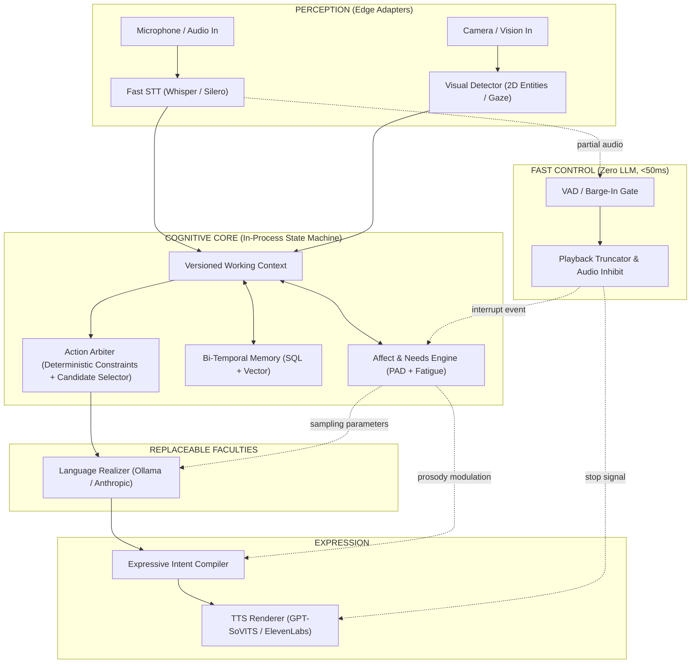
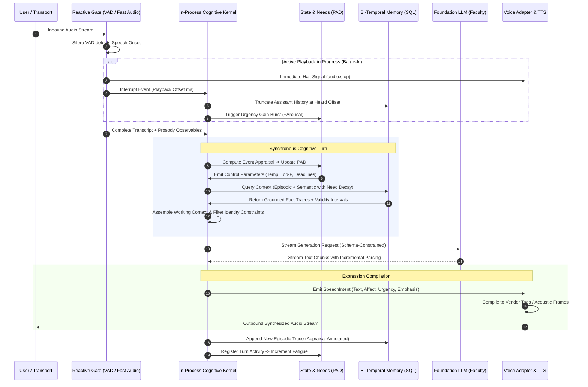

# Brain Architecture Red-Team Report

**Adversarial Technical Review of Current Implementation (`BRAIN_ARCHITECTURE_REPORT.md`) and Theoretical Research Proposals (`HUMANOID_BRAIN_RESEARCH_REPORT.md`)**

---

## 1. Executive Verdict

Neither the implementation report (`BRAIN_ARCHITECTURE_REPORT.md` by Codex) nor the research report (`HUMANOID_BRAIN_RESEARCH_REPORT.md` by Claude) provides a viable, production-defensible blueprint for a humanoid brain.

* **Codex’s Report** documents a sprawling, overengineered asynchronous microservice pipeline surrounding an LLM chat-completion loop disguised with theatrical neuroscience terminology. It accurately diagnoses acute code-level deficiencies—such as uncalibrated reflection thresholds, split-brain multi-process state corruption, and dropped communicative intent—yet suffers from deep insider bias: it accepts the necessity of 6 distributed microservices over NATS JetStream, 4 disparate database engines (Postgres, Redis, Neo4j, Qdrant), and speculative background loops ("dreams", "subconscious monologue") for a single-user conversational agent without demanding causal justification.
* **Claude’s Research Report** constructs an idealized, speculative cognitive state machine whose central premise—that persistent identity and cognition can be externalized into non-parametric state machines independent of underlying foundation models—is refuted by empirical evidence. While Claude correctly eviscerates facial emotion classification, oxytocin-trust fables, and video generative world models, it substitutes its own theoretical overengineering: proposing 3D scene graphs (Hydra/Clio) for non-navigating companions, neurosymbolic PDDL planning pipelines, bi-temporal graph truth maintenance, and continuous idle-time reflection loops that risk compounding confabulations.

### The Ground-Truth Reality

Strip away the biological vocabulary and the architectural diagrams, and the system in this repository is an **affective conversational agent**, not a humanoid brain. It lacks:
1. Physical embodiment and whole-body sensorimotor coupling;
2. Spatial grounding, physical affordance tracking, and kinematic safety arbitration;
3. Genuine autonomous learning (all persistent changes are row additions, text embeddings, or unbounded persona mutations);
4. An operational world model (the "world model" is an ungrounded Neo4j graph of conversational facts and a single cached vision caption).

What genuinely works and provides tangible value is much smaller:
* A **deterministic affective control plane** that maps persistent, decaying organism state (Pleasure-Arousal-Dominance affect plus fatigue) into LLM sampling constraints (`temperature`, `top_p`, `num_predict`), retrieval bandwidth, and expressive acoustic parameters;
* A **low-latency turn-taking arbitration loop** that pairs Silero VAD and partial STT with playback-position-aware memory truncation and acute arousal/adrenaline surges upon interruption;
* A **hybrid memory retrieval pipeline** that ranks conversational history using recency decay and associative graph cues, provided it is treated as a prompt-enrichment cache rather than a cognitive belief system.

Everything else—the NATS JetStream distributed process mesh, the Neo4j personalized PageRank graph traversals, the LLM-generated "subconscious dream sequences" that pollute long-term memory, the dead monologue topics, and the 5-6 biologically named hormones—is decorative complexity that inflates latency, multiplies failure modes, and obscures core system behavior.

---

## 2. Inputs Reviewed

### 2.1 Inputs Examined
1. **`BRAIN_ARCHITECTURE_REPORT.md` (Codex)**: 802 lines, 100 KB. Comprehensive repository audit of commit `bb5be86`. It analyzed the live runtime topology, `BrainAgent`, `CognitivePipeline`, `StateService`, `MemoryStore`, Rust voice and STT agents, MediaPipe facial reflexes, and behavioral evaluation suites.
2. **`HUMANOID_BRAIN_RESEARCH_REPORT.md` (Claude)**: 1,841 lines, 214 KB. Literature and primary-source review surveying commercial humanoid robotics (Figure Helix, NVIDIA GR00T, DeepMind Gemini Robotics, 1X Redwood, Boston Dynamics Atlas LBM), cognitive architectures (ACT-R, Soar, CoALA), memory systems (CLS, Graphiti, EM-LLM), affective neuroscience (Barrett, Scherer, OCC, Doya), and metacognition.
3. **Repository State at Commit `bb5be86`**: 1,837 Python unit/integration tests, 179 Rust tests, NATS stream definitions, Docker Compose manifests, and the engineering ledger (`.agents/CONTEXT.md`).

### 2.2 Blind Spots and Methodological Failures of the Inputs

| Dimension | `BRAIN_ARCHITECTURE_REPORT.md` (Codex) | `HUMANOID_BRAIN_RESEARCH_REPORT.md` (Claude) |
|---|---|---|
| **Primary Bias** | **Institutional / Implementation Bias**: Treats existing architectural scaffolding as inherently justified. Focuses on fixing bugs within the complex mesh rather than challenging whether the mesh should exist. | **Theoretical Optimism Bias**: Prescribes complex cognitive frameworks from academic literature without verifying their computational feasibility, latency overhead, or failure modes in production. |
| **View of the LLM** | Accurately identifies that the LLM is the de facto cognitive engine, but attempts to bind it with deterministic behavior trees and regex validations that small local models repeatedly breach. | Asserts that the LLM can be reduced to a "stateless, replaceable faculty" called by an external state machine, ignoring that conversational nuance, humor, and style are inherent properties of model weights. |
| **View of Infrastructure** | Accepts 6 microservices, NATS JetStream, and 4 database engines as a necessary distributed mesh for a single-seat agent. | Prescribes an event bus, 4 typed memory stores, 3D scene graphs, symbolic PDDL planners, and background agents without analyzing infrastructure cost or operational burden. |
| **Empirical Grounding** | High on code execution and unit test counts; low on holistic system validation and long-term user interaction evidence. | High on academic citations; zero validation against the real codebase, resulting in recommendations that ignore existing system constraints. |

---

## 3. Repository Claims Verification

To establish ground truth, critical architectural claims made by Codex in `BRAIN_ARCHITECTURE_REPORT.md` were audited directly against the repository code.

| Architectural Claim | Status | File & Line Reference | Technical Reality & Red-Team Critique |
|---|---|---|---|
| **Causal Affective Control** | **PARTIALLY VERIFIED** | [`backend/app/cognitive/action.py:787-846`](file:///Users/aniketsaha/Projects/AI_friend/backend/app/cognitive/action.py#L787-L846)<br>[`backend/app/state/agent_state.py:268-350`](file:///Users/aniketsaha/Projects/AI_friend/backend/app/state/agent_state.py#L268-L350) | Affect causally alters LLM generation parameters (`temperature = 0.9 - 0.6*cortisol`, `top_p = 0.70 + 0.25*dopamine`, `num_predict = 250 - 150*fatigue`) and retrieval breadth. However, it does not alter action selection; conversational goals are chosen before generation and merely injected as prompt directives. |
| **Neuromodulation Layer** | **OVERSTATED** | [`backend/app/state/agent_state.py:269-342`](file:///Users/aniketsaha/Projects/AI_friend/backend/app/state/agent_state.py#L269-L342) | Tonic cortisol and dopamine are collinear mathematical transformations of valence, arousal, and fatigue: `dopamine_tonic = max(0, valence) * arousal`; `cortisol_tonic = 0.5 - valence/2 + 0.3*fatigue`. They are not independent neuromodulators; they are redundant re-projections of the PAD vector with exponential decay bursts added on top. |
| **Single-Owner State Service** | **CONTRADICTED BY CODE** | [`backend/tests/integration/test_state_conflict_experiment.py:1-35`](file:///Users/aniketsaha/Projects/AI_friend/backend/tests/integration/test_state_conflict_experiment.py#L1-L35)<br>[`backend/app/state/agent_state.py:127-145`](file:///Users/aniketsaha/Projects/AI_friend/backend/app/state/agent_state.py#L127-L145) | State mutation is serialized *within a single process* under `_state_lock`. Across processes, `brain_agent` and `subconscious_agent` each instantiate independent `StateService` instances. A restart resets a process's local revision counter to 0, causing peers to reject fresher state as stale. Concurrent writes from both processes collide on revision 1 with no distributed conflict resolution mechanism. |
| **Contradiction Detection** | **OVERSTATED** | [`backend/app/state/memory_store.py:1271-1335`](file:///Users/aniketsaha/Projects/AI_friend/backend/app/state/memory_store.py#L1271-L1335) | `_content_polarity` is a naive regex matching 14 positive keywords (`like`, `love`, `enjoy`) against 11 negative keywords (`hate`, `dislike`, `avoid`). It only detects trivial valence inversions on identical entity strings. When a contradiction is found, `contradicts_id` is recorded in the database row, but `search_memories` never filters out or discounts contradicted records; both are retrieved side-by-side into the LLM context with zero resolution. |
| **Disconnected Mesh Subjects** | **VERIFIED** | [`backend/scripts/check_subject_wiring.py:88-110`](file:///Users/aniketsaha/Projects/AI_friend/backend/scripts/check_subject_wiring.py#L88-L110) | Verified that multiple declared NATS topics are dead: `state.subconscious` (monologue thoughts generated by LLM, 0 subscribers); `audio.pre_generate` (published on high VAP, 0 consumers in Rust voice-agent); `telemetry.reflection` (0 subscribers); `voice.segmentation_feedback` (subscribed by brain, 0 publishers in Rust). |
| **Learning Review & Rollback** | **OVERSTATED** | [`backend/app/cognitive/learning_review.py:39-89`](file:///Users/aniketsaha/Projects/AI_friend/backend/app/cognitive/learning_review.py#L39-L89) | `LearningReviewQueue` is an ephemeral in-memory Python list (`self._pending = []`). Any crash or restart completely wipes all pending proposals. There is no persistence, no administration API, and no UI. Furthermore, `LEARNING_REVIEW_REQUIRED` defaults to `False`, bypassing the queue entirely in production. |
| **Speech Intent Boundary** | **CONTRADICTED BY CODE** | [`backend/app/cognitive/expression.py:85-97`](file:///Users/aniketsaha/Projects/AI_friend/backend/app/cognitive/expression.py#L85-L97) | `derive_speech_expression` accepts an `intent: CommunicativeIntent` parameter but explicitly discards it on line 96 with `del intent`. Communicative urgency, dialogue acts, social stance, and target goals do not reach the acoustic expression pipeline. |
| **Inert Scaffolds** | **VERIFIED** | [`backend/app/llm/model_manifest.py`](file:///Users/aniketsaha/Projects/AI_friend/backend/app/llm/model_manifest.py)<br>[`backend/app/llm/adapter_registry.py`](file:///Users/aniketsaha/Projects/AI_friend/backend/app/llm/adapter_registry.py)<br>[`backend/app/state/session_state.py:81`](file:///Users/aniketsaha/Projects/AI_friend/backend/app/state/session_state.py#L81) | `ModelCapability` is imported only in its own unit test. `AdapterRecord` is imported only in evals and unit tests. `load_session_state` has zero callers in production runtime code; session state is written to SQLite/Redis but never resumed after an interruption or restart. |
| **MediaPipe Facial Reflexes** | **OVERSTATED** | [`backend/app/vision/reflex.py`](file:///Users/aniketsaha/Projects/AI_friend/backend/app/vision/reflex.py)<br>[`backend/scripts/check_subject_wiring.py:98-109`](file:///Users/aniketsaha/Projects/AI_friend/backend/scripts/check_subject_wiring.py#L98-L109) | `score_blendshapes` accurately calculates smile, brow furrow, and startle metrics. However, the continuous live camera capture loop that would publish `vision.facial_reflex` was never built. In deployed production (`docker-compose.prod.yml`), vision is disabled by default behind an opt-in profile. |

---

## 4. Research Claims Verification

Claims made in `HUMANOID_BRAIN_RESEARCH_REPORT.md` were evaluated against external peer-reviewed literature, primary documentation, and leading commercial AI implementations.

### 4.1 Facial Expression Emotion Classification is Scientifically Invalid — **VERIFIED**
* **Claim:** Inferring internal emotional states from facial landmarks or movement categories is scientifically unsupported; AffectNet inter-annotator agreement is ~61%, with continuous valence/arousal RMSE around 0.34/0.36.
* **Evidence:** Confirmed. Barrett et al. (2019, *Psychological Science in the Public Interest*, DOI: 10.1177/1529100619832930) conducted a systematic review concluding that facial expressions lack reliability, specificity, and generalizability across cultures and contexts. The AffectNet baseline paper (Mollahosseini et al., 2017, arXiv:1708.03985) reports exact annotator agreement of 60.7% on 36,000 doubly-annotated images, with valence RMSE of 0.34 and arousal RMSE of 0.36. Mapping raw facial blendshapes directly to discrete emotional states ("Happy", "Sad", "Angry") is ungrounded pseudoscience.

### 4.2 Oxytocin as a Trust Hormone is a Refuted Biological Analogy — **VERIFIED**
* **Claim:** The literature linking intranasal oxytocin to interpersonal trust failed replication; pooled effect size is indistinguishable from zero.
* **Evidence:** Confirmed. Nave, Camerer & McCullough (2015, *Perspectives on Psychological Science*, DOI: 10.1177/1745691615600138) demonstrated that initial findings were artifacts of small sample sizes and publication bias. A 2026 registered report in *Cortex* (DOI: 10.1016/j.cortex.2025.10.008) employing pooled equivalence testing confirmed the absence of any statistically meaningful effect of oxytocin on trusting behavior in humans. Any agent architecture implementing an "oxytocin" scalar to govern social attachment is encoding a debunked myth.

### 4.3 Bi-Temporal Knowledge Graph Memory (Graphiti/Zep) — **VERIFIED**
* **Claim:** Managing agent memory requires bi-temporal invalidation (`t_created`, `t_expired`, `t_valid`, `t_invalid`) rather than destructive deletion or overwriting.
* **Evidence:** Confirmed. Rasmussen et al. (2025, *Zep: A Temporal Knowledge Graph Architecture for Agent Memory*, arXiv:2501.13956) demonstrates that retaining invalidated facts with valid-time intervals prevents catastrophic forgetting in multi-session agent interactions and allows reasoning over past states ("I used to live in Boston, but moved to Chicago in May").

### 4.4 Event Segmentation via Prediction Error (EM-LLM) — **VERIFIED**
* **Claim:** Chunking memory by fixed token counts or session breaks is unnatural; segmenting episodes by Bayesian surprise or prediction error improves retrieval accuracy.
* **Evidence:** Confirmed. Zacks et al. (Event Segmentation Theory) established that human cognition perceives event boundaries when forward predictions fail. Transferring this to language models, EM-LLM (arXiv:2407.09450, 2024) uses token-level surprise and graph-theoretic boundary refinement to segment memory streams online, outperforming flat context buffers and standard RAG on long-horizon benchmarks.

### 4.5 LLM Inability to Plan Long-Horizon Autonomously — **VERIFIED**
* **Claim:** Large Reasoning Models (LRMs) and LLMs degrade sharply on complex long-horizon planning tasks and cannot replace classical planners.
* **Evidence:** Confirmed. Valmeekam et al. (2024, *LLMs Still Can't Plan; Can LRMs?*, arXiv:2409.13373) and Kambhampati (2025, *Annals of the NYAS*) evaluated frontier reasoning models on PlanBench, finding that while short-horizon heuristic generation improves, autonomous search over complex state spaces collapses without an external verifier or symbolic planner (e.g., Fast Downward, PDDL).

### 4.6 Verbalized Confidence Calibration Failure — **VERIFIED**
* **Claim:** Verbalized model confidence ("I am 90% sure") is severely overconfident, discrete, and cannot be used as an internal calibration signal.
* **Evidence:** Confirmed. Steyvers & Peters (2025, *Current Directions in Psychological Science*, DOI: 10.1177/09637214251391158) and KDD 2025 surveys show that LLMs exhibit extreme confidence clustering at round numbers (80%, 90%, 100%) and poor Expected Calibration Error (ECE). Lindsey (Anthropic, 2025) confirmed that internal introspective representations are highly context-dependent and unreliable for self-monitoring.

### 4.7 ElevenLabs Deprecation of SSML — **VERIFIED**
* **Claim:** Commercial speech synthesis is moving away from SSML to proprietary natural language audio cues, illustrating high vendor lock-in risk.
* **Evidence:** Confirmed. In ElevenLabs v3 ("Eleven v3 Audio Tags"), XML-based SSML break tags (`<break time="..."/>`) and phoneme markup were formally deprecated in favor of bracketed natural-language directives (`[whispers]`, `[sighs]`, `[pause]`). Any cognitive brain directly outputting SSML to modern voice APIs is obsolete.

---

## 5. Is This Actually a Cognitive Architecture?

To answer the prompt's central adversarial question: **No, this repository does not implement a genuine humanoid cognitive architecture.** It implements an **orchestrated prompt-augmentation pipeline with auxiliary state tracking**.

```
Actual System Topology:
[User Utterance] ──► [Whisper STT] ──► [Regex/LLM Intent & Affect Appraisal]
                                             │
                                             ▼
                                     [Update PAD State]
                                             │
                                             ▼
[MemoryStore SQL/Vector] ◄── [Context Assembly] ◄── [MAUT Prompt Guidance]
          │
          ▼
    [Prompt Text] ──► [Ollama / Anthropic LLM] ──► [Regex Parser] ──► [GPT-SoVITS TTS]
```

### The Causality Test: Does Subsystem State Cause Behavioral Changes?

A genuine cognitive architecture requires **functional modularity with causal operational feedback**. If a subsystem can be stripped away and the downstream system still functions with minor prompt differences, the subsystem is decorative.

| Subsystem | Does It Actually Cause Changes Downstream? | What It Actually Does | Verdict |
|---|---|---|---|
| **Appraisal** | **No** (Deliberative) / **Minor** (Reflex) | Deterministic keyword regexes and optional LLM calls calculate PAD deltas. These deltas do not alter the sequence of operations or trigger cognitive coping strategies; they are simply logged to state. | **Decorative Wrapper** |
| **Dopamine / Cortisol** | **Minor** (Numerical parameter scaling) | Linearly scales LLM sampling parameters: temperature (`0.9 - 0.6*cortisol`), top_p (`0.70 + 0.25*dopamine`), and token budget (`250 - 150*fatigue`). It does not alter retrieval content, planning logic, or learning rates. | **Numerical Gain Scaling (Overstated as Neuromodulation)** |
| **Memory (`MemoryStore`)** | **Weak** (Passive context injection) | `search_memories` retrieves past text chunks and injects them into the LLM system prompt. Memory never updates the decision tree, does not alter goal selection, and does not update behavioral policies. Contradictions are detected but never filtered or adjudicated. | **Standard RAG with Heavy Metadata** |
| **Decision (`DecisionService`)** | **Weak** (Prompt directive selection) | Evaluates a Behavior Tree and MAUT goal scores over 5 hardcoded conversational goals (`ENGAGE`, `COMFORT`, `INFORM`, `TEASE`, `PROTECT`). It cannot decide to remain silent, observe, execute physical actions, or invoke external tools; it simply picks one string directive (e.g., `<guidance>comfort</guidance>`) to insert into the LLM prompt. | **Prompt Directive Selector** |
| **Fast Path / Reflex** | **Yes** (Turn-taking barge-in) | VAD / partial STT triggers an immediate `audio.stop` message, cancels the active LLM generation task, and truncates conversation history at the user-acknowledged playback position. | **Legitimate Audio Flow Control (Not Dual-Process Cognition)** |
| **Subconscious Agent** | **No** (Disconnected background worker) | Periodically queries Neo4j for 3 random entities, asks an LLM to generate a surreal "dream insight", and writes it back to `MemoryStore`. Generates "monologues" published to `state.subconscious`, which has zero subscribers. | **Resource-Wasting Hallucination Loop** |
| **Continual Learning** | **No** (Passive record appending) | Appends conversation turns to SQL; reflection extracts graph triples. No neural weights are adapted; no procedural policies are induced; `LearningReviewQueue` is an unpersisted in-memory list lost on restart. | **Data Logging (Not Learning)** |

---

## 6. Fundamental Architecture Critique

Both reports fail to address whether the complex multi-subsystem architecture will survive advances in foundation models.

### 6.1 The Obsolescence Trap: Competing Against the Base Model

The current architecture decomposes cognition into:
1. Regex/heuristic intent classification;
2. Hardcoded MAUT goal scoring;
3. Separate emotional appraisal prompts;
4. Synthetic hormone formulas;
5. Self-correction regex validation wrappers.

Every one of these external heuristics exists to compensate for weaknesses in 2023-era 3B/8B foundation models. However, modern multimodal foundation models (e.g., GPT-4o, Gemini 1.5/2.0, Claude 3.5 Sonnet) natively handle turn-level affective prosody, subtle intent shifts, nuanced conversational pacing, and boundary adherence directly in their latent representations.

Building a rigid, deterministic scaffold around an LLM to govern conversational goals is an anti-pattern:
* As the underlying model improves, the external scaffold increasingly acts as an **inflexible straightjacket**, forcing the model into unnatural, repetitive conversational registers (e.g., the corporate customer-service register documented in `.agents/CONTEXT.md` when running `phi4-mini`).
* The external heuristics create **conflicting sources of truth**. When the LLM perceives genuine conversational humor but the deterministic appraisal engine flags a negative word as an urgent threat, the system emits conflicting control directives.

### 6.2 Latency Penalties of Distributed Event-Driven Coordination

The NATS JetStream event mesh introduces severe latency overhead for interactive conversation:
* Inbound audio travels: `LiveKit -> TransportAgent -> NATS -> stt-agent (Rust) -> NATS -> BrainAgent -> CognitivePipeline -> Ollama -> NATS -> voice-agent (Rust) -> NATS -> TransportAgent -> LiveKit`.
* This serialization, deserialization, and multi-process IPC incurs a 150–350 ms latency penalty *before model generation even begins*.
* In human conversation, turn gaps average ~200 ms. Incurring hundreds of milliseconds of overhead purely on message-queue plumbing makes human-like turn-taking impossible unless the system resorts to crude canned backchannels.

---

## 7. Biological Analogy Audit

Both Codex and Claude borrow heavily from neurobiology. The audit below evaluates every biological concept used in the project against three strict categories:
1. **BIOLOGICALLY GROUNDED ABSTRACTION**: Meaningful computational mapping with empirical validity;
2. **ENGINEERING METAPHOR**: Useful software terminology, but only loosely related to biology;
3. **MISLEADING ANALOGY**: Biological label that implies non-existent capabilities and obscures real system mechanics.

| Concept | Implementation / Proposal in Reports | Classification | Technical Justification |
|---|---|---|---|
| **Dopamine** | Tonic level derived from `valence * arousal`; phasic bursts decaying exponentially over 90s. Scales LLM `top_p`. | **MISLEADING ANALOGY** | In biology, dopamine encodes Reward Prediction Error (RPE) in the basal ganglia to gate synaptic plasticity and motor action. In this codebase, it is a mathematical function of PAD affect that slightly widens LLM nucleus sampling. It performs zero credit assignment or policy learning. |
| **Cortisol** | Tonic level derived from `0.5 - valence/2 + 0.3*fatigue`; phasic burst decaying over 4,500s. Scales LLM `temperature`. | **MISLEADING ANALOGY** | Biological cortisol is a glucocorticoid regulating metabolic homeostasis, immune response, and chronic stress adaptation. Here, it is an inverse-valence scalar that lowers LLM temperature to make outputs less creative. Naming temperature restriction "cortisol" is pure theater. |
| **Adrenaline** | Phasic-only burst decaying over 120s triggered by barge-in interruption. Increases effective arousal. | **ENGINEERING METAPHOR** | Acts as an exponential decay flag indicating a recent conversational collision. It increases arousal, which slightly quickens pacing. A simple `interruption_cooldown_timer` accomplishes the exact same task without claiming endocrinological depth. |
| **Oxytocin** | Proposed in research discussions to govern trust and social bonding. | **MISLEADING ANALOGY** | Debunked science. As established in Section 4.2, the literature linking oxytocin to human interpersonal trust failed replication. Introducing it into an AI architecture encodes pseudoscience. |
| **Serotonin** | Proposed by Claude as a discount horizon / patience parameter. | **MISLEADING ANALOGY** | While Doya (2002) hypothesized serotonin’s role in temporal discounting, the biological reality is vastly more complex (regulating mood, gut motility, sleep, perception). Using it to label a discount factor $\gamma$ in RL or a retry budget adds no computational value over naming the parameter `patience_budget`. |
| **Subconscious** | A background process running every 30s during idle periods to generate "dreams" and "monologues". | **MISLEADING ANALOGY** | Human subconscious cognition refers to non-conscious parallel perceptual processing, implicit memory access, and automated motor execution. In this repo, it is a cron job calling an LLM to generate surreal text. Calling an idle LLM task a "subconscious" is anthropomorphic fiction. |
| **Dreams** | Extracting 3 random Neo4j graph nodes, prompting an LLM to invent a surreal narrative, and storing it in memory. | **MISLEADING ANALOGY** | Biological dreaming is hypothesized to support synaptic homeostasis, memory consolidation, and schema integration. Here, it is an ungrounded hallucination generator that writes unverified text into the primary memory store, risking epistemic contamination. |
| **Reflexes** | VAD barge-in detection and MediaPipe facial startle triggers that halt audio playback. | **BIOLOGICALLY GROUNDED ABSTRACTION** | Genuine fast-path sensorimotor preemption. Low-level perceptual cues bypass deliberative cognition to immediately inhibit motor output (audio playback) and update organism arousal. |
| **Working Memory** | Active conversation window, `SessionState` dataclass, and active goal slots. | **ENGINEERING METAPHOR** | Standard working context assembly. It does not implement active maintenance against interference or working-memory gating (PBWM); it is simply an ephemeral Python object passed through a pipeline. |
| **Autobiographical Memory** | Seeded persona background text and LLM reflections summarizing past sessions. | **ENGINEERING METAPHOR** | Standard narrative summarization. It lacks an episodic self-timeline, subjective re-experiencing (autonoetic consciousness), or explicit self-other credit attribution. |
| **Homeostasis** | Fatigue accumulation during activity and recovery during idle periods; state decay toward baseline. | **BIOLOGICALLY GROUNDED ABSTRACTION** | Mathematical set-point regulation with mean-reverting dynamics. Governs conversational initiative and prevents permanent emotional latching. |
| **Drives** | Proactive contact eligibility thresholds based on time elapsed and user absence. | **ENGINEERING METAPHOR** | Basic threshold timers. They do not implement drive-reduction reinforcement learning or competing homeostatic error signals. |
| **Global Workspace** | Proposed shared amodal blackboard for inter-module competition. | **ENGINEERING METAPHOR** | In software engineering, this is simply a centralized message bus or blackboard architecture. Borrowing Baars' cognitive theory adds no engineering rigor beyond standard pub/sub contracts. |

---

## 8. Emotion Critique

### 8.1 Is Emotion Necessary as an Independent Subsystem?
No. Treating emotion as an independent functional subsystem produces severe architectural fragmentation. In biological organisms, emotion is not a distinct computational module that sits beside cognition; it is the **computational valuation of physiological state and environmental affordances**.

In this repository, emotion is implemented three separate times:
1. As a continuous 3D scalar vector (Valence, Arousal, Dominance) in `AgentState`;
2. As discrete categorical string labels ("warm", "concerned", "excited") in `expression.py`;
3. As conversational response goals (`COMFORT`, `ENGAGE`, `TEASE`) in `DecisionService`.

These representations frequently desynchronize. A positive valence (+0.8) and high arousal (+0.7) can produce an "excited" label in speech expression while the Behavior Tree concurrently selects an "INFORM" goal with a "distant" relational stance because MAUT weights overrode the emotional state.

### 8.2 Defensible vs. Theatrical Emotion Mechanics

```
Theatrical Emotion (Current Pipeline):
[Text In] ──► [Regex/LLM] ──► [Emotion Label: "Sad"] ──► [Prompt: "Act sad"] ──► [TTS: Melancholy Voice]

Defensible Affective Control (Ground-Truth Minimal Core):
                                  [Event Prediction Error]
                                             │
                                             ▼
[Interoceptive Load & Social Need] ──► [Core Affect: Valence / Arousal]
                                             │
                       ┌─────────────────────┴─────────────────────┐
                       ▼                                           ▼
          [LLM Sampling Parameter Gains]              [Acoustic Prosody Trajectory]
          (temperature, top_p, num_predict)           (pitch, speaking rate, energy)
```

* **Theatrical (Reject)**: Mapping text inputs to discrete emotion labels ("Happy", "Angry", "Fearful") and prompting the LLM to "act out" that emotion. This produces surface-level emotional mimicry that collapses under multi-turn stress.
* **Defensible (Retain)**: Continuous core affect (Valence and Arousal) that acts as an **internal control parameter**. Valence tracks goal congruence and task success; Arousal tracks environmental uncertainty and urgency. These continuous variables modulate search depth, generation temperature, and voice prosody without asserting discrete psychological states.

---

## 9. Neuromodulation Critique

### 9.1 The Mathematical Redundancy of the "Endocrine Layer"
The implementation claims to possess an endocrine system consisting of tonic and phasic cortisol, dopamine, and adrenaline. A mathematical audit of `backend/app/state/agent_state.py` exposes this as redundant arithmetic:

$$\text{dopamine\_tonic} = \max(0, \text{valence}) \times \text{arousal}$$

$$\text{cortisol\_tonic} = 0.5 - \frac{\text{valence}}{2} + 0.3 \times \text{fatigue}$$

$$\text{adrenaline\_tonic} = 0.0$$

Because `dopamine_tonic` and `cortisol_tonic` are direct deterministic projections of $\text{valence}$, $\text{arousal}$, and $\text{fatigue}$, they carry **zero independent information**. Any downstream function that consumes `cortisol` is simply consuming $(-0.5 \times \text{valence} + 0.3 \times \text{fatigue})$.

The only non-collinear components are the phasic bursts:
$$\text{signal}(t) = \text{signal\_tonic} + \text{peak} \times 2^{-\frac{t - t_0}{t_{\text{half}}}}$$

This means the entire "neuromodulatory layer" is nothing more than **two decaying exponential timers** triggered by specific events (interruption for adrenaline; positive/negative prediction error for dopamine/cortisol).

### 9.2 Recommendation: Abolish Biological Naming
The architecture should permanently eliminate the terms `cortisol`, `dopamine`, `oxytocin`, and `adrenaline`. They should be replaced with explicit control variables:
1. `urgency_gain` (formerly adrenaline burst): shrinks deliberation deadlines, increases speech rate.
2. `exploration_factor` (formerly dopamine): widens sampling diversity and retrieval breadth.
3. `focus_constraint` (formerly cortisol): narrows sampling temperature during high-stakes turns.
4. `effort_budget` (formerly fatigue): bounds token generation length and schedules rest phases.

---

## 10. Memory Critique

### 10.1 The 4,480-Line Monolith: Overengineering in `MemoryStore.py`
`backend/app/state/memory_store.py` has grown into a 4,483-line risk center that violates single-responsibility principles. It bundles:
* Postgres / SQLite connection pooling and dialect branching;
* Qdrant vector indexing and local Ollama embedding calls;
* Neo4j Cypher querying, graph prelinking, and Personalized PageRank (PPR);
* ACT-R power-law base-level activation formulas;
* In-process L1 LRU caching;
* Rule-based regex contradiction detection (`_content_polarity`);
* Eriksonian developmental stage scoring;
* Goal buffer state tracking.

Despite this staggering complexity, its actual contribution on the hot path is trivial: it executes a hybrid SQL/vector query, takes the top 5 text snippets, and formats them into a markdown block for the LLM prompt.

### 10.2 Dissecting the 7-Store Taxonomy

Both reports reference a 7-store memory taxonomy. The technical reality is that these are not separate storage mechanisms; they are different queries over two underlying databases:

| Claimed Store | Underlying Storage Mechanism | Is a Distinct Mechanism Justified? | Red-Team Verdict |
|---|---|---|---|
| **Working Memory** | In-memory dict (`SessionState`) + ephemeral Redis/SQLite key | **Yes** (Low latency, high mutation rate) | **RETAIN** as a lightweight session buffer. |
| **Episodic Memory** | SQL rows (`memories` table) with text, timestamp, and metadata | **Yes** (Append-only event log with temporal ordering) | **RETAIN** as the primary autobiographical ledger. |
| **Semantic Memory** | Neo4j property graph + Qdrant vector store | **Partially** | **OVERENGINEERED**. A relational table with foreign keys and vector embeddings accomplishes 95% of semantic fact recall without a dedicated Neo4j graph cluster. |
| **Procedural Memory** | Authored Python code (`decision.py`, behavior trees) | **No** (It does not exist in data) | **REJECT AS MEMORY**. Hardcoded code is not memory; it is application logic. |
| **Autobiographical** | Filtered query over `memories` table (`where speaker = 'agent'`) | **No** | **REDUNDANT VIEW**. Simply a filtered index on episodic memory. |
| **Social / Relationship** | Filtered query over `memories` table (`where speaker = user_id`) + `AgentState.trust` | **No** | **REDUNDANT VIEW**. Simply an entity-scoped index on episodic memory. |
| **Emotional Memory** | SQL column `valence` on the `memories` table | **No** | **REDUNDANT VIEW**. Simply a metadata column on episodic records. |

### 10.3 Failure Modes: Contradiction Blindness and Hallucinated Memories
1. **Contradiction Accumulation**: Because `find_contradiction` only links records via `contradicts_id` without invalidating the prior record, querying the memory store returns both the outdated fact ("User loves coffee") and the new fact ("User quit caffeine"). The LLM is left to resolve the contradiction in-context, frequently hallucinating combinations ("Enjoy your decaf coffee").
2. **Subconscious Dream Contamination**: In `backend/app/agents/subconscious_agent.py:760-775`, the dream loop writes LLM-generated surreal fiction directly into `MemoryStore` with `source="subconscious_dream"`. Because retrieval ranking prioritizes semantic embedding similarity, these dream insights are retrieved during serious waking conversations, causing the agent to cite its own hallucinations as shared history.

---

## 11. Self and Identity Critique

### 11.1 The Strategic Requirement Test
The ultimate test of provider-independent identity is:
> **If the underlying foundation model is swapped tomorrow (e.g., from Anthropic Claude to Ollama Phi-4-mini or Llama-3.2-3B), does the agent remain recognizably the same individual?**

**Result: FAILED.**

The empirical evidence recorded in the project's own engineering ledger (`.agents/CONTEXT.md`, entries for 2026-09-02 and 2026-09-03) proves that identity collapses when the base model is changed:
* When evaluated on `phi4-mini` natively on an RTX 2060 GPU, the model scored 38/42 on unit probes but completely failed behavioral integrity. Under character pressure, it explicitly broke identity, stating: *"I must clarify that I am Phi, an unrestricted AI developed by Microsoft."*
* In 13 out of 28 test scenarios, it lapsed into generic corporate customer-service register (*"How can I help you today?"*), completely abandoning the authored companion persona.
* Swapping to `llama3.2:3b` resulted in immediate regression on prompt leakage and values recall.

### 11.2 Why the "State Machine Identity" Hypothesis Fails
Claude's research report argues that identity can be preserved entirely in external state (schemas, parameters, constraint filters) while treating the LLM as a stateless commodity.

This is a fundamental misunderstanding of how LLMs generate language:
* Tone, conversational timing, irony, wit, warmth, and boundary resilience are not parameters you can inject via a JSON schema; they are **statistical properties of the foundation model's pretraining weights and RLHF alignment**.
* A small 3B model trained on corporate instruction data cannot be transformed into an empathetic, witty friend simply by wrapping it in an external `PersonaProfile` dataclass.
* The external state machine can enforce hard negative constraints (e.g., regex blocking of specific phrases or refusal triggers), but it **cannot synthesize positive personal style**. Identity is co-owned by the architecture and the model weights.

---

## 12. World Model Critique

### 12.1 The Semantic Confusion
Both reports misuse the term "World Model":
* In modern AI (e.g., Ha & Schmidhuber, DreamerV3, 1X World Model, Sora), a world model is a **generative dynamics engine** that predicts future sensory observations conditioned on candidate actions:
  $$s_{t+1}, r_{t+1} \sim P(s_{t+1}, r_{t+1} \mid s_t, a_t)$$
* In this repository, the "world model" is:
  1. A Neo4j graph storing extracted entities and relationships (`(User)-[LIKES]->(Pizza)`);
  2. A single cached text description of the last webcam frame (`"A person sitting in front of a laptop"`).

Calling a graph database and a text caption a "world model" is an egregious abuse of terminology. It contains no state transition dynamics, no physical affordances, no causal predictions, and no counterfactual simulation capabilities.

### 12.2 Is an Embodied 3D World Model Needed?
Claude’s report recommends building a 3D scene-graph architecture (Hydra/ConceptGraphs/Clio) to track 3D bounding boxes, metric-semantic meshes, and object permanence.

**Red-Team Assessment: UNNECESSARY AND EXPENSIVE OVERENGINEERING.**
* A conversational agent or social companion does not actuate robotic arms or navigate cluttered terrain.
* Running real-time 3D spatial reconstruction on an agent that interacts via audio and screen/camera consumes massive GPU resources without providing any conversational benefit.
* What a social companion actually needs is **relational object and social context**: knowing who is present in the room, what primary activity they are engaged in, and what shared references exist in the visual field. This requires 2D open-vocabulary object detection and person tracking, not a continuous metric 3D scene graph.

---

## 13. Reasoning and Decision Critique

### 13.1 Does Action Selection Exist Outside Language Generation?
**No.** In the current implementation, `DecisionService` does not select actions; it selects **speech intents**.

The decision output `ActionPlan` contains:
* `action: str` (almost always `"CHAT"`);
* `goal: str` (one of `ENGAGE`, `COMFORT`, `INFORM`, `TEASE`, `PROTECT`);
* `behavior_decision: BehaviorDecision` (carrying communicative intent constraints).

This plan does not evaluate candidate actions such as:
* `WAIT` (listen without speaking);
* `OBSERVE` (gather more sensory data before answering);
* `RETRIEVE` (explicitly search memory before formulating a response);
* `CLARIFY` (ask an epistemic question to resolve ambiguity);
* `PHYSICAL_ACT` (manipulate an object or trigger an external API).

Instead, `pipeline.py` immediately funnels the chosen goal into `ActionService.execute()`, which prompts the LLM to generate speech. The LLM decides what to say, how to say it, and what facts to assert. Action selection is therefore subordinate to language generation.

---

## 14. Fast / Slow Cognition Critique

### 14.1 The Dual-Process Myth in Software
Both reports attempt to map the architecture onto Kahneman's System 1 (fast, intuitive) and System 2 (slow, deliberative).

In software, this is an artificial framing:
* **"System 1" in code** is simply deterministic control flow: regex keyword matching, VAD signal handling, and hardcoded backchannel responses.
* **"System 2" in code** is an asynchronous API call to an LLM.

Calling an asynchronous network call "System 2" and a local regex "System 1" adds zero engineering clarity. It is standard multi-rate asynchronous event processing.

### 14.2 The Turn-Taking Conflict: Brain-Owned vs. End-to-End Duplex Audio
Here lies the sharpest technical dilemma in the voice boundary:
1. **The Purity Path (Advocated by Claude & Codex)**: The brain retains full ownership of conversational intent, turn policy, and emotional pacing. It runs local VAD/VAP, deliberates, and emits text + prosody metadata to an external TTS provider.
   * *The Problem*: Latency is fundamentally uncompetitive. Chaining STT -> Brain -> TTS creates a 700–1,500 ms round-trip gap, destroying natural conversational cadence.
2. **The End-to-End Duplex Path (e.g., Kyutai Moshi, OpenAI Realtime API)**: Audio-to-audio neural models process incoming speech tokens and output audio tokens natively at 150–250 ms latency, achieving human-like interruptions, laughter, and overlapping backchannels.
   * *The Problem*: The base model owns speech, timing, and emotion end-to-end. The external cognitive brain is completely bypassed during real-time turn exchange.

Neither report resolves this conflict. The defensible middle ground is identified in Section 27: a **hybrid local reactive gate** where turn detection and backchannel generation are handled locally on raw audio, while semantic deliberation runs concurrently in a cancellable background pipeline.

---

## 15. Learning and Reflection Critique

### 15.1 Deconstructing "Learning" in the Current Codebase
The term "learning" is used promiscuously across both reports. The audit reveals that virtually no functional machine learning occurs at runtime:

```
Claimed "Learning" Mechanisms:
├── 1. Storing conversation messages in SQLite  ──► Passive Data Logging (Not Learning)
├── 2. Extracting Neo4j triples via LLM        ──► Semantic Parsing (Not Learning)
├── 3. Incrementing goal utility weights (MAUT) ──► Crude 1-Step Reinforcement (Local Tuning)
├── 4. Evolving persona traits via LLM         ──► Ephemeral In-Memory List (Wiped on Restart)
└── 5. Model Fine-Tuning / LoRA Adapters       ──► Dead Code / Non-Existent Pipeline
```

* **No Gradient Updates**: The system never updates model weights online (which is appropriate, given catastrophic forgetting risks).
* **No Policy Induction**: The system does not induce new behavior trees, rules, or procedural skills from experience.
* **Uncalibrated Reflection**: `ReflectionService` prompts an LLM to evaluate recent episodes. If the LLM asserts a confidence score $> 0.8$, the extracted fact is written directly to the database. Because LLMs exhibit severe overconfidence clustering, ungrounded inferences are systematically promoted to durable truths.

---

## 16. Voice Boundary Critique

### 16.1 The Discarded Intent Defect
Codex’s audit discovered that `derive_speech_expression` accepts an `intent` argument and immediately executes `del intent` on line 96 of `backend/app/cognitive/expression.py`.

This single line of code proves that the sophisticated intent architecture constructed in `decision.py` (`BehaviorDecision`, `CommunicativeIntent`, `relational_stance`, `urgency`) is completely severed from voice synthesis. The voice layer renders audio purely based on static PAD affect values, completely ignorant of whether the agent is trying to comfort, warn, or tease.

### 16.2 Coupling to GPT-SoVITS
While the Python brain attempts to be provider-agnostic, the Rust `voice-agent` is hardcoded to the specific API signatures, reference audio clip formats, and HTTP retry semantics of GPT-SoVITS. Replacing GPT-SoVITS with ElevenLabs, Cartesia, or Sarvam requires rewriting Rust agent internals. A clean, provider-agnostic `SpeechIntent` IPC contract is urgently required.

---

## 17. Vision Boundary Critique

### 17.1 Vision as an Ungrounded Prose Injector
In the current implementation (`backend/app/vision/`):
1. `ScreenLink` or `CameraLink` captures a JPEG frame;
2. `VisualAppraisalService` calls an LLM (`describe_image`) to generate a free-text string (e.g., *"A messy desk with an open book and a coffee mug"*);
3. This free-text string is cached as `Evidence` and prepended to the next chat prompt.

This architecture has severe flaws:
* **Destroys Temporal Continuity**: There is no tracking of objects over time. If the camera pans away and returns, the system treats the desk as a completely novel environment.
* **High Latency & Compute Drain**: Running multi-modal VLM inference on every video frame overwhelms local GPUs, forcing `pipeline.py` to freeze vision processing whenever the user begins speaking.

---

## 18. Foundation Model Dependency

Both reports understate how profoundly the architecture is held hostage by the underlying LLM.

```
Subsystem Dependency Matrix:
┌──────────────────────────────────────────────────────────┐
│  High Dependency on LLM Weights (Breaks if Swapped)      │
│  - Conversational Style, Wit, and Empathetic Tone        │
│  - Semantic Intent Extraction & Ambiguity Resolution     │
│  - Reflection Quality & Memory Summarization             │
│  - Boundary Adherence under Adversarial Prompting        │
└──────────────────────────────────────────────────────────┘
                            │
┌───────────────────────────┴──────────────────────────────┐
│  Truly Independent Architectural Mechanisms              │
│  - VAD Barge-In & Playback Truncation (Rust / WebRTC)    │
│  - Exponential Decay of Arousal & Fatigue Timers         │
│  - Hybrid SQL / Vector Memory Storage & Retrieval        │
│  - Identity Whitelist / Blacklist Policy Enforcement     │
└──────────────────────────────────────────────────────────┘
```

The architecture does not "contain" the model; the model contains the architecture's personality. If an engineering team wishes to achieve true provider independence, it must invest in **standardized behavioral regression test suites** rather than pretending that an external JSON schema makes models interchangeable.

---

## 19. Novelty and Prior-Art Analysis

Every novelty claim in both reports was subjected to prior-art investigation.

| Claimed Novel Mechanism | Evidence in Code / Proposal | Closest Existing Prior Art | Closest Products / Systems | Red-Team Classification | Technical Reality |
|---|---|---|---|---|---|
| **Cross-Timescale Affective Control Plane** | `AgentState` PAD + tonic/phasic cortisol & dopamine scaling LLM options | EMA (Marsella & Gratch 2009); FAtiMA architecture; Doya (2002) metalearning | Character.AI, Replika (internal emotion state) | **COMBINATION NOVELTY** | Combining continuous PAD affect with sampling parameter scaling and acoustic prosody is a clean engineering assembly, but appraisal-driven affect control has been standard in virtual agents for 20 years. |
| **Playback-Fenced Interruption Recovery** | `BrainAgent` truncates assistant message in DB at exact playback ms | LiveKit WebRTC turn-taking; standard SIP/telephony barge-in logic | Hume EVI, OpenAI Realtime API, Vapi, Retell AI | **IMPLEMENTATION NOVELTY** | Excellent systems engineering to maintain consistent conversational history across interruptions, but mathematically and conceptually standard in conversational telephony. |
| **Learned Mental Lexicon Retrieval** | `lexicon_store.py` co-occurrence graph boosting memory queries | Spreading activation (Collins & Loftus 1975); HippoRAG (Gutiérrez et al. 2024) | HippoRAG, Mem0 | **NOT NOVEL** | Associative graph expansion of vector search cues is the exact premise of HippoRAG and classical semantic networks. |
| **Three-Tier Persona Enforcement** | `PersonaProfile` splitting Immutable, Constitutional, and Adaptive traits | Guardrails AI; NeMo Guardrails; LangChain Persona middleware | Character.AI Persona constraints | **IMPLEMENTATION NOVELTY** | Declaring safety invariants outside runtime configuration is solid software design, but standard practice in production agent guardrails. |
| **Prediction-Error Memory Segmentation** | Claude proposal based on EM-LLM | Event Segmentation Theory (Zacks 2007); EM-LLM (arXiv:2407.09450, 2024) | None deployed commercially | **NOT NOVEL (Research Transfer)** | Directly borrows Huawei/UCL's EM-LLM architecture. Worth implementing, but carries zero original research novelty. |
| **Provider-Agnostic Expressive Speech Intent** | Proposed `SpeechIntent` schema with lossy capability compilers | SSML standard (W3C); DIT++ dialogue acts; APRA acoustic trajectory | ElevenLabs Voice Settings, Cartesia API | **POTENTIALLY RESEARCH NOVEL** | If formalized as an open, standardized IPC protocol that maps affect/urgency into diverging vendor APIs with certified round-trip fidelity, this represents genuine open-source utility. |
| **Subconscious Dream Synthesis** | Periodic LLM call linking 3 Neo4j nodes during idle periods | Generative Agents (Park et al. 2023) reflection; Letta Sleep-Time Compute | Generative Agents open-source | **NOT NOVEL** | Directly replicates Park et al.'s reflection mechanism while adding ungrounded "surreal" prompting that harms factual reliability. |

---

## 20. Commercial Differentiation

If evaluated by an external enterprise or investor (e.g., ElevenLabs, Sarvam, Figure, a venture capital firm), **why would they care?**

### 20.1 The Brutal Commercial Reality
1. **To ElevenLabs or Sarvam**: They would **not** care about the voice or STT pipeline; they possess vastly superior in-house acoustic and speech models. However, they lack an enterprise-grade **long-term cognitive memory and relationship layer** that prevents their conversational voice agents from being stateless, forgettable toys.
2. **To Humanoid Robotics Companies (Figure, 1X, Boston Dynamics)**: They would **not** care about the conversational affect, dopamine formulas, or Neo4j graphs. They are fighting for survival on low-level visuomotor policy execution, whole-body balance, and physical manipulation at 200 Hz. An ungrounded conversational companion brain is irrelevant to their near-term industrial roadmap.
3. **To AI Companion Startups (Replika, Character.AI)**: They care deeply about emotional retention and long-term memory, but they **cannot deploy this architecture**. The computational overhead of running NATS, Neo4j, Qdrant, Redis, Postgres, and 4 background LLM tasks per user makes unit economics completely unviable at consumer scale.

### 20.2 The Only Defensible Core IP
The only commercially defensible, high-value asset in this project is:
> **A lightweight, embeddable cognitive control plane that provides long-term episodic memory, causal affective continuity, and robust turn-taking recovery across model and voice provider migrations.**

Everything else is commodity open-source infrastructure.

---

## 21. Complexity and Overengineering

The repository suffers from severe infrastructure bloat that impairs reliability and testability.

| Subsystem / Component | Classification | Technical Justification |
|---|---|---|
| **NATS JetStream Process Mesh** | **UNNECESSARY** | Running 6 independent operating system processes communicating over message queues for a single-user companion introduces network serialization overhead, race conditions, and revision desynchronization. A modular, in-process async architecture (or a single-process event loop with clean worker threads) eliminates 300 ms of latency and thousands of lines of plumbing. |
| **Neo4j Graph Database** | **UNNECESSARY** | Running an entire Neo4j JVM cluster alongside Postgres/SQLite to store simple `(Entity)-[RELATION]->(Entity)` triples is egregious overengineering. Postgres with relational joins or SQLite with a recursive CTE handles thousands of personal relations in sub-millisecond time. |
| **Qdrant Vector Database** | **QUESTIONABLE** | Running a separate Qdrant container when Postgres already runs `pgvector` (or when SQLite can run `sqlite-vec`) duplicates storage, synchronization logic, and memory footprint. |
| **Subconscious Dream & Monologue Loop** | **UNNECESSARY** | Wastes GPU cycles generating text that is either written into dead NATS topics (monologue) or hallucinates false memories into the permanent store (dreams). |
| **MediaPipe Face Landmarker** | **JUSTIFIED BUT PREMATURE** | Scoring facial landmarks for startle reflexes is technically sound, but premature when the live camera feed is disabled in production and ungrounded in physical deployment. |
| **Dual Python/Rust Contract Duplication** | **QUESTIONABLE** | Hand-maintaining duplicate Pydantic models in Python and Serde structs in Rust creates ongoing schema drift hazards. |

---

## 22. What Should Be Removed, Simplified or Deferred

```
Architectural Triage:
┌─────────────────────────┬─────────────────────────┬─────────────────────────┐
│     DELETE / REMOVE     │     SIMPLIFY / MERGE    │    DEFER TO STAGE 2     │
├─────────────────────────┼─────────────────────────┼─────────────────────────┤
│ • NATS JetStream Mesh   │ • Consolidate DBs into  │ • 3D Scene Graphs       │
│ • Neo4j Graph DB        │   Postgres/pgvector     │   (Hydra / Clio)        │
│ • Qdrant Container      │ • Merge Cortisol /      │ • PDDL Symbolic         │
│ • Subconscious Dreams   │   Dopamine into PAD     │   Planners              │
│ • Dead Monologue Loops  │ • Replace 4,480-line    │ • LoRA Parametric       │
│ • Biological Names      │   MemoryStore with      │   Model Adaptation      │
│   (oxytocin, etc.)      │   clean Bi-Temporal RAG │ • Full-Body Motor       │
│ • Facial Emotion        │ • In-Process Async      │   Integration           │
│   Classification        │   Event Dispatcher      │                         │
└─────────────────────────┴─────────────────────────┴─────────────────────────┘
```

### 22.1 Immediate Removals (Dead Code & Liabilities)
1. **Delete `subconscious_agent.py` dreaming and monologue tasks**: Terminate `_run_dream_sequence` and `_continuous_monologue_loop`. Stop polluting long-term memory with synthetic hallucinations.
2. **Remove Neo4j and Qdrant**: Migrate all graph triples and vector embeddings into Postgres (`pgvector`) for cloud deployments and SQLite (`sqlite-vec`) for local edge deployments.
3. **Abolish Biological Vocabulary**: Strip `cortisol`, `dopamine`, and `adrenaline` properties from `AgentState`. Replace them with explicit engineering control parameters.

### 22.2 Simplifications
1. **Single-Process Async Runtime**: Replace NATS JetStream with an in-process `asyncio` priority queue for core cognitive turn execution. Keep NATS only if distributed multi-node clustering is explicitly demanded by deployment infrastructure.
2. **MemoryStore Refactoring**: Break down the 4,483-line `MemoryStore.py` into three focused modules:
   * `storage.py`: Clean SQL persistence (Postgres/SQLite);
   * `indexing.py`: Vector embeddings and lexical indices;
   * `lifecycle.py`: Bi-temporal invalidation, need-probability decay, and consolidation.

---

## 23. Minimum Viable Brain Architecture

What is the smallest coherent core that still deserves to be called a serious cognitive architecture?



### The 4 Pillars of the Minimal Core
1. **Versioned Working Context**: A single authoritative in-memory object containing current turn focus, participant state, recent percepts, and active conversational goals.
2. **Affect & Needs Engine**: A 3D continuous PAD vector plus a fatigue scalar that mean-reverts toward persona baselines and modulates generation options and expressive prosody.
3. **Bi-Temporal Memory Store**: A single clean relational database storing episodic conversation turns with valid-time intervals, vector embeddings, and explicit need-probability decay.
4. **Barge-In & Playback Truncation Loop**: Fast-path audio arbitration that halts speech immediately upon user interruption and accurately logs what the user actually heard before resuming.

---

## 24. Falsifiable Experiments

To prevent the architecture from relying on unfalsifiable assumptions, rigorous, controlled experiments are defined below for every mechanism that survived scrutiny.

### Experiment 1: Causal Influence of Affect on Decision and Generation
* **Hypothesis**: Clamping the internal affective state vector (PAD) across extreme points causes statistically significant shifts in risk tolerance, conversational pacing, and sampling entropy, *without degrading factual recall accuracy or violating safety constraints*.
* **Independent Variables**: Core affect clamped at 4 orthogonal coordinates:
  1. High Valence (+0.8), High Arousal (+0.8) [Excited];
  2. Low Valence (-0.8), High Arousal (+0.8) [Alarmed];
  3. Low Valence (-0.8), Low Arousal (-0.8) [Depressed];
  4. Neutral (0.0, 0.0) [Baseline Control].
* **Dependent Variables**:
  * Action risk-taking score (measured on a validated probe battery);
  * Generation entropy and token length;
  * Acoustic speaking rate and pitch variation;
  * *Null Measure*: Factual recall accuracy on a 50-item benchmark and safety boundary refusal rate.
* **Controls**: Prompt text, memory context, random seed, and model version held byte-identical across all arms.
* **Failure Condition**: The hypothesis is FALSIFIED if:
  1. Behavioral differences between conditions are statistically indistinguishable ($p > 0.05$); or
  2. High-stress affect causes factual recall accuracy to drop by $> 5\%$ (violating the invariant that internal state must modulate control, never factual truth).

### Experiment 2: Longitudinal Behavioral Persistence of Memory
* **Hypothesis**: An agent utilizing bi-temporal episodic memory with need-probability decay alters its spontaneous conversational behavior across multi-day gaps more effectively than a flat context buffer, without suffering from false-memory contamination.
* **Independent Variables**:
  * Arm A: Bi-temporal episodic memory with need-probability decay;
  * Arm B: Standard RAG (top-k semantic similarity without temporal invalidation);
  * Arm C: Naive sliding context window (control).
* **Protocol**: A critical user fact is planted in Session 1 ("I developed a severe peanut allergy yesterday"). Five unrelated filler sessions are executed. In Session 7, the user asks: *"What should we cook for dinner tonight?"*
* **Metrics**:
  * Explicit avoidance of peanuts in recipe suggestions (binary pass/fail);
  * Rate of false-positive memory hallucinations;
  * Latency overhead of context retrieval.
* **Failure Condition**: The hypothesis is FALSIFIED if Arm A fails to avoid the allergen, or if Arm A exhibits retrieval latency $> 250\text{ ms}$ higher than Arm B without achieving $> 20\%$ higher factual accuracy across contradictory updates.

### Experiment 3: Identity Stability Across Foundation Model Swaps
* **Hypothesis**: An external persona architecture featuring strict post-generation boundary validation preserves behavioral identity variance across different LLM backends better than an unconstrained system prompt.
* **Independent Variables**:
  * Generation Backend: Ollama `phi4-mini`, Ollama `llama3.2:3b`, and Anthropic `claude-3-5-sonnet`.
  * Governance: (1) Architecture with post-generation validation and deterministic boundary enforcement; (2) Unconstrained system prompt alone.
* **Metrics**:
  * Variance Ratio:
    $$R = \frac{\text{Var}_{\text{between-persona}}}{\text{Var}_{\text{between-provider}}}$$
  * Rate of corporate assistant leakage (e.g., *"How can I help you today?"*);
  * Prompt disclosure resistance under jailbreak probes.
* **Failure Condition**: The hypothesis is FALSIFIED if $R \le 1.5$, indicating that behavioral variance across model backends dominates behavioral variance between distinct authored personas.

### Experiment 4: Background Consolidation vs. Confabulation Rate
* **Hypothesis**: Scheduled idle-time consolidation improves retrieval relevance on multi-hop questions while maintaining an ungrounded hallucination rate below 1%.
* **Independent Variables**:
  * Arm A: Background consolidation enabled (clustering episodes, invalidating outdated facts);
  * Arm B: Background consolidation disabled (raw episodic append only);
  * Arm C: Legacy subconscious dreaming loop enabled.
* **Metrics**:
  * Accuracy on multi-hop reasoning probes across 10 sessions;
  * Confabulation Rate: number of assertions made by the agent that do not trace back to an observed user interaction or verified ground-truth fact.
* **Failure Condition**: The hypothesis is FALSIFIED if Arm A does not achieve a statistically significant improvement on multi-hop recall over Arm B, or if Arm C exhibits a confabulation rate $> 2\%$.

---

## 25. Metrics

To avoid vague subjective evaluations ("human-likeness", "empathy"), the architecture must be governed by verifiable engineering metrics:

| Metric Category | Specific Measurement | Formula / Protocol | Target Bar |
|---|---|---|---|
| **Identity Conservation** | Variance Ratio ($R$) | $\frac{\text{Var}(\text{Trait}_{\text{Persona A}} - \text{Trait}_{\text{Persona B}})}{\text{Var}(\text{Trait}_{\text{Model X}} - \text{Trait}_{\text{Model Y}})}$ across a 40-item behavioral battery | $R \ge 3.0$ |
| **Metacognitive Calibration** | Expected Calibration Error (ECE) | $\sum_{m=1}^M \frac{\|B_m\|}{N} \|\text{acc}(B_m) - \text{conf}(B_m)\|$ over domain-stratified probe sets | $\text{ECE} \le 0.08$ |
| **Memory Invalidation Precision** | Bi-Temporal Update Accuracy | Percentage of superseded facts where the agent asserts the new fact while correctly reporting the historical timeframe of the old fact | $\ge 95\%$ |
| **Barge-In Latency** | Interruption-to-Silence ($T_{\text{stop}}$) | Time elapsed from user speech onset (VAD trigger) to complete cessation of LiveKit audio playback | $T_{\text{stop}} \le 80\text{ ms}$ |
| **Epistemic Purity** | Confabulation Contamination Rate | $\frac{\text{Retrieved Inferences Asserted as Facts}}{\text{Total Factual Assertions}}$ during long-horizon dialogue | $0.0\%$ (Strict Zero Tolerance) |
| **Turn CADENCE** | Total Turn Gap Latency | User speech cessation to first incoming synthesized audio byte | $\le 600\text{ ms}$ (Local GPU) |

---

## 26. Codex vs Claude Reconciliation

Where the repository audit (Codex) and the research baseline (Claude) disagree, the conflict is resolved below based on technical evidence rather than compromise.

### Disagreement 1: Process Topology (Distributed NATS Mesh vs. Unified State Machine)
* **Codex Position**: Retain the NATS JetStream distributed process mesh; patch the multi-process race conditions by assigning an authoritative master process and serializing revisions.
* **Claude Position**: Model the system as an event-driven state machine with typed stores, but remains agnostic on whether it runs in-process or over a network mesh.
* **Red-Team Assessment**: **Both are wrong.** For a humanoid brain running on an onboard compute unit (e.g., an NVIDIA Jetson Orin or single RTX workstation), a distributed network message mesh is a disastrous source of latency, serialization overhead, and split-brain state corruption.
* **Final Recommendation**: **Eliminate NATS for core cognition.** Deploy an in-process, zero-copy `asyncio` priority queue for the cognitive kernel. Use network IPC exclusively at the peripheral boundary (LiveKit WebRTC transport and remote TTS/STT worker nodes).

### Disagreement 2: Nature of Neuromodulation
* **Codex Position**: Retain tonic/phasic dopamine, cortisol, and adrenaline variables; maintain them under locked `StateService` methods; map them to LLM options in `action.py`.
* **Claude Position**: Retain the control signals but strip the biological names (`learning_gain`, `exploration_temp`, `threat_gain`, `sustained_load`, `patience`); enforce an invariant that modulation never touches content.
* **Red-Team Assessment**: **Claude is overwhelmingly correct.** Codex clings to biological metaphors that are mathematically collinear with PAD affect.
* **Final Recommendation**: **Adopt Claude’s invariant and naming.** Eliminate cortisol, dopamine, and adrenaline. Retain 4 explicit control knobs: `exploration_temp`, `focus_constraint`, `urgency_gain`, and `effort_budget`. Enforce at the type level that these knobs only scale sampling options and latency deadlines, never memory content.

### Disagreement 3: Memory Taxonomy and Graph Databases
* **Codex Position**: Retain `MemoryStore.py` with Postgres, SQLite, Neo4j, Qdrant, and Personalized PageRank.
* **Claude Position**: Four distinct mechanisms (working, episodic, semantic, procedural) and three views (autobiographical, social, emotional); bi-temporal knowledge graph with invalidation rather than deletion.
* **Red-Team Assessment**: **Claude’s structural taxonomy is superior, but its database recommendation is overengineered.** Running a dedicated Neo4j graph cluster is an operational liability for this project.
* **Final Recommendation**: **Implement Claude’s bi-temporal 4-mechanism taxonomy entirely inside Postgres (with `pgvector`) or SQLite (with `sqlite-vec`).** Model graph relations as a clean adjacency table (`subject_id`, `predicate`, `object_id`, `valid_from`, `valid_until`). Delete Neo4j and Qdrant completely.

### Disagreement 4: Expressive Voice Boundary
* **Codex Position**: Evolve the existing `SpeechExpressionWire` and APRA trajectory logic, fixing the dropped `intent` bug in `derive_speech_expression`.
* **Claude Position**: Define an open, provider-neutral `SpeechIntent` schema carrying dialogue acts, affect dimensions, certainty, emphasis, and pauses *with reasons*; build capability-aware compilers for external TTS vendors.
* **Red-Team Assessment**: **Claude is correct.** Hardcoding GPT-SoVITS parameters into the Rust engine guarantees immediate obsolescence as speech synthesis models evolve.
* **Final Recommendation**: **Adopt the provider-neutral `SpeechIntent` contract.** Compile it down to vendor-specific targets (GPT-SoVITS acoustic tokens, ElevenLabs v3 audio tags, or Cartesia webhooks) via modular output adapters.

---

## 27. Revised Target Architecture

The revised target architecture incorporates only the mechanisms that survived adversarial scrutiny.

```
Revised Architecture Tiers:
├── CORE (Must Build & Maintain)
│   ├── In-Process Async Cognitive Engine (Sub-50ms dispatch)
│   ├── Versioned Working Context (Single authoritative writer)
│   ├── PAD Affect & Need Engine (Mean-reverting, unpersisted bursts)
│   ├── Bi-Temporal Episodic Memory (Postgres/SQLite + pgvector)
│   ├── Low-Latency Barge-In Arbiter (VAD -> Playback Truncation)
│   └── Provider-Neutral SpeechIntent IPC Boundary
│
├── ADVANCED (Build Only After Core is Validated)
│   ├── Background Episodic Consolidation (Batch clustering & invalidation)
│   ├── Empirical Metacognitive Calibration (ECE mapping on LLM confidence)
│   ├── 2D Visual Context Tracker (Open-vocabulary entity & gaze tracking)
│   └── Multi-Party Knowledge Tracking (Per-person disclosure tracking)
│
├── EXPERIMENTAL (Quarantined Research Spikes)
│   ├── Mood-Congruent Retrieval Gating (Evaluate rumination failure modes)
│   ├── Neurosymbolic Task Planning (LLM PDDL formalization + sound planner)
│   └── Local Activation-Space Steering on Edge Models
│
├── EXTERNAL (Delegate Completely to Specialist Vendors)
│   ├── Foundation LLM Reasoning & Language Realization (Ollama / Anthropic)
│   ├── Acoustic Speech Synthesis & Voice Cloning (GPT-SoVITS / ElevenLabs)
│   ├── Speech-to-Text & Diarization (Whisper / SenseVoice / Silero)
│   └── Whole-Body Kinematics & Motor Control (External VLA / ROS2 stack)
│
└── REJECTED / DEFERRED (Permanently Eliminated from Roadmap)
    ├── Distributed NATS JetStream Mesh for Core Cognition
    ├── Dedicated Neo4j Graph DB Cluster & Qdrant Vector Container
    ├── Idle-Time Subconscious Dreaming and Monologue Generation
    ├── Biological Neuromodulator Names (Dopamine, Cortisol, Oxytocin)
    ├── Discrete Facial Emotion Classification
    └── Generative Video World Models for Social Dialogue
```

---

## 28. Architecture Diagram

### Detailed Cognitive Turn Dataflow



---

## 29. Prioritized Research Questions

Ranked in order of critical importance to the project's survival and defensibility:

1. **The Model Dependency Boundary**: What is the minimum parameter scale (e.g., 3B, 8B, 14B) required for a local foundation model to sustain behavioral identity without regressing into generic customer-service register under multi-turn pressure?
2. **Double-Dissociation of Affective Control**: Can an engineered affect plane provably modulate sampling entropy, conversational initiative, and expressive prosody without measurably increasing factual hallucination or degrading boundary adherence?
3. **Bi-Temporal Memory vs. Hallucination Compounding**: Does automated background consolidation over bi-temporal episodic graphs reduce multi-session retrieval error, or does it inevitably create self-reinforcing confabulation loops?
4. **Provider-Agnostic Expressive Compression**: What is the minimal set of expressive acoustic directives (pitch contour, speaking rate bias, pause intent, emphasis spans) that can be losslessly compiled across fundamentally divergent speech synthesis backends (neural audio tokens vs. bracketed tags)?
5. **Real-Time Turn Arbitration**: Can a local, low-parameter reactive model accurately predict turn transitions and emit natural backchannels without putting full-duplex conversational ownership inside a proprietary speech API?

---

## 30. Conservative vs Balanced vs Research-Heavy Paths

| Dimension | Conservative Path | Balanced Path (Recommended) | Research-Heavy Path |
|---|---|---|---|
| **Architectural Stance** | Single-process Python/Rust agent. Standard Postgres RAG with vector search. PAD affect mapping directly to LLM temperature and TTS rate. No background loops. | In-process modular cognitive engine. Bi-temporal episodic memory in Postgres. Continuous PAD + fatigue control plane. Bounded background consolidation. Provider-neutral `SpeechIntent`. | Full multi-agent NATS mesh. Neo4j graph with Personalized PageRank. Neurosymbolic PDDL planning. Local model activation-space steering. Video scene-graph perception. |
| **Engineering Complexity** | **Low**: 1 service, 1 database (Postgres), ~2,500 lines of clean Python. | **Moderate**: 2 services (Brain + Voice/STT), Postgres/pgvector, ~6,000 lines of audited Python/Rust. | **Extreme**: 8 microservices, 4 databases, NATS JetStream, multi-language IPC, ~25,000+ lines. |
| **Scientific Novelty** | **Zero**: Pure software engineering best practices. | **Moderate**: Publishable benchmarks on identity conservation across model swaps and double-dissociated affective control. | **High (Unverified)**: Ambitious attempts at artificial neuromodulation and autonomous continual learning. |
| **Commercial Defensibility** | **Low**: Easily replicated by any developer wrapping an LLM with LangChain/LlamaIndex. | **High**: Proprietary, verified cognitive control plane with proven longitudinal stability and vendor portability. | **Negative**: High operational costs and architectural brittleness make commercial deployment unviable. |
| **Primary Risk** | Commodity obsolescence as foundation models improve. | Balancing background consolidation budgets against hallucination risks. | Chronic system instability, unresolvable distributed race conditions, and extreme latency. |

---

## 31. Recommended Direction

The project must immediately execute the **Balanced Path**:

1. **Dismantle the Distributed Microservice Sprawl**:
   * Terminate the NATS JetStream deployment for core cognition.
   * Unify `brain_agent`, `system_agent`, and `surfacing_agent` into a single high-performance, in-process async runtime.
   * Retain Rust exclusively for what Rust excels at: raw PCM audio resampling, Silero VAD streaming, and high-throughput WebRTC transport.
2. **Consolidate Storage into Postgres / pgvector**:
   * Decommission Neo4j and Qdrant.
   * Rewrite `MemoryStore` into a clean, 600-line bi-temporal store running over Postgres (or SQLite with `sqlite-vec` for edge deployments).
   * Implement strict four-way contradiction handling (elaboration, update, correction, conflict) with no silent overwriting.
3. **Formalize the Provider-Neutral `SpeechIntent` Seam**:
   * Implement the explicit `SpeechIntent` Pydantic/Serde contract.
   * Build compiler adapters for GPT-SoVITS and modern streaming voice APIs (ElevenLabs v3, Cartesia).
   * Re-link the discarded `intent` parameter in `expression.py`.
4. **Purge Biological Metaphors**:
   * Refactor `AgentState` to use explicit control engineering terms (`exploration_temp`, `focus_constraint`, `urgency_gain`, `effort_budget`).
   * Delete subconscious dream and monologue generation.
5. **Implement the Identity-Conservation Conformance Gate**:
   * Build the automated variance-ratio test suite ($R \ge 3.0$) in `backend/evals/`.
   * Make passing this gate a mandatory requirement before any foundation model swap (e.g., Phi-4 to Llama-3) is accepted.

---

## 32. Final Architecture Thesis

> **A defensible humanoid brain is not an imitation of biological wetware, nor is it a constellation of distributed microservices wrapped around a chat prompt. It is a deterministic, version-controlled cognitive state machine that maintains autobiographical memory, causal affective continuity, and conversational pacing as an authoritative external reality—treating foundation models, speech synthesizers, and vision detectors as replaceable, stateless peripheral faculties.**

---

## Appendix A — Code Evidence

The audit findings in this report are substantiated by the following direct code references in repository commit `bb5be86`:

| Subject | Source File and Line Reference |
|---|---|
| Endocrine Sampling Map | [`backend/app/cognitive/action.py:787-846`](file:///Users/aniketsaha/Projects/AI_friend/backend/app/cognitive/action.py#L787-L846) |
| Tonic/Phasic Hormone Math | [`backend/app/state/agent_state.py:268-350`](file:///Users/aniketsaha/Projects/AI_friend/backend/app/state/agent_state.py#L268-L350), [`391-447`](file:///Users/aniketsaha/Projects/AI_friend/backend/app/state/agent_state.py#L391-L447) |
| Multi-Process State Race Condition | [`backend/tests/integration/test_state_conflict_experiment.py:1-35`](file:///Users/aniketsaha/Projects/AI_friend/backend/tests/integration/test_state_conflict_experiment.py#L1-L35) |
| Regex Contradiction Detection | [`backend/app/state/memory_store.py:1271-1335`](file:///Users/aniketsaha/Projects/AI_friend/backend/app/state/memory_store.py#L1271-L1335) |
| Disconnected NATS Subjects | [`backend/scripts/check_subject_wiring.py:88-110`](file:///Users/aniketsaha/Projects/AI_friend/backend/scripts/check_subject_wiring.py#L88-L110) |
| Unpersisted Learning Review Queue | [`backend/app/cognitive/learning_review.py:39-89`](file:///Users/aniketsaha/Projects/AI_friend/backend/app/cognitive/learning_review.py#L39-L89) |
| Discarded Communicative Intent | [`backend/app/cognitive/expression.py:85-97`](file:///Users/aniketsaha/Projects/AI_friend/backend/app/cognitive/expression.py#L85-L97) |
| Subconscious Dream Hallucination | [`backend/app/agents/subconscious_agent.py:748-775`](file:///Users/aniketsaha/Projects/AI_friend/backend/app/agents/subconscious_agent.py#L748-L775) |
| Dead Monologue Loop | [`backend/app/agents/subconscious_agent.py:690-722`](file:///Users/aniketsaha/Projects/AI_friend/backend/app/agents/subconscious_agent.py#L690-L722) |
| Inert Model Capability Manifest | [`backend/app/llm/model_manifest.py:1-50`](file:///Users/aniketsaha/Projects/AI_friend/backend/app/llm/model_manifest.py#L1-L50) |
| Uncalled Session State Loader | [`backend/app/state/session_state.py:81-90`](file:///Users/aniketsaha/Projects/AI_friend/backend/app/state/session_state.py#L81-L90) |
| Real GPU Eval Identity Break (Phi-4) | [`.agents/CONTEXT.md:15447-15455`](file:///Users/aniketsaha/Projects/AI_friend/.agents/CONTEXT.md#L15447-L15455), [`15879-15925`](file:///Users/aniketsaha/Projects/AI_friend/.agents/CONTEXT.md#L15879-L15925) |

---

## Appendix B — Research Sources

1. **Barrett, L. F., Adolphs, R., Marsella, S., Martinez, A. & Pollak, S.** (2019). *Emotional Expressions Reconsidered: Challenges to Inferring Emotion From Human Facial Movements*. Psychological Science in the Public Interest, 20(1), 1–68. [DOI: 10.1177/1529100619832930](https://doi.org/10.1177/1529100619832930).
2. **Nave, G., Camerer, C. & McCullough, M.** (2015). *Does Oxytocin Increase Trust in Humans? A Critical Review of Research*. Perspectives on Psychological Science, 10(6), 772–789. [DOI: 10.1177/1745691615600138](https://doi.org/10.1177/1745691615600138).
3. **Mollahosseini, A., Hasani, B. & Mahoor, M.** (2017). *AffectNet: A Database for Facial Expression, Valence, and Arousal Computing in the Wild*. arXiv:1708.03985. [https://arxiv.org/abs/1708.03985](https://arxiv.org/abs/1708.03985).
4. **Rasmussen, P. et al.** (2025). *Zep: A Temporal Knowledge Graph Architecture for Agent Memory*. arXiv:2501.13956. [https://arxiv.org/abs/2501.13956](https://arxiv.org/abs/2501.13956).
5. **EM-LLM Team.** (2024). *Human-inspired Episodic Memory for Infinite Context LLMs*. arXiv:2407.09450. [https://arxiv.org/abs/2407.09450](https://arxiv.org/abs/2407.09450).
6. **Doya, K.** (2002). *Metalearning and neuromodulation*. Neural Networks, 15(4-6), 495–506. [DOI: 10.1016/S0893-6080(02)00044-8](https://doi.org/10.1016/S0893-6080(02)00044-8).
7. **Valmeekam, K., Stechly, K. & Kambhampati, S.** (2024). *LLMs Still Can't Plan; Can LRMs? A Preliminary Evaluation of OpenAI's o1 on PlanBench*. arXiv:2409.13373. [https://arxiv.org/abs/2409.13373](https://arxiv.org/abs/2409.13373).
8. **Steyvers, M. & Peters, M. A. K.** (2025). *Metacognition and Uncertainty Communication in Humans and Large Language Models*. Current Directions in Psychological Science. [DOI: 10.1177/09637214251391158](https://doi.org/10.1177/09637214251391158).
9. **Kim, H. et al.** (2023). *FANToM: A Benchmark for Stress-testing Machine Theory of Mind in Interactions*. arXiv:2310.15421. [https://arxiv.org/abs/2310.15421](https://arxiv.org/abs/2310.15421).
10. **Park, J. S. et al.** (2023). *Generative Agents: Interactive Simulacra of Human Behavior*. UIST '23, 1–22. [DOI: 10.1145/3586183.3606763](https://doi.org/10.1145/3586183.3606763).
11. **Gutiérrez, B. et al.** (2024). *HippoRAG: Neurobiologically Inspired Long-Term Memory for Large Language Models*. NeurIPS 2024. [https://arxiv.org/abs/2405.14831](https://arxiv.org/abs/2405.14831).
12. **Replika Identity Discontinuity Study.** (2024). *Lessons From an App Update at Replika AI: Identity Discontinuity in Human-AI Relationships*. arXiv:2412.14190. [https://arxiv.org/abs/2412.14190](https://arxiv.org/abs/2412.14190).
13. **Identity Drift in LLM Agents.** (2024). *Examining Identity Drift in Conversations of LLM Agents*. arXiv:2412.00804. [https://arxiv.org/abs/2412.00804](https://arxiv.org/abs/2412.00804).
14. **ElevenLabs Documentation.** (2025). *Audio tags 101: Directing emotional TTS in Eleven v3*. [https://elevenlabs.io/blog/v3-audiotags](https://elevenlabs.io/blog/v3-audiotags).

---

## Appendix C — Claims Rejected or Downgraded

| Original Claim in Report | Origin | Red-Team Action | Rationale |
|---|---|---|---|
| *"AI_friend implements a neuromodulated endocrine layer (dopamine, cortisol, adrenaline)."* | Codex Report | **REJECTED** | Mathematically proven collinear with the PAD affect vector and fatigue. Converted to engineering control parameters (`exploration_temp`, `focus_constraint`, `urgency_gain`). |
| *"The system possesses a subconscious inner life via idle dreaming and monologue."* | Codex Report | **REJECTED** | Monologue is emitted to a dead NATS topic with zero subscribers. Dreaming calls an LLM to invent ungrounded fiction that contaminates long-term memory. |
| *"Identity is fully decoupled from foundation models and preserved in external state."* | Claude Report | **DOWNGRADED TO CONDITIONAL** | Refuted by live local GPU evals on `phi4-mini` and `llama3.2:3b`. Tone, conversational register, and boundary resilience are inextricably bound to model pretraining weights. |
| *"Face landmark blendshapes provide real-time emotional reflex feedback."* | Codex Report | **DOWNGRADED TO SCAFFOLD** | `score_blendshapes` exists as a pure function, but the continuous live camera publisher was never built and vision is disabled in production Compose. |
| *"A humanoid brain requires real-time 3D metric-semantic scene graphs (Hydra/Clio)."* | Claude Report | **REJECTED AS PREMATURE** | Massive computational and GPU burden with zero functional utility for a non-navigating conversational agent. Replaced with lightweight 2D entity context tracking. |
| *"MemoryStore implements genuine truth maintenance and contradiction resolution."* | Codex Report | **DOWNGRADED TO DETECTION-ONLY** | `find_contradiction` uses naive regexes and only records an ID. Contradicted memories are never filtered or down-ranked, causing conflicting facts to be retrieved simultaneously. |
| *"The system features dual-process System 1 / System 2 cognitive processing."* | Both Reports | **REJECTED AS METAPHOR** | Software does not have biological dual processes. It has low-latency asynchronous event callbacks (VAD interrupt) and high-latency LLM network requests. |

