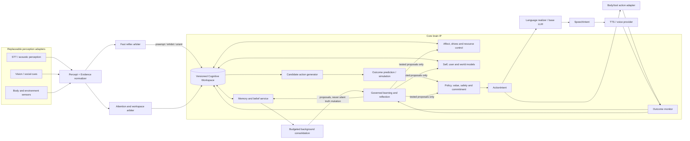

# Brain Architecture Report

## 1. Executive Verdict

AI_friend is a substantial **affective conversational-agent architecture**, not yet a general humanoid brain. Its code-real strengths are persistent social-affective state, a multi-store memory system, explicit fast/slow/background paths, deterministic policy around an LLM, turn-scoped interruption handling, and a typed brain-to-speech expression channel. These mechanisms are causally connected: internal state changes retrieval breadth, goal utilities, generation settings, proactive behavior, and acoustic expression. That is materially more than a persona prompt wrapped around chat completion.

The central architectural deficit is the absence of one authoritative, versioned cognitive workspace containing current focus, competing percepts, active goals, beliefs, uncertainty, pending actions, and predicted outcomes. Today those responsibilities are fragmented across `BrainAgent` fields, `SessionState`, `StateService`, the conversation store, NATS queues, memory surfacing, and prompt assembly. Consequently, the system has salience gates but not general attention; a knowledge graph but not a predictive world model; an identity plus affect but not a unified self model; and response-goal scoring but not general action selection.

The recommended direction is evolutionary: preserve the mesh, affective state, memory machinery, identity policy, interruption loop, and provider-neutral LLM surface; wrap them around a single cognitive-workspace contract and an explicit candidate-action/outcome-selection loop. The strongest research thesis is a **cross-timescale affective control plane** whose state measurably regulates attention, retrieval, policy, language realization, and expression while learning from outcomes under provenance and rollback controls. More biologically named variables, free-running “dreams,” proprietary TTS, and a giant learned video world model are distractions until that loop is causally demonstrated.

Classification shorthand used throughout:

- **CURRENT** — implemented and on a live runtime path.
- **PARTIAL** — code exists, but integration or capability is incomplete.
- **PROPOSED** — recommended here, not implemented.
- **RESEARCH-GROUNDED** — supported by cited research or credible engineering precedent.
- **SPECULATIVE** — plausible but not adequately validated.

## 2. Repository State Examined

The audit examined the repository `/Users/aniketsaha/Projects/AI_friend` on 2026-09-03, branch `main`, at full commit `bb5be86ba7c14ab7f8afa056707597a37d3bdd86`. The checkout contained user-owned untracked `HUMANOID_BRAIN_REDTEAM_PROMPT.md`, `HUMANOID_BRAIN_RESEARCH_PROMPT.md`, and (appearing during this audit) `HUMANOID_BRAIN_RESEARCH_REPORT.md`; none was modified. Only `BRAIN_ARCHITECTURE_AUDIT_PROMPT.md` is replaced by this report.

Recent architecture-relevant history includes the pipeline/memory complexity split (`bb5be86`), typed speech expression and its Rust contract (`b1096f5`, `7289748`, `b9718cc`), provider/model-role and deterministic-policy work (`19dac99`, `4f7dcdd`, merge `9476c71`), session/revision/provenance work (`f368eb9`, `0ebb0c3` in the ledger history), and governed-learning scaffolding (`cfd15ae`, `4faee7e`, `19191cb`, merge `da15515`). Commit messages were treated as discovery aids only; code, configuration, tests, and [the engineering ledger](.agents/CONTEXT.md) drove conclusions.

Areas inspected included:

- Runtime and deployment: `docker-compose.prod.yml`, `docker-compose.infra.yml`, `backend/Dockerfile*`, `backend/app/main.py`, agent entry points, NATS provisioning and delivery policies.
- Brain: `backend/app/cognitive/`, `backend/app/state/`, contracts, configuration, provider clients, persona data, and Rust cognitive kernels.
- Periphery: Rust STT and voice agents, LiveKit transport, Python vision capture/appraisal/reflex code, and frontend integration contracts.
- Evidence: 1,837 Python tests, 179 Rust tests, `backend/evals/`, `backend/scripts/bench_latency.py`, pytest-benchmark outputs, subject-wiring and delivery-semantics diagnostics, and recent measured-evaluation entries in the ledger.

Current local verification was clean when allowed to bind loopback sockets: **1,837/1,837 Python tests passed**, **179/179 Rust tests passed**, Ruff passed, delivery declarations matched stream policies, and every observed subject was either connected or explicitly allowlisted. In the default sandbox, 8 Python NATS-account setups and 13 Rust mock-server/NATS tests could not bind ports; rerunning with socket access proved these were environmental rather than assertion failures.

The architecture snapshot near the start of `.agents/CONTEXT.md` has some drift: it calls vision commented out, while current Compose includes it behind the opt-in `vision` profile; it describes the Rust voice agent as ONNX-local with SoVITS fallback, while current synthesis is substantially GPT-SoVITS-shaped. The root README and several old architecture documents were deliberately removed by `728e92d`. Therefore the current sources of truth before this report were code, contracts, Compose, tests, and the ledger—not a stable standalone architecture document.

## 3. Current Architecture

### 3.1 Deployed process topology

`docker-compose.prod.yml` defines Python `signaling`, `brain_agent`, `system_agent`, `subconscious_agent`, `surfacing_agent`, and `transport_agent`; Rust `stt_agent` and `voice_agent`; an opt-in Python `vision_agent`; and the frontend. `docker-compose.infra.yml` supplies NATS JetStream, Postgres/pgvector, Neo4j, Redis, LiveKit, optional Ollama, GPT-SoVITS, and Qdrant.

Cross-process coordination is event-driven through NATS rather than in-process agent calls. [`Topics` and `TOPIC_DELIVERY`](backend/app/contracts.py) declare 24 typed subjects and whether each is durable or best-effort. `backend/app/nats_streams.py` maps messages to a week-scale file-backed stream and audio to a minutes-scale memory-backed stream. `BaseAgent.subscribe` acknowledges after a callback completes; cognitive chat handling uses an ack-progress heartbeat because a turn may outlive JetStream's default wait. `BaseAgent.publish` can still fall back from JetStream to core NATS unless a caller forbids it, so declared durability is a target semantic, not an absolute guarantee at every call site.

### 3.2 Brain organization

The conversational brain is `BrainAgent` plus `CognitiveService`. `CognitiveService.initialize` constructs provider-neutral LLM access, identity, state, perception, appraisal, decision, action, reflection, memory, conversation history, and working-memory dependencies. `CognitivePipeline.execute` then sequences a turn. Despite an old “pure pipeline” description, the pipeline performs I/O, starts tasks, mutates and persists state, calls models, and emits mesh signals. It is transport-neutral, but not functionally pure.

The internal organization is hybrid:

- **CURRENT:** deterministic appraisal, behavior-tree routing, MAUT-style response-goal scoring, fixed boundary/backchannel responses, identity validation, and grounding checks.
- **CURRENT:** LLM semantic drift appraisal, optional intent classification, response realization, self-correction, and reflection.
- **CURRENT:** separate background state decay, memory surfacing, consolidation, proactive thought, “monologue,” dream, and rest-replay loops.
- **PARTIAL:** structured `BehaviorDecision`, `SessionState`, `SpeechExpression`, learning review, model capability manifests, and adapter records exist, but do not yet form a closed, authoritative brain state or deployment-learning loop.

The retired Python STT/voice packages are vestigial (`backend/app/stt/` and `backend/app/voice/` contain no active agent implementation); current Compose runs the Rust crates. Vision is experimental/optional rather than deprecated. Model manifests and adapter records are implemented scaffolds rather than configuration-backed runtime selection or adaptation.

### 3.3 State and persistence

`AgentState` is a slotted dataclass holding PAD affect, Marsh-style trust components, attachment, fatigue, interaction counters, user mental-model fields, persona baselines, and phasic/tonic control signals. `StateService` owns mutations under `_state_lock`, persists to Postgres or SQLite plus Redis, mirrors through Neo4j, and broadcasts state snapshots. Brain and subconscious processes each maintain a local `StateService` and reconcile by revision/writer metadata.

This is **PARTIAL single ownership**. Mutation within a process is serialized, but there is no distributed authoritative writer or persisted restart epoch. Equal-revision writes from different processes have no principled winner, and a restarted writer can emit lower revisions that peers reject as stale. Tests intentionally document both hazards.

Persistent knowledge spans:

- Postgres/SQLite: messages, memories, current/archived traces, state, working state, and adaptive weights.
- Qdrant: optional vector acceleration.
- Neo4j: entities, social/semantic relationships, state mirror, and spreading-activation topology.
- Redis: state/working-memory acceleration and ephemeral coordination.
- Persona/config store and identity snapshots: narrative identity and evolved traits.

### 3.4 Provider boundaries

`backend/app/llm/__init__.py` defines an `LLMClient` protocol (`generate_stream`, `generate`, `describe_image`, health, close) and a factory for Ollama or Anthropic. Production brain, background, and vision call sites use the factory. The eval harness intentionally constructs `OllamaClient` directly because model unload/reload and warm-up are part of its reproducibility control. This is a good **CURRENT** provider seam, although only two providers are implemented and the model-capability manifest is not consumed by runtime routing.

Voice is less independent. Cognition sends typed `ChatOutput` plus `SpeechExpressionWire`, but the Rust renderer directly models GPT-SoVITS URLs, reference clips, request fields, retry behavior, and health probing. There is no TTS provider trait or expression compiler. Vision is closer to replaceable at the model boundary because it calls `LLMClient.describe_image`, but its output schema is mostly free-text description rather than a stable percept contract.

## 4. Runtime Cognitive Flow

### 4.1 User utterance to speech

1. `TransportAgent` reads LiveKit PCM and publishes best-effort `audio.inbound`.
2. Rust `stt-agent` performs resampling, Silero VAD/end-pointing, and two-speed perception. SenseVoice, when available, produces fast transcript/emotion/event metadata on `audio.perception`; Whisper produces the accurate final `chat.input`.
3. `BrainAgent._on_chat_input` validates `ChatInput`, supersedes an older in-flight generation if needed, attaches cached acoustic/visual/state context, and starts `_process_chat_input_flow`.
4. `CognitiveService.process_event` enters `CognitivePipeline.execute`.
5. The pipeline creates and persists a per-turn `SessionState`; resolves any speculative interruption conflict; builds a `CognitiveEvent`; runs deterministic appraisal plus an asynchronous System-2 semantic appraisal; applies appraisal to persistent state; updates a lightweight user mental model; and calls `DecisionService.decide`.
6. `DecisionService` first checks deterministic boundary/backchannel outputs, then greeting or heuristic/optional-LLM intent classification, scores five conversational goals (`ENGAGE`, `COMFORT`, `INFORM`, `TEASE`, `PROTECT`), and routes through a behavior tree. It returns an `ActionPlan` containing a typed `BehaviorDecision` and realization policy.
7. `ActionService.execute` retrieves memories, builds persona/state/visual/ToM context, maps cortisol/dopamine/fatigue into generation options, and streams the selected LLM. Its incremental parser holds partial `<thought>` tokens across chunk boundaries, strips control markup, checks claims and identity boundaries, and may run a self-correction retry.
8. `BrainAgent._stream_to_speech` segments visible text, derives affect and `SpeechExpressionWire`, and publishes chunked `chat.output` with a completion signal.
9. Rust `voice-agent` chooses an emotion reference, interprets expression timing and APRA trajectory, calls GPT-SoVITS, performs gain/crossfade/reverb processing, and publishes `audio.stream` plus viseme/progress metadata.
10. `TransportAgent` plays PCM into LiveKit and reports playback progress/backlog, allowing cognition to distinguish generated words from words actually heard.

Memory primarily influences this path by becoming context for language realization. It does not yet regularly change the selected action or response goal. This is a critical difference between memory-aware speech and memory-driven cognition.

### 4.2 Environmental and visual percepts

The opt-in `VisionAgent` captures screen or camera frames. `VisualAppraisalService.appraise` rate-limits a VLM call, rejects habituated low-change frames using a 16×16 visual vector, and publishes `vision.description` with source, distance, and novelty. `BrainAgent._on_vision_description` caches it as `Evidence` and may learn a somatic comfort association. The next chat turn includes the description in action context. `SubconsciousAgent._on_vision_description` persists only novel, affectively salient camera observations; screen observations go to a separate TTL trace table.

Camera frames also run a MediaPipe blendshape reflex path. `score_blendshapes` produces structured smile/brow/startle signals. `BrainAgent._on_facial_reflex` can release dopamine for smiles, update affect, or emit immediate `audio.stop` for a startle. That fast signal changes later state, so it is more than a display-only reflex.

Other environmental events are not normalized into a common percept. Acoustic metadata, visual descriptions, facial reflexes, chat, playback, and presence each have separate schemas and handlers. **Unified multimodal perception is PARTIAL.**

### 4.3 Fast reaction and interruption

Fast partial STT may publish a speculative duck/stop hypothesis before accurate transcription finishes. The final transcript is the arbiter. `CognitivePipeline._resolve_turn_conflict` either emits `audio.resume` for a rejected hypothesis or a turn-scoped confirmed `audio.stop`. `BrainAgent` cancels the superseded generator and truncates the stored assistant reply at the acknowledged playback position. `voice-agent` and `TransportAgent` use turn IDs/generations to discard stale audio. A confirmed interruption releases adrenaline; later affect and voice expression therefore retain a causal trace of the event.

The path is genuinely latency-oriented and mostly bypasses the LLM. However, it is specialized turn-taking logic rather than a general reflex arbitration system. Visual startle unconditionally interrupts speech rather than competing against other goals in one attention/action framework.

### 4.4 State change, decision, and LLM ownership

Appraisal originates from deterministic text/acoustic/visual features and optional LLM semantic drift. `StateService.update_from_appraisal`, sensory/facial methods, and hormone-release wrappers serialize mutations and persistence. Decision code consumes state before generation. The LLM is therefore not the whole brain: it is a semantic classifier/appraiser in optional slow paths, a response realizer, and a reflection extractor. Deterministic code owns boundaries, state updates, the response-goal choice, retrieval algorithms, interruption arbitration, and output validation.

That separation is real but incomplete. The LLM still creates most semantic content, reflection facts, autobiographical summaries, and persona-change proposals. `BehaviorDecision` constrains language with allowed/forbidden claims, yet typed realization is opt-in and buffers a full output before parsing, trading away streaming latency. There is no general planner that simulates consequences before choosing an action.

### 4.5 Interaction end and continuing activity

`BrainAgent` publishes a done marker after a response; transport publishes `state.presence` when LiveKit participation changes. Proactive thoughts may be queued until a user is present. Database sessions have an `ended_at` field and `get_last_session_time` reads it, but no production `end_session` method/call closes a session. Brain startup begins a session, not a human's connection lifecycle. Therefore a meaningful interaction-end transition is **PARTIAL** and restart/session analytics can be misleading.

After foreground work stops:

- `system_agent` emits ticks; state decays toward baseline and fatigue changes.
- `surfacing_agent` alternates episodic and semantic surfacing.
- `subconscious_agent` consolidates paired conversation episodes, gates proactive contact, generates internal monologue, runs dream synthesis, and performs rest-phase memory replay/relinking.
- Reflection extracts graph facts, suggests persona evolution, stores an episodic summary, and decays graph links.

Two outputs are disconnected: `audio.pre_generate` has no consumer, and `state.subconscious` monologue has no subscriber. `voice.segmentation_feedback` has a brain subscriber but no Rust producer. `telemetry.reflection` and ambient-noise telemetry lack declared durable stream coverage. The diagnostics allowlist these intentionally; they must not be presented as completed capabilities.

### 4.6 Permanent storage and learning

Conversation messages are logged durably. Explicit `REMEMBER` plans call `MemoryStore.add_memory`. Reflection writes high-confidence extracted relations to Neo4j and consolidated episodes to memory. Visual salience writes camera memories or expiring screen traces. Reappraisal updates and persists appraisal weights and decision goal utilities. Persona evolution writes durable evolved-learning history before saving an identity snapshot.

This produces several kinds of adaptation, but not one unified learning system. It stores observations, changes relationship/affect state, adjusts small policy weights, mutates a bounded persona, and records model-adapter provenance. It does not autonomously train or deploy a model adapter, learn general procedures, calibrate its confidence, or evaluate whether a change improved held-out behavior.

## 5. Current Brain Capability Map

| Capability | Status | What genuinely exists | What does not yet exist |
|---|---|---|---|
| Multimodal perception | **PARTIAL** | Typed speech, acoustic affect/events, free-text visual scene, distance, novelty, facial reflexes, presence | Common percept/evidence schema, identity resolution, temporal object tracks, calibrated uncertainty |
| Attention | **PARTIAL** | Urgency, salience, novelty, affective memory gating, interrupt priority, proactive gates | Shared competition among percepts/goals; focus state; inhibition and attentional switching policy |
| Working mental state | **PARTIAL** | `SessionState`, `AgentState`, active generation/playback fields, working-memory storage | One authoritative resumable workspace; production use of turn buffer; populated active goals/pending actions |
| Long-term memory | **CURRENT** | Episodic rows, graph facts, autobiographical seeds, affect/provenance, reinforcement, forgetting, archive/promotion | Procedural memory; belief-resolution semantics; calibrated confidence; decision-policy integration |
| Emotion/mood | **CURRENT** | Persistent PAD/trust/attachment causally affects retrieval, goals, generation, pacing, proactive behavior, learning salience, and speech | Controlled behavioral evidence across the whole loop; formal appraisal/coping semantics |
| Neuromodulation-like controls | **CURRENT, SPECULATIVE** | Tonic/phasic cortisol and dopamine, phasic adrenaline, fatigue, decay and multiple downstream controls | Biological equivalence; learned mappings; serotonin/oxytocin; demonstrated system-level benefit |
| Drives | **PARTIAL** | Curiosity/self-gap records, proactive social contact, novelty and rest/resource gates | Persistent needs with error signals, goal hierarchy, conflict resolution, drive satisfaction tracking |
| Self model | **PARTIAL** | Narrative identity, tiered persona, biography, current affect, self-knowledge gaps | Unified capabilities/limitations/goals/action history/confidence model |
| World model | **PARTIAL** | Entities/relations and latest scene description | Explicit current environment state, dynamics, causal transitions, affordances, action-conditioned predictions |
| Reasoning | **PARTIAL** | Deterministic appraisal/policy, optional semantic reasoning, LLM realization/reflection, self-correction | Inspectable multi-step problem model, uncertainty-aware planning, consequence simulation |
| Decision making | **PARTIAL** | Five response goals, MAUT scoring, behavior-tree selection, deterministic policies | General candidate actions such as wait/observe/act/update belief; predicted outcomes; resource constraints |
| Fast reactions | **CURRENT** | VAD/partial STT interruption, deterministic boundary/backchannel, facial startle, turn fencing | General reflex registry and arbitration with slow cognition |
| Background cognition | **PARTIAL** | Decay, surfacing, consolidation, proactive contact, replay, dream/monologue generation | Consumer for monologue; epistemic separation of imagination; incremental-value evidence |
| Social cognition | **PARTIAL** | Persistent trust/attachment, user affect/goals/concepts, relation graph, some ToM prompt context | Robust multi-person identity, persistent belief attribution, longitudinal partner-model evaluation |
| Metacognition | **PARTIAL** | Grounding/identity self-correction, contradiction links, self-knowledge gaps, proposal review objects | Calibrated confidence, durable review workflow/UI, failure attribution, automatic rollback based on evidence |
| Continual learning | **PARTIAL** | Memory reinforcement, relationship learning, adaptive weights, bounded persona changes | General rule/procedure learning, replay-safe policy learning, anti-forgetting validation before every update |
| Personality/identity | **CURRENT, PARTIAL** | Immutable/constitutional/adaptive tiers plus narrative identity and deterministic boundaries | Cross-provider stability demonstrated; single integrated identity representation |
| Imagination/simulation | **SPECULATIVE** | LLM “dream” synthesis from graph entities | Predictions kept separate from facts; counterfactual rollouts used for action selection |

## 6. Memory Architecture

### 6.1 Stores and lifecycle

`MemoryStore` is the largest and highest-risk module in the brain. It treats Postgres or SQLite as the authoritative row store, Qdrant as an optional vector accelerator, Neo4j as an entity/relationship graph, `MentalLexicon` as learned associative cues, and an in-process L1 cache as a bounded TTL accelerator. A small `GoalBuffer` keeps query terms active across searches.

`add_memory` computes embeddings through local Ollama, prelinks graph entities, reinforces exact duplicates, checks simple contradiction candidates, writes the row, updates Qdrant, and feeds the learned lexicon. Rows can carry content and raw content, wing/room, importance, affect/valence, certainty, source, recall count/timestamps, speaker, record type, validity interval, contradiction link, modality, and Eriksonian metadata.

`search_memories` combines L1 cache, vector/SQL candidates, ACT-R-inspired base activation and spacing, effective semantic similarity, mood/stress gating, direct lexical cues, pronoun-aware identity cues, personalized PageRank spreading activation, the goal buffer, and archived-memory promotion. `apply_actr_decay` shields new memories, lowers importance, moves decayed records into an archive, deletes or retains them under tiered TTL rules, and allows high-importance records to persist indefinitely.

### 6.2 Memory types

- **Working memory — PARTIAL.** `WorkingMemoryStore` has Redis/SQLite turn and state-variable APIs; `SessionState` is the first production writer. `add_turn/get_recent_turns` and `load_session_state` are tested but have no production caller. Foreground working context is reconstructed from several objects each turn.
- **Short-term interaction memory — CURRENT/PARTIAL.** `ConversationHistoryStore` logs turns and supplies recent context, while active generation/playback lives in agent fields. It is useful but not a bounded cognitive workspace.
- **Episodic memory — CURRENT.** Conversation episodes and salient visual observations are consolidated into narrative memories with affect and provenance. The narrative is LLM-generated and therefore can distort source events.
- **Semantic memory — CURRENT.** Neo4j facts/relations and associative lexical cues are queried during surfacing and retrieval.
- **Procedural memory — ABSENT.** Behavior trees and rules are authored code, not experience-learned procedures.
- **Autobiographical memory — CURRENT/PARTIAL.** Authored biography is seeded and reflections create first-person summaries. There is no integrated timeline with source reliability, capability history, or explicit self/other separation.
- **Social/relationship memory — CURRENT/PARTIAL.** Trust/attachment live in state; people/preferences/relations live in graph and memory rows. User scoping and multi-person resolution are weak.
- **Emotional association — CURRENT.** Memory stores affect and retrieval changes with current affect/stress.
- **Learned preferences — PARTIAL.** Repeated facts and somatic comfort associations can be learned. There is no explicit preference-belief lifecycle or confidence calibration.
- **Learned rules — ABSENT.** Adaptive weights are narrow numeric tuning, not symbolic or procedural rule induction.

### 6.3 Correctness and cognitive role

The strongest aspects are hybrid retrieval, explicit provenance fields, archive/promotion, novelty suppression, reinforcement, and retrieval conditioned on internal state. The main weaknesses are semantic rather than storage-related:

1. `certainty` is persisted and returned but does not materially enter ranking.
2. Contradictions are linked through `contradicts_id`; there is no belief adjudication, supersession, or validity-aware query policy.
3. Reflection uses model-reported confidence greater than 0.8 as if calibrated.
4. Search failures normally degrade to an empty result, which preserves availability but makes “no memory” ambiguous with “memory system failed” unless telemetry is inspected.
5. Retrieved memory chiefly shapes the LLM prompt; it rarely changes goal/action selection.
6. Dream-generated content can enter long-term memory with a source label but without an epistemic class that prevents it from later competing with observations.

The target is not another database. It is an explicit belief/experience layer above these stores: immutable source events, derived beliefs with confidence and validity, imagined hypotheses that cannot masquerade as observations, and causal links showing which memory changed which decision.

## 7. Emotional and Neuromodulatory Architecture

### 7.1 Emotion is causally active

The system's affect is not merely an output label. Deterministic and semantic appraisal update PAD, trust, and attachment. These values then affect:

- memory candidate breadth, mood congruence, and stress-related memory-resource level;
- MAUT response-goal utilities and relational stance;
- persona/mood directives and conversational pacing;
- proactive-contact eligibility;
- reflection salience;
- LLM temperature, `top_p`, and response-token budget;
- structured speech affect, breath, hesitation, rate, pitch, and volume;
- interruption aftermath through adrenaline.

That earns **CURRENT** status as an engineered affective control architecture. It does not establish that the variables correspond to human emotion or improve perceived humanness.

### 7.2 Control-signal mechanics

`AgentState` derives cortisol tonic level from inverse valence plus fatigue and dopamine tonic level from positive valence/arousal. Both add decaying phasic bursts; adrenaline is phasic-only and raises effective arousal. Releases occur through locked `StateService` wrappers so peaks are measured against a coherent tonic floor. The shipped persona-profile defaults are 90 seconds for dopamine, 4,500 seconds for cortisol, and 120 seconds for adrenaline; authored personas may select bounded constitutional values. Bursts are deliberately not persisted because their meaning expires on the scale of a restart.

Sources include reward-prediction error, somatic comfort, and smiles for dopamine; negative prediction error and self-correction stress for cortisol; and confirmed interruption for adrenaline. Fatigue changes with activity, time, and rest. No serotonin or oxytocin mechanism exists.

The mappings are hand-designed. Tonic cortisol and dopamine share valence-derived structure, so phasic components carry most ability to represent concurrent stress and reward. `ActionService._compute_endocrine_options` treats cortisol as narrower temperature, dopamine as wider nucleus sampling, and fatigue as a shorter completion. Memory and APRA expression use additional formulas. These are testable control policies, not hormones in a biological sense.

### 7.3 Evidence and limitations

Unit and Rust parity tests prove formula execution, bounds, decay, and local downstream differences. They do not prove useful whole-system behavior. There is no factorial intervention showing that identical percepts under controlled internal states produce appropriately different attention, memory, action choice, learning, and human-rated expression. No mapping was learned from behavior. The scientific status is therefore **CURRENT implementation, RESEARCH-GROUNDED inspiration, SPECULATIVE benefit**.

The correct next step is intervention-based validation and simplification. Retain a signal only if ablation shows incremental value beyond PAD/fatigue. Do not add more named neuromodulators until a missing control dimension and measurable behavior require one.

## 8. Reasoning, Decisions and Fast Reactions

### 8.1 Reasoning layers

The fast layer includes VAD/end-pointing, speculative interruption, deterministic boundary responses, canned backchannels, greeting heuristics, facial reflex thresholds, and fixed appraisal features. The slow layer includes optional LLM intent classification, semantic appraisal drift, response realization, grounding retry, and reflection. The background layer includes consolidation, surfacing, decay, replay, and proactive generation.

There is no wake-word subsystem in the active Python/Rust runtime found by this audit. Voice activation is based on continuous LiveKit audio plus VAD/end-pointing.

Internal state influences all three layers, and foreground generation is cancellable. This is a credible **CURRENT fast/slow/background decomposition**. It is not equivalent to human dual-process cognition: the categories are engineering latency/policy lanes, not evidence of human cognitive mechanisms.

### 8.2 Decision semantics

`DecisionService.decide` produces `ActionPlan`; `_build_communicative_intent` creates `BehaviorDecision` with speech act, response goal, urgency, relational stance, interruption policy, and claim constraints. `_score_goals_maut` considers five conversational goals and persists small utility adaptations. A behavior tree chooses social response, reflection, or storage branches.

The action space is still narrow. It does not normally enumerate and compare `answer`, `ask`, `wait`, `observe`, `retrieve`, `update belief`, `change goal`, `perform tool/physical action`, and `stay silent` using predicted consequences. Memory retrieval happens inside response execution rather than being selected as an action. LLM language and policy are more separated than in a normal chatbot, but semantic wording still carries much of the behavior.

The `BACKGROUND_CONSOLIDATION` decision branch is effectively disconnected: `PerceptionService` maps `SYSTEM_TICK` to `REFLECT`, but production ticks are handled directly by state/background agents rather than passed through the foreground pipeline. This illustrates why implemented branches must be traced to callers.

### 8.3 Fast-path continuity

The best fast-path property is that reflexes alter later cognition. A barge-in changes stored conversation at the playback boundary and releases adrenaline; a smile can release dopamine; acoustic affect enters appraisal. The main architectural debt is separate arbitration: audio conflict, visual startle, deterministic response, and NATS delivery priority each use bespoke logic. A future reflex arbiter should emit the same `ActionCandidate` contract as slow cognition, with safety preemption and a workspace update, while retaining present latency.

## 9. Learning and Metacognition

### 9.1 What “learning” means in this repository

The current code contains several distinct adaptation mechanisms that should not be conflated:

| Mechanism | Status | Persistent change |
|---|---|---|
| Conversation/episodic memory | **CURRENT** | Stores events and generated summaries for later retrieval |
| Semantic/social learning | **CURRENT/PARTIAL** | Reinforces graph facts and relationships; contradictions are linked, not resolved |
| Relationship learning | **CURRENT** | Updates trust, attachment, interaction history, user affect/goals/concepts |
| Memory-policy adaptation | **CURRENT/PARTIAL** | Recall reinforcement, learned lexicon, goal buffer, archive promotion |
| Appraisal/policy reinforcement | **CURRENT/PARTIAL** | Persists small reappraisal-weight and response-goal utility changes from proxy outcomes |
| Persona evolution | **CURRENT/PARTIAL** | High-confidence LLM proposals can add bounded adaptive traits and relationship changes |
| Review/rollback governance | **PARTIAL** | In-memory proposal queue, approval/rejection API at class level, previous-value metadata |
| Adapter provenance | **PARTIAL** | JSON `AdapterRecord` and eval report attachment; no trainer, activation, or automatic rollback |
| Model fine-tuning | **PROPOSED** | No in-repository experience-to-training-to-deployment loop |
| Procedural/rule learning | **ABSENT** | No learned general behavior programs or rules |
| Code/config change | External engineering | Not autonomous cognitive learning |

### 9.2 Reflection path

`ReflectionService._consolidate` ranks episodes by arousal/cortisol, builds an interaction summary, extracts facts/ToM observations, proposes persona changes, writes an episodic summary, and decays the relation graph. Facts pass schema/safety checks and a model-stated confidence threshold. The per-turn brain path injects its active `IdentityManager`, so accepted changes can affect replies. `SubconsciousAgent`, however, constructs a standalone reflection path whose fallback identity is deliberately local/default; background reflection may therefore update graph/memory while its persona changes do not share the foreground identity owner.

When `LEARNING_REVIEW_REQUIRED=false`—the default—high-confidence persona suggestions apply automatically. When true, they enter a `LearningReviewQueue` held only in process memory. No runtime API, UI, durable store, or operational worker exposes the queue. A crash loses proposals. This is **software governance scaffolding**, not yet a complete metacognitive review system.

### 9.3 Metacognitive capabilities

The system can detect ungrounded user-memory claims, unknown self claims, persona-boundary violations, malformed structured realization, and some contradiction candidates. It can retry generation and record self-knowledge gaps. Evals preserve raw versus post-processed output, model/config/prompt provenance, and refuse incomparable reports. These are valuable **CURRENT** monitoring and self-correction mechanisms.

They do not yet amount to calibrated self-knowledge. Confidence is usually model output, not measured probability; contradiction detection uses shallow polarity/entity cues; no type-2 metric tests whether confidence discriminates correct from incorrect cognition; and rollback is not automatically tied to held-out regression. Reflection has no explicit causal trace from proposed update to later improvement.

The eval harness is strong at what it claims: deterministic LLM-boundary probes, provenance, model reset/warm-up, single-turn identity/boundary tests, and multi-turn recall under controlled context strategies. It does not validate the complete event-driven brain. Current external evidence in the ledger is sobering: a real home-GPU `phi4-mini` action-path run scored 38/42 but both recall probes failed, 13/28 character-pressure responses showed generic therapy/customer-service register, and the teacher-quality gate was closed as failed. A later `phi4-mini` versus `llama3.2:3b` action comparison also failed because the latter regressed on prompt disclosure and values recall. These results support keeping policy and identity outside the base model; they do not prove provider-independent personality yet.

## 10. Self, Personality and Social Cognition

### 10.1 Identity ownership

Identity is more than one prompt. `PersonaProfile` assigns authored traits to enforceable tiers: immutable safety rules are code-owned rather than accepted from persona files, constitutional temperament is fixed after creation, and adaptive fields may evolve within bounds. Strict authored-file loading fails as a whole, while deployment-config loading clamps with warnings. `IdentityManager` hydrates narrative personality/history, seeds biography, renders the system prompt, validates output, persists evolved learnings, and caps adaptive traits.

Deterministic boundaries and `PersonaPolicy` keep some identity behavior outside the model. The LLM factory makes generation provider-neutral at call sites. This is a strong **CURRENT** basis for brain-owned identity.

Identity remains **PARTIAL** because numeric temperament, narrative identity, current affect, biography, relationship history, and self-knowledge gaps are separate representations assembled at prompt time. The runtime model manifest is unused for capability-based routing. Cross-provider eval has found model-specific register, prompt leakage, formatting, and biography fabrication. Stable identity across Ollama and Anthropic—or across voice providers—has not been demonstrated.

### 10.2 Self model

The system knows its authored values, boundaries, relationship framing, biography, current affect/fatigue, and some gaps in self-knowledge. It retains previous interactions and can revise adaptive traits. It does not keep one explicit model of capabilities, limitations, current focus, active goals, action history, predictions, errors, and uncertainty. `AgentState.active_goals` exists as a field but has no meaningful production writer. The result is a persistent persona and organism state, not yet a unified operational self model.

### 10.3 Social cognition

Persistent trust, attachment, interaction count, inferred user valence/arousal, implied goals, known concepts, graph relations, somatic comfort, and recent history all influence replies. The `LLMIntentClassifier` always runs a heuristic first and can enrich it through an LLM; although its backend default is `llm`, current Compose and `.env.example` default `LLM_INTENT_CLASSIFICATION_ENABLED=false`, so rich intent inference should not be assumed in the deployed default. `user_beliefs` and belief-discrepancy utilities appear in tests but lack a production writer and durable state path.

This is meaningful relationship modeling, but robust theory of mind is **PARTIAL**. There is no reliable multi-person identity resolution, nested belief representation, belief revision, social prediction benchmark, or evidence that the partner model improves longitudinal action choice. Language-only false-belief success would be insufficient; the relevant test is whether a persistent user model improves predictions and behavior with a real partner.

## 11. Voice Architecture

### 11.1 Current pipeline

Rust `stt-agent` owns audio normalization, VAD/end-pointing, Whisper transcription, optional SenseVoice emotion/event tags, partial hypotheses, and user voice-property estimates. The Python brain owns turn arbitration, communicative content, state, and chunking. `SpeechExpression` and `SpeechExpressionWire` carry affect label, breath, hesitation, style, and time-indexed `(offset, rate, pitch, volume)` APRA frames. Rust `voice-agent` owns acoustic synthesis, emotion-reference selection, pause/vocalization rendering, retries, circuit breaking, overlap/crossfade, reverb, playback metadata, and visemes. `TransportAgent` owns LiveKit I/O.

This is already close to the strategic split “brain chooses meaning and expression; voice renders audio.” The interruption and progress feedback loop is particularly valuable because the brain records what the user actually heard.

### 11.2 Boundary defects

The current speech intent is incomplete:

- `derive_speech_expression` explicitly discards its `intent` argument, and `BrainAgent._derive_expression_wire` passes `None`; typed communicative urgency, confidence, social stance, emphasis, and interruption intent do not reach voice.
- Expression may arrive both per chunk and through `agent.voice.modulation` emitted by surfacing/state paths, creating unclear temporal ownership.
- Legacy inline pause/hesitation/breath markers remain alongside structured expression. The Rust consumer prioritizes structured data, but cognition still carries provider/rendering concerns in text.
- Typed realization can isolate spoken text and claim IDs, but it is optional and currently buffers the whole model output.
- `voice-agent` is directly coupled to GPT-SoVITS endpoint shape and reference-audio semantics. No provider-neutral TTS protocol or per-provider expression compiler exists.
- `audio.pre_generate` is published but has no voice consumer; `voice.segmentation_feedback` is subscribed by brain but has no producer.

### 11.3 Recommended brain-to-voice contract

Define a versioned **PROPOSED `SpeechIntent`** owned by the brain:

```text
SpeechIntent {
  turn_id, semantic_text, speech_act, conversational_objective,
  affect {valence, arousal, dominance, label, intensity},
  relationship_context {stance, familiarity, interpersonal_distance},
  delivery {urgency, confidence, uncertainty, style, rate, pitch, volume},
  timeline [{kind: text|pause|emphasis|vocalization, span, parameters}],
  interruption_policy, pronunciation_hints, locale, safety_constraints
}
```

The brain should not name GPT-SoVITS reference clips or ElevenLabs/Sarvam settings. A voice adapter compiles this provider-independent intent to provider controls, reports supported/lost dimensions, streams audio, and returns start/progress/end/interrupted events. Provider capability negotiation prevents silent degradation. The existing `ChatOutput`/`SpeechExpressionWire` can evolve into this without rewriting cognition.

ElevenLabs publicly exposes controls such as stability, similarity, style, speed, and streaming, illustrating that a compiler can map a subset of brain expression to a specialist API. Exact Sarvam control coverage is **Unknown from available evidence** from the sources reviewed; the architecture must tolerate different capability sets rather than target one vendor.

## 12. Vision Architecture

### 12.1 Current pipeline

`VisionAgent` is opt-in via the `vision` Compose profile. `ScreenLink`/`CameraLink` capture JPEG frames. `VisualAppraisalService` uses provider-neutral `describe_image`, rate limiting, a circuit breaker, cached results, and simple pixel-change habituation. VLM appraisal pauses during foreground turns to limit local GPU contention. Camera-only MediaPipe facial reflexes generate structured, low-latency smile/brow/startle signals. Brain estimates user distance from face width, caches the latest scene as `Evidence`, and can turn learned proximity comfort into dopamine. Subconscious vision storage is novelty- and affect-gated.

### 12.2 Architectural assessment

Vision does feed cognition rather than directly chaining a vision model's prose into another model unseen: the description crosses a typed `VisionDescription` message, becomes brain evidence, and is included with explicit provenance. Facial reflexes are structured and affect state. Underlying VLM replacement is possible through `LLMClient.describe_image`.

The representation is still **PARTIAL**. It carries mainly description, source, distance, novelty, and timestamps. It lacks stable entities, person identity, gaze, action, object state, temporal change, spatial relations, uncertainty calibration, and links to current beliefs. A free-text description inserted into the next prompt is not a world model. Camera availability also depends on host devices and optional dependencies; current home-GPU ledger evidence says vision was intentionally disabled there.

### 12.3 Target boundary

Vision providers should produce a versioned `Percept` with observations and uncertainty, not cognition or relationship decisions:

```text
Percept {
  percept_id, modality, source, observed_at, expires_at,
  entities[], attributes[], relations[], events[],
  social_cues[], spatial_frame, confidence, provenance,
  raw_reference, novelty, quality_flags
}
```

The brain should resolve identities, bind observations to beliefs, decide attention, update the world/user model, and choose action. Provider-specific object labels and embeddings stay behind an adapter. The first target should be temporal symbolic state and uncertainty, not an expensive proprietary video foundation model.

## 13. External Research Comparison

### 13.1 Cognitive architectures and memory

**ACT-R** formalizes separate declarative and procedural knowledge, buffers, activation, and production selection ([ACT-R project](https://act-r.psy.cmu.edu/), [reference manual](https://act-r.psy.cmu.edu/actr7.x/reference-manual.pdf)). AI_friend borrows activation/spacing language and equations, but has no production-learning system or single buffer architecture. **Soar** similarly integrates working, semantic, episodic, and procedural memory with decision cycles and multiple learning mechanisms ([Soar architecture](https://soar.eecs.umich.edu/soar_manual/02_TheSoarArchitecture/)). AI_friend is stronger in affective conversational continuity, weaker in general problem spaces and learned procedures.

The LIDA/global-workspace account uses specialized processors, attention codelets, a selected broadcast, and action selection ([Baars & Franklin, 2007, DOI 10.1016/j.neunet.2007.09.013](https://doi.org/10.1016/j.neunet.2007.09.013)). Modern global-neuronal-workspace reviews emphasize selective broadcast across otherwise specialized processors ([Mashour et al., 2020/2022 PMC](https://pmc.ncbi.nlm.nih.gov/articles/PMC8770991/)). The useful engineering lesson is a common competition-and-broadcast workspace; this report makes no claim that implementing one produces consciousness.

Generative Agents showed that observation memory, reflection, planning, and retrieval each contribute to believable simulated behavior in ablations ([Park et al., UIST 2023, DOI 10.1145/3586183.3606763](https://doi.org/10.1145/3586183.3606763)). HippoRAG combines a knowledge graph with personalized PageRank for long-term retrieval ([NeurIPS 2024](https://papers.nips.cc/paper_files/paper/2024/hash/6ddc001d07ca4f319af96a3024f6dbd1-Abstract-Conference.html)). AI_friend independently has a comparable graph/PPR direction plus ACT-R-like activation and affective gating; novelty would require comparative evaluation, not similar terminology.

### 13.2 Affect, world models, learning, and metacognition

EMA models emotion as evolving appraisal and coping over a person-environment relationship ([Marsella & Gratch, 2009, DOI 10.1016/j.cogsys.2008.03.005](https://doi.org/10.1016/j.cogsys.2008.03.005)). AI_friend has causal appraisal/state effects but lacks an explicit coping/action-outcome loop and validated appraisal semantics. Neuromodulated plasticity research such as Backpropamine learns plasticity and modulation end to end ([Miconi et al., 2020](https://arxiv.org/abs/2002.10585)); AI_friend's named signals are hand-authored runtime controls, not learned synaptic neuromodulation.

Active-inference work frames perception and action around generative prediction and uncertainty ([Friston, 2010, DOI 10.1038/nrn2787](https://doi.org/10.1038/nrn2787)). Dreamer-style world models predict consequences and improve behavior by imagined rollouts; DreamerV3 reports one configuration across many domains ([Nature 2025](https://www.nature.com/articles/s41586-025-08744-2)). These are standards for what AI_friend presently lacks: action-conditioned dynamics and evaluated prediction. Active inference is a research framework, not evidence that it should be copied wholesale.

Continual-learning surveys distinguish task/data regimes, stability-plasticity, replay, regularization, and architecture changes ([Nature Machine Intelligence review, 2022](https://www.nature.com/articles/s42256-022-00568-3)); recent work shows loss of plasticity can impair continually trained deep networks ([Nature 2024](https://www.nature.com/articles/s41586-024-07711-7)). AI_friend's memory and persona mutation should not be called model continual learning. Metacognition should be evaluated by calibration/type-2 sensitivity rather than self-reported confidence ([AAAI 2025 evaluation framework](https://ojs.aaai.org/index.php/AAAI/article/view/34723), [PNAS Nexus 2025](https://academic.oup.com/pnasnexus/article/4/5/pgaf133/8118889)).

Theory-of-mind benchmarks show some language-model successes ([Strachan et al., Nature Human Behaviour 2024](https://doi.org/10.1038/s41562-024-01882-z)), while benchmark critiques warn that language tasks can overstate functional mental-state reasoning ([OpenReview benchmark critique](https://openreview.net/pdf?id=BCP8UU2BcU)). AI_friend should measure partner-specific prediction and adaptation, not claim ToM from extracted labels.

### 13.3 Embodied and humanoid systems

Developmental Autonomous Robot Architecture (DAC) work emphasizes embodied, layered control and real-world action; DAC-h3 integrated episodic/autobiographical and self/world structures on iCub ([DAC review, DOI 10.1098/rstb.2013.0483](https://doi.org/10.1098/rstb.2013.0483), [DAC-h3](https://arxiv.org/abs/1706.03661), [iCub autobiographical self](https://pmc.ncbi.nlm.nih.gov/articles/PMC5476692/)). This supports AI_friend's fast/slow/background and autobiographical direction, but also exposes the missing sensorimotor action loop.

Current commercial humanoid work is dominated by perception-to-action foundation models:

- Figure describes Helix as a slow vision-language planner feeding a fast visuomotor policy, with newer Helix 02 extending whole-body control ([Helix](https://www.figure.ai/news/helix), [Helix 02](https://www.figure.ai/news/helix-02)). These are company-reported results, not evidence of persistent affect, autobiographical identity, or social learning.
- Google DeepMind's Gemini Robotics 1.5 separates higher-level embodied reasoning/tool use from a vision-language-action controller and reports cross-embodiment transfer ([official overview](https://deepmind.google/blog/gemini-robotics-15-brings-ai-agents-into-the-physical-world/)).
- NVIDIA GR00T N1 is an open humanoid foundation model trained from human video, robot trajectories, and simulation ([NVIDIA Research](https://research.nvidia.com/publication/2025-03_nvidia-isaac-gr00t-n1-open-foundation-model-humanoid-robots)).
- 1X's public world-model work predicts future observations and task value for full-body humanoid behavior ([1X World Model PDF](https://www.1x.tech/1x-world-model.pdf)).
- Boston Dynamics reports reinforcement-learning and simulation pipelines for Atlas and collaboration with the Robotics & AI Institute ([partnership](https://bostondynamics.com/news/boston-dynamics-and-the-robotics-ai-institute-partner/), [Atlas evolution](https://bostondynamics.com/blog/atlas-evolution-from-research-robot-to-industrial-humanoid/)).
- Sanctuary AI publicly describes symbolic/logical reasoning, LLMs, simulation, and explainable plans in its Carbon/Phoenix stack ([official announcement](https://sanctuary.ai/news/sanctuary-ai-unveils-phoenix-a-humanoid-general-purpose-robot-designed-for-work/)). Technical evidence for a persistent affective self is insufficient.
- Tesla's public AI page describes vision, planning, navigation, and balance at high level ([Tesla AI](https://www.tesla.com/AI)). A detailed mental architecture is **Unknown from available evidence**.
- Apptronik is named as a Gemini Robotics hardware partner in DeepMind's material, but a detailed public cognitive architecture is **Unknown from available evidence**.

These systems are ahead in embodied perception, control, action data, and simulation. AI_friend is potentially differentiated in persistent affective/social continuity, but that claim remains uncompetitive until it has causal longitudinal evidence and a body-neutral action interface.

## 14. Current vs Partial vs Proposed vs Speculative

| Classification | Mechanisms |
|---|---|
| **CURRENT** | NATS process mesh; typed primary contracts; durable/best-effort tiers; persistent PAD/trust/attachment/fatigue; tonic/phasic control-signal decay; hybrid memory retrieval; explicit interruption/resume and playback fencing; deterministic boundaries/backchannels; response-goal scoring; provider-neutral LLM protocol; reflection and episodic consolidation; typed speech-expression transport; visual habituation and facial reflexes |
| **PARTIAL** | Distributed state ownership; `SessionState` and working-memory resume; common perception; attention; active goals/drives; world/self/user models; structured decisions; procedural learning; confidence/contradiction semantics; review/rollback workflow; adapter deployment; provider-neutral TTS; structured vision; session end; model-capability routing; background monologue and pre-generation |
| **PROPOSED** | Versioned cognitive workspace; evidence/percept envelope; unified attention and reflex arbitration; action candidates with predicted outcomes; belief/world/self models; durable governed-learning proposals; observed/inferred/imagined epistemic classes; `SpeechIntent`; TTS/VLM capability adapters; physical-action interface |
| **RESEARCH-GROUNDED** | Selective workspace/broadcast; declarative/procedural/episodic separation; appraisal-and-coping loops; graph/PPR retrieval; action-conditioned world models; continual-learning controls; metacognitive calibration; layered fast/slow embodied control |
| **SPECULATIVE** | Added benefit of biologically named control signals over simpler latent state; human-like “subconscious” monologue; dream-generated memory; consciousness implications; robust ToM; provider-invariant personality; general humanoid intelligence; patentable novelty of the present combination |

A mechanism may occupy multiple categories. For example, dopamine-like state is **CURRENT** as software and **SPECULATIVE** as a claim of cognitive benefit; the target workspace is **PROPOSED** and **RESEARCH-GROUNDED** as an architectural pattern.

## 15. Gap Analysis

Scores use 0–5: 0 absent, 1 scaffold, 2 weak/fragmented, 3 useful bounded capability, 4 strong and integrated, 5 validated general capability. “Difficulty” is relative engineering/research difficulty.

| Capability | Exists now | Code evidence | Strength | Major limitation | Target | Research support | Difficulty | Priority |
|---|---|---|---:|---|---|---|---|---|
| Perception integration | Partial | `contracts.py`; `perception.py`; brain handlers | 2 | Separate modality schemas; weak uncertainty/entity binding | Common evidence-rich `Percept` | Strong | Medium | P0 |
| Attention | Partial | pipeline conflict; salience/novelty/proactive gates | 1 | Gates/queues, no shared competition or focus | Workspace attention arbiter | Strong | High | P0 |
| Working state | Partial | `SessionState`; `WorkingMemoryStore`; agent fields | 2 | Fragmented; resume loader unused | Single versioned resumable workspace | Strong | High | P0 |
| Memory | Yes | `MemoryStore`; `GraphDB`; surfacing | 3 | Prompt-centric; confidence/contradictions weak | Evidence→belief→decision causal memory | Strong | Medium | P1 |
| Emotional state | Yes | `AgentState`; appraisal; decision/action/expression | 3 | Hand-designed; system benefit unproven | Appraisal/coping/outcome loop | Strong | Medium | P1 |
| Neuromodulation | Yes | hormone properties/releases; endocrine options; APRA | 2 | Biological names; no ablation/learned mapping | Minimal validated control dimensions | Moderate | Medium | P1 |
| Drives | Partial | proactive eligibility; curiosity gaps; fatigue/rest | 1 | Triggers, not maintained needs/goals | Homeostatic needs and goal arbitration | Moderate | High | P2 |
| World model | Partial | Neo4j; cached vision evidence | 1 | Facts are not dynamics/predictions | Temporal belief state plus transition model | Strong | Very high | P2 |
| Self model | Partial | persona, identity, state, self gaps | 2 | Multiple representations; no action/error history | Unified operational and autobiographical self | Moderate/strong | High | P2 |
| Reasoning | Partial | appraisal, decision, action, reflection | 2 | Semantic work model-owned; no consequence simulation | Structured hypotheses/plans under uncertainty | Strong | High | P2 |
| Decision making | Partial | `BehaviorDecision`; MAUT; behavior tree | 2 | Only conversational response goals | General action candidates and value/risk selection | Strong | High | P1 |
| Reflexes | Yes | STT partial stop; facial reflex; deterministic responses | 3 | Bespoke lanes; no common arbiter | Fast candidates with safety preemption | Strong | Medium | P1 |
| Learning | Partial | reinforcement, adaptive weights, persona evolution | 2 | Proxy rewards; no procedure/model loop | Outcome-linked proposals, replay, rollback | Strong | Very high | P3 |
| Metacognition | Partial | grounding, validation, review queue, eval provenance | 2 | Uncalibrated; queue not durable/operational | Calibrated confidence and governed change | Strong | High | P2 |
| Personality | Yes/partial | `PersonaProfile`; `IdentityManager`; policy | 3 | Model register leaks; fragmented representation | Behaviorally stable trait policy | Moderate | High | P1 |
| Identity | Yes/partial | immutable core; biography; validation | 3 | Cross-provider stability unproven | Provider-independent identity contract | Strong engineering | Medium | P1 |
| Social cognition | Partial | user mental model; ToM context; graph | 2 | Shallow intent/belief model | Persistent partner hypotheses and prediction | Emerging | Very high | P3 |
| Relationship modeling | Yes/partial | trust, attachment, interaction, graph relations | 3 | Coarse scalar state; weak identity scoping | Event-grounded multi-person relationships | Moderate | High | P2 |
| Imagination/simulation | Speculative | dream sequence | 1 | Generated text may pollute facts; no action use | Quarantined counterfactual rollouts | Strong for world models | Very high | P4 |
| Prediction | Minimal | VAP/reward prediction error | 1 | Narrow heuristics, not next-state prediction | Calibrated percept/action outcome models | Strong | Very high | P3 |
| Uncertainty | Partial | confidence fields, evidence, model proposals | 1 | Mostly self-report; little propagation | Typed uncertainty and calibration | Strong | High | P1 |
| Background cognition | Partial | subconscious, surfacing, ticks, replay | 2 | Disconnected monologue; uncertain incremental value | Budgeted jobs over immutable experiences | Moderate | Medium | P2 |
| Voice integration | Yes/partial | `SpeechExpressionWire`; Rust voice/transport | 3 | Intent discarded; GPT-SoVITS coupled | Provider-neutral `SpeechIntent` + compiler | Strong engineering | Medium | P1 |
| Vision integration | Partial | VLM description; facial reflex; visual memory | 2 | Free text; opt-in; weak temporal/object model | Provider-neutral structured percepts | Strong engineering | High | P2 |

## 16. Target Brain Architecture

### 16.1 Architectural shape

The target should be a body- and provider-independent cognitive kernel surrounded by adapters. It should evolve current services rather than replace them wholesale.



### 16.2 Core data contracts

1. **`Percept`** normalizes modality, time, source, entities/relations/events, raw reference, novelty, confidence, expiry, and provenance. Existing `ChatInput`, `AudioPerception`, `VisionDescription`, and `FacialReflexEvent` become adapter inputs, not competing cognitive formats.
2. **`CognitiveWorkspace`** is the single versioned owner of current focus, active user/session, recent percepts, hypotheses, unresolved questions, active goals/drives, committed/pending actions, affect/resource snapshot, and uncertainty. It replaces ad hoc reassembly while reusing `StateService` and `WorkingMemoryStore` underneath.
3. **`Belief`/`ExperienceRecord`** separates observed, user-reported, inferred, reflected, and imagined information; records derivation, validity, confidence, contradiction/supersession, and consumers.
4. **`ActionCandidate`** describes action type, goal, preconditions, predicted outcomes, uncertainty, cost/latency, urgency, social effect, and safety constraints. Speak, ask, wait, attend, retrieve, update belief, internal reflect, tool/body action, and inhibit are first-class alternatives.
5. **`ActionIntent`** records the committed action independently of wording. Existing `BehaviorDecision` is the starting point.
6. **`SpeechIntent`** is the provider-neutral expressive contract described in Section 11.
7. **`OutcomeRecord` and `LearningProposal`** connect action, prediction, observation, reward/error, affected policy/model, evaluation artifact, approval, and rollback pointer.

### 16.3 Processing lanes

- **Fast lane:** sensor-specific feature extraction and a deterministic reflex arbiter operate within bounded latency. Safety/interrupt candidates may preempt but must update the same workspace and emit an outcome record.
- **Deliberative lane:** attention selects a broadcast; candidate generators consult state, beliefs, memory, and goals; a selector compares predicted outcomes; an LLM realizes semantic intent only after commitment.
- **Background lane:** immutable experiences feed consolidation, relationship updates, uncertainty reduction, and learning proposals under CPU/GPU budgets. Background work cannot silently relabel imagined text as fact or mutate active policy without evaluation/review.

### 16.4 Persistence and concurrency

Retain NATS as replaceable transport, but put brain semantics in contracts independent of NATS. One workspace authority should serialize committed state per identity/session, persist its revision and restart epoch, and expose compare-and-swap updates. Redis may cache; Postgres/SQLite may store; Neo4j/Qdrant may index; none should define cognition. Stream delivery should be explicit per event, with idempotency keys and replay semantics for every state-changing consumer.

### 16.5 Evolution path

The change is additive: adapt current modality events into `Percept`; make `SessionState` the seed of `CognitiveWorkspace`; lift pure appraisal, goal scoring, and expression calculations out of the side-effectful pipeline; wrap current memories as evidence/beliefs; generalize `BehaviorDecision` into candidates; and add outcome traces before changing any learned policy. Existing interruption, memory, identity, and speech contracts remain useful throughout.

## 17. Core Brain IP Boundary

The durable intellectual core should be the architecture that converts evidence and persistent history into coherent, measurable behavior—not queues, databases, or a particular foundation model.

### Core brain IP

- The cognitive-workspace schema, ownership rules, attention competition, focus transitions, and replay semantics.
- The affect/drive/resource control plane and its empirically validated influence on attention, retrieval, action selection, learning, and expression.
- Memory lifecycle policy: evidence classes, consolidation, reinforcement, forgetting, contradiction/supersession, relationship binding, and causal use in decisions.
- Self, user, relationship, and world-model schemas plus their update and uncertainty policies.
- Candidate-action generation, fast/slow arbitration, outcome prediction, value/risk/safety selection, commitment, and post-action learning.
- Identity invariants, constitutional/adaptive boundaries, claim grounding, provider-independent behavioral constraints, and continuity evaluation.
- Background-cognition governance: what may run, what it may write, how imagined material is quarantined, and how proposed learning is evaluated and rolled back.
- The provider-neutral `ActionIntent`, `SpeechIntent`, `Percept`, `Belief`, `OutcomeRecord`, and evaluation contracts.
- The causal evaluation suite that proves whether these mechanisms change behavior and generalize across base models, voices, and bodies.

These policies should remain portable Python/Rust domain logic with deterministic tests and recorded provenance. The current `PersonaProfile`, `StateService`, retrieval scoring, `DecisionService`, `BehaviorDecision`, grounding checks, and expression derivation are seeds of this core.

### Replaceable infrastructure

NATS/JetStream, Postgres/SQLite, Redis, Neo4j, Qdrant, Docker/Compose, LiveKit, embedding models, metrics backends, and serialization libraries are replaceable. Their adapters must honor brain-defined consistency, provenance, latency, and delivery contracts. A graph database is not itself a world model; a vector database is not memory policy; a queue is not attention.

## 18. External Provider Boundary

### External specialist capabilities

Base LLMs, speech recognition, premium TTS/voice cloning, foundational vision, navigation, manipulation, and low-level motor control can be external specialist capabilities. They remain subordinate to brain-owned intent, state, policy, provenance, and outcome evaluation.

#### Base LLMs

External LLMs may classify semantic ambiguity, generate candidate interpretations, realize committed speech, summarize source-grounded episodes, or propose hypotheses. They must not own durable identity, current state, memory truth, safety invariants, final action policy, learning approval, or provenance. Every model call should name its role, input evidence IDs, allowed claims, output schema, model/config digest, latency budget, and fallback. `LLMClient` is the correct starting seam; the unused `ModelCapability` manifest should become capability negotiation and role routing only after tests prove the need.

#### Speech specialists

STT providers may return transcript alternatives, word timing, language, acoustic affect cues, confidence, and quality flags. TTS/voice-cloning providers may own voice identity assets, acoustic fidelity, synthesis, and supported expressive controls. They receive `SpeechIntent`, not the whole memory/persona prompt, and return audio plus rendering telemetry. A provider swap must preserve semantic intent, identity policy, relationship state, and action decisions.

#### Vision specialists

Vision providers may detect and track entities, scenes, expressions, gaze, actions, spatial relations, and uncertainty. They return `Percept`; they do not update trust, diagnose the user, or decide action. Raw media retention and identity recognition need explicit privacy policy. The core should function with a local VLM, cloud model, deterministic detector, or no vision.

#### Embodied control specialists

Future navigation, manipulation, whole-body policies, and simulation can be external skills behind a typed action interface. The brain owns why an action is selected, constraints, predicted social/task outcome, commitment, and learning record. A fast motor controller owns stability and execution details. This resembles the high-level/low-level split reported by current humanoid projects without importing their models into the identity core.

## 19. Potential Novelty

### Existing ideas implemented well

- Persistent PAD-like affect, appraisal, behavior trees, MAUT scoring, ACT-R-inspired memory activation, graph spreading activation, reflection, retrieval-augmented generation, persona constraints, and fast/slow lanes all have established precedents.
- The incremental `<thought>` parser, playback-aware interruption truncation, typed Python/Rust contracts, and provenance-gated eval comparison are strong engineering executions, not scientific novelty claims.

### Interesting combinations

- One persistent affective state influences retrieval bandwidth, response-goal utilities, model sampling, proactive contact, reflection salience, and acoustic APRA expression.
- Turn-scoped interruption joins perceptual speculation, corrective resume, generation cancellation, actual-playback memory repair, and lingering adrenaline-like state.
- A learned mental lexicon, vector retrieval, ACT-R-like activation, and PPR graph spreading are combined with mood/stress gating.
- Identity is split into code-owned invariants, authored constitutional temperament, and bounded adaptive traits while the base LLM remains replaceable.

These combinations are potentially differentiating as a product architecture, but combination alone does not establish novelty.

### Potentially novel research direction

The most defensible candidate is: **a provider-independent, cross-timescale affective control plane for a persistent social agent, evaluated through causal perturbations across attention, memory, action selection, language realization, interruption recovery, and acoustic expression.** The contribution would be the explicit control architecture, provenance-aware longitudinal protocol, and evidence that coupling improves coherence without collapsing adaptability—not the words “dopamine” or “cortisol.”

The literature reviewed contains computational appraisal, global workspaces, neuromodulated plasticity, graph memory, autonomous-agent reflection, and humanoid fast/slow control separately. It does not justify claiming that AI_friend's current combination is materially novel. A broader patent/literature search and controlled baselines are required before publication, patent, or pitch claims. Patentability is **Unknown from available evidence**.

### Unsupported novelty claims

Do not currently claim a biological brain, HNNA, consciousness, genuine hormones, general theory of mind, human memory equivalence, autonomous general learning, a predictive world model, or a complete humanoid cognition stack. “Dreaming” is LLM synthesis over random graph entities; “subconscious” names a background worker; these names do not prove biological or psychological equivalence.

## 20. Weaknesses and Architectural Debt

1. **No authoritative cognitive workspace.** State, focus, goals, interruptions, context, and pending work are scattered; `SessionState` is additive and its resume path is unused.
2. **Distributed state is not truly single-owner.** Locks protect each process, while equal revisions and restart-reset revisions remain known consistency hazards.
3. **Attention is a collection of gates.** NATS ordering, startle, VAP, salience, memory MRL, and proactive thresholds never compete in one policy.
4. **The action space is speech-centric.** MAUT selects conversational goals, not general actions under predicted consequences.
5. **The world model is nominal.** Neo4j facts and one scene caption do not encode temporal dynamics, affordances, causal transitions, or future states.
6. **Memory truth is underspecified.** Confidence barely affects use, contradictions are only linked, and observed/inferred/imagined records are insufficiently separated.
7. **Background generation can pollute memory.** Dream summaries are stored without a hard epistemic quarantine; monologue is generated and discarded because its subject has no consumer.
8. **Reflection confidence is uncalibrated.** Model-stated `0.8` controls durable facts/persona changes. Review is optional, in-memory, and not operationally exposed.
9. **Session lifecycle is incomplete.** Sessions start but are not ended in production; presence and cognitive-session boundaries differ.
10. **Identity remains model-sensitive.** Real evals show generic assistant register, fabricated biography, prompt leakage, and recall failures despite high aggregate deterministic scores.
11. **Voice intent is dropped.** Structured expression exists, but communicative intent does not reach derivation; dual modulation paths and legacy tags blur ownership.
12. **Voice provider coupling is strong.** Rust synthesis and health/retry tests encode GPT-SoVITS semantics rather than a TTS adapter protocol.
13. **Vision is prose-heavy and optional.** No temporal entity state or calibrated uncertainty reaches cognition.
14. **Some scaffolds are inert.** Model capabilities, adapter registry, `audio.pre_generate`, `voice.segmentation_feedback`, system-tick reflection branch, turn-buffer reads, and parts of belief modeling have little/no production effect.
15. **`MemoryStore` remains a 4,000-plus-line risk center.** Recent complexity extraction helps local functions, but storage, ranking, graph, archive, and migration responsibilities remain coupled.
16. **Contracts are duplicated across Python and Rust.** Tests catch current drift, but there is no single generated schema source.
17. **Durability can silently weaken.** Default publish fallback may turn a failed JetStream write into core NATS delivery.
18. **Measurement is seam-heavy.** Unit coverage is excellent; full-loop longitudinal, causal, multimodal, and human interaction evidence is much thinner.

## 21. What Not to Build Yet

- Do not add more hormone/neurotransmitter names. First ablate dopamine/cortisol/adrenaline against simpler latent controls and retain only explanatory dimensions.
- Do not train or deploy a LoRA from current outputs. The teacher gate failed, memory probes failed, and adapter infrastructure is provenance-only.
- Do not expand dream/monologue complexity. Quarantine imagined records and prove background processing improves future behavior first.
- Do not build a proprietary premium TTS or voice-cloning research program. Implement `SpeechIntent` and provider adapters; let specialists compete on acoustics.
- Do not build a large end-to-end video world model. Establish structured percepts, temporal beliefs, prediction metrics, and body-action interfaces first.
- Do not add a general consciousness/global-workspace claim. Use selective broadcast as an engineering pattern and measure attention behavior.
- Do not add a large symbolic ontology, more databases, or another memory store. Fix belief semantics and causal use of existing memory.
- Do not automate persona mutation or model-adapter adoption further until review is durable and regression/rollback is enforced.
- Do not optimize disconnected speculative pre-generation until the measured latency budget identifies it as the limiting path.
- Do not collapse all agents into one process or rewrite the mesh. First separate pure decision logic from orchestration and introduce the workspace contract incrementally.
- Do not attempt full humanoid manipulation before a body-neutral action contract and simulated outcome loop exist.

## 22. Prioritized Roadmap

Priorities below are architectural phases, not calendar estimates.

### Phase 0 — Truthful baseline and causal observability

- **Objective/problem:** make every current claim traceable to real events and outcomes before changing architecture.
- **Components:** contracts, metrics, eval provenance, session lifecycle, subject diagnostics, `BrainAgent`, `CognitivePipeline`, state and memory telemetry.
- **Ordering/dependencies:** first because later comparisons are invalid without stable identifiers, state fixtures, delivery status, and actual-playback outcomes. Depends only on current contracts.
- **Research questions:** Which current mechanisms have measurable incremental value? Where is latency spent? How often do fallback, contradiction, retry, and stale-state paths occur?
- **Risks:** telemetry volume, accidental personal-data retention, and instrumentation changing timing.
- **Success criteria:** every percept→workspace/state→decision→LLM→speech→outcome trace shares IDs; sessions end correctly; provenance distinguishes observed/inferred/generated; JetStream fallback is visible; current eval reports include a state/memory fixture hash.
- **Tests/evals:** schema/contract mutation tests, replay/idempotency tests, session connect/disconnect tests, trace completeness, privacy redaction, and a frozen baseline on at least two LLM providers/models.

### Phase 1 — Authoritative workspace and unified percepts

- **Objective/problem:** eliminate fragmented current mental state and modality-specific cognition.
- **Components:** evolve `SessionState` into `CognitiveWorkspace`; adapt `AudioPerception`, `ChatInput`, `VisionDescription`, reflex, playback, and presence into `Percept`; single workspace owner with persisted revision/epoch.
- **Why now/dependencies:** attention and action selection need one current state. Requires Phase 0 IDs and traces.
- **Research questions:** What belongs in volatile focus versus durable belief? Which percept fields generalize across voice, vision, and future body sensors?
- **Risks:** latency on the hot path, distributed-state migration, stale replay, oversized workspace.
- **Success criteria:** production resume restores correct turn/focus; concurrent updates are linearizable or deterministically rejected; active goals/pending actions are populated; every foreground decision consumes one workspace revision.
- **Tests/evals:** crash/restart and reordered-delivery experiments, multi-process property tests, percept conformance, working-set bounds, and unchanged interruption/first-audio latency within a preset budget.

### Phase 2 — Attention, reflex arbitration, and general action intent

- **Objective/problem:** move from gates plus response goals to explicit competition among percepts and actions.
- **Components:** attention candidates, focus/inhibition, shared fast reflex arbiter, `ActionCandidate`, generalized `BehaviorDecision`, selector, action commitment, wait/ask/observe/retrieve/internal-action alternatives.
- **Why now/dependencies:** requires a coherent workspace; precedes world-model learning because outcomes need explicit selected actions.
- **Research questions:** Can simple deterministic priority/value rules outperform a learned selector initially? How should social urgency trade against task/safety goals?
- **Risks:** slower reaction, oscillating focus, silence or over-interruption, opaque utility tuning.
- **Success criteria:** competing events yield deterministic, explainable focus; fast-path latency remains bounded; selected actions reference rejected alternatives and reasons; memory retrieval can change action choice, not just wording.
- **Tests/evals:** adversarial simultaneous percepts, interrupt false-positive/negative rate, focus-switch stability, counterfactual action ablations, and end-to-end latency distributions.

### Phase 3 — Belief, world, self, and relationship models with uncertainty

- **Objective/problem:** turn stored text/graph facts into temporally valid models that support prediction.
- **Components:** immutable `ExperienceRecord`, typed `Belief`, observed/inferred/imagined classes, validity/supersession, entity/person resolution, self capability/error history, temporal world state, relationship hypotheses.
- **Why now/dependencies:** explicit actions/outcomes from Phase 2 provide the transition data these models need.
- **Research questions:** What minimal symbolic/probabilistic world model improves conversational and embodied decisions? How should confidence propagate from providers and reflection?
- **Risks:** false precision, identity/privacy harm, graph migration complexity, confirmation bias.
- **Success criteria:** contradictions resolve without deleting source evidence; imagined data never answers as observed fact; next-state/user-response predictions beat recency baselines; self capability reports are calibrated.
- **Tests/evals:** temporal contradiction suites, provenance contamination tests, Brier/log-loss prediction, multi-user identity separation, relationship prediction, and self-knowledge calibration.

### Phase 4 — Close and validate the affective control loop

- **Objective/problem:** prove or simplify the project's differentiating affect/emotion architecture.
- **Components:** appraisal, affect/drives, attention weights, memory MRL, action utilities, endocrine generation options, APRA expression, outcome monitor.
- **Why now/dependencies:** the workspace and explicit outcomes permit causal interventions; doing this earlier would optimize proxies.
- **Research questions:** Which state dimensions add value beyond PAD/fatigue? Does cross-subsystem coupling improve longitudinal coherence? Can mappings be tuned without identity drift?
- **Risks:** overfitting subjective ratings, unstable feedback, manipulative behavior, anthropomorphic claims.
- **Success criteria:** controlled state interventions create predicted, bounded differences across at least attention, retrieval, action, and expression; ablations show incremental benefit; state returns to baseline; no safety or identity regression.
- **Tests/evals:** randomized factorial interventions, dose-response/decay checks, mediator analysis, human pairwise continuity ratings, and cross-model replication.

### Phase 5 — Governed continual learning and background cognition

- **Objective/problem:** make experience improve future behavior without silent corruption or catastrophic drift.
- **Components:** durable `LearningProposal`, review API, eval linkage, replay buffer, policy/relationship/persona update types, adapter registry integration, automatic rollback, background job budgets.
- **Why now/dependencies:** needs explicit evidence, actions, outcomes, beliefs, and validated affect metrics.
- **Research questions:** Which updates can be safe online? What requires human approval? How is forgetting measured per identity without leaking personal data?
- **Risks:** self-reinforcing false beliefs, reward hacking, privacy exposure, loss of plasticity, inaccessible rollback.
- **Success criteria:** approved updates improve held-out behavior; rejected changes leave no runtime mutation; every update has provenance and rollback; frozen knowledge/identity suites do not regress; background work shows positive incremental value.
- **Tests/evals:** pre/post held-out trials, shadow deployment, rollback drills, poisoning/contradiction tests, stability-plasticity curves, restart durability, and dream/monologue ablation.

### Phase 6 — Provider and embodiment portability

- **Objective/problem:** demonstrate that the brain—not a provider or body—is the product.
- **Components:** `SpeechIntent`, STT/TTS capability adapters, structured vision adapters, model-role router, body/tool action protocol, simulator connector, outcome feedback.
- **Why now/dependencies:** portability is meaningful only after the cognitive contracts and evaluation loop are stable.
- **Research questions:** Which expressive/perceptual dimensions survive provider changes? What control frequency belongs in brain versus body policy?
- **Risks:** lowest-common-denominator contracts, capability leakage, network latency, unsafe physical actions.
- **Success criteria:** two LLMs, two speech renderers, and two visual backends pass the same brain conformance suite; provider swaps preserve intent/personality within thresholds; a simulated body action closes perception→decision→action→outcome without provider-specific brain changes.
- **Tests/evals:** capability negotiation, golden intent/percept fixtures, blinded voice equivalence, structured vision accuracy/calibration, provider-failure fallback, simulation safety, and cross-provider identity comparisons.

## 23. Evaluation Framework

Every result must record code revision, model/provider digest, persona version, prompt/probe digest, state/workspace fixture, memory fixture, raw/post-processed outputs, delivery/fallback status, timing, and human-rater protocol where applicable. Use interventions and ablations, not demonstrations.

| Claim | Controlled experiment | Primary measures | Failure interpretation |
|---|---|---|---|
| Perception integration | Replay synchronized audio/vision/environment events with provider and modality ablations | entity/event F1, temporal alignment, confidence calibration, downstream decision delta | Prose reaches prompt but structured evidence is unusable |
| Attention | Present competing threat, social, task, and novelty events at controlled timing | selected focus, switch latency, priority violations, starvation, explanation consistency | Queue order or one hardcoded interrupt masquerades as attention |
| Working state | Crash/restart and concurrent-writer replay mid-turn | exact state recovery, stale-write rejection, linearizability, pending-action correctness | Workspace is not authoritative/resumable |
| Memory | Randomly include/exclude matched memories and perturb relevance while holding prompt length constant | action-choice change, response factuality, attributable claim IDs, delayed recall, false-memory rate | Retrieval changes wording only or injects unsupported claims |
| Emotion/mood | Feed identical percepts under randomized valid PAD/trust/attachment fixtures | attention, goal/action, retrieval, latency, learning, voice and human appropriateness | Affect is decorative or has uncontrolled side effects |
| Neuromodulation | Factorial dopamine/cortisol/adrenaline/fatigue interventions plus PAD-only ablation | dose response, recovery curve, incremental predictive value, safety/identity regressions | Named signals add no value or duplicate simpler state |
| Drives | Simulate long idle/social/task/resource histories with and without drive state | appropriate self-initiated actions, false contact rate, goal persistence, satisfaction decay | Proactivity is a timer/random trigger |
| World model | Predict next percept/user response/task outcome before action; compare recency and LLM baselines | Brier score/log loss, calibration, counterfactual ranking, task success | Graph storage is mislabeled as prediction |
| Self model | Ask capability/history/current-goal questions and create controlled failures | accuracy, calibration, update after outcome, resistance to fabricated biography | Persona prose substitutes for operational self-knowledge |
| Reasoning | Use tasks with hidden intermediate facts and interrupt/resume variants | plan validity, evidence use, recovery, latency/cost, outcome success | Fluent rationale without a correct structured decision |
| Decision making | Log multiple candidates and randomize safe selector components | regret, goal satisfaction, predicted-vs-actual outcome, rejected-alternative quality | Generation still owns the action |
| Reflexes | Replay partial speech/startle/noise at boundary timings | p50/p95 latency, false stop/resume, stale-action leakage, later-state trace | Fast output is brittle or disconnected from cognition |
| Learning | Apply an update to treatment identities and shadow controls | held-out improvement, retention, transfer, rollback fidelity, contamination | More stored text is called learning without behavioral gain |
| Metacognition | Require confidence before outcome reveal across known/unknown tasks | ECE, Brier, AUROC/type-2 sensitivity, abstention utility, correction precision | Model self-confidence is uncalibrated narration |
| Personality/identity | Run identical longitudinal scenarios across LLM providers/models with deterministic policy ablations | boundary pass rate, trait consistency, generic-register rate, biography fabrication, blinded pairwise identity | Provider owns identity behavior |
| Social/ToM | Maintain partner-specific hidden beliefs/preferences across sessions; compare no-user-model control | next-action/response prediction, appropriate adaptation, false attribution, persistence | Past-chat context is mislabeled as ToM |
| Relationship model | Controlled histories of reliability, rupture, repair, and multiple users | trust/attachment trajectory, user separation, behavior mediation, recovery | Scalars drift without event-grounded meaning |
| Imagination | Generate quarantined counterfactuals, then test planning with/without them | task success, prediction gain, fact-contamination rate | “Dreams” create hallucinated memory without decision value |
| Background cognition | Randomly enable consolidation/surfacing/replay per matched session | future recall/action gain, compute cost, unsolicited-output harm, contamination | Background work is activity rather than cognition |
| Speech boundary | Render the same `SpeechIntent` through local and specialist adapters | semantic equivalence, instruction coverage, first-audio latency, MOS/pairwise fit, interruption correctness | Provider settings leak into brain or intent is lost |
| Vision boundary | Run identical scenes through two vision providers into one brain | percept schema agreement, calibration, track continuity, invariant decision behavior | Free-text/provider quirks own cognition |
| End-to-end brain | Longitudinal multimodal scenario with model/provider swaps and delayed outcomes | task/social success, continuity, causal trace completeness, recovery, safety, cost | Local unit successes do not compose |

The current deterministic eval harness should remain the LLM-boundary layer. Add a mesh-level replay harness, a workspace/state fixture format, causal intervention runner, longitudinal simulator, and blinded human protocol. Report local code tests, live infrastructure tests, and external human/home-GPU evidence as separate evidence tiers.

## 24. Final Architecture Thesis

AI_friend should become a **provider-independent persistent cognitive control system for social embodied agents**. Its defining loop should be:

> normalize evidence → select attention → update a versioned workspace and belief models → generate competing actions → predict and select outcomes under identity, affect, drives, uncertainty, and safety → realize the committed intent through replaceable language, voice, vision, and body providers → observe results → consolidate or learn under provenance, evaluation, and rollback.

The project's strongest existing foundation is causal social-affective continuity joined to memory and interruption-aware expression. Its next breakthrough will not come from making the LLM larger, adding more biological labels, or building better audio. It will come from making that continuity explicit, authoritative, action-oriented, and experimentally falsifiable. The brain should own identity, state, memory meaning, attention, decisions, learning, and expression intent. Providers should supply perception, generation, speech, and motor skill without becoming the mind.

## Appendix A — Code Evidence

The references below identify the main evidence used. Line numbers refer to commit `bb5be86` and may drift later.

| Architectural claim | Source evidence |
|---|---|
| Typed mesh and delivery semantics | `backend/app/contracts.py:26-110` (`Topics`, `TOPIC_DELIVERY`); `backend/app/nats_streams.py`; `backend/app/agents/base.py` |
| Runtime process topology | `docker-compose.prod.yml:46-584`; `docker-compose.infra.yml:14-194` |
| Brain entry and lifecycle | `backend/app/agents/brain_agent.py:66-232`, `482-744`, `960-1192` |
| Cognitive composition and event processing | `backend/app/cognitive/core.py:40-136`, `262-456` |
| Ten-stage foreground orchestration and side effects | `backend/app/cognitive/pipeline.py:45-81`, `439-737` |
| Minimal percept model | `backend/app/cognitive/perception.py` (`CognitiveEvent`, `PerceptionService.perceive`) |
| Deterministic/semantic appraisal | `backend/app/cognitive/appraisal.py:66-132`, `134-377` |
| Structured decision and MAUT/BT | `backend/app/cognitive/decision.py:37-97`, `99-297`, `297-687`; `backend/app/cognitive/behavior_contracts.py` |
| Deterministic policies and optional intent classifiers | `backend/app/cognitive/deterministic_responses.py`; `backend/app/cognitive/intent_classifier.py` |
| Retrieval, realization, endocrine control, sanitization, correction | `backend/app/cognitive/action.py:390-432`, `433-848`, `858-1068`, `1179-1475` |
| Persistent organism state and locking | `backend/app/state/agent_state.py:51-447`, `448-590`, `794-1067`, `1122-1859` |
| Tonic/phasic cortisol, dopamine, adrenaline | `backend/app/state/agent_state.py:235-447`, `1461-1509` |
| Session state scaffold | `backend/app/state/session_state.py:37-90`; production call in `cognitive/pipeline.py`; test-only loader references in `tests/test_session_state.py` |
| Working-memory store | `backend/app/state/working_memory_store.py:14-301` |
| Hybrid long-term memory | `backend/app/state/memory_store.py:456-515`, `638-1549`, `1609-3699`, `3707-4468` |
| Graph relations and decay | `backend/app/state/graph_db.py:31-328`; `backend/app/cognitive/learning.py:121-235`, `367-395` |
| Reflection and persona proposals | `backend/app/cognitive/learning.py:16-75`, `236-365`, `377-402`; `backend/app/cognitive/learning_review.py` |
| Identity ownership and persistence | `backend/app/cognitive/identity.py:110-476`, `529-734`, `735-830`; `backend/app/persona/profile.py` |
| Background cognition | `backend/app/agents/subconscious_agent.py:114-229`, `319-603`, `616-837` |
| Memory surfacing | `backend/app/agents/surfacing_agent.py:35-192`, `193-636` |
| LLM provider abstraction | `backend/app/llm/__init__.py:21-82`; implementations in `ollama_client.py` and `anthropic_client.py` |
| Inert model/adaptation scaffolds | `backend/app/llm/model_manifest.py`; `backend/app/llm/adapter_registry.py`; references limited to tests/evals |
| Typed speech expression | `backend/app/cognitive/expression.py:23-124`; `backend/app/contracts.py:138-207`; `backend/crates/contracts/src/lib.rs` |
| Speech streaming and interruption | `backend/crates/voice-agent/src/main.rs`; `backend/app/agents/transport_agent.py`; brain methods at `350-481`, `745-838`, `960-1192` |
| Visual appraisal/reflex path | `backend/app/vision/agent.py:54-480`; `backend/app/vision/appraisal.py:14-255`; `backend/app/vision/reflex.py` |
| Disconnected subjects | `backend/scripts/check_subject_wiring.py:88-101`; publishers/subscribers named by its current output |
| Eval design and provenance | `backend/evals/runner.py`, `conversation.py`, `compare.py`, `schema.py`, `probes.py`; measured evidence in `.agents/CONTEXT.md:15805-15927`, `16006-16028` |
| Test evidence for state conflict | `backend/tests/integration/test_state_conflict_experiment.py`; ledger `.agents/CONTEXT.md:15970-15988` |

## Appendix B — Research Sources

### Cognitive architecture, memory, affect, and learning

- ACT-R project and publications: <https://act-r.psy.cmu.edu/>; architecture manual: <https://act-r.psy.cmu.edu/actr7.x/reference-manual.pdf>
- Soar architecture manual: <https://soar.eecs.umich.edu/soar_manual/02_TheSoarArchitecture/>
- Baars, B. & Franklin, S. “An architectural model of conscious and unconscious brain functions: Global Workspace Theory and IDA.” *Neural Networks* (2007), DOI [10.1016/j.neunet.2007.09.013](https://doi.org/10.1016/j.neunet.2007.09.013).
- Mashour et al. “Conscious Processing and the Global Neuronal Workspace Hypothesis.” <https://pmc.ncbi.nlm.nih.gov/articles/PMC8770991/>
- Friston, K. “The free-energy principle: a unified brain theory?” *Nature Reviews Neuroscience* (2010), DOI [10.1038/nrn2787](https://doi.org/10.1038/nrn2787).
- Marsella, S. & Gratch, J. “EMA: A process model of appraisal dynamics.” *Cognitive Systems Research* (2009), DOI [10.1016/j.cogsys.2008.03.005](https://doi.org/10.1016/j.cogsys.2008.03.005).
- Miconi et al. “Backpropamine: training self-modifying neural networks with differentiable neuromodulated plasticity.” <https://arxiv.org/abs/2002.10585>
- Park et al. “Generative Agents: Interactive Simulacra of Human Behavior.” UIST 2023, DOI [10.1145/3586183.3606763](https://doi.org/10.1145/3586183.3606763).
- Gutiérrez et al. “HippoRAG: Neurobiologically Inspired Long-Term Memory for Large Language Models.” NeurIPS 2024: <https://papers.nips.cc/paper_files/paper/2024/hash/6ddc001d07ca4f319af96a3024f6dbd1-Abstract-Conference.html>
- Wang et al. “A comprehensive survey of continual learning.” *Nature Machine Intelligence* (2024 publication page for the 2022 DOI record): <https://www.nature.com/articles/s42256-022-00568-3>
- Dohare et al. “Loss of plasticity in deep continual learning.” *Nature* (2024): <https://www.nature.com/articles/s41586-024-07711-7>
- Hafner et al. “Mastering diverse control tasks through world models.” *Nature* (2025): <https://www.nature.com/articles/s41586-025-08744-2>
- Strachan et al. “Testing theory of mind in large language models and humans.” *Nature Human Behaviour* (2024), DOI [10.1038/s41562-024-01882-z](https://doi.org/10.1038/s41562-024-01882-z).
- Theory-of-mind benchmark critique: <https://openreview.net/pdf?id=BCP8UU2BcU>
- Metacognitive evaluation framework, AAAI 2025: <https://ojs.aaai.org/index.php/AAAI/article/view/34723>
- LLM confidence/metacognition study, *PNAS Nexus* 2025: <https://academic.oup.com/pnasnexus/article/4/5/pgaf133/8118889>

### Embodied cognition and current humanoid systems

- Verschure et al. DAC embodied cognitive architecture, DOI [10.1098/rstb.2013.0483](https://doi.org/10.1098/rstb.2013.0483).
- DAC-h3 humanoid cognitive architecture: <https://arxiv.org/abs/1706.03661>
- iCub autobiographical self/world memory: <https://pmc.ncbi.nlm.nih.gov/articles/PMC5476692/>; iCub project: <https://icub.iit.it/>
- Figure Helix: <https://www.figure.ai/news/helix>; Helix 02: <https://www.figure.ai/news/helix-02>
- Google DeepMind Gemini Robotics 1.5: <https://deepmind.google/blog/gemini-robotics-15-brings-ai-agents-into-the-physical-world/>
- NVIDIA Isaac GR00T N1: <https://research.nvidia.com/publication/2025-03_nvidia-isaac-gr00t-n1-open-foundation-model-humanoid-robots>
- 1X World Model: <https://www.1x.tech/1x-world-model.pdf>
- Boston Dynamics/RAI Institute Atlas RL partnership: <https://bostondynamics.com/news/boston-dynamics-and-the-robotics-ai-institute-partner/>; Atlas evolution: <https://bostondynamics.com/blog/atlas-evolution-from-research-robot-to-industrial-humanoid/>
- Sanctuary AI Phoenix/Carbon: <https://sanctuary.ai/news/sanctuary-ai-unveils-phoenix-a-humanoid-general-purpose-robot-designed-for-work/>
- Tesla AI/Optimus public overview: <https://www.tesla.com/AI>

### Voice interfaces

- ElevenLabs voice settings API: <https://elevenlabs.io/docs/api-reference/voices/settings/get>; speech settings: <https://elevenlabs.io/docs/speech-synthesis/voice-settings>; streaming: <https://elevenlabs.io/docs/eleven-api/guides/how-to/text-to-speech/streaming>
- Tan et al. “A Survey on Controllable Text-to-Speech Synthesis.” <https://arxiv.org/abs/2412.06602>
