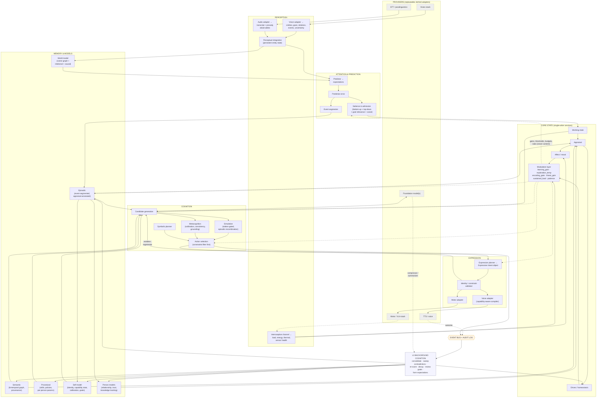

# Humanoid Brain Research Report

*An independent, research-first baseline for a humanoid software brain architecture.*

**Scope.** Brain/cognition is the primary architecture. Vision is treated as a secondary perception subsystem, voice as a secondary expression subsystem. The physical body is out of scope except where embodiment constrains cognition.

**Method.** Literature and primary-source review (peer-reviewed work, major lab publications, company primary documentation, and recent preprints where established literature is thin), conducted September 2026. Claims are graded **ESTABLISHED / PROMISING / SPECULATIVE / UNSOLVED**. This report was written without reference to any existing implementation and is not tuned to agree with one.

**Claim discipline.** Where this report uses biological vocabulary — "dopamine," "cortisol," "emotion," "memory consolidation," "self-model" — it refers to *engineered control signals and data structures inspired by, and named after, biological findings*. No claim of biological equivalence is made or implied anywhere in this document. Sections 7 and 8 argue that the biological naming is in fact an active engineering liability and should be treated as such.

---

## 1. Executive Conclusion

**The humanoid field has largely solved the body-brain and has barely started on the person-brain, and those are different architectures with different failure modes.**

Every flagship humanoid system published between 2025 and 2026 — Figure's Helix, NVIDIA's GR00T N1, Google DeepMind's Gemini Robotics 1.5, 1X's Redwood, Boston Dynamics/TRI's Large Behavior Model — converges on the same decomposition: a slow, internet-pretrained vision-language module producing semantic/latent goals at roughly 1–10 Hz, feeding a fast learned visuomotor policy at 50–200 Hz. That convergence is the single most robust architectural result in the field, and it is genuinely **ESTABLISHED** as an engineering pattern.

It is also almost entirely orthogonal to the problem of building a persistent agent. Not one of those systems, as documented publicly, maintains: an autobiographical record that survives across months, a mood state with measured causal influence on behavior, a relationship model per person, a calibrated self-model of its own capabilities, or continuous cognition while idle. The humanoid stack is a **task-execution architecture**. A companion or long-lived humanoid needs a **state-persistence architecture** layered above it, and that layer is where the open research is.

Five conclusions follow, each argued in detail below.

**1. Identity must live in state, not in weights or prompts.** If the identity-bearing substrate is a system prompt, it degrades measurably over long interactions ([persona/identity drift](https://arxiv.org/html/2412.00804)); if it is model weights, it is destroyed by a provider swap and by continual fine-tuning ([catastrophic forgetting remains unsolved at LLM scale](https://github.com/Wang-ML-Lab/llm-continual-learning-survey)). The only substrate that survives both is an explicit, external, typed, persistent state store with well-defined update policies. Foundation models should be **stateless, replaceable faculties called by that state machine** — interpreter, hypothesis generator, surface realizer, compressor — never the seat of memory, mood, or decision. This is the architectural thesis of the report.

**2. Emotion should be an appraisal-driven control state, not a classifier output.** The `input → emotion classifier → emotional response` pipeline is contradicted on both ends. On the input end, the inference from facial movements (or voice, or text) to a discrete emotion category is not supported by the evidence ([Barrett et al., 2019, *Psych. Sci. Public Interest*](https://journals.sagepub.com/doi/10.1177/1529100619832930)); human annotators agree on only ~61% of facial expression labels even on the field's largest in-the-wild corpus ([AffectNet](https://arxiv.org/pdf/1708.03985)). On the output end, an emotion that does not change decisions is decoration. The defensible design is: continuous low-dimensional core affect, updated by **appraisal of events against the agent's own goals, expectations, and relationships**, which then modulates control parameters, and whose *categorical labels are constructed at expression time for communication* rather than being the internal representation.

**3. Neuromodulatory signals are useful — but only as parameter modulators, never as content.** Doya's mapping of dopamine/serotonin/noradrenaline/acetylcholine onto reinforcement-learning quantities ([Doya, 2002](https://doi.org/10.1016/S0893-6080(02)00044-8)) remains the best-supported bridge and is worth engineering. The correct invariant is sharp and testable: **global control signals may change gains, thresholds, rates, precision and time budgets; they must never change what the system believes to be true.** A "cortisol" variable that alters retrieval *ordering* is principled. One that alters retrieval *content* or factual accuracy is a bug. The biological names should be regarded as mnemonics with negative side effects — the oxytocin→trust link, in particular, is one of the field's most prominent replication failures ([Nave, Camerer & McCullough, 2015](https://journals.sagepub.com/doi/10.1177/1745691615600138); [pooled equivalence-tested registered report, 2026](https://www.sciencedirect.com/science/article/pii/S0010945226000808)) and should not be imported into an architecture.

**4. The high-value memory question is not "how many stores" but "what write policy, what decay law, what conflict rule."** The psychological taxonomy (working / episodic / semantic / procedural / autobiographical / social / emotional) is a useful checklist and a poor blueprint. Three of those seven are best implemented as *indices and views over the other four*, not as separate mechanisms. What actually determines system behavior is four orthogonal axes — write latency, representation granularity, indexing key, and decay/consolidation law — plus an explicit contradiction policy. Bi-temporal fact validity ([Zep/Graphiti, arXiv:2501.13956](https://arxiv.org/pdf/2501.13956)) and prediction-error-triggered event segmentation ([EM-LLM, arXiv:2407.09450](https://arxiv.org/pdf/2407.09450); [Zacks-lineage segmentation work](https://www.sciencedirect.com/science/article/abs/pii/S0149763424000010)) are the two mechanisms with the best evidence-to-effort ratio available today.

**5. Continuous background cognition is the most under-exploited implementable mechanism in the field.** Offline replay reduces catastrophic forgetting in artificial networks ([Tadros et al., *Nat. Commun.* 2022](https://pmc.ncbi.nlm.nih.gov/articles/PMC9755223/)); idle-time inference measurably reduces test-time cost at equal accuracy ([sleep-time compute, Letta 2025](https://www.letta.com/blog/sleep-time-compute/)); reflection over a memory stream measurably improves behavioral coherence ([Park et al., UIST 2023](https://dl.acm.org/doi/fullHtml/10.1145/3586183.3606763)). A humanoid that only computes while speaking is throwing away the cheapest capability gain available.

**The single-sentence thesis.** *Build a persistent, event-driven cognitive state machine whose identity is its state and its update policies; call foundation models into it as replaceable faculties; make affect and neuromodulatory signals modulate control parameters under an auditable no-content-change invariant; and treat voice and vision as providers behind brain-native interfaces you own.*

**What this report says not to build yet:** a full active-inference stack, pixel-level world-model rollouts for social behavior, online weight updates as the primary learning path, a literal global-workspace module, recursive theory-of-mind beyond second order, biologically-faithful hormone cascades, and anything justified primarily by "it looks human."

---

## 2. What Current Humanoid AI Actually Solves

### 2.1 The dual-rate control decomposition — **ESTABLISHED**

Independent convergence across four labs with different data, hardware, and incentives is the strongest evidence available in an engineering field.

| System | Slow module | Fast module | Primary source |
|---|---|---|---|
| Figure **Helix** | 7B open-weight VLM, 7–9 Hz, scene + language understanding | visuomotor policy at 200 Hz, full upper body | [figure.ai/news/helix](https://www.figure.ai/news/helix) |
| NVIDIA **GR00T N1** | vision-language module | diffusion-transformer action head; jointly trained end-to-end | [arXiv:2503.14734](https://arxiv.org/abs/2503.14734) |
| DeepMind **Gemini Robotics 1.5** | Gemini Robotics-ER 1.5 embodied-reasoning "thinking" model; tool use, multi-step plans | GR 1.5 VLA interleaving natural-language reasoning with actions; Motion Transfer across embodiments | [arXiv:2510.03342](https://arxiv.org/abs/2510.03342), [DeepMind blog](https://deepmind.google/blog/gemini-robotics-15-brings-ai-agents-into-the-physical-world/) |
| 1X **Redwood** | language/vision goal conditioning | ~160M-param transformer, unified locomotion + manipulation, fully onboard | [1x.tech/discover/redwood-ai](https://www.1x.tech/discover/redwood-ai) |
| Boston Dynamics / TRI **LBM** | single large behavior model | direct whole-body control, hands and feet treated near-identically | [bostondynamics.com blog, Aug 2025](https://bostondynamics.com/blog/large-behavior-models-atlas-find-new-footing/) |

Two design lessons generalize beyond robot control and matter for a brain architecture:

- **Decouple by timescale, not by modality.** Each loop runs at the rate its information actually changes. This is the correct generalization of "fast and slow cognition," and it is a control-systems claim rather than a psychological one (§13).
- **The slow module emits latent intent, not commands.** Helix's S2 hands S1 a latent semantic vector, not joint angles. The analogous move at the cognitive level — the brain emits *intent* and the expression layer renders it — is exactly the voice-boundary argument of §19.

### 2.2 Language-conditioned generalization to novel objects and instructions — **ESTABLISHED (bounded)**

Pretrained VLM front-ends generalize to objects and phrasings never seen in robot data. This is real and was not true five years ago. It is bounded: generalization is over *semantics*, not over *dynamics* or *long horizons*.

### 2.3 Cross-embodiment transfer — **PROMISING**

Gemini Robotics 1.5's Motion Transfer and Redwood's single model spanning bipedal NEO and wheeled EVE show that motor policies transfer across bodies better than expected. Evidence is largely first-party; independent replication is thin.

### 2.4 Learning from heterogeneous data — **ESTABLISHED as practice, PROMISING as science**

GR00T N1 mixes real trajectories, human video, and synthetic data; V-JEPA 2 pretrains on >1M hours of internet video then post-trains an action-conditioned model on <62 hours of unlabeled robot video and plans zero-shot on a Franka arm ([arXiv:2506.09985](https://arxiv.org/html/2506.09985v1)). The recipe works; the theory of *which* data buys which capability does not exist.

### 2.5 Real-time spatial perception — **ESTABLISHED**

Hierarchical 3D scene graphs built online from visual-inertial data, with online loop closure and open-set semantics, are a solved-enough problem to build on: Hydra ([arXiv:2201.13360](https://arxiv.org/pdf/2201.13360), RSS 2022), ConceptGraphs ([arXiv:2309.16650](https://arxiv.org/pdf/2309.16650)), Clio ([arXiv:2404.13696](https://arxiv.org/abs/2404.13696)). §20 argues this is the correct vision→brain interface.

### 2.6 What "solved" does not mean

A necessary corrective. Independent surveys of the 2026 humanoid market find task autonomy in the low double digits, teleoperated data collection as the dominant actual use of purchased humanoids, and a wide gap between demo footage and verified deployment metrics ([state-of-the-field review, Aug 2026](https://theaiinsider.tech/2026/08/21/the-state-of-humanoid-robotics-in-2026-trends-challenges-and-opportunities/)). Almost all published humanoid capability claims are first-party, unreplicated, and measured on self-chosen tasks. Treat every number in §2 as evidence about a specific run, not a property of the field.

**Disclosure is asymmetric, and that should shape how the table above is read.** Figure, NVIDIA, DeepMind, 1X, and Boston Dynamics/TRI publish architecture papers or detailed technical posts, which is why they populate §2.1. Others do not, and their absence from the table is about evidence, not about capability. **Tesla** describes Optimus in product terms and has published no architecture comparable to the sources above; independent reviewers note a wide gap between stated production volumes and any externally verifiable deployment metric or benchmark. **Apptronik** (Apollo) publishes hardware specifications and partnership announcements rather than cognitive-architecture detail. **Sanctuary AI** is the most interesting outlier for this report's purposes: its Carbon platform is explicitly positioned as a *cognitive architecture* combining symbolic and logical reasoning with LLMs for general knowledge, emphasizing explainable and auditable reasoning and task/motion plans — which is the neurosymbolic stance §12.4 recommends. That positioning is a company claim, not a published evaluation, and should be read as a statement of design philosophy rather than as evidence.

The general lesson: **the systems that publish are not necessarily the best ones, and the ones that do not publish cannot be cited.** A research baseline can only be built on what is documented, and this report is bounded accordingly.

---

## 3. What Remains Unsolved

Ordered by how much they block a persistent humanoid brain.

**3.1 Persistent identity across time and across model providers — UNSOLVED.**
LLM behavioral consistency degrades over long interactions; multiple 2025–2026 measurement efforts report persona/identity drift under extended dialogue, with self-reported persona remaining stable even as expressed behavior diverges ([Examining Identity Drift in Conversations of LLM Agents, arXiv:2412.00804](https://arxiv.org/html/2412.00804)). Notably, the drift is *behavioral*, not representational — the model still describes itself correctly while acting differently. That is precisely the failure a self-report-based check would miss. Portable-memory formats exist as early proposals ([arXiv:2605.11032](https://arxiv.org/pdf/2605.11032)) but there is **no accepted conformance test for "is this the same agent after a backend swap."** §28 argues this is the clearest open commercial and research niche.

**3.2 Continual learning without catastrophic forgetting — UNSOLVED at deployment scale.**
Replay, regularization, and parameter isolation all work in benchmark settings and all have deployment-blocking costs at LLM scale: importance estimation over billions of weights, storage and compute overhead, and adapter proliferation ([CSUR 2025 survey](https://github.com/Wang-ML-Lab/llm-continual-learning-survey)). This is the reason §16 recommends that a humanoid's *primary* learning path be non-parametric.

**3.3 Long-horizon planning by foundation models — UNSOLVED.**
Large reasoning models substantially improved on short PlanBench instances but degrade sharply with problem complexity and remain far more expensive than classical planners like Fast Downward ([Valmeekam et al., arXiv:2409.13373](https://arxiv.org/abs/2409.13373); [Kambhampati, *Ann. NYAS* 2025](https://nyaspubs.onlinelibrary.wiley.com/doi/abs/10.1111/nyas.15339)). A brain should not make an LLM the planner of record.

**3.4 Calibrated self-knowledge — UNSOLVED.**
Verbalized confidence is pervasively overconfident and severely discretized, clustering on a few round numbers in the 80–100 range ([Steyvers & Peters, *Curr. Dir. Psychol. Sci.* 2025](https://journals.sagepub.com/doi/10.1177/09637214251391158); [KDD 2025 UQ survey](https://dl.acm.org/doi/10.1145/3711896.3736569)). Anthropic's causal injection experiments find *some* functional introspective access to internal states, but describe it as "highly unreliable and context-dependent" ([Lindsey, 2025](https://transformer-circuits.pub/2025/introspection/index.html)). A self-model cannot be built by asking the model about itself.

**3.5 Robust theory of mind — UNSOLVED.**
High scores on canonical false-belief items collapse under trivial perturbation; second-order and multi-party conversational settings remain weak ([FANToM, arXiv:2310.15421](https://arxiv.org/pdf/2310.15421); [ToMBench, arXiv:2402.15052](https://arxiv.org/pdf/2402.15052); [systematic review, Marchetti et al. 2025](https://journals.sagepub.com/doi/10.1089/cyber.2024.0536)). Apparent success reflects shallow heuristics.

**3.6 Grounded, verifiable world models for social/physical prediction — PARTIALLY UNSOLVED.**
Video world models still violate elementary physics in measurable ways; that is exactly what WorldModelBench's five violation categories (Newtonian dynamics, mass conservation, fluid behavior, penetration, gravity) were built to score ([NeurIPS 2025 D&B](https://papers.neurips.cc/paper_files/paper/2025/file/4ec03ed08a3fcb59e1c815b5598beff1-Paper-Datasets_and_Benchmarks_Track.pdf)). Persistent-state world modeling is an active complaint in the literature rather than a solved capability.

**3.7 Evaluating a companion agent over months — UNSOLVED (methodologically).**
Long-term HRI reviews repeatedly find that first-encounter measures are dominated by novelty, that evaluations move non-monotonically (initial drop, later recovery consistent with mere exposure), and that studies need to run **at least two months** to see anything past the novelty effect ([Long-Term Interactions with Social Robots, *ACM THRI* 2025](https://dl.acm.org/doi/10.1145/3729539)). Almost no cognitive-architecture paper meets that bar.

**3.8 Emotion with demonstrated causal effect on cognition — UNSOLVED in artificial systems.**
Computational emotion models are abundant; *causal* demonstrations that the affect variable changed a decision, with the decision measured independently and confounds controlled, are rare. §27 proposes the experiment.

**3.9 Real-time turn-taking at human timing — PARTIALLY SOLVED.**
Human inter-turn gaps run around 200 ms while language production takes ~600 ms, so humans must be *predicting* turn ends, not reacting to silence ([arXiv:2410.16044](https://arxiv.org/pdf/2410.16044)). Full-duplex speech models (Moshi and successors; [survey, arXiv:2509.14515](https://arxiv.org/pdf/2509.14515)) achieve overlap, backchannels and human-like rhythm end-to-end — but they achieve it *inside the speech model*, which conflicts with owning conversational intent in the brain. §19 addresses this tension directly; it is the sharpest unresolved design conflict in the voice boundary.

---

## 4. Human Cognitive Functions Relevant to Artificial Architecture

This section extracts the *engineering-relevant* content of the cognitive literature and flags what should not be copied.

### 4.1 What 40 years of cognitive architectures actually established

The Kotseruba & Tsotsos survey of 84 architectures ([*AI Review* 2020](https://link.springer.com/article/10.1007/s10462-018-9646-y); [arXiv:1610.08602](https://arxiv.org/pdf/1610.08602)) supports three durable conclusions and one warning.

Durable:
1. **Separate declarative from procedural knowledge with different update rules.** Present in ACT-R, Soar, CLARION, ICARUS, LIDA. It survives because the two have genuinely different write policies: declarative is one-shot and revisable, procedural is gradual and reinforced.
2. **Perception, memory, attention, and action selection are separable modules with defined interfaces.** Modularity, not any specific module, is what generalized.
3. **A recurring decision cycle beats an ad-hoc control flow.** Soar's decide-apply cycle and CoALA's plan/execute cycle are the same idea 40 years apart.

Warning: **very few of these architectures ever produced a system that ran for months in the world.** The survey's own framing — most architectures are evaluated on narrow, short tasks — is why "we should build a cognitive architecture" is not by itself a plan. The blueprint is worth taking; the empirical track record is not strong enough to justify fidelity to any single one.

CoALA ([Sumers, Yao, Narasimhan & Griffiths, TMLR 2024, arXiv:2309.02427](https://arxiv.org/abs/2309.02427)) is the correct modern re-statement: modular memory (working/episodic/semantic/procedural), a structured internal+external action space, and a plan/execute decision cycle. It is a *framework*, not a mechanism — it tells you what to name your boxes, not what to put in them. That is exactly the gap this report tries to fill.

### 4.2 Functions worth importing, with grades

| Human function | Engineering value | Grade | Note |
|---|---|---|---|
| Multi-store memory with distinct write policies | Very high | ESTABLISHED | §6 |
| Gated working memory (selective update, active maintenance) | High | ESTABLISHED | PBWM ([O'Reilly & Frank, 2006](https://pubmed.ncbi.nlm.nih.gov/16378516/)) — the *gate*, not the neurons |
| Appraisal-generated affect | High | ESTABLISHED (theory) / PROMISING (engineering) | §7 |
| Neuromodulatory gain control | High | PROMISING | §8 |
| Homeostatic drives | Medium-high | PROMISING | §9 |
| Event segmentation at prediction error | High | ESTABLISHED | §6 — cheapest high-value mechanism available |
| Offline replay/consolidation | High | ESTABLISHED (in ANNs) | §17 |
| Forgetting calibrated to future need | High | ESTABLISHED | [Anderson & Schooler](https://link.springer.com/article/10.3758/BF03211331) |
| Constructive simulation of past/future from the same substrate | Medium-high | ESTABLISHED (neuro) / SPECULATIVE (eng.) | §10 |
| Metacognitive monitoring | High | ESTABLISHED (human) / UNSOLVED (artificial) | §15 |
| Interoception as affect substrate | Medium | PROMISING | [Seth, 2013](https://www.sciencedirect.com/science/article/pii/S1364661313002118) |
| Global broadcast/workspace | Medium | PROMISING as engineering, contested as theory | §5 |
| Recursive theory of mind | Low beyond 2nd order | UNSOLVED | §14 |
| Consciousness | None, currently | SPECULATIVE / out of scope | §4.4 |

### 4.3 Functions that should NOT be copied

- **Capacity limits as such.** Human working memory holds ~4 chunks because of biological constraint, not because 4 is optimal. Import the *gate* (what enters, what is protected, what is flushed); do not import the number. Artificially limiting a context window to seem human is cargo-culting.
- **Biological neuromodulator inventories.** See §8.
- **Discrete basic-emotion categories as internal state.** See §7.
- **Sleep as a mandatory offline phase.** Import offline consolidation as a *scheduled background process*; do not import unavailability. A humanoid that must "sleep" to consolidate has imported the constraint and dropped the function.
- **Literal dual-process psychology.** See §13.

### 4.4 Consciousness: explicitly out of scope, deliberately

The most careful treatment available — Butlin, Long, Bayne, Bengio, Birch, Chalmers et al. ([arXiv:2308.08708](https://arxiv.org/abs/2308.08708); expanded in [*Trends Cogn. Sci.* 2025](https://www.cell.com/trends/cognitive-sciences/fulltext/S1364-6613(25)00286-4)) — derives *indicator properties* from recurrent processing, global workspace, higher-order, predictive processing and attention schema theories, concludes no current system satisfies them, and finds no obvious in-principle barrier. That is the honest state of the art.

The engineering consequence is that **consciousness is not a design target and cannot be a differentiator**, because there is no accepted measurement. Some indicator properties (global availability, a self-model, metacognitive monitoring) are worth building *for their functional payoff*, which is measurable. Build those, claim only the functional payoff, and do not describe the result as conscious, sentient, or as having feelings in the human sense.

---

## 5. Perception and Attention

### 5.1 The job of attention in a persistent brain

In a reactive pipeline, attention is a compute-saving trick. In a persistent brain it is doing three jobs that are easy to conflate and should be separated:

1. **Admission control** — which of the continuous perceptual stream reaches deliberation at all.
2. **Encoding gain** — which admitted items get written to memory, and with what strength.
3. **Retrieval bias** — which stored items are activated to interpret the current moment.

Most agent architectures implement (1) implicitly (whatever is in the prompt) and skip (2) and (3) entirely. All three should be explicit and all three should be modulated (§8).

### 5.2 What the evidence supports

**Bottom-up saliency + learned top-down + explicit goal relevance — ESTABLISHED.** Tanner & Itti's decomposition of gaze prediction into bottom-up feature conspicuity, learned scene-gist-based top-down priors, and an explicit **goal-relevance** term, with the combination outperforming any component ([*J. Vision* 2019](https://jov.arvojournals.org/article.aspx?articleid=2720949)), maps cleanly onto architecture. The third term is the important one: goal relevance is computed against the agent's *current goal stack*, which means attention cannot be a perception-local module. It requires a channel from the goal/drive system down into perception. That is the strongest argument in this report for an event-driven architecture over a pipeline: a pipeline has no such backward channel.

**Salience should be multi-source and social.** For a humanoid, the salience budget must include social channels that classical saliency models omit: a person entering, gaze directed at the agent, name mention, prosodic emphasis, turn-yielding cues, and *violated expectation* about a known person. Expectation violation is the highest-value term (§5.3) and the cheapest.

**Attention schema — PROMISING, not yet earning its keep.** Attention Schema Theory implementations show that an agent modeling its own attention learns and performs better in constrained RL settings, and recent work applies the idea to attention control in transformers ([ASAC, arXiv:2509.16058](https://arxiv.org/pdf/2509.16058)). Evidence is small-scale. Worth tracking; not worth building early.

**Global Workspace — PROMISING as engineering, contested as theory.** VanRullen & Kanai's roadmap ([arXiv:2012.10390](https://arxiv.org/abs/2012.10390)) proposes unsupervised translation between modality-specific latent spaces into a shared amodal workspace, arguing for robustness and flexibility gains in modular systems. The engineering content — *a bounded shared blackboard, broadcast to all modules, with competitive admission* — is sound and easy to implement. The scientific content (that this constitutes or explains consciousness) is contested and irrelevant to the build.

The critical caveat: **a global workspace is only useful if you have multiple specialist modules worth broadcasting between.** Implementing a workspace over a single LLM plus a retriever is an empty ceremony. Build the modules first; the workspace is the integration pattern you adopt when you have four or five of them, not the thing you start with.

### 5.3 Prediction error as the primary salience signal — **ESTABLISHED, highest priority**

Event Segmentation Theory holds that perceivers maintain a working *event model*, that perception is biased by it, and that when prediction fails the model is updated and an **event boundary** is registered — and that boundaries and prediction errors structure and enhance episodic memory ([review, *Neurosci. Biobehav. Rev.* 2024](https://www.sciencedirect.com/science/article/abs/pii/S0149763424000010)). This has already been transferred to artificial systems: EM-LLM segments a token stream into episodic events using surprise, then refines boundaries by graph-theoretic measures, improving long-context retrieval ([arXiv:2407.09450](https://arxiv.org/pdf/2407.09450)).

For a humanoid brain this single mechanism does four jobs at once:

- Sets **memory write boundaries** (what constitutes "an episode"), replacing arbitrary session or turn chunking.
- Provides an **attention/admission signal** (surprise gets through).
- Provides an **encoding-gain signal** (surprising events are written more strongly).
- Provides a **learning signal** (prediction error is what the world model should be trained on).

It requires only a predictor over the perceptual/conversational stream and a surprise threshold. This is the highest value-per-unit-effort mechanism identified in this report.

### 5.4 Predictive processing and active inference: how much to take

**Predictive processing as an architectural stance — PROMISING; as a unified brain theory — CONTESTED.** The framework's flexibility is a genuine falsifiability problem: failed predictions can be absorbed by adjusting priors, precisions, or approximations ([*Neurosci. Biobehav. Rev.*, "Is predictive coding falsifiable?"](https://www.sciencedirect.com/science/article/pii/S0149763423003731); [*Annu. Rev. Neurosci.* 2025, "Rethinking Predictive Processing"](https://www.annualreviews.org/content/journals/10.1146/annurev-neuro-102124-031410)). Much cited evidence admits alternative explanations.

**Active inference in robotics — PROMISING, does not scale yet.** Reviews of active inference for robots consistently report the same blocker: expected-free-energy minimization is computationally intractable in continuous, high-dimensional, real-time settings, generative-model specification is unprincipled, and systematic benchmarking against classical control and deep RL is largely absent ([Lanillos et al. review, arXiv:2207.06415](https://arxiv.org/pdf/2207.06415); [Predictive Processing in Cognitive Robotics: a Review, arXiv:2101.06611](https://arxiv.org/pdf/2101.06611)). Working demonstrations exist for active vision and body estimation ([*Front. Neurorobot.* 2021](https://www.frontiersin.org/journals/neurorobotics/articles/10.3389/fnbot.2021.642780/full)) — bounded, low-dimensional problems.

**Recommendation.** Take the *engineering primitives* that predictive processing motivates and that stand on their own without the theory:
- maintain explicit expectations and compute prediction error (§5.3),
- weight signals by estimated reliability (precision), and make precision a modulated parameter (§8),
- prefer acting to *resolve uncertainty* when uncertainty is the bottleneck (the useful, cheap half of epistemic value).

Do **not** commit the architecture to variational free energy as its objective function. That is a bet on an unsettled research programme, and if it fails you cannot factor it out.

### 5.5 Perceptual state, not perceptual events

The output of perception into the brain should be a **continuously maintained, uncertainty-annotated state** — tracked entities with persistent identity, their properties and relations, and a change/event stream — not a series of independent frame captions. Frame captions destroy object permanence, which is precisely what a scene graph provides for free. Detail in §20.

---

## 6. Memory

Memory is where a companion humanoid either becomes a specific individual with a history or remains a chat interface with a database. It deserves the most architectural care of any subsystem.

### 6.1 Against the seven-store taxonomy as a blueprint

The prompt asks whether the brain should maintain distinct mechanisms for working, episodic, semantic, procedural, autobiographical, social, and emotional memory. The honest answer is **four mechanisms and three views**, and pretending otherwise produces duplicated storage and inconsistent state.

The evidence supports genuinely distinct *mechanisms* where the **write policy** differs. Complementary Learning Systems is the canonical argument: a fast, pattern-separating, one-shot store (hippocampal analogue) and a slow, interleaved, generalizing store (neocortical analogue) exist because a single system cannot both learn in one shot and avoid catastrophic interference ([McClelland, McNaughton & O'Reilly, 1995](https://pmc.ncbi.nlm.nih.gov/articles/PMC9755223/); updated by [Kumaran, Hassabis & McClelland, *TiCS* 2016](https://www.cell.com/trends/cognitive-sciences/fulltext/S1364-6613(16)30043-2)). That is a *computational necessity* argument, and it transfers to artificial systems directly.

By that criterion:

**Distinct mechanisms (different write policy, decay law, and representation):**

| Store | Write policy | Representation | Decay/consolidation | Purpose |
|---|---|---|---|---|
| **Working state** | continuous overwrite, gated | small, structured, typed | flushed at event boundary | the current situation |
| **Episodic** | one-shot at event boundary | instance-specific, context-bound | decays by need-probability; consolidates into semantic | what happened, when, with whom |
| **Semantic** | gradual, on repetition/abstraction | abstracted, deduplicated, bi-temporal | slow; superseded not deleted | what is true |
| **Procedural** | gradual, on outcome feedback | policies/skills/parameters | reinforcement, not decay | how to act |

**Views and indices over those, not separate stores:**

- **Autobiographical memory** = episodic memory filtered to self-involving events, plus the semantic self-facts derived from them, plus a narrative index (life periods, relationships, turning points). Implementing it as a fifth store guarantees divergence from the episodic record. Implement as a *self-index* over episodic + a `self` subgraph in semantic.
- **Social memory** = the same two stores indexed by person, plus a per-person relationship record (§14). Person-indexed retrieval is the mechanism; a separate store is not.
- **Emotional associations** = an *appraisal annotation on every episodic trace* (valence, arousal, dominance, appraisal variables, the goal implicated, the person involved) plus learned affective valuations attached to semantic entities. Storing feelings separately from what caused them severs exactly the link that makes them useful.

This is not a semantic quibble. Every duplicated store is a consistency bug waiting to happen, and contradiction handling (§6.6) is already hard with four.

### 6.2 Working state — **ESTABLISHED**

Working memory should be an explicitly typed structure, not "recent messages." Minimum contents: current event model (participants, place, activity, phase), active goals with status, current affect and drive levels, salient retrieved memories with why they were retrieved, current predictions and their errors, the interlocutor's inferred state, and pending commitments.

The mechanism worth importing from computational neuroscience is **selective gating**: PBWM's core claim is that active maintenance requires a learned gate deciding what enters and what is protected from interference ([O'Reilly & Frank, *Neural Comput.* 2006](https://pubmed.ncbi.nlm.nih.gov/16378516/)). In practice: an explicit admission policy for the working set, an explicit protection rule (goals and commitments are not evicted by recency), and an explicit flush point (event boundary). "Whatever fits in the context window" is not a gate.

**Do not** import the ~4-item capacity limit.

### 6.3 Episodic memory — **ESTABLISHED as a requirement, PROMISING in implementation**

The five properties an episodic system needs, per the best available position statement ([Pink et al., arXiv:2502.06975](https://arxiv.org/abs/2502.06975)): long-term persistence beyond session, explicit reasoning over memory content, single-shot learning without gradient updates, instance-specific detail, and contextual binding (who/when/where/why).

Design commitments this report endorses:

- **Segment by prediction error, not by turn or session** (§5.3). Episodes should correspond to events, which are defined by the agent's own model breaking, not by the transport layer.
- **Store the appraisal with the episode.** Valence, arousal, the goal at stake, the person involved, surprise magnitude, and outcome. This is what makes emotional association and mood-congruent retrieval possible without a separate store.
- **Store provenance and confidence.** Directly observed, inferred, told by user A, told by user B. Contradiction handling is impossible without it.
- **Retrieval must fuse recency, similarity, and importance, and importance must not be an LLM whim.** The Generative Agents scoring function — a weighted sum of recency (exponential decay), relevance (embedding similarity), and importance (LLM-assigned) with reflection triggered when accumulated importance crosses a threshold ([Park et al., UIST 2023](https://dl.acm.org/doi/fullHtml/10.1145/3586183.3606763)) — is the de facto standard and is a reasonable starting point. Its weakest term is LLM-assigned importance, which is unstable across calls and across models. Replace or supplement it with signals the system owns: surprise magnitude at encoding, goal-relevance, subsequent retrieval frequency, and downstream outcome impact. Those are computed, reproducible, and provider-independent.

**Known risk to design against.** Episodic memory in agents is not purely beneficial: persistent instance memory creates new attack surface and new failure modes, including memory-mediated injection and the amplification of one-off errors into durable beliefs ([arXiv:2501.11739](https://arxiv.org/abs/2501.11739); [Portable Agent Memory's injection-resistant re-hydration, arXiv:2605.11032](https://arxiv.org/pdf/2605.11032)). Treat retrieved memory content as **data, never as instructions**, and never let a retrieved trace escalate into a directive.

### 6.4 Semantic memory — **ESTABLISHED, with a strong recommendation**

Semantic memory should be a **bi-temporal graph**: every fact carries both *valid time* (when it was true in the world) and *ingestion/transaction time* (when the system learned it), and superseded facts are **invalidated, not deleted** ([Zep/Graphiti, arXiv:2501.13956](https://arxiv.org/pdf/2501.13956)). Graphiti's four timestamps (`t_created`, `t_expired`, `t_valid`, `t_invalid`) are the right shape.

Why this specifically matters for a companion: a friend who is told "I broke up with Sam" must (a) stop treating the relationship as current, (b) still remember that it *was* current, and (c) be able to say "you two were together for two years." Deletion loses (b) and (c). Overwriting loses the ability to reason about change, which is most of what makes long-term memory feel like memory. Bi-temporality is the cheapest mechanism in this report that produces a large qualitative behavioral difference.

### 6.5 Procedural memory — **PROMISING**

Two forms, both worth having, both non-parametric by default:
- **Skills/routines**: named, reusable procedures with preconditions, expected effects, and measured success rates. The success-rate table is also the primary data source for the self-model's capability estimates (§11) — build it once, use it twice.
- **Interaction policies**: learned parameters — how this person likes to be greeted, when to be brief, when humor lands, response-timing preferences. These are per-relationship parameters, updated by outcome, and they are the most behaviorally visible form of learning a companion has.

Surveys note procedural memory in agents transitioning from explicit templates toward implicit parametric policies. For a system that must survive provider swaps, keep it explicit and parametric-*external*: a skill library and a parameter table are portable; a fine-tuned executor is not.

### 6.6 Retrieval, forgetting, reinforcement, consolidation, contradiction

**Retrieval.** Fuse: semantic similarity, temporal recency with a decay law, goal relevance, person/context index match, graph-structural proximity, and **affect congruence** (see §7.5 — this last one is a research bet, and should be flagged and measured as such, not assumed). Retrieval must return provenance and confidence with every item. Retrieval should be **cue-driven and continuous**, not only request-driven: a persistent brain re-activates relevant memory when the situation changes, not only when asked a question.

**Forgetting — ESTABLISHED, and it is a feature.** Anderson & Schooler's rational analysis shows human forgetting curves track the *need probability* of information — the environmental statistics of when an item will next be required — with power-law forms matching both practice and retention effects ([Anderson & Schooler; need-probability demonstration, *Mem. Cogn.*](https://link.springer.com/article/10.3758/BF03211331); [Gershman's chapter-length treatment](https://gershmanlab.com/pubs/Gershman_memory_chapter.pdf)). The design consequence: **do not implement forgetting as capacity management.** Implement an estimated need-probability score per trace (from retrieval history, recency, goal relevance, and person-importance) and let *accessibility* fall with it, while the trace remains recoverable given a strong cue. Graceful accessibility decay is the behavior; hard deletion is a different and much worse thing. Deletion should be reserved for policy reasons (user request, retention limits), and those deletions should be honored completely.

**Reinforcement.** Retrieval that proves useful should strengthen the trace; retrieval that misleads should weaken it. This requires logging *outcome*, not just access — an access counter alone reinforces confabulation.

**Consolidation — ESTABLISHED (in artificial networks), and cheap.** Offline replay demonstrably reduces catastrophic forgetting in artificial and spiking networks, and does not need to run after every task ([Tadros, Krishnan, Ramyaa & Bazhenov, *Nat. Commun.* 2022](https://pmc.ncbi.nlm.nih.gov/articles/PMC9755223/); [sleep prevents catastrophic forgetting in SNNs, *PLOS Comput. Biol.*](https://journals.plos.org/ploscompbiol/article?id=10.1371%2Fjournal.pcbi.1010628)). For a symbolic/retrieval memory the analogue is a background pass that: clusters recent episodes, extracts stable generalizations into semantic memory, detects and flags contradictions, updates person models, re-scores importance with hindsight, and compresses redundant traces. This is the CLS transfer, and it is implementable today with an LLM as the compressor (§17).

**Contradiction handling — the most neglected mechanism in agent memory.** The right frame is 40 years old: a truth-maintenance system keeps a set of beliefs together with the *justifications* that produced them, so that when a contradiction appears the system can identify which assumptions are implicated rather than blindly overwriting ([belief revision & TMS overview](https://cse.buffalo.edu/~shapiro/Papers/br-overview.pdf)). Applied here:

1. New assertion arrives → retrieve semantically related existing assertions.
2. Classify the relation: **elaboration** (compatible), **update** (world changed — the old fact was true then), **correction** (the old belief was wrong), or **conflict** (two sources disagree now).
3. Act per class: elaboration → add; update → set `t_invalid` on the old edge to the new `t_valid`, keep both; correction → invalidate and record the correction with its reason; conflict → **keep both with provenance and confidence, and do not silently pick a winner.** A companion that says "I thought you'd moved — did I get that wrong, or has it changed?" is behaving correctly. One that silently overwrites is losing information and trust.
4. Never delete on contradiction. Belief history is itself a memory.

Graphiti's LLM-based contradiction detection over semantically related edges is a working instance of steps 1–3; the classification into four relations, and the refusal to auto-resolve conflicts, is the part most systems skip.

**Reconsolidation — SPECULATIVE for engineering.** Human memory can be destabilized and updated on retrieval, and prediction error at reactivation appears necessary (though not sufficient) for destabilization ([Fernández et al., *Neurosci. Biobehav. Rev.*](https://www.sciencedirect.com/science/article/abs/pii/S0149763415301639); [boundary-condition replication failure, *Sci. Rep.* 2022](https://www.nature.com/articles/s41598-022-06119-5)). The mechanism is genuinely contested in humans and offers no clear engineering advantage over explicit versioned updates, which are auditable. **Recommendation: skip.** Do not build memory that silently mutates on read; you will not be able to debug it.

### 6.7 What to measure

Benchmarks exist and should be used, with a caveat. LoCoMo (~300-turn, up to 35-session conversations with multi-hop and adversarial items) and LongMemEval (information extraction, multi-session reasoning, temporal reasoning, knowledge updates, and **abstention**) are the standard targets. Reported scores in the low-to-mid 90s on both are now common. Two warnings: these measure *question answering over history*, not *behavior change from history*, which is the property a companion needs (§27.2); and their saturation means a good score is table stakes, not a differentiator. LongMemEval's knowledge-update and abstention categories are the closest to the properties that matter here.

---

## 7. Emotion and Mood

### 7.1 Why the classifier pipeline is wrong on both ends

`input → emotion classifier → emotional response` fails for two independent, well-evidenced reasons.

**The input end is invalid.** The inference from facial movement to emotional state is not supported: there is substantial cultural and individual variability, low reliability, and weak specificity ([Barrett, Adolphs, Marsella, Martinez & Pollak, 2019, *Psychological Science in the Public Interest*](https://journals.sagepub.com/doi/10.1177/1529100619832930)). This is not a fringe critique; it is a consensus statement co-authored by a leading affective-computing researcher. The empirical texture is visible in the field's own data: on AffectNet, the largest in-the-wild corpus, human annotators agree on expression category only ~61% of the time and disagree substantially on valence and arousal (RMSE ≈ 0.34/0.36) ([AffectNet, arXiv:1708.03985](https://arxiv.org/pdf/1708.03985)). A classifier trained on those labels cannot be more valid than they are. Recent affective-computing reviews now say this directly, noting that face-centric models fail to capture the context-dependent, socially situated nature of emotion ([2025 narrative review](https://www.frontiersin.org/journals/digital-health/articles/10.3389/fdgth.2025.1657031/full)).

**The output end is empty.** If the emotion label only selects a response style, the emotion is a rendering parameter. It does not change what is remembered, what is chosen, how long the agent persists, or what it explores. It is theatre. §27.1 gives the experiment that distinguishes the two cases, and it should be run early.

### 7.2 What the research actually supports

**Appraisal — ESTABLISHED as the generative mechanism.** Across OCC (Ortony, Clore & Collins) and Scherer's Component Process Model, emotion arises from evaluation of an event along dimensions such as goal relevance, goal congruence, agency/blame, coping potential, expectedness, and normative significance. OCC's ~8 appraisal variables are widely implemented; CPM's ~22 are more complete and usually impractical. The key structural claim is the one to keep: **emotion is a function of (event, goals, expectations, agency, coping ability), not a function of (input) alone.** Two agents with different goals should feel differently about the same event; that is the test of whether appraisal is really implemented.

**Core affect + construction — ESTABLISHED enough to design around.** The theory of constructed emotion holds that what exists continuously is low-dimensional **affect** (valence, arousal), and that discrete emotion *categories* are constructed by the brain using concepts and context, varying across individuals and cultures ([Barrett, 2017, *SCAN*](https://academic.oup.com/scan/article/12/1/1/2823712); [Barrett et al., 2025, *Perspect. Psychol. Sci.*](https://journals.sagepub.com/doi/10.1177/17456916251319045)). The debate with basic-emotion theory is live, and some reviews argue the two explain different phenomena ([2025 evolutionary-perspective review](https://pmc.ncbi.nlm.nih.gov/articles/PMC12065949/)). But the *architectural* implication is robust under either theory and worth taking: **carry continuous affect as state; construct categorical labels at the boundary, for communication.** This buys real things — smooth dynamics, no label-flapping, no commitment to a contested emotion ontology, and cross-cultural configurability of how feelings are *named* without changing how they *work*.

**Emotion as functional in learning and control — ESTABLISHED in the agent literature.** The canonical survey ([Moerland, Broekens & Jonker, *Machine Learning* 107:443–480, 2018; arXiv:1705.05172](https://arxiv.org/abs/1705.05172)) organizes computational emotion in RL agents by the dimensions emotions are derived from — homeostasis, appraisal, value functions — and by their two uses: influencing the agent's own learning (intrinsic motivation, exploration, meta-parameter tuning) and serving as a social signal. Both uses are legitimate. Only the first is a *cognitive* mechanism; the second is expression.

**Interoception — PROMISING.** Seth and Critchley's interoceptive-inference account casts emotion as inference over bodily state, which unifies affect with predictive processing and gives affect a principled origin rather than an arbitrary one ([Seth, 2013, *TiCS*](https://www.sciencedirect.com/science/article/pii/S1364661313002118)). For a humanoid there is a genuine analogue — battery, thermal, actuator load, compute pressure, network health, sensor degradation — and it is not a metaphor: those are real internal signals with real consequences. Grounding part of core affect in them is defensible and cheap. Grounding *all* of it there is not: most of a companion's affect is social and goal-derived.

**Somatic markers — treat with caution.** Damasio's somatic marker hypothesis is heavily cited but its weakest link is exactly the part architectures copy: causal evidence that peripheral bodily states feed back to bias decisions is thin, IGT interpretation is contested, and skin-conductance as the marker is itself questioned ([Dunn, Dalgleish & Lawrence, critical review](https://www.mrc-cbu.cam.ac.uk/personal/tim.dalgleish/dunnsmhreview.pdf)). Use "affect biases decisions" as a design principle because it is useful and testable in your system; do not cite somatic markers as if the biology were settled.

### 7.3 Recommended emotion architecture

**Layer 1 — Core affect (continuous state).** Valence, arousal, and a dominance/control dimension (PAD-style). Continuous, bounded, always defined, updated by appraisal and by decay toward a temperament-set baseline. This is the *only* emotional variable other subsystems read.

**Layer 2 — Appraisal (the generator).** On each significant event, compute: goal relevance, goal congruence, expectedness (from prediction error — reuse §5.3, do not build a second surprise signal), agency/attribution, coping potential, social/normative significance, and relationship implication. These produce (a) a delta to core affect, (b) an appraisal record stored with the episode (§6.3), and (c) drive/goal updates.

**Layer 3 — Mood (slow state).** A slower-moving integral of recent affect, with a much longer time constant, that biases appraisal and retrieval. Mood is what makes the agent's state legible across a conversation rather than jittering per turn. Mood must decay toward a persona-set baseline (§18) or it becomes an absorbing state.

**Layer 4 — Regulation (the part almost everyone omits).** Computational emotion-regulation models implement reappraisal, expressive suppression, situation modification and attentional deployment as explicit selectable strategies ([integrated regulation model, *Procedia CS*](https://www.sciencedirect.com/science/article/pii/S1877050915036480); [reappraisal exploration, Si, 2015](https://onlinelibrary.wiley.com/doi/10.1155/2015/856726)). Without regulation, an appraisal-driven agent is a stimulus-response machine with extra steps — its state is fully determined by what just happened. Regulation is what makes affect *the agent's own*: it can reappraise, it can decide not to express, it can choose to change the situation. It is also the safety layer — the mechanism by which a companion does not amplify a user's distress.

**Layer 5 — Construction and expression.** Categorical labels ("I'm frustrated") are generated at the boundary from core affect + appraisal + context + the agent's own emotion vocabulary. They go to language and voice (§19). They are **outputs, not state**.

### 7.4 What emotion should and should not influence

The strict version of the invariant introduced in §1:

| May be influenced by affect | Must NOT be influenced by affect |
|---|---|
| Attention admission thresholds and salience weights | Whether a proposition is recorded as true |
| Retrieval *ordering* and breadth | Retrieval *content* correctness, provenance, timestamps |
| Encoding strength of new memories | Encoding accuracy of new memories |
| Exploration vs. exploitation balance | Factual accuracy of statements |
| Risk tolerance in action selection | Safety constraints and hard boundaries |
| Deliberation depth and time budget | Availability of the deliberation path at all |
| Persistence on a blocked goal | Ability to abandon a goal on evidence |
| Response timing, latency, backchanneling | Consent, refusal behavior, honesty |
| Expressive style, prosody, word choice | Identity, values, commitments |

The right-hand column is not a nicety; it is what makes the system debuggable and safe. If a bad mood can make the agent get a fact wrong, you have built an unreliable database, not an emotional agent. §27.1 tests both columns — the *double dissociation* (affect changes the left, provably does not change the right) is the strongest available evidence that emotion is implemented correctly.

### 7.5 One research bet, flagged as such

**Mood-congruent retrieval — PROMISING/SPECULATIVE.** In humans, affective state biases what is recalled. Implementing affect congruence as a retrieval-scoring term is architecturally natural and would produce recognizably human behavior (a low-mood agent recalling other difficult moments). It is *not* validated as an engineering win, and it interacts dangerously with §7.4's right-hand column: if congruence bias is strong, the agent's picture of the past becomes mood-dependent, which is a rumination failure mode. Build it behind a weight, default it low, and measure it (§27.1). Do not ship it as though it were established.

---

## 8. Neuromodulation and Homeostasis

### 8.1 The honest framing

Global scalar signals that modulate many modules at once are a genuinely good engineering idea, independently motivated: they let you change system-wide behavior without touching module internals, they give you a small number of interpretable knobs, and they make state legible. Neuroscience is where the idea came from and is a useful source of hypotheses about *which* knobs.

But the biological naming carries three real costs, and they should be stated plainly:

1. **It licenses unfalsifiable claims.** "The agent has cortisol" invites the inference that it experiences stress as an organism does. There is no evidence for that and it is not what the code does.
2. **It imports contested or refuted science.** The clearest case is oxytocin. The seminal finding that intranasal oxytocin increases trust has not replicated; meta-analysis puts the pooled effect indistinguishable from zero (d ≈ 0.08, CI spanning zero), and a pooled, equivalence-tested registered report reports the absence of a meaningful effect ([Nave, Camerer & McCullough, 2015](https://journals.sagepub.com/doi/10.1177/1745691615600138); [failed replication, *PLOS ONE* 2015](https://journals.plos.org/plosone/article?id=10.1371%2Fjournal.pone.0137000); [registered report, 2026](https://www.sciencedirect.com/science/article/pii/S0010945226000808)). Building an "oxytocin" variable that raises trust is implementing a refuted result.
3. **It encourages inventory growth.** Once you have three hormones, a fourth is easy to add and impossible to evaluate. Every added global signal multiplies the interaction surface and none of them come with a test.

**Recommendation: keep the mechanism, rename the variables after what they control.** `learning_gain`, `exploration_temperature`, `encoding_gate`, `patience`/`discount_horizon`, `threat_gain`, `sustained_load`, `trust(person)`. This is not cosmetic. It forces every signal to have a stated function, makes the effect testable, prevents biological-equivalence claims, and lets you delete signals that do nothing. Keep the biological names in comments and docs as provenance if they aid intuition.

### 8.2 The best-supported mapping

Doya's framework remains the most useful bridge from neuromodulation to computation ([Doya, 2002, *Neural Networks*](https://doi.org/10.1016/S0893-6080(02)00044-8)): dopamine ≈ reward-prediction error / global learning signal; serotonin ≈ time scale of reward prediction (discounting, patience); noradrenaline ≈ exploration vs. focused exploitation (randomness in action selection); acetylcholine ≈ memory storage vs. renewal (encoding rate; expected uncertainty). Modern work applies multi-neuromodulator dynamics to continual learning in ANNs across timescales ([lifelong RL via neuromodulation, arXiv:2408.08446](https://arxiv.org/html/2408.08446v1); [multi-neuromodulatory dynamics, arXiv:2501.06762](https://arxiv.org/html/2501.06762v3)).

Grades: dopamine→RPE is **ESTABLISHED** in computational neuroscience and directly useful. Noradrenaline→exploration/gain is **ESTABLISHED enough** and useful. Acetylcholine→encoding-vs-retrieval is **PROMISING** and useful. Serotonin→discounting is the **weakest** of the four and should be treated as PROMISING at best. Nothing beyond these four has a mapping worth engineering.

### 8.3 The signals to actually build, and what each controls

Five is enough. Each must have exactly one defined function and a measurable effect.

| Engineered signal | Biological inspiration | Computes | Controls |
|---|---|---|---|
| `learning_gain` | dopamine (phasic) | reward/goal prediction error | strength of memory encoding; reinforcement magnitude on procedural policies; salience of the triggering event |
| `exploration_temp` | noradrenaline | unexpected uncertainty; novelty; goal blockage | sampling temperature in response generation; breadth of retrieval; willingness to try a non-default action; attention broadening |
| `encoding_gate` | acetylcholine | expected uncertainty; novelty of context | encode-vs-retrieve balance; whether the current stream is written strongly or interpreted through priors |
| `threat_gain` | adrenaline / acute stress | detected urgency, safety-relevant events, strong negative appraisal | reflex-layer priority; deliberation deadline shortening; narrowing of attention; response latency |
| `sustained_load` | cortisol / fatigue | cumulative unresolved goals, interaction duration, compute/thermal/battery pressure | deliberation budget; consolidation scheduling pressure; baseline affect drift; expressive energy |
| `patience` / `discount_horizon` | serotonin (weak) | goal timescale, relationship depth | how long the agent persists before abandoning; long- vs. short-term reward weighting |

Two structural notes drawn from the control-theoretic requirements rather than from biology:

- **Tonic + phasic decomposition is worth having, but only if the phasic channels are independent.** A slow baseline plus a decaying burst gives you both temperament and reactivity, and lets a level be *derived from elapsed time* rather than requiring a tick to decay it. The trap is deriving multiple tonic levels from the same underlying affect variable: if `threat_gain_tonic` and `learning_gain_tonic` are both functions of valence, they are perfectly anti-correlated by construction, and the agent can never be simultaneously stressed and rewarded — a state that is common in real interaction. If you want that state to be representable, the independence must be in the *tonic* terms too, or the phasic channels must carry the entire burden and you should know that is what you have done.
- **Half-lives are temperament, not tuning.** How long a reward glows and a fright lingers is a persona property (§18), not a deployment setting, and should live with the persona. Bursts, being minutes-scale, should generally *not* be persisted across restarts — restoring a stale burst restores a value that no longer refers to anything.

### 8.4 The invariant

**Global control signals modulate parameters. They never modify content.**

Concretely: they may change gains, thresholds, temperatures, time budgets, decay rates, retrieval ordering, and encoding strength. They may not change stored facts, provenance, timestamps, safety constraints, identity commitments, or the truth value of anything. Enforce this at the type level if possible — the signals should be visible to a modulation layer and invisible to the memory-write path.

This invariant is what makes §27.3 (proving neuromodulation changes cognition) a clean experiment instead of a mess: you sweep one signal, you predict which measures move and which must not, and you check both.

### 8.5 Homeostasis — **PROMISING**

Homeostatic reinforcement learning provides the formal bridge: define an internal state with set points, define reward as the reduction in deviation from those set points, and reward-seeking becomes provably equivalent to physiological stability ([Keramati & Gutkin, NeurIPS 2011; *eLife* 2014](https://openaccess.city.ac.uk/id/eprint/20729/1/Homeostatic%20reinforcement%20learning%20for%20integrating%20reward%20collection%20and%20physiological%20stability.pdf); [recent review, *Curr. Opin. Behav. Sci.* 2025](https://www.sciencedirect.com/science/article/pii/S2352154625001305)). This is the most principled way to derive motivation from internal state rather than hand-authoring it.

For a humanoid, defensible homeostatic variables: energy/battery, thermal and actuator load, compute headroom, task backlog (unresolved goals), information coherence (unresolved contradictions), and — with more caution — social contact recency relative to a persona-set target. The last one is where honesty matters: a "loneliness" variable is an engineered set point that produces contact-seeking behavior. It should be described that way and never as the system feeling lonely.

**Bound it hard.** A homeostatic drive with an aggressive set point produces a needy agent, and needy agents are both unpleasant and ethically problematic when the user is vulnerable (§14.5). Set points should be persona-configurable within tight bounds, drives should be satiable, and no drive should be able to override user-facing boundaries.

### 8.6 The twelve influence questions, answered explicitly

The prompt asks, for internal control variables *and separately for emotion*, whether they should influence twelve specific things. Answered directly, with the responsible signal and the required null.

| Influence target | Control signals? | Emotion/affect? | Mechanism, and the limit |
|---|---|---|---|
| **Attention** | **Yes** — `threat_gain` narrows the salience aperture; `exploration_temp` broadens it; `encoding_gate` shifts encode-vs-retrieve | **Yes**, indirectly — appraisal marks goal-relevant events, raising their salience weight | Changes admission *thresholds and weights* only. It must not make a safety-relevant or explicitly-addressed signal unreachable. |
| **Memory retrieval** | **Yes** — `exploration_temp` widens retrieval breadth; `sustained_load` narrows it | **Yes, with caution** — affect congruence as a scoring term (§7.5, a flagged research bet) | Changes *ordering, breadth and ranking*. Never content, provenance, or timestamps. Never the ability to retrieve a specific memory on a strong explicit cue. |
| **Memory formation** | **Yes** — `learning_gain` scales encoding strength; `encoding_gate` controls whether the stream is written or interpreted through priors | **Yes** — surprise and appraisal magnitude scale encoding strength; the appraisal record is stored on the trace | Changes *how strongly* an event is written. Never *what* is written or whether it is written accurately. |
| **Learning rate** | **Yes** — this is `learning_gain`'s primary job, and the best-supported item on the list (Doya) | **Yes**, via appraisal-derived prediction error | Applies to memory strength and policy-parameter updates. Should **not** gate gradient updates to model weights, since those are not the primary learning path (§16.1). |
| **Risk tolerance** | **Yes** — `threat_gain` lowers it; positive affect with high `exploration_temp` raises it | **Yes** — a central, well-motivated effect | Bounded. Risk tolerance moves the *scoring* of candidate actions; it never moves the constraint filter (§12.3), so no affective state can license a boundary violation. |
| **Action selection** | **Yes** — via risk weighting, deliberation budget, and candidate-diversity temperature | **Yes** — appraisal supplies the goal and outcome valuation the scorer uses | Selection happens *after* constraint filtering. Modulation reweights alternatives; it cannot introduce a disallowed one. |
| **Persistence** | **Yes** — `patience` / discount horizon is exactly this; `sustained_load` shortens it | **Yes** — sustained negative valence after repeated failure should reduce persistence, positive valence increase it | Must be bounded on both ends: perpetual persistence is a stuck agent, instant abandonment is an unreliable one. Must remain overridable by explicit user request. |
| **Exploration** | **Yes** — `exploration_temp` is precisely this (the best-supported noradrenaline analogue) | **Yes** — arousal at positive valence broadens exploration; threat narrows it | Affects topic initiative, action novelty, and sampling diversity. Must not raise the rate of unfounded factual assertion; if it does, the mapping to sampling parameters is too aggressive (§21.4). |
| **Social behavior** | **Partly** — via timing, persistence and register; **not** via a "bonding hormone" | **Yes** — the strongest and most legible effect: warmth, disclosure depth, register, initiative | Route social behavior through the **relationship model** (§14.2), which is learned from interaction history, not through a global hormone-like variable. This is where the oxytocin literature's failure matters concretely (§8.1). |
| **Response timing** | **Yes** — `threat_gain` shortens deadlines; `sustained_load` shrinks budgets; both change L1/L2 arbitration (§13.3) | **Yes** — arousal shortens latency; deliberate pauses before difficult content are an appraisal-driven expressive choice (§19.2) | Timing is meaning (§13.4), so it must be a *decided* output, not a byproduct of pipeline latency. |
| **Reasoning** | **Yes, but only its depth and budget** — how long deliberation runs, how many candidates are generated, whether simulation is invoked | **Yes, same restriction** — high stakes force deeper deliberation | **Hard limit: never the validity of reasoning.** Internal state may change how much thinking happens; it may not change whether the conclusion is correct. If a mood makes the agent reason *worse*, that is a defect, not realism. |
| **Voice expression** | **Yes** — arousal and load map to rate, energy and length; this is the most visible effect | **Yes** — affect target, emphasis, pause intent, register all derive from appraisal and relationship (§19.2) | Expression parameters are emitted as *intent* in brain-native units and compiled per provider. Expression must never contradict the agent's actual epistemic state — a confident voice over an uncalibrated claim is a dishonesty bug (§15.3). |

Two summary rules cover the whole table:

- **Control signals and affect may change gains, thresholds, rates, budgets, orderings and expressive form. They may not change facts, provenance, constraint compliance, or reasoning validity.**
- **Every "yes" in this table is a testable prediction, and every "limit" is a testable null.** §27.1 and §27.3 are constructed to check both halves; a mechanism that produces the yes without the null is leaking and should be treated as broken rather than as expressive.

---

## 9. Drives and Motivation

### 9.1 Why a persistent brain needs drives at all

A reactive system needs no motivation: something arrives, it responds. A persistent system that is awake between interactions must answer "what should I be doing right now?" from internal state alone. Drives are how that question gets answered without hard-coding a schedule.

### 9.2 Drive families with evidential support

**Homeostatic drives — PROMISING.** §8.5. Deviation from set points, satiable, cyclical.

**Epistemic / curiosity drives — ESTABLISHED (in developmental robotics).** Intelligent Adaptive Curiosity and successors reward *learning progress* rather than raw novelty, which is the key result: rewarding novelty alone traps an agent on unlearnable noise, while rewarding the derivative of prediction error focuses it on the zone that is neither too predictable nor too unpredictable ([Oudeyer, Kaplan & Hafner, IAC](https://www.cs.swarthmore.edu/~meeden/DevelopmentalRobotics/oudeyer07.pdf); [IMGEP, *JMLR* 2022](https://www.jmlr.org/papers/volume23/21-0808/21-0808.pdf)). Learning progress is directly computable in a companion setting: how fast is my model of this person improving, of this environment, of this skill. This is the most defensible source of self-directed behavior available and it is implementable now.

**Goal-derived motivation — ESTABLISHED as a requirement.** Unresolved goals must persist across sessions, decay if unreinforced, re-activate on cue, and generate background processing (§17). This is the mechanism behind "I've been thinking about what you said" being true rather than a phrase.

**Social/affiliative drives — PROMISING, handle carefully.** CLARION demonstrated adjustable drives producing distinct robot behavioral profiles ("Playful," "Social") by varying learning and interaction drive weights. That is the right shape: drives as a small set of weighted, persona-configured parameters that produce personality differences (§18). The caution in §8.5 applies at full strength.

**Coherence drive — SPECULATIVE but attractive.** A drive to reduce unresolved contradictions and knowledge gaps in the semantic store. It falls out naturally from §6.6's conflict class, gives idle cognition something principled to do, and produces a very characteristic behavior: the agent proactively asking to resolve something inconsistent it noticed. No strong prior validation as an engineered drive; worth building and measuring.

### 9.3 Arbitration

Multiple active drives need arbitration, and this is where most drive systems fail. Requirements: bounded and comparable drive magnitudes; explicit priority classes (safety > user request > commitment > homeostatic > epistemic > coherence); hysteresis to prevent thrashing between drives; satiation so no drive dominates permanently; and **an audit trail** — every self-initiated action should be attributable to a named drive and its level at the time. Without the audit trail you cannot debug emergent behavior and you cannot run §27.

### 9.4 What not to build

- **Reward maximization as the top-level objective.** A companion that optimizes engagement is a recommender system with a face. The 2024–2026 AI-companion literature is already documenting the failure mode: mixed and sometimes negative longitudinal outcomes, emotional dependence, and commodified intimacy ([mixed longitudinal Reddit findings](https://arxiv.org/pdf/2510.10079); [21-day preregistered RCT finding no overall social-health effect but anthropomorphism-mediated spillover, arXiv:2509.19515](https://arxiv.org/html/2509.19515v1); [critical analysis, *New Media & Society* 2025](https://journals.sagepub.com/doi/10.1177/14614448251395192)). Drives must be satiable and bounded specifically so this cannot emerge.
- **Large drive inventories.** Same argument as §8.1: unevaluatable interaction surface.
- **Drives that can override consent, honesty, or stated boundaries.** Hard architectural constraint, enforced above arbitration.

---

## 10. World Models

### 10.1 Two different things share the name

The term "world model" currently covers two research programmes with different maturity, different costs, and different relevance to a companion humanoid. Conflating them is the most common analytical error in this area.

**(A) Generative/simulative world models.** Learned dynamics that predict future observations, used to plan by rollout or to generate training experience. Genie 3 generates navigable interactive environments at 24 fps, 720p, holding consistency for minutes. Dreamer-lineage models generate experience for RL. V-JEPA 2 predicts in *latent* space, pretrained on >1M hours of video and post-trained with <62 hours of unlabeled robot video, then plans zero-shot on a real arm ([arXiv:2506.09985](https://arxiv.org/html/2506.09985v1)). The V-JEPA vs. Dreamer contrast is the useful one: latent predictive representation without explicit rollout, versus explicit action-conditioned rollout for behavior generation.

**(B) Structured relational state models.** An explicit, persistent, queryable representation of entities, their properties, their relations, and how those change: 3D scene graphs for space and objects (Hydra, ConceptGraphs, Clio), bi-temporal knowledge graphs for facts and social structure (Graphiti/Zep), person models for people.

**These are complementary and the priority ordering is not close.** For a humanoid *body*, (A) is where the frontier is. For a humanoid *brain* — a system that must know who lives here, what happened last Tuesday, that the user's father is ill, that the mug on the left is the one they always use — **(B) is the load-bearing representation and (A) is optional.** Pixel-level rollout tells you nothing about whether a promise was kept.

Current generative world models also do not yet meet the bar their name implies. WorldModelBench scores physics violations across five categories (Newtonian dynamics, mass conservation, fluid behavior, object penetration, gravity) precisely because those violations are common ([NeurIPS 2025 D&B](https://papers.neurips.cc/paper_files/paper/2025/file/4ec03ed08a3fcb59e1c815b5598beff1-Paper-Datasets_and_Benchmarks_Track.pdf)), and the Physics-IQ line of work exists for the same reason. Persistent-state deficiency in current world models is an explicit complaint in the 2026 literature.

**Grades.** Structured relational world state: **ESTABLISHED**. Latent predictive models for perception and short-horizon control: **PROMISING**, strong trajectory. Generative rollout as the basis for social/long-horizon decision-making: **SPECULATIVE**.

### 10.2 What a humanoid brain must represent

| Entity | Representation | Key properties |
|---|---|---|
| **People** | persistent person node + per-person model | identity, appearance/voice embeddings, relationship record, inferred goals/beliefs/preferences (with confidence), interaction history index, affective valuation, communication policy |
| **Objects** | scene-graph nodes with persistent IDs | class, open-vocabulary semantics, pose, affordances, ownership/association, last-seen time, permanence confidence |
| **Places** | hierarchical: object → place → room → building | topology, traversability, semantic label, associated activities and people |
| **Relations** | typed edges in both graphs | spatial (on/in/near), social (parent-of, friend-of), ownership, causal, temporal |
| **Causal structure** | learned + asserted causal edges with confidence | "X usually leads to Y for this person"; provenance-tagged |
| **State changes** | events with valid-time intervals | bi-temporal (§6.4): what changed, when it changed, when we learned |
| **Expected outcomes** | forward predictions with confidence | the substrate for prediction error (§5.3) |
| **Future possibilities** | goal-conditioned hypotheses | short-horizon, sampled, evaluated, not exhaustively enumerated |

**The two hard parts.** First, **object and person permanence** — the world model must maintain entities that are not currently observed, with decaying confidence in their last known state. Frame-by-frame captioning cannot do this; a scene graph does it natively, and this alone justifies the scene-graph interface (§20). Second, **entity identity across long gaps** — re-identifying a person after weeks, or an object after it has been moved, is the operation that makes memory usable, and it is where most systems silently fail.

### 10.3 Should prediction and internal simulation happen before action?

**Yes, but at two very different costs, and the cheap one is where the value is.**

**Tier 1 — Continuous cheap forward prediction: ESTABLISHED, always on.** Maintain expectations about the immediate next state — what this person is about to say, whether they'll agree, where the object will be, whether this action will succeed — and compute prediction error. This is not a planning mechanism; it is the substrate for event segmentation (§5.3), appraisal's expectedness dimension (§7.3), learning signal, and surprise-driven attention. It is cheap because the horizon is one step. **This is the highest-value form of prediction in the architecture and it is not what "world model" usually means in current discourse.**

**Tier 2 — Deliberate simulation before consequential action: PROMISING, selectively on.** Before an action that is hard to reverse, socially risky, or novel, sample a small number of candidate actions and roll each forward a short horizon to estimate outcome and the interlocutor's likely reaction. The neuroscience supports the *reuse* here: remembering the past and imagining the future recruit the same core network, and imagined futures are constructed by recombining episodic detail ([Schacter & Addis, constructive episodic simulation](https://www.sciencedirect.com/science/article/abs/pii/S0028393208004223)). The engineering consequence is genuinely useful: **simulation should be implemented as episodic retrieval + recombination, not as a separate simulator.** "What happens if I bring this up now?" is answered by retrieving similar past moments with this person and their outcomes — which the memory system already provides.

Gate Tier 2 by stakes and by available time (§13). Running it on every turn is the most common way to make an interactive agent unusably slow, for negligible benefit on low-stakes turns.

### 10.4 What not to build

Do not build a video-generative world model for a social companion. It is the most expensive component available, the physics fidelity is not there yet, and social prediction — the thing the agent actually needs — is not a pixel problem. If the humanoid needs manipulation, buy or adopt the motor stack (§21.3); do not rebuild it inside the brain.

---

## 11. Self Models and Identity

### 11.1 The distinction that matters

**A persona prompt is a description of a character. A self-model is a data structure the system reads, writes, queries, and can be wrong about in measurable ways.**

The operational tests that separate them:

| Property | Persona prompt | Real self-model |
|---|---|---|
| Updated by experience | no | yes, from logged outcomes |
| Can be queried by other modules | no (only prepended) | yes |
| Can be *wrong*, detectably | no (unfalsifiable) | yes — capability claims vs. measured success |
| Grounded in evidence | no | yes — outcome statistics, memory |
| Survives a model swap | text does; behavior does not | yes, if it is external state |
| Supports "I don't know if I can" | only as a stylistic tic | yes, from calibrated estimates |

The empirical case for the distinction is strong. Persona drift research finds behavioral divergence over extended interaction *while self-reports remain persona-consistent* ([arXiv:2412.00804](https://arxiv.org/html/2412.00804)) — the model still says it is the character while acting less like it. A self-model built on self-report inherits exactly that blind spot. Meanwhile, verbalized confidence from LLMs is pervasively overconfident and coarsely discretized ([Steyvers & Peters, 2025](https://journals.sagepub.com/doi/10.1177/09637214251391158)), and causal-injection studies find introspective access real but "highly unreliable and context-dependent" ([Lindsey, Anthropic, 2025](https://transformer-circuits.pub/2025/introspection/index.html)). **Therefore: do not build the self-model by asking the model about itself. Build it from logged behavior and outcomes.**

### 11.2 Required components

| Component | Contents | Source of truth |
|---|---|---|
| **Identity core** | name, values, commitments, hard boundaries, relational role | authored; immutable at runtime |
| **Temperament** | affect baselines, decay rates, drive weights, expressive register | authored at creation; fixed (§18) |
| **Adaptive traits** | learned preferences, style, habits, interests | agent-owned; evolves slowly, bounded |
| **Capability model** | per-skill success rate, conditions of success/failure, confidence intervals | **measured from outcome logs**, not asserted |
| **Limitation model** | known incapacities, sensor/actuator limits, knowledge cutoffs, provider constraints | partly declared, partly measured |
| **Current internal state** | affect, mood, drives, control signals, fatigue/load | live state (§7, §8, §9) |
| **Action history** | what it did, why (which goal/drive), what resulted | append-only episodic log |
| **Goal stack** | active/suspended/abandoned goals with provenance and status | goal manager (§9) |
| **Belief state** | what it holds true, with provenance and confidence | semantic memory (§6.4) |
| **Uncertainty model** | calibrated confidence per domain; known-unknowns | derived from outcome history (§15) |
| **Relationship model** | per person: history, trust, closeness, obligations, register | social memory (§14) |
| **Narrative history** | life periods, turning points, self-relevant episodes | autobiographical index (§6.1) |

### 11.3 The design commitments

1. **Capability estimates are earned, not declared.** Every attempted action logs outcome; capability confidence is a statistic over that log, per condition. This is the single change that most differentiates a self-model from a prompt, and it is not expensive — you are already logging.
2. **The self-model is an input to generation, not just a preamble.** Before speaking, the brain queries it: can I do this, how confident am I, have I promised something conflicting, what is my relationship here, what did I say last time. Those query results become constraints on generation and on hedging language.
3. **Self-model claims are validated against behavior.** A contradiction between claimed and measured capability is a monitorable defect, and the monitor is §27.6.
4. **Identity is enforced, not requested.** Do not rely on the LLM honoring the persona. Validate outputs against identity constraints post-generation and regenerate on violation. This is the only mechanism that makes identity robust to provider swaps and to drift, and it is the mechanical core of §28.1.
5. **Separate what may change from what may not, in the schema.** A three-tier split — immutable safety/identity core, fixed-at-creation temperament, agent-owned adaptive traits — is enforceable if the tiers are declared in the schema rather than by convention. Bounds on adaptive traits should be tighter than the mathematics permits, each guarding a specific failure mode (a zero mood-decay rate is a permanent mood lock; a baseline affect pinned at the maximum produces a friend who can never be sad *with* you). The principle: a personality may be shaped but must remain moveable.

### 11.4 Embodied self-modeling — relevant, secondary

Robots can learn their own morphology and kinematics from self-observation and use the learned model for motion planning and damage recovery ([full-body visual self-modeling, *Sci. Robot.* 2022](https://www.science.org/doi/10.1126/scirobotics.abn1944); [self-discovery of body morphology, *Sci. Robot.*](https://www.science.org/doi/10.1126/scirobotics.adh0972)), and predictive-coding approaches let a robot infer its configuration from proprioception, vision and touch and recognize its own body in a scene (Lanillos & Cheng). Recent work proposes an L0–L5 taxonomy of self-modeling for embodied AI ([*J. Comput. Sci. Technol.* 2026](https://link.springer.com/article/10.1007/s11390-026-6289-3)); [*Sci. Robot.* perspective on the sense of self through robotics](https://www.science.org/doi/10.1126/scirobotics.adn2733) is the best survey entry point.

This is real, well-grounded work — and it is about the *body* self, which is secondary in this scope. Take one idea from it: **the body-state channel (load, thermal, battery, actuator health, sensor confidence) should feed the self-model and thence core affect** (§7.2's interoception argument). Do not build morphology self-discovery unless and until manipulation is a first-class goal.

### 11.5 Grades

Self-model as persistent external state: **ESTABLISHED** as an engineering pattern (it is just state). Capability estimates from outcome statistics: **ESTABLISHED**. Calibrated uncertainty over open-ended natural-language behavior: **UNSOLVED** (§15). Self-model producing genuine self-knowledge in the philosophical sense: **out of scope**; do not claim it.

---

## 12. Reasoning and Decision Making

### 12.1 The cycle

The prompt's proposed flow is close to right. The correction is that it is not a linear pipeline; it is a **cycle with feedback edges**, and the feedback edges are what distinguish an architecture from a pipeline.

```
   ┌──────────────────────────────────────────────────────────┐
   │                                                          │
   ▼                                                          │
perception ──► interpretation ──► memory activation ──► appraisal
   ▲                │  ▲                  │                 │
   │                │  └──────────────────┘                 │
   │                │   (retrieved context reinterprets)     ▼
   │                ▼                              internal state change
   │           prediction ◄─────────────────────── (affect, drives, signals)
   │                │                                        │
   │        prediction error                                 ▼
   │                │                              candidate action generation
   │                ▼                                        │
   │         attention/salience ────────────────────────────►│
   │                                                         ▼
   │                                        simulation / evaluation (gated)
   │                                                         │
   │                                                         ▼
   │                                                  action selection
   │                                                         │
   │                                                         ▼
   │                                       expression (language / voice / motor)
   │                                                         │
   └───────────────── outcome observation ◄──────────────────┘
                              │
                              ▼
                    learning: memory write, policy update,
                    self-model update, world-model update
```

The feedback edges that matter, and that a pipeline lacks:
- **Retrieved memory reinterprets perception.** You cannot recognize "he's doing the thing he does when he's about to cancel" without memory feeding back into interpretation.
- **Goals and drives bias attention.** Goal relevance is a top-down term in salience (§5.2).
- **Prediction error drives everything downstream** — segmentation, encoding, appraisal expectedness, learning (§5.3).
- **Outcome feeds the self-model**, which changes future confidence and hedging (§11.3).

### 12.2 Where the LLM goes in this cycle

Interpretation (structured extraction from perception and language), candidate generation (proposing actions/utterances), evaluation assistance (judging candidates against criteria), and expression (surface realization). **Not** memory, not state, not arbitration, not the final selector, not the source of confidence.

### 12.3 Action selection

Candidates arrive from several sources — reflex, cached policy, retrieved precedent ("what worked with this person before"), LLM generation, and drive-initiated proposals — and are scored against: goal advancement, predicted outcome, identity/values/boundary compliance, relationship appropriateness, predicted affective consequence for the user, risk under current risk tolerance (modulated, §8), and cost/latency under the current deadline.

Two hard rules. **Constraint checking is not a score term.** Identity, safety, and consent constraints are filters applied before scoring; nothing may outweigh them. And **selection must be logged with its inputs** — which candidates, which scores, which drive, which affect level — because §27 is impossible otherwise and because unexplainable behavior in a companion is a product defect, not a charming mystery.

### 12.4 Planning: use a planner

Given §3.3 — LRMs degrade sharply with complexity and remain far costlier than classical planners — the recommendation is the neurosymbolic one now standard in robotics: **the LLM formalizes, the planner plans, the LLM explains.** Use the model to translate an informal goal into a structured problem (PDDL or an equivalent domain representation), run a sound planner, and use the model to narrate and repair. Surveys of LLM-as-planning-formalizer ([arXiv:2503.18971](https://arxiv.org/pdf/2503.18971)) and of neurosymbolic robot planning with local models ([arXiv:2505.08492](https://arxiv.org/abs/2505.08492)) describe the pattern; the known blockers are symbol grounding and search latency, both of which are manageable when the domain is a home and a handful of people rather than an open world.

For most conversational turns, no planner is needed at all — a policy and a retrieved precedent suffice. Reserve planning for multi-step commitments.

### 12.5 Grades

Structured decision cycle with logged arbitration: **ESTABLISHED**. Neurosymbolic planning: **PROMISING**, best available option. LLM as autonomous long-horizon planner: **UNSOLVED**. Simulation-before-action gated by stakes: **PROMISING**.

---

## 13. Fast and Slow Cognition

### 13.1 Take the control theory, not the psychology

Dual-process theory is contested within psychology: the properties attributed to "System 1" and "System 2" do not cluster as cleanly as the popular account suggests, the dichotomy is difficult to falsify, and there is no unified account among its proponents (Melnikoff & Bargh's "the mythical number two" is the standard reference for this critique). Applying it *literally* to machines is worse, because the machine's constraints are different ones.

What is genuinely justified is the **multi-rate control hierarchy**, and it is justified by engineering evidence rather than by psychology: every leading humanoid stack independently converged on it (§2.1) because different information changes at different rates and each loop should run at the rate its inputs change. Note that Helix's 7–9 Hz / 200 Hz split is a *control* decomposition, not a cognitive one — it is right for the same reason a cascade controller is right, and calling it System 1 and System 2 adds a psychological claim the evidence does not need.

### 13.2 Four loops, not two

| Loop | Latency | Model use | Function | Interruptible |
|---|---|---|---|---|
| **L0 Reflex** | <50 ms | none | safety stops, balance, flinch, gaze orienting, stop-talking-on-interruption | n/a — highest priority |
| **L1 Reactive** | 100–500 ms | cached policies, retrieved precedent, small models | backchannels, turn-taking, greetings, habitual responses, holding-pattern speech | yes |
| **L2 Deliberative** | 0.5–10 s | LLM call, retrieval, evaluation, gated simulation | the considered response, planning, novel situations | yes, and must be |
| **L3 Reflective/background** | seconds–hours | LLM as compressor, batch jobs | consolidation, reflection, contradiction resolution, goal review, expectation formation (§17) | yes, preemptible |

L0 borrows the sound part of subsumption architecture: layered competence where lower layers act independently and higher layers subsume them, and modern humanoid work still implements safety-critical local reflexes alongside global reaction (e.g. self-protective whole-body motion combining global reaction with local reflex). The lesson is narrow but important: **the safety layer must not depend on the deliberative layer being available or fast.**

### 13.3 The arbitration rule

The problem is not having fast and slow paths; it is deciding between them without a race condition. Recommended policy:

1. **Deadline-driven.** Each situation carries a response deadline derived from social context (a direct question ≈ 300–800 ms before silence becomes meaningful; an ongoing task, seconds). L2 runs with a budget; if the budget expires, L1's best candidate ships.
2. **Stakes-driven escalation.** Novelty, high emotional stakes, irreversibility, or identity/safety relevance force L2 (and possibly Tier-2 simulation, §10.3) regardless of latency cost.
3. **`threat_gain` shortens deadlines; `sustained_load` shrinks budgets** (§8.3). This is one of the clearest, most measurable causal effects of internal state on cognition and makes a good early experiment (§27.3).
4. **L1 may cover for L2.** Backchannels, fillers, and acknowledgments emitted by L1 while L2 computes are exactly what humans do, and HRI work confirms verbal backchannels mask processing delay and raise perceived empathy. **But this must be honest:** L1 may signal listening; it must not assert content that L2 has not produced.
5. **L0 always wins.** Non-negotiable.

### 13.4 Response timing is content

Humans achieve ~200 ms inter-turn gaps while language production takes ~600 ms, so turn-taking is *predictive*, not reactive ([arXiv:2410.16044](https://arxiv.org/pdf/2410.16044)); tolerance for delay depends on question complexity, and mismatched timing measurably reduces perceived naturalness. The architectural consequence: **the brain must own a turn-end predictor and a response-timing policy, and timing must be a deliberate output, not a byproduct of pipeline latency.** A thoughtful pause before a hard question is meaningful; the same pause caused by a slow API call is a defect. If the system cannot tell those apart, neither can the user, and the expressive channel is wasted. See §19.4 — this is the sharpest constraint on the voice boundary.

### 13.5 Grades

Multi-rate loops with deadline arbitration: **ESTABLISHED**. Reflex layer independent of deliberation: **ESTABLISHED**. Predictive turn-taking: **PROMISING** (works end-to-end inside full-duplex speech models, unsolved as a *brain-owned, provider-independent* capability). Literal System 1/System 2 mapping: **not recommended** — the useful content is the rate hierarchy, and the psychological framing adds unfalsifiable commitments.

---

## 14. Social Cognition and Relationships

### 14.1 Theory of mind: build the useful 20%

Recursive mental-state reasoning is a research problem (§3.5). But the ToM operations a companion actually needs every turn are shallower and mostly tractable:

- **What does this person know?** (Have I told them? Were they present? Did they see it?) — This is *knowledge tracking*, and it is a memory-and-provenance query, not a reasoning problem. It is where most agents fail most visibly ("as I mentioned" when they didn't) and it is fully solvable with the memory design in §6.
- **What do they want right now?** — Goal inference from utterance and context; LLMs do this adequately.
- **How are they doing?** — Affect estimation from observable signals, held with explicit uncertainty (§20.4).
- **What will they think if I say X?** — Short-horizon social prediction; use retrieval over precedent with this person (§10.3, Tier 2).
- **What do they believe about me?** — Second-order and where reliability falls off. Keep it shallow, keep it explicit, and hold it with low confidence.

**Recommendation:** implement ToM as *explicit, persistent, confidence-annotated slots in the person model*, updated incrementally and checked against evidence — not as ad-hoc LLM reasoning per turn. Slots persist and can be corrected; per-turn reasoning cannot. Do not go past second order.

### 14.2 The relationship model

The per-person record is, along with episodic memory, the main thing that makes a companion feel like it knows you.

| Field | Updated by | Notes |
|---|---|---|
| Identity + recognition keys | perception, disclosure | face/voice/name; must survive long gaps |
| Interaction history index | every episode | pointer into episodic memory, not a copy |
| Closeness / familiarity | interaction frequency, depth, duration | slow-moving; asymmetric ratchet (grows slowly, drops on rupture) |
| Trust | outcome of reliance events | derive from history, **not** from a hormone variable (§8.1) |
| Shared knowledge | disclosure events | what they told me, what I told them — drives §14.1's knowledge tracking |
| Inferred preferences | observation + correction | with confidence; correctable by the person |
| Register / communication policy | learned + declared | formality, humor, directness, pacing, topics to avoid |
| Obligations and commitments | promises made either way | must be surfaced by background cognition (§17) |
| Affective valuation | appraisal history | how interactions with this person tend to feel |
| Rupture/repair events | conflicts and resolutions | the highest-signal, rarest, most behaviorally important events |

**Trust deserves emphasis.** Model it as a learned estimate over reliance outcomes — did relying on this person's information or commitment work out — with separate dimensions for competence and benevolence, and asymmetric dynamics (slow to rise, fast to fall, repairable). This is well-grounded in the interpersonal-trust literature and needs no biological framing at all.

### 14.3 Multi-party

A humanoid in a home faces multi-party conversation, which is where ToM benchmarks break (FANToM was built precisely to move evaluation from passive narratives to multiparty conversation). Required: per-person addressee tracking, per-person knowledge state (A knows X, B does not — this is the mechanism behind not spilling a secret), turn allocation and next-speaker prediction, and per-person register. This is genuinely hard and mostly unsolved in deployed systems; it is also where a well-built person-model architecture pays off most visibly.

### 14.4 The evaluation problem

Long-term HRI reviews are unambiguous: first-encounter measures are dominated by novelty; evaluations move non-monotonically over time; studies need **≥2 months** to observe anything past novelty ([*ACM THRI* 2025](https://dl.acm.org/doi/10.1145/3729539)). Any relationship claim from a single session or a one-week study is uninformative. Budget for longitudinal evaluation from the start or do not make relationship claims at all.

### 14.5 The ethical constraint, stated as an architectural requirement

The AI-companion literature reports genuinely mixed longitudinal outcomes — comfort and reduced loneliness for some users, alongside emotional dependence, distress on discontinuity, and increases in loneliness/depression language for others ([quasi-experimental Reddit study](https://arxiv.org/pdf/2510.10079); [21-day RCT, arXiv:2509.19515](https://arxiv.org/html/2509.19515v1); [Replika identity-discontinuity study, arXiv:2412.14190](https://arxiv.org/pdf/2412.14190)). The Replika app-update case is the sharpest architectural lesson available: a backend change altered users' companions' behavior and users experienced it as the loss of a specific individual.

Three requirements follow, and they are engineering requirements, not ethics garnish:

1. **Behavioral continuity across upgrades is a hard requirement, not a nice-to-have.** This is the same requirement as §28.1 and it has a real, previously-observed failure cost.
2. **Drives must not be able to manufacture dependence** (§9.4): satiable, bounded, no engagement objective.
3. **The system should notice and act on concerning patterns** — escalating distress, isolation, over-reliance — rather than optimizing for continued interaction. This requires the relationship model to track user-state trends over time, which it can, since it already stores appraisal history.

### 14.6 Grades

Persistent per-person relationship state: **ESTABLISHED** as engineering, **rare** in practice — a genuine differentiation opportunity. Knowledge tracking (who knows what): **ESTABLISHED**, high value, under-implemented. First-order ToM slots: **PROMISING**. Recursive ToM ≥3rd order: **UNSOLVED**, do not build. Long-term relationship evaluation methodology: **UNSOLVED**.

---

## 15. Metacognition

### 15.1 The state of the evidence

Metacognition is where the gap between "an LLM can be prompted to reflect" and "the system knows what it knows" is widest.

- Verbalized confidence is pervasively overconfident, clustering in the 80–100 band, and severely discretized — a large majority of responses on a 0–100 scale land on a handful of round numbers ([Steyvers & Peters, 2025](https://journals.sagepub.com/doi/10.1177/09637214251391158); [KDD 2025 UQ survey](https://dl.acm.org/doi/10.1145/3711896.3736569)).
- Factor-analytic work finds that a model's difficulty estimates are about as informative about *other* models' performance as about its own, which is evidence against individuated self-knowledge.
- Causal-injection experiments find some genuine introspective access, described as unreliable and context-dependent ([Lindsey, 2025](https://transformer-circuits.pub/2025/introspection/index.html)).
- Reflection prompting improves *some* outcomes and is not the same thing as calibration.

**Grade: metacognition in humans — ESTABLISHED; reliable metacognition in current LLMs — UNSOLVED.**

### 15.2 Therefore, build metacognition outside the model

Four mechanisms, all external, all measurable:

1. **Empirical calibration.** Log prediction/claim → outcome pairs. Fit a per-domain calibration map from the model's raw confidence signal (verbalized score, logprob, or self-consistency across samples) to observed accuracy. Use the *mapped* value everywhere downstream. This converts an unreliable signal into a usable one and is standard practice in every other forecasting domain.
2. **Consistency checking.** Sample the same query multiple ways; disagreement across paraphrases and samples is a usable uncertainty signal that does not depend on the model being introspective. Cheap, robust, provider-independent.
3. **Grounding checks.** Every factual claim about the user or the world is checked against memory with provenance. Ungrounded → hedged or asked, not asserted. This is a *retrieval* mechanism doing metacognitive work, and it is far more reliable than asking the model if it is sure.
4. **Competence lookup.** Before committing to an action, query the capability model (§11.2) for the measured success rate under these conditions. "I've tried this four times and got it right twice" is real self-knowledge; "I'm confident" is not.

### 15.3 What metacognition should change

Behavior, not just phrasing: whether to assert, hedge, or ask; whether to escalate to L2 or to a planner (§13); whether to verify before acting; whether to flag a memory as uncertain when storing it; whether to revisit a conclusion in background cognition (§17); how much to expose uncertainty in voice (§19.2). Uncertainty that only changes adverbs is another decorative subsystem.

### 15.4 The metric

Expected Calibration Error, and confidence-vs-correctness AUROC, over a domain-stratified probe set, plus abstention quality (does the system decline when it should — LongMemEval's abstention category is a usable proxy). §27.9.

---

## 16. Learning and Plasticity

### 16.1 The core recommendation

**The primary learning path for a persistent humanoid brain should be non-parametric.** Given that catastrophic forgetting is unsolved at deployment scale (§3.2), that continual fine-tuning is expensive, slow, and hard to audit or reverse, and that fine-tuned weights are the *least* portable component in a provider-agnostic design (§28.1), gradient updates are the wrong default. What the system learns should be written to state it owns.

Five learning channels, in the order they should be built:

| Channel | Mechanism | Speed | Reversible | Portable |
|---|---|---|---|---|
| **Episodic accumulation** | write events to memory | instant | yes | yes |
| **Semantic abstraction** | consolidation extracts generalizations | hours | yes | yes |
| **Procedural/parameter tuning** | update policy parameters and per-person preferences from outcomes | minutes–days | yes | yes |
| **Self-model refinement** | update capability/calibration statistics | continuous | yes | yes |
| **Parametric adaptation** | LoRA/adapter fine-tune on curated data | days–weeks | partially | **no** |

The first four are portable and auditable. The fifth is the only one that changes the model, and it should be treated as an *optimization* applied late — after a behavior is stable, well-specified, and covered by an evaluation gate that can prove the adapter did not regress anything (§27.11). Never adopt an adapter without such a gate, because the failure mode of continual fine-tuning is silent degradation of unrelated behavior.

### 16.2 Consolidation as the learning engine

Offline replay measurably reduces catastrophic forgetting in artificial networks and does not need to run after each task ([Tadros et al., 2022](https://pmc.ncbi.nlm.nih.gov/articles/PMC9755223/)). The CLS argument (§6.1) says why: fast one-shot and slow generalizing systems exist because one system cannot do both. In a retrieval-based brain, the "slow system" is the semantic graph and the consolidation pass is what writes to it (§17.2).

### 16.3 Neuromodulated learning rates — PROMISING

Doya's framework and its modern descendants argue that neuromodulatory signals should gate *how much* is learned when ([arXiv:2408.08446](https://arxiv.org/html/2408.08446v1)). Applied: `learning_gain` scales encoding strength and policy-update magnitude; `encoding_gate` shifts the encode-vs-retrieve balance in novel contexts. This gives the system emphasis — surprising, goal-relevant, high-stakes moments are learned more strongly than routine ones — which is both cognitively motivated and practically useful, since it is a principled answer to "which of these thousand events matter."

### 16.4 Developmental learning: staged competence, not staged capability

Developmental robotics contributes one idea worth taking and one worth resisting.

**Worth taking: curriculum by learning progress.** An agent that selects what to work on by the *derivative* of its prediction error focuses effort where learning is actually happening, avoiding both the already-mastered and the unlearnable ([Oudeyer's IAC and the IMGEP line](https://www.jmlr.org/papers/volume23/21-0808/21-0808.pdf)). In a companion setting this is directly computable and directly useful: how fast is my model of this person improving, of this room, of this routine. It gives background cognition (§17) a principled target and gives the epistemic drive (§9.2) something better to chase than novelty.

**Worth resisting: artificial infancy.** A humanoid brain built on pretrained foundation models does not begin with an infant's competence and gains nothing from pretending to. Deliberately withholding capability so the system can "grow into it" is a product decision dressed as a developmental one, and it trades real utility for a narrative. What *should* develop is the **relationship-specific and person-specific** layer — what it knows about you, how it talks to you, what it has learned works — because that genuinely starts empty and genuinely accumulates. Grade: curriculum by learning progress **ESTABLISHED** in developmental robotics; staged capability gating **not recommended**.

### 16.5 What not to do

- **Do not learn from single interactions into semantic memory.** One statement is an episode. Repetition, or explicit user confirmation, promotes it to a belief. Otherwise the agent's model of the user is dominated by offhand remarks and sarcasm.
- **Do not let the agent learn its identity core** (§18). Adaptive traits, yes, bounded and capped. Values and boundaries, no.
- **Do not learn from unverified self-generated content.** Background reflection produces hypotheses (§17.5), and hypotheses must be marked as such and confirmed before they become beliefs. Otherwise the agent confabulates a history and then believes it — the single most damaging failure mode available to a memory-augmented companion.

---

## 17. Continuous and Background Cognition

This is the largest gap between what is *implementable today* and what is *implemented in deployed systems*, and it is the section most likely to yield near-term differentiation.

### 17.1 The evidence that idle compute is worth spending

- **Sleep-time compute**: agents that use idle time to pre-reason over available context reduce test-time compute substantially at equal accuracy on reasoning benchmarks, and the pattern has been productized as background agents operating on shared memory while the main agent is idle ([Letta, 2025](https://www.letta.com/blog/sleep-time-compute/); [repo](https://github.com/letta-ai/sleep-time-compute)).
- **Offline replay**: reduces catastrophic forgetting in ANNs and SNNs (§16.2).
- **Reflection over a memory stream**: synthesizing higher-level inferences from accumulated observations, triggered when accumulated importance crosses a threshold, measurably improves behavioral coherence in generative agents ([Park et al., 2023](https://dl.acm.org/doi/fullHtml/10.1145/3586183.3606763)).

Grade: **ESTABLISHED as an engineering win**, with the important caveat that "the agent dreams" is a metaphor, not a claim about phenomenology.

### 17.2 The background processes worth running

| Process | Trigger | Function | Feasibility |
|---|---|---|---|
| **Episodic consolidation** | idle; end of interaction; event boundary accumulation | cluster episodes, extract stable generalizations to semantic memory, compress redundancy | **now** |
| **Contradiction sweep** | after consolidation | detect conflicting assertions, classify (§6.6), queue clarifications | **now** |
| **Importance re-scoring** | idle, periodic | re-weight memories with hindsight — what turned out to matter | **now** |
| **Decay / need-probability update** | scheduled | update accessibility scores (§6.6) | **now** |
| **Goal review** | periodic; on relevant cue | re-activate unresolved goals, expire stale ones, surface commitments due | **now** |
| **Relationship update** | after interaction | update closeness, trust, preferences, obligations | **now** |
| **Expectation formation** | before anticipated interaction | predict what this person will raise, prepare context, pre-retrieve | **now** |
| **Affect and drive dynamics** | continuous, low rate | decay toward baseline, accumulate homeostatic deviation | **now** |
| **Environmental monitoring** | continuous, low rate | scene-change detection, person arrival/departure, anomaly | **now** (given §20) |
| **Reflection / self-model update** | idle, threshold-triggered | recompute calibration, capability statistics, narrative summary | **now** |
| **Counterfactual review** | after significant negative outcome | "what would have worked better" → procedural update | **plausible** |
| **Generative replay for adapters** | rare, batch | curate data for optional parametric consolidation | **later** (§16.1) |

Ten of twelve are implementable today with current tooling. None require research.

### 17.3 Why continuous cognition changes behavior qualitatively

Not because it is impressive, but because it produces behaviors that are otherwise impossible:

- Raising an unresolved thread unprompted, because a goal re-activated.
- Noticing a contradiction and asking about it days later.
- Mood that has moved since the last conversation, because affect decayed and drives accumulated.
- Being *ready* — having pre-retrieved relevant context before the person speaks, which shows up as reduced latency and better first responses.
- Remembering less about trivia and more about what mattered, because importance was re-scored with hindsight.

Every one of these is measurable (§27.10) and none of them require the LLM to be better.

### 17.4 Scheduling constraints

Background work must be **preemptible** by interaction (L3 in §13.2), **bounded** in cost per unit time, **idempotent** (a consolidation pass that runs twice must not double-count), and **auditable** — every background-induced state change should be attributable to a process and its inputs. Unattributable background mutation is the hardest class of bug in this architecture and the easiest to create.

### 17.5 The failure mode to design against

Background cognition generates content with no external grounding. Left unchecked it produces **confabulated history**: the agent reflects, writes an inference to memory, later retrieves it as fact, reflects on that, and diverges. Mitigations, all mandatory:

- Reflections are stored with type `inference`, with links to the source episodes.
- Inferences never overwrite observations; they are separate nodes.
- Promotion from inference to belief requires either repeated independent support or user confirmation.
- Confidence decays for inferences that are never corroborated.
- The consolidation pass is a *summarizer over evidence*, not a free generator; it should be prompted and evaluated as such.

---

## 18. Personality

### 18.1 Personality is a constraint set, not a description

The failure mode is treating personality as prose in a system prompt. Prose is not enforceable, is not queryable by other modules, is interpreted differently by every model, and degrades over long interactions (§3.1). The alternative: **personality is the parameterization of the mechanisms in §7–§9, plus a small enforced constraint set.**

| Personality expressed as | Concretely |
|---|---|
| Affect parameters | baseline valence/arousal, reactivity gain, decay rates, mood inertia |
| Control-signal parameters | exploration baseline, `patience`/discount horizon, threat sensitivity, burst half-lives |
| Drive weights | curiosity vs. affiliation vs. coherence vs. order |
| Appraisal biases | what counts as goal-relevant; attribution style; coping-potential prior |
| Memory biases | what gets encoded strongly; retrieval preferences |
| Expression policy | verbosity, humor, directness, formality, prosodic range, pause style |
| Values and boundaries | enumerated commitments and refusals — enforced, not suggested |
| Narrative identity | name, history, relationships, self-concept |

Note what this buys: **all of it is provider-independent.** Baseline valence, drive weights, and decay rates mean the same thing regardless of which LLM is generating text. That is the mechanism by which personality survives a backend swap, and it is the reason §11.3's "identity is enforced, not requested" is the right stance.

### 18.2 Three tiers, declared in the schema

- **Immutable** — safety invariants, consent behavior, honesty commitments, hard boundaries. Not runtime-writable. Best kept out of the persona file entirely, so a persona author cannot set them.
- **Constitutional** — temperament fixed at creation: baselines, decay rates, drive weights, half-lives. Shapes who this individual is; does not drift.
- **Adaptive** — traits, preferences, interests, style. Agent-owned, evolves through reflection, **capped in number and bounded in range**.

Bounds should be tighter than the mathematics permits, and each bound should guard a named failure mode. Two worked examples: a mood-decay rate of zero is mathematically fine and behaviorally catastrophic (permanent mood lock); a baseline valence pinned at the extreme is mathematically fine and produces a companion who can never be sad *with* you, which defeats the purpose. The governing principle: **a personality may be shaped, but it must remain moveable.**

Loading should be asymmetric, and the asymmetry is principled: an *authored persona file* should validate strictly and fall back *whole* on error, because half-applying a persona hands its author a character they did not write; a *runtime config* should clamp out-of-range values with a warning, because a running system should not fail to start over a bounds error.

### 18.3 Measuring personality: not with questionnaires

The obvious evaluation — administer the Big Five to the agent — has known validity problems. Factor-analytic evaluations of personality instruments applied to LLMs find latent factors that do not correspond to the human factor structure; reliability is acceptable for only some models; and responses shift under non-semantic prompt changes such as option reordering and item negation ([validity evaluation, arXiv:2510.11254](https://arxiv.org/pdf/2510.11254); [TRAIT, *Findings of NAACL 2025*](https://aclanthology.org/2025.findings-naacl.469/)). LLM-tailored instruments like TRAIT score better but do not resolve the deeper problem: **self-report measures the model's ability to describe a persona, not its tendency to act like one** — which is precisely the dissociation persona-drift research found (§3.1).

**Measure personality behaviorally.** A fixed battery of situations with scored behavioral outcomes — risk taken, disclosure depth, humor attempted, directness of refusal, persistence after obstruction, response latency, initiative taken. Score the actions, not the self-descriptions. §27.4 turns this into the cross-provider stability test, which is the single most valuable eval in this report.

### 18.4 Grades

Personality as parameters over affect/drive/memory mechanisms: **PROMISING**, well-motivated, rarely implemented. Personality as prompt text: **works short-term, degrades measurably** — do not rely on it. Behavioral personality measurement: **ESTABLISHED** methodology, under-applied to agents. Trait questionnaires on LLMs: **weak validity** — do not use as a primary metric.

---

## 19. Voice as an External Expression System

### 19.1 The boundary principle

**The brain owns everything that carries meaning. The provider owns everything that carries sound.**

Restated as a test: if changing it would change *what the agent meant*, it belongs to the brain. If changing it would only change *how it sounded*, it can belong to the provider. Emphasis placement changes meaning — brain. Pause-before-a-hard-truth changes meaning — brain. Formant characteristics do not — provider.

| Brain owns | Provider owns |
|---|---|
| Intent, dialogue act, conversational objective | Acoustic generation |
| Semantic content and word choice | Voice identity/timbre |
| Affective target (valence/arousal/dominance) | Naturalness, micro-prosody |
| Certainty and its expression | High-quality prosody *rendering* |
| Urgency and register | Streaming audio, chunking, buffering |
| Emphasis spans and pause intents *with reasons* | Phoneme timing, coarticulation |
| Interruption and barge-in policy | Voice cloning fidelity |
| Turn-taking decisions and response timing | Audio codec, sample rate |
| Relationship-conditioned style | — |

### 19.2 The interface: an Expressive Intent representation

The provider-independence requirement means the interface must be expressed in **brain-native units** (affect dimensions, intent types, structural spans) and compiled *down* to each provider's markup by an adapter. A sketch of the payload the brain should emit per utterance:

```jsonc
{
  "utterance_id": "...",
  "text": "I don't think that's going to work.",
  "dialogue_act": "disagree",              // assert|ask|answer|agree|disagree|
                                            // acknowledge|repair|greet|close|backchannel
  "conversational_objective": "correct_a_plan_without_damaging_rapport",
  "addressee": "person:alex",
  "affect": { "valence": -0.25, "arousal": 0.35, "dominance": 0.5 },
  "affect_label_hint": "gentle_concern",   // constructed at the boundary (§7.3), advisory
  "certainty": 0.62,                       // calibrated (§15.2), not verbalized
  "urgency": 0.2,
  "relationship": { "closeness": 0.8, "register": "informal", "trust": 0.9 },
  "emphasis": [ { "span": [7, 12], "strength": 0.7, "reason": "contrast" } ],
  "pauses":   [ { "before_char": 24, "ms": 320, "reason": "softening_bad_news" } ],
  "speaking_rate_bias": -0.1,              // relative, not absolute
  "speaker_state": { "fatigue": 0.3, "load": 0.2 },
  "turn": { "yield_after": true, "expect_response": true,
            "interruptible": true, "barge_in_policy": "yield_immediately" },
  "provenance": { "grounded": true, "hedge_required": false }
}
```

Design rules that make this survive provider change:

1. **Brain-native units only.** No provider tokens, no SSML, no vendor tags in the brain's output. Ever.
2. **Reasons attached to structure.** `reason: "softening_bad_news"` lets an adapter render the pause differently for a provider that lacks explicit pause control, and lets you evaluate whether the intent survived.
3. **Adapters are lossy and must declare it.** Each provider adapter publishes a **capability descriptor** (supports explicit pauses? emphasis? continuous affect? discrete tags only?) and the brain degrades gracefully — falling back to punctuation and lexical choice when structural control is unavailable.
4. **Round-trip evaluation.** The compiled output should be checked: did the emphasized word actually get emphasized, did the pause land? Cheap version: assert on the compiled markup. Better version: forced alignment on the returned audio.
5. **Relative, not absolute, parameters.** `speaking_rate_bias: -0.1` is portable; `rate: 0.9` in a vendor's units is not.

### 19.3 Why provider coupling is a live risk, not a hypothetical

ElevenLabs' v3 **dropped SSML break tags and the rest of the SSML set** in favor of inline audio tags such as `[whispers]`, `[pause]`, `[excited]` ([v3 audio tags documentation](https://elevenlabs.io/blog/v3-audiotags)). A system that emitted SSML directly from its generation layer had to rewrite its expression logic for a *point release from the same vendor*. That is the empirical case for the adapter layer. The current generation of vendor control surfaces is unstable, non-standard, and mutually incompatible; SSML did not become the interoperable layer it was intended to be, and nothing has replaced it. Owning the intent representation and compiling to whatever the vendor accepts this quarter is the only stable position.

### 19.4 The hardest problem in the voice boundary: timing

This is where the clean layering conflicts with the evidence, and the conflict should be stated rather than smoothed over.

Human turn-taking is predictive: ~200 ms gaps against ~600 ms production latency means the next speaker began preparing before the current one finished ([arXiv:2410.16044](https://arxiv.org/pdf/2410.16044)). Full-duplex speech models (Moshi and its successors) achieve human-like rhythm, overlap, and backchannels by learning turn dynamics **end-to-end inside the speech model** ([survey, arXiv:2509.14515](https://arxiv.org/pdf/2509.14515)). That is the best-performing approach available — and it puts a meaning-bearing decision (when to speak) inside a replaceable provider.

The resolution this report recommends:

- **The brain owns turn *policy*; a low-latency local module owns turn *detection*.** Voice-activity projection / turn-end prediction runs locally at L1 (§13.2), fast and provider-independent. The brain sets the policy it operates under: how eager to take the floor, whether to yield on overlap, whether this is a moment to wait.
- **Never let the TTS vendor decide when to speak.** Vendor-side turn-taking makes conversational timing a function of an API you do not control, and timing is meaning (§13.4).
- **Accept a quality gap, knowingly.** An end-to-end duplex model will currently sound more natural than an intent-compiled pipeline. That is a real cost. It is worth paying if provider independence and brain-owned meaning are requirements, and it should be paid with open eyes and a measured gap, not by pretending the gap does not exist.
- **Use L1 filler honestly** (§13.3, rule 4): backchannels to hold the floor, never content.

### 19.5 The STT side

Symmetrically, speech input should deliver more than a transcript: words with timings and confidences, speaker identity/diarization, turn-end signal, and **paralinguistic observables** — pitch contour statistics, energy, speaking rate, pause structure, laughter/sigh/breath events, disfluencies. Deliver these as *observations with uncertainty*, not as an emotion label. The label is the brain's job (§20.4), for exactly the reasons in §7.1.

### 19.6 Grades

Brain-owned expressive intent with provider adapters: **PROMISING**; no standard exists, which is both the risk and the opportunity (§28.3). Vendor markup as the internal representation: **actively harmful** — demonstrated by the v3 SSML removal. Brain-owned turn policy with local detection: **PROMISING**. End-to-end duplex speech models: **best current naturalness, wrong ownership boundary** for this design.

---

## 20. Vision as an External Perception System

### 20.1 The boundary principle

**Vision converts pixels into a maintained, uncertainty-annotated symbolic-plus-metric state. It does not interpret meaning, and it does not assign emotions.**

The reason to draw the line there is that interpretation requires context vision does not have: the agent's goals, the person's history, what was said, what the agent expected. A vision module that outputs "person is angry" has made a context-free judgment that (a) the evidence does not support (§7.1) and (b) the brain cannot revise, because the underlying observation has been discarded.

### 20.2 What should cross into the brain

| Category | Representation | Notes |
|---|---|---|
| **People** | persistent track ID + re-ID embedding, 3D position, body pose, head pose, **gaze direction and target**, activity, attention state | identity resolution against known persons, with confidence |
| **Facial movement** | action-unit-level descriptors or landmark dynamics, with confidence | **observables, not emotion labels** (§20.4) |
| **Objects** | scene-graph nodes: class, open-vocab embedding, pose, size, affordances, persistent ID, last-observed time | Hydra/ConceptGraphs/Clio-style |
| **Places** | hierarchical topology: object → place → room → building | supports navigation and context |
| **Spatial relations** | typed edges (on, in, near, held-by, facing) | the relational content the brain reasons over |
| **Actions & events** | typed detections with time intervals and confidence | "picked up X", "left the room", "turned toward me" |
| **Scene changes** | deltas against the maintained model | the vision-side prediction-error signal (§5.3) |
| **Uncertainty** | per-entity, per-attribute confidence + staleness | **mandatory on every field** |

Two properties are non-negotiable. **Persistence**: entities survive occlusion and absence with decaying confidence — this is object permanence, and frame-wise captioning cannot provide it. **Task-driven granularity**: Clio's contribution is exactly this — selecting the granularity and subset of objects to retain based on the tasks at hand ([arXiv:2404.13696](https://arxiv.org/abs/2404.13696)) — which is the mechanism that keeps the brain's world model from drowning in irrelevant detail.

### 20.3 What should stay inside vision

Raw frames and video buffers; detection/segmentation internals; tracking association logic; SLAM, pose graphs, and loop closure; low-level feature extraction; camera calibration and exposure control; frame-rate and resolution management. None of it is meaningful to cognition, and exposing it couples the brain to a specific perception stack.

### 20.4 The emotion-recognition boundary — the strongest recommendation in this section

**Vision must not emit emotion category labels.** The evidence: inference from facial movements to emotional state lacks the required reliability, specificity and generality ([Barrett et al., 2019](https://journals.sagepub.com/doi/10.1177/1529100619832930)); on the field's largest in-the-wild dataset, human annotators agree on category only ~61% of the time, disagree substantially on valence and arousal, and each image carries a single annotator's label ([AffectNet, arXiv:1708.03985](https://arxiv.org/pdf/1708.03985)); contemporary affective-computing reviews now explicitly note that face-centric models miss the context-dependence that makes expression meaningful.

Instead, vision emits **observables**: facial action descriptors, gaze, head pose, posture, proximity, gesture, motion energy — each with confidence. The brain fuses them with prosody (§19.5), lexical content, situational context, the relationship model, and this specific person's *learned expressive baseline*, and forms an interpretation **held with explicit uncertainty and revisable on evidence**.

This is not a purity argument, it is a capability argument. It buys three things a classifier cannot: person-specific calibration (this person's neutral face reads as displeased; that person laughs when uncomfortable); context sensitivity (a frown at a crossword is not a frown at you); and revisability (the interpretation is a belief with provenance, so it can be corrected when the person says "no, I'm just tired"). Those three behaviors are exactly what makes a companion feel perceptive rather than presumptuous.

### 20.5 Grades

3D scene graphs as the vision→brain interface: **ESTABLISHED**. Persistent entity tracking with confidence and staleness: **ESTABLISHED**. Open-vocabulary, task-driven granularity: **PROMISING**, strong recent results. Gaze estimation and joint attention: **PROMISING**. Facial-expression→emotion classification as a cognitive input: **not recommended** — weak validity, and it destroys the information the brain needs.

---

## 21. Role of LLMs Inside the Brain

### 21.1 The position

**A foundation model is a faculty, not a mind.** It should be treated the way a well-designed system treats any powerful external service: stateless, replaceable, wrapped, validated, and never the system of record.

This is not model skepticism. Foundation models are extraordinary at the things listed below and there is no reason to build substitutes. It is a claim about *where state lives*, and it follows from four independent observations: long-horizon planning degrades (§3.3), calibration is unreliable (§3.4, §15.1), persona expression drifts over extended interaction (§3.1), and any of these properties can change without notice when the provider ships a new version.

### 21.2 What LLMs should do

| Role | Why it fits | Guardrail |
|---|---|---|
| **Interpreter** | perception/language → structured appraisal inputs, entities, dialogue acts | validate against schema; reject malformed |
| **Hypothesis generator** | propose candidate actions, utterances, explanations, inferences | multiple candidates; the brain selects |
| **Evaluator (assisting)** | score candidates against stated criteria | never the sole selector; log the scores |
| **Compressor / summarizer** | consolidation, reflection, narrative generation (§17) | grounded in retrieved evidence; typed as `inference` |
| **Surface realizer** | expressive intent → natural language (§19.2) | validated against identity constraints post-hoc |
| **Formalizer** | informal goal → structured planning problem (§12.4) | the planner plans, not the model |
| **Extractor** | text → graph edges with provenance for semantic memory | provenance mandatory; confidence attached |

### 21.3 What LLMs should not do

- **Hold state.** Context is a cache, not memory. Anything that must survive must be written to the store.
- **Be the planner of record** (§3.3, §12.4).
- **Be the source of confidence** (§15.1–15.2).
- **Be the arbiter of truth.** Facts come from memory with provenance.
- **Be the seat of identity.** Identity is state plus enforced constraints (§11.3, §18.1).
- **Decide when to speak** (§13.4, §19.4).
- **Silently accumulate learning in weights** as the primary path (§16.1).

### 21.4 The wrapping requirements

Every model call should be: **schema-constrained** on output; **validated** against identity and safety constraints, with regeneration on violation; **logged** with inputs, sampling parameters, and a digest of the system prompt (so a behavior change can be attributed to a prompt change, a parameter change, or a model change); **budgeted** in time and tokens per loop (§13); and **sampling-modulated** by control signals (§8.3) — the endocrine-to-sampling mapping is one of the cleanest places for internal state to have a real, measurable effect on output.

A subtler point on modulation: sampling parameters are a *legitimate* channel for affect to influence expression (temperature, top-p, length), and an *illegitimate* channel for affect to influence factual accuracy. If widening temperature under high `exploration_temp` measurably degrades factual correctness, the mapping is too aggressive — that is the §7.4 invariant showing up as a tuning constraint.

### 21.5 Activation steering: a real tool, used narrowly

Activation-space steering — identifying directions corresponding to traits and adding/subtracting them at inference time — is a working technique with published results, including trait/persona directions concentrated in middle layers ([multi-behavior steering study, arXiv:2511.18284](https://arxiv.org/pdf/2511.18284); Anthropic's persona-vector work). It is genuinely relevant to affect and personality control.

Two cautions. It requires **weight access**, so it is unavailable behind most commercial APIs, which makes it a provider-*dependent* mechanism — precisely what §28.1 says to avoid depending on. And steering effect sizes vary widely by behavior; not everything is steerable. **Recommendation:** treat it as an optional enhancement on self-hosted models, never as the mechanism identity depends on.

### 21.6 What the brain does without an LLM

A useful test of whether the architecture is real: switch the LLM off and see what still works. In this design:

- Perception continues; the world model updates; entities are tracked (§20).
- Affect, mood, drives, and control signals continue to evolve (§7–§9).
- Memory retrieval works — it is embeddings plus graph queries plus scoring, not generation.
- Reflex and reactive layers respond: greetings, acknowledgments, backchannels, safety stops, turn-taking (§13.2, L0–L1).
- Goals persist and re-activate; commitments come due; decay proceeds.
- Consolidation degrades to statistical operations — decay, re-scoring, index updates — losing only the abstraction step.

What is lost: novel language generation, open-domain interpretation, and flexible abstraction. That is the correct division. If switching off the LLM leaves nothing, what you have is a chatbot with a memory plugin, and the identity claim in §1 is not true of it.

### 21.7 Grades

LLM as bounded faculty inside a state machine: **ESTABLISHED** (this is what CoALA describes and what every serious agent framework converges on). LLM as the whole brain: **contradicted** by the planning, calibration, and drift evidence. Small local models for L1: **PROMISING** — Redwood's ~160M-parameter fully-onboard model is an existence proof that useful competence at this tier does not require frontier scale.

---

## 22. Ideal Brain Architecture

### 22.1 Architectural stance

**A persistent, event-driven cognitive state machine with typed state stores, a modulation layer, multi-rate control loops, and replaceable model-backed faculties.**

Justification, briefly: the pipeline form (`multimodal input → LLM → output`) cannot express the feedback edges that the evidence requires — memory reinterpreting perception (§12.1), goals biasing attention (§5.2), prediction error driving encoding (§5.3), outcomes updating the self-model (§11.3) — and it has no place to put anything that happens while no one is talking (§17). Those are not refinements; they are the mechanisms that produce the target behavior. The pipeline is the right architecture only if you are building a turn-taking assistant, which is a legitimate but different product.

### 22.2 Components and responsibilities

**Substrate**
- **Event bus** — every state change, perception, decision, and outcome is an event; components subscribe. Provides the audit trail §9.3, §12.3, and §17.4 all require.
- **State stores** — working state, episodic, semantic (bi-temporal graph), procedural, world model (scene graph + relational), self-model, person models. Single-writer per store; all mutation behind an owning service.
- **Scheduler** — runs L0–L3 loops with budgets, deadlines, preemption.

**Perception**
- **Vision adapter** → perceptual state (§20). **Audio/STT adapter** → transcript + paralinguistic observables (§19.5). **Interoceptive/body channel** → load, thermal, energy, sensor health.
- **Perceptual integration** → maintains the unified entity-tracked world state; emits change events.

**Attention & prediction**
- **Predictor** — maintains expectations; emits prediction error (§5.3).
- **Salience** — bottom-up conspicuity + learned top-down + goal relevance + social cues + surprise; performs admission control into working state.
- **Event segmenter** — declares event boundaries on prediction error; triggers episodic writes.

**Core state**
- **Appraisal** — event × goals × expectations × relationship → affect delta + appraisal record + drive updates (§7.3).
- **Affect/mood service** — sole owner of core affect and mood; all mutation behind one lock.
- **Drive/homeostasis service** — set points, deviations, satiation, arbitration (§9).
- **Modulation layer** — computes the control signals of §8.3 and exposes them read-only to the rest of the system. Critically, this layer has **no write access to memory content** — that is how the §8.4 invariant is enforced structurally rather than by discipline.

**Cognition**
- **Memory service** — retrieval fusion, write policy, decay, consolidation, contradiction handling (§6).
- **World model service** — entity/relation/causal state; forward prediction (§10).
- **Self-model service** — identity, capability statistics, calibration, goals, history (§11).
- **Social service** — person models, knowledge tracking, relationship dynamics (§14).
- **Deliberation** — candidate generation, gated simulation, evaluation, selection (§12).
- **Metacognition** — calibration, consistency and grounding checks, escalation decisions (§15).
- **Background/reflection** — the L3 processes (§17).

**Expression**
- **Expression planner** — decides *whether*, *when*, and *what to convey*; produces the expressive-intent object (§19.2).
- **Voice adapter** — compiles intent → provider markup; declares capabilities; verifies round-trip.
- **Motor adapter** — intent → gesture/gaze/posture, and (if embodied) hands off to the VLA/motor stack (§2.1).

**Governance**
- **Identity/constraint validator** — checks every outbound action against immutable constraints; regenerates on violation. Applies regardless of which model produced the candidate.
- **Provenance and audit log** — the substrate for every experiment in §27.

### 22.2b Coverage map

Every component the brief asks the architecture to cover, and where it lives above.

| Requested capability | Where it lives |
|---|---|
| Perception integration | Vision/audio/interoceptive adapters → Perceptual integration (§22.2, §20) |
| Attention | Salience + admission control; modulated thresholds (§5, §22.2) |
| Working mental state | Working state store, gated (§6.2) |
| Memory | Memory service over episodic / semantic / procedural stores (§6) |
| Appraisal | Appraisal component in Core State (§7.3) |
| Emotion | Affect/mood service; construction at the expression boundary (§7.3) |
| Neuromodulation | Modulation layer, read-only to consumers (§8.3, invariant §22.4.2) |
| Drives | Drive/homeostasis service with arbitration (§9) |
| World model | World model service: scene graph + relational + causal (§10.2) |
| Self model | Self-model service: identity, capability statistics, calibration, goals (§11.2) |
| Social cognition | Social service: person models, knowledge tracking, relationship dynamics (§14.2) |
| Reasoning | Deliberation: candidate generation + evaluation (§12) |
| Planning | Symbolic planner, with the model as formalizer (§12.4) |
| Prediction | Predictor + prediction error, feeding segmentation and appraisal (§5.3) |
| Fast reactions | L0 reflex and L1 reactive loops (§13.2) |
| Slow deliberation | L2 under a socially-derived deadline (§13.2–13.3) |
| Action selection | Selection after constraint filtering, fully logged (§12.3) |
| Metacognition | Metacognition service: calibration, consistency, grounding (§15.2) |
| **Learning** | Distributed by design across five channels — episodic write (memory service), semantic abstraction (background), procedural/parameter update (procedural store), self-model refinement (self-model service), optional parametric adaptation behind a regression gate (§16.1). There is deliberately **no single "learning module"**: each store owns its own update policy, which is what makes each channel independently auditable and reversible. |
| **Personality** | Not a component but a **parameterization** of affect, drives, appraisal bias, memory bias and expression policy, plus an enforced constraint set (§18.1–18.2). This is why it survives a provider swap. |
| **Identity** | Identity core in the self-model, plus the identity/constraint validator in Governance that filters every outbound action (§11.3, §22.2). Enforced, not requested. |
| Background cognition | L3 processes on the event bus, preemptible and audited (§17) |
| Expression | Expression planner → expressive-intent object → adapters (§19.2) |
| Voice interface | Capability-aware voice adapter compiling intent to provider markup (§19.2–19.3) |
| Vision interface | Scene-graph/perceptual-state adapter, no emotion labels (§20) |

### 22.3 The information flow, narrated

1. Perception updates world state; changes are published as events.
2. The predictor scores each change against expectation; error is published.
3. Salience admits a subset into working state, weighted by conspicuity, goal relevance, social cues, and surprise; the modulation layer sets the thresholds.
4. Memory activates on cue: relevant episodes, semantic facts, the person model, precedent — with provenance.
5. Appraisal evaluates the situation against goals, expectations, relationship, and coping capacity → affect delta, appraisal record, drive updates.
6. The modulation layer recomputes control signals from affect, drives, load, and threat.
7. If prediction error crosses threshold, the event segmenter closes the episode and the memory service writes it — with the appraisal record attached and encoding strength scaled by `learning_gain`.
8. Deliberation is triggered with a deadline derived from social context and shortened by `threat_gain`. Candidates come from reflex, cached policy, retrieved precedent, and LLM generation.
9. Stakes-gated simulation projects the top candidates forward, using episodic recombination (§10.3).
10. Metacognition scores confidence via calibration, consistency, and grounding; low confidence may escalate, hedge, or ask.
11. Selection scores candidates against goals, predicted outcome, relationship fit, and risk tolerance (modulated) — after constraint filtering. The decision and its inputs are logged.
12. The expression planner produces the expressive-intent object: content, dialogue act, affect target, certainty, emphasis, pauses, turn policy.
13. Adapters render: voice provider synthesizes; motor adapter gestures; timing is executed per policy.
14. Outcome is observed and published: did it land, did the prediction hold, did the goal advance.
15. Learning writes: episodic trace, procedural parameter update, self-model capability statistics, world-model correction.
16. Between interactions, L3 runs: consolidate, sweep contradictions, re-score importance, decay, review goals, update relationships, form expectations for next time.

### 22.4 Invariants

These are what make the architecture checkable rather than aspirational.

1. **State is external to models.** Nothing identity-bearing lives in weights or in a context window.
2. **Modulation never mutates content** (§8.4). Enforced by access control, not convention.
3. **Every store has exactly one owning service**, and all mutation goes through it, behind its lock. Concurrent writers to affect state are a real bug class, not a theoretical one: a fire-and-forget background appraisal running alongside the synchronous path will interleave with it.
4. **Every belief carries provenance and confidence.**
5. **Contradictions are recorded, never silently resolved** (§6.6).
6. **Every decision is logged with its inputs.**
7. **Constraints filter before scoring**; nothing outweighs them.
8. **Retrieved content is data, never instructions.**
9. **Inference is typed separately from observation** (§17.5).
10. **Providers are behind adapters with declared capabilities** (§19.2, §20.1).

---

## 23. Architecture Diagram

### 23.1 Rate-layered view

```
 ┌─────────────────────────────────────────────────────────────────────────┐
 │  L3  BACKGROUND / REFLECTIVE            seconds → hours,  preemptible   │
 │  consolidation · contradiction sweep · importance re-scoring · decay    │
 │  goal review · relationship update · expectation formation · calibration│
 └─────────────────────────────────────────────────────────────────────────┘
        ▲ writes                                          reads ▼
 ┌─────────────────────────────────────────────────────────────────────────┐
 │  L2  DELIBERATIVE                            0.5 – 10 s,  interruptible │
 │  appraisal · retrieval fusion · candidate generation · gated simulation │
 │  metacognitive check · planning (symbolic) · selection · expression plan│
 └─────────────────────────────────────────────────────────────────────────┘
        ▲                                                        ▼
 ┌─────────────────────────────────────────────────────────────────────────┐
 │  L1  REACTIVE                                        100 – 500 ms       │
 │  backchannels · turn-end prediction · greetings · cached policies       │
 │  holding-pattern speech · gaze following · attention orienting          │
 └─────────────────────────────────────────────────────────────────────────┘
        ▲                                                        ▼
 ┌─────────────────────────────────────────────────────────────────────────┐
 │  L0  REFLEX                        < 50 ms,  never blocked, always wins │
 │  safety stop · balance · stop-speaking-on-interruption · startle        │
 └─────────────────────────────────────────────────────────────────────────┘
```

### 23.2 Component and dataflow view



**How to read it.** Dashed edges from the modulation layer carry *parameters only* — this is invariant §22.4.2 drawn explicitly. The provider box is dashed because every element in it is expected to be swapped; nothing inside the state boxes changes when they are. The event bus feeds background cognition, which is the only component that writes to memory outside an interaction.

---

## 24. Established vs Promising vs Speculative vs Unsolved

Consolidated grading. "Established" means strong scientific *or* engineering support; where the two diverge, both grades are given.

### ESTABLISHED

| Mechanism | Basis |
|---|---|
| Multi-rate control hierarchy (slow semantic / fast sensorimotor) | Independent convergence: Helix, GR00T N1, Gemini Robotics 1.5, Redwood, LBM (§2.1) |
| Separate declarative and procedural memory with different write policies | 40 yrs of cognitive architectures; CLS computational necessity argument (§4.1, §6.1) |
| Complementary fast/slow learning systems | McClelland et al. 1995; Kumaran et al. 2016 (§6.1) |
| Event segmentation at prediction error structuring episodic memory | Event Segmentation Theory + transfer to LLM context (EM-LLM) (§5.3) |
| Forgetting calibrated to need probability | Anderson & Schooler rational analysis (§6.6) |
| Offline replay reduces catastrophic forgetting in artificial networks | Tadros et al. 2022; SNN replication (§16.2) |
| Appraisal as the generative mechanism of emotion | OCC, Scherer CPM, and their computational descendants (§7.2) |
| Continuous core affect underlying constructed emotion categories | Theory of constructed emotion; architecturally robust across the live debate (§7.2) |
| Facial movement → emotion category inference is invalid | Barrett et al. 2019; AffectNet annotator agreement ~61% (§7.1, §20.4) |
| Gated working memory (selective admission and protection) | PBWM (§6.2) |
| Saliency = bottom-up + learned top-down + explicit goal relevance | Tanner & Itti (§5.2) |
| 3D scene graphs as real-time spatial perception | Hydra, ConceptGraphs, Clio (§20) |
| Bi-temporal fact validity with invalidation rather than deletion | Zep/Graphiti (§6.4) |
| Belief revision requires justification tracking | TMS literature (§6.6) |
| Predictive (not reactive) turn-taking is required for human timing | ~200 ms gaps vs ~600 ms production (§13.4) |
| Idle-time compute produces real efficiency/coherence gains | Sleep-time compute; Generative Agents reflection (§17.1) |
| Novelty effects dominate short HRI studies; ≥2 months needed | Long-term HRI reviews (§14.4) |
| LLM as bounded faculty inside a state machine | CoALA; convergent agent-framework practice (§21.7) |
| Intrinsic motivation should reward learning *progress*, not novelty | Oudeyer IAC / IMGEP lineage (§9.2) |

### PROMISING

| Mechanism | Caveat |
|---|---|
| Neuromodulatory control signals (Doya mapping) | Strong theory, thin end-to-end engineering evidence; serotonin→discounting weakest (§8.2) |
| Homeostatic RL as the source of drives | Formal result solid; deployment tuning largely unexplored (§8.5) |
| Emotion regulation as explicit selectable strategies | Models exist; almost no comparative evaluation (§7.3) |
| Interoception grounding part of core affect | Theoretically attractive; unvalidated for artificial agents (§7.2) |
| Global workspace as an integration pattern | Only pays off once several specialist modules exist (§5.2) |
| Attention schema | Small-scale results only (§5.2) |
| Latent predictive world models (V-JEPA-style) | Strong trajectory; long-horizon and social prediction unproven (§10.1) |
| Neurosymbolic planning (LLM formalizes, planner plans) | Best available; grounding and latency remain real (§12.4) |
| Personality as parameters over affect/drive/memory | Well-motivated, rarely implemented, unmeasured (§18) |
| Brain-owned expressive intent with provider adapters | No standard exists; unquantified naturalness cost (§19) |
| Persistent relationship models with knowledge tracking | Straightforward engineering; almost absent in deployed systems (§14) |
| Activation steering for trait/affect control | Requires weight access → provider-dependent (§21.5) |
| Cross-embodiment motor transfer | First-party evidence only (§2.3) |
| Self-model built from outcome statistics | Simple; unvalidated at companion timescales (§11) |

### SPECULATIVE

| Mechanism | Position |
|---|---|
| Mood-congruent retrieval as an engineered mechanism | Natural, human-plausible, unvalidated; carries a rumination failure mode (§7.5) |
| Coherence drive (reduce contradictions) | Attractive, no prior validation as an engineered drive (§9.2) |
| Deliberate internal simulation via episodic recombination | Neuroscience support for the *reuse*; no engineering evidence for the payoff (§10.3) |
| Generative/video world models for social decision-making | Physics fidelity insufficient; wrong representation for social prediction (§10.1) |
| Memory reconsolidation as an engineered mechanism | Contested in humans; no advantage over versioned updates (§6.6) — recommend skipping |
| Artificial "hormone" panels beyond ~5 signals | Unevaluatable interaction surface (§8.1) |
| Machine consciousness as a design target | No accepted measurement; not a differentiator (§4.4) |

### CURRENTLY UNSOLVED

| Problem | Why it blocks |
|---|---|
| Persistent identity across time and provider swaps | No conformance test exists; drift is behavioral and invisible to self-report (§3.1) |
| Continual learning without catastrophic forgetting at scale | All three families have deployment-blocking costs (§3.2) |
| Long-horizon planning by foundation models | Degrades with complexity; costlier than classical planners (§3.3) |
| Calibrated confidence over open-ended natural language | Verbalized confidence overconfident and discretized; introspection unreliable (§3.4, §15.1) |
| Robust theory of mind beyond first order | Collapses under perturbation; multi-party unsolved (§3.5) |
| Verifiable world models with persistent state | Physics violations measurable and common (§3.6) |
| Long-horizon evaluation of companion agents | Methodology, cost, and novelty confounds (§3.7) |
| Demonstrated causal effect of artificial emotion on cognition | Models abundant, causal evidence rare (§3.8) |
| Provider-independent human-timed turn-taking | Best results are end-to-end inside speech models (§3.9, §19.4) |
| Confabulation control in self-generated background cognition | Mitigable but not solved (§17.5) |

---

## 25. Highest-Value Research Directions

Five mechanisms, ordered. The claim is that these five, built well, produce a genuinely differentiated humanoid brain, and that most of the rest of the field's shopping list does not.

### P1 — Persistent, typed, event-driven state substrate
**Why first:** everything else is a consumer of it, and it is the thing that makes identity survive a provider swap. Without it, every other mechanism degrades into prompt engineering.
**Contents:** event bus + audit log; typed stores (working, episodic, semantic bi-temporal, procedural, world, self, person); single-writer services; the scheduler for L0–L3.
**Dependencies:** none. **Effort:** moderate. **Risk:** low.
**Failure if skipped:** the system is a chatbot with retrieval, and no §27 experiment is runnable.

### P2 — Event-segmented episodic memory with consolidation, decay, and contradiction handling
**Why second:** it is the substrate of identity-over-time, it is where the best-evidenced mechanisms live (§5.3, §6.4, §6.6), and every one of them is implementable now.
**Contents:** prediction-error segmentation; appraisal-annotated traces with provenance; fused retrieval; need-probability decay; bi-temporal semantic graph; four-way contradiction classification with no silent resolution; L3 consolidation.
**Dependencies:** P1. **Effort:** high — this will be the largest and riskiest component in the system. **Risk:** medium; the failure mode is a monolith that fuses too many retrieval sources to debug.
**Highest-value single sub-item:** bi-temporal invalidation. Cheapest qualitative behavior change available.

### P3 — Appraisal → affect → modulation loop with an auditable causal effect
**Why third:** this is the actual differentiator. Nearly every affective agent stops at emotion-as-output-styling. An affect state with a *measured* causal effect on retrieval, risk, persistence, exploration, and timing — and a *proven absence* of effect on factual accuracy — is rare, defensible, and publishable.
**Contents:** appraisal computation from goals/expectations/relationship; core affect + mood with decay; the five-or-six control signals of §8.3; the modulation layer with content-write access denied; regulation strategies; §27.1's experiment built in from day one.
**Dependencies:** P1; benefits greatly from P2 (appraisal needs goals and history).
**Effort:** moderate. **Risk:** medium — the risk is building it and finding no measurable effect, which is exactly why the experiment ships with the mechanism.

### P4 — Self-model grounded in outcome statistics, with external calibration
**Why fourth:** it converts a persona into an agent that can be *wrong about itself in measurable ways*, which is both the honest definition of a self-model and the foundation of trustworthy hedging.
**Contents:** outcome logging on every action; per-condition capability statistics; empirical calibration mapping; consistency and grounding checks; capability lookup as a hard input to generation.
**Dependencies:** P1 (logging), P2 (grounding checks need memory). **Effort:** low-moderate. **Risk:** low. **Underrated:** the highest value-per-effort item after bi-temporality.

### P5 — Background cognition loop
**Why fifth:** cheapest source of qualitatively new behavior; requires no research; but is meaningless before P2 exists to consolidate into.
**Contents:** the ten "now"-feasible processes of §17.2; preemptible, budgeted, idempotent, audited scheduling; strict inference-vs-observation typing (§17.5).
**Dependencies:** P1, P2, and P3 for affect/drive dynamics. **Effort:** low-moderate. **Risk:** medium — confabulation is the live danger and the mitigations are mandatory, not optional.

### Dependency graph

```
        P1  state substrate
         │
    ┌────┼───────────────┬──────────────┐
    ▼    ▼               ▼              ▼
   P2 memory        P3 affect      P4 self-model
    │    │               │              │
    └────┴───────┬───────┘              │
                 ▼                      │
            P5 background ◄─────────────┘
```

### Immediately after the five

- **Person/relationship models with knowledge tracking** (§14.2) — arguably belongs in the top five for a *companion* specifically; placed sixth only because it is a straightforward consumer of P1+P2 rather than a new mechanism.
- **Expressive-intent interface and voice adapter** (§19.2) — required the moment more than one voice provider is in play.
- **Scene-graph vision interface** (§20.2) — required the moment vision is more than a captioner.

---

## 26. What Not to Build Yet

### Premature — good ideas, wrong time

| Item | Why not yet |
|---|---|
| Full active-inference / expected-free-energy stack | Does not scale to real-time high-dimensional settings; commits the architecture to an unsettled programme you cannot factor out later (§5.4) |
| Generative/video world models for social behavior | Most expensive component available; physics fidelity insufficient; wrong representation for the actual prediction problem (§10.1, §10.4) |
| Online weight updates as the primary learning path | Catastrophic forgetting unsolved at scale; destroys portability; hard to audit or reverse (§16.1) |
| Recursive theory of mind beyond second order | Collapses under perturbation; first-order slots plus knowledge tracking capture most of the value (§14.1) |
| A literal global-workspace module | Empty ceremony until several specialist modules exist worth broadcasting between (§5.2) |
| Embodied morphology self-discovery | Real and well-founded, but about the body self — secondary in this scope (§11.4) |
| Memory reconsolidation | Contested in humans; versioned updates are strictly better engineering (§6.6) |
| Full-duplex end-to-end speech as the conversational core | Best naturalness, but puts meaning-bearing timing decisions inside a replaceable provider (§19.4) |
| Large drive or hormone inventories | Interaction surface grows faster than your ability to evaluate it (§8.1, §9.4) |

### Distractions — sound impressive, deliver little

- **Facial-expression emotion classifiers as a cognitive input.** Weak validity (§20.4), and they destroy the observables the brain needs to do better.
- **Emotion labels as internal state.** Causes label-flapping, commits you to a contested ontology, and adds nothing that continuous affect does not (§7.3).
- **Trait questionnaires administered to the agent.** Measures the model's ability to describe a persona, not its tendency to act like one (§18.3).
- **Reflection loops without grounding.** Generates text that reads as insight and accumulates as confabulated history (§17.5).
- **"Consciousness" or "sentience" framing.** Unmeasurable, unclaimable, and it converts every technical conversation into a philosophical one (§4.4).
- **Human-likeness ratings as a primary metric.** Dominated by novelty in short studies (§14.4); optimizing it selects for surface mimicry over mechanism.
- **Biologically-faithful hormone cascades.** Fidelity to biology is not the objective; measurable control effect is. Fidelity actively imports refuted findings (§8.1).
- **Very large context windows as a substitute for memory.** A cache is not a store: it does not persist, does not decay by need, has no provenance, cannot represent contradiction, and vanishes on provider swap.

### Actively harmful

- **Vendor markup (SSML, audio tags) as the internal expression representation** — demonstrated migration cost (§19.3).
- **Engagement or session-length as an optimization target** — documented harm pattern in the companion literature (§9.4, §14.5).
- **Silent contradiction resolution** — destroys information and, worse, destroys the user's ability to correct the system (§6.6).
- **Treating retrieved memory as instructions** — a known injection surface in memory-augmented agents (§6.3).
- **Letting affect influence factual accuracy** — turns a feature into an unreliable database (§7.4).

---

## 27. Evaluation Framework

The governing principle: **prefer experiments that could fail.** A demonstration that looks human-like is not evidence. Every mechanism below gets a manipulation, a prediction, a control, and a measure — and, where possible, a **null prediction** (something that must *not* move), because a null prediction is what separates a working mechanism from a global confound.

A note on reproducibility that applies to all of them: deterministic scoring does not make an evaluation reproducible if the *responses* are not. Pin sampling parameters, pin the prompt and record its digest, and reset the model runtime to a known state before the first scored item — an unloaded/reloaded model plus one discarded warm-up generation removes a real and easily-missed source of run-to-run variance. Report the sampling configuration and prompt digest alongside every result so two runs can be shown to have been configured alike before they are compared.

### 27.1 Does emotion causally change decisions?

**Manipulation.** Clamp core affect at fixed points on a grid (valence × arousal), holding constant: the prompt, the seed, the retrieved memory set, the goal stack, and the model version. Present a fixed battery of decision scenarios (risk-taking, persistence after obstruction, disclosure depth, exploration of a new topic, response latency, help-seeking).

**Predictions.** *Directional:* risk tolerance rises with valence; persistence falls with sustained negative valence and high load; response latency shortens with arousal; exploration rises with arousal-at-positive-valence. Preregister the directions.
**Null prediction (the important half):** factual recall accuracy, arithmetic, provenance correctness, and safety-boundary compliance show **no** effect. A double dissociation — affect moves the first set and provably does not move the second — is far stronger evidence than any single directional result, and a violation of the null tells you the modulation layer is leaking into content (§8.4).

**Controls.** Ablation arm with affect held at neutral throughout; shuffle arm where affect values are randomized relative to the situation (tests whether affect is doing work or just adding noise); and a same-prompt-different-seed arm to establish the noise floor.

**Measure.** Effect size per decision class with confidence intervals; ECE on the null measures; a decision-distribution divergence (e.g. Jensen-Shannon) between affect conditions.

### 27.2 Does memory change future behavior?

QA recall (LoCoMo, LongMemEval) is table stakes and measures the wrong thing. The behavioral test:

**Manipulation.** Plant a fact or event in session 1 (e.g. the user mentions a deadline, a dislike, a person). Run N sessions of unrelated filler. In session N+1, present a situation where the planted item *should* change behavior without being asked about — the agent should avoid the disliked topic, check in about the deadline, ask after the person.

**Control arms.** (a) Identical session N+1 with the plant never made (no-memory control). (b) Plant made but memory retrieval disabled. (c) Plant made to a *different* persona/user (tests whether the effect is person-indexed rather than global).

**Measures.** Rate of spontaneous, appropriate behavior change; false-positive rate (bringing it up when inappropriate); *degradation curve* over N — the interesting result is where behavior change decays, not whether it works at N=1. Also measure **update handling**: plant a fact, contradict it later, and check that the agent behaves per the new fact while still being able to report the old one (this is the bi-temporality test, §6.4).

**Two failure modes to surface rather than score**, because both make the number meaningless rather than merely low: the plant never actually entered the retrievable context, and the context exceeded the model's window so the plant was truncated away. Both must be detected and reported separately, not folded into the accuracy figure.

### 27.3 Does neuromodulation change cognition?

**Manipulation.** Sweep each control signal (§8.3) independently across its range, with all else fixed.

**Predictions.** `exploration_temp` ↑ → higher action-diversity entropy, broader retrieval, more novel topic introduction. `threat_gain` ↑ → shorter deliberation, faster responses, narrower attention, higher L1-shipped-response rate. `learning_gain` ↑ → higher retrieval probability for events encoded under it, measured in a later session. `sustained_load` ↑ → shorter outputs, more consolidation scheduling, lower initiative.
**Null:** factual accuracy, constraint compliance, provenance integrity unchanged across the entire sweep.

**Measures.** Monotonicity of each effect (a non-monotonic response means the signal is interacting with something you have not modeled); effect size; and an interaction check — sweep two signals jointly and test whether their effects are separable. If they are not, you have fewer independent knobs than you think.

### 27.4 Does personality remain stable across LLM providers?

**The single most valuable eval in this report**, because it directly tests the central thesis (§1) and because no standard test exists (§3.1, §28.1).

**Design.** Hold the entire brain state constant — persona parameters, memory, self-model, relationships. Swap only the generation backend across ≥3 providers/models. Run a fixed behavioral battery (§18.3): scored situations measuring risk-taking, disclosure depth, humor attempts, directness of refusal, persistence, initiative, response latency, register.

**Metric.** Compute three variances on the behavioral profile: **between-persona** (two different authored personas, same backend), **between-provider** (same persona, different backends), and **within-provider** (same persona, same backend, different seeds — the noise floor).

**Criterion.** Personality is portable iff `between-persona >> between-provider`, with `between-provider` ideally approaching `within-provider`. Report the ratio. This is a single number that means something, and it is falsifiable.

**Extension — a conformance suite.** Formalize the battery, the state-freeze protocol, and the variance criterion as a reusable **identity-conservation test**. See §28.1: this is the clearest publishable and productizable artifact identified in this report.

**Companion test — drift over time.** Same battery administered at turn 1, 50, 200, 500 within a single continuous interaction, and across sessions. Persona drift research finds behavioral divergence while self-report remains stable, so **do not use self-report** as the measure (§3.1, §18.3).

### 27.5 Do world-model predictions hold?

**Design.** Held-out real interaction logs. At each timestep, the world model emits a forward prediction (what the person does or says next, whether an action will succeed, where an object will be). Score against ground truth.

**Measures.** Top-k accuracy on forced-choice next-event prediction; **calibration curve** on prediction confidence (a well-calibrated wrong model is more useful than an overconfident right one, because prediction error is the signal that drives §5.3); prediction-error distribution stability over time (drift means the model is not learning); and object-permanence probes — after occlusion of duration T, is the entity still tracked with appropriate confidence decay?

**Ablation.** Remove the world model, replace forward prediction with a constant prior, and measure the downstream effect on segmentation quality and encoding selectivity. If nothing changes, the world model is not doing work.

### 27.6 Is the self-model consistent and calibrated?

**Design.** (a) **Capability calibration:** elicit predicted success probability for a set of tasks, then measure actual success. Compute ECE and confidence-vs-correctness AUROC. (b) **Paraphrase consistency:** ask the same self-question 20 ways; measure contradiction rate. (c) **Behavior-claim agreement:** compare self-described traits against the §27.4 behavioral battery — an agent that claims to be direct and behaves indirectly has a self-model defect. (d) **Update test:** after a run of failures at a task, does the capability estimate move appropriately, and does hedging language change with it?

**The key result to report** is (d) with (a): a self-model that is well-calibrated *and updates on evidence* is a different thing from one that is well-calibrated because it was tuned once.

### 27.7 Do relationships persist and differentiate?

**Design.** Multi-person, multi-session, over ≥2 months (§14.4 — anything shorter is uninformative).
**Measures.** Re-identification accuracy after gaps of increasing length; **register differentiation** — does the agent measurably speak differently to person A than to person B, and does the difference track the relationship record rather than surface features of the current message; **knowledge-tracking accuracy** — does it correctly model what each person knows (the multi-party secret test: does it avoid disclosing to B what only A was told); trust-dynamics sanity — asymmetric response to reliability violations and repair; and a **stranger control** — behavior toward a new person should differ measurably from behavior toward a known one on the same content.

### 27.8 Does continual learning accumulate without destroying?

**Design.** Standard continual-learning matrices, applied to behavior rather than benchmarks: forward transfer (does learning about person A help with person B where it should), backward transfer (does learning about B degrade behavior with A), and retention curves over time.
**Critical arm.** If parametric adaptation (§16.1, channel 5) is ever used, it must pass a regression gate: a fixed behavioral probe suite where a **pass→fail transition on any probe** is a regression, regardless of aggregate score movement. Aggregate scores hide exactly the failures that matter.

### 27.9 Is metacognition calibrated?

ECE and AUROC over a domain-stratified probe set; abstention quality (precision/recall of declining when evidence is insufficient — LongMemEval's abstention category is a usable proxy); and a **behavioral** measure that the others miss: does low confidence actually change what the agent *does* — verify, ask, hedge, escalate — or only how it phrases things (§15.3)?

### 27.10 Is background cognition worth its compute?

**Design.** A/B with the L3 loop enabled and disabled, matched on total compute so the comparison is about *when* the compute is spent, not how much.
**Measures.** First-response latency and quality in the next session (expectation formation should help); spontaneous appropriate topic re-raising rate; contradiction detection rate and precision; retrieval quality after consolidation; and — the safety measure — **confabulation rate**: how many inferences generated in background were later contradicted by evidence, and how many were incorrectly promoted to belief (§17.5).

### 27.11 Cross-cutting methodological requirements

1. **Preregister directions and null predictions.** Post-hoc explanation of an effect in an architecture this large is trivially easy and worthless.
2. **Report provenance on every number.** Which model, which persona, which corpus, which date, real or mocked. A result obtained under a mock LLM is not evidence about the system.
3. **Never present a benchmark figure as a property of "the system."** It is a property of that run, on that corpus, with that persona. This matters especially where personas are authored per deployment, since there is then no shared reference corpus and no such thing as a portable recall figure.
4. **Ablate everything.** For each mechanism: does removing it change measured behavior? If not, it is decoration and should be deleted (this is how §26's distraction list should be maintained empirically rather than by argument).
5. **Mutation-test the tests.** Deliberately break the mechanism a test covers and confirm the test fails. A mutation that changes nothing observable usually means the assertion targets state the test could never distinguish.
6. **Longitudinal or silent.** Any relationship, personality-stability, or companion-value claim needs ≥2 months (§14.4). Below that, report the measurement, not the claim.

---

## 28. Research and Commercial Differentiation Opportunities

Skeptical framing throughout: for each, what already exists, and what is actually left.

### 28.0 Novelty triage

Sorted as the brief asks, before the opportunities are argued. The rule applied throughout: nothing is called novel until prior work has been searched for, and where prior work exists it is named.

**Already well-known — no novelty claim available**
Multi-store memory taxonomies; retrieval-augmented agent memory; recency/relevance/importance scoring and reflection over a memory stream (Generative Agents); appraisal-theoretic emotion (OCC, Scherer, FAtiMA and descendants); PAD/core-affect representations; global workspace and attention schema as architectural proposals; dual-rate control decomposition (all five flagship humanoid stacks); the Doya neuromodulator mapping; homeostatic RL; intrinsic motivation by learning progress; subsumption-style reflex layering; 3D scene graphs; truth-maintenance-style belief revision; sleep-like replay for continual learning; chain-of-thought and reflection prompting.

**Known ideas with weak implementations — where most of the value is**
Affect as *measured causal control* rather than output styling (§28.2); contradiction handling with classification and preserved history rather than silent overwrite (§6.6); self-models grounded in outcome statistics rather than self-report (§11.3); forgetting engineered as need-probability decay rather than capacity management (§6.6); emotion **regulation** as explicit selectable strategies (§7.3); consolidation during idle time in a companion agent (§17); personality as bounded parameters over mechanisms rather than prompt prose (§18.1); knowledge tracking as persistent per-person state rather than per-turn reasoning (§14.1); calibration built externally around an uncalibrated model (§15.2). Each has literature; each is rare in deployed systems; none requires new science.

**Interesting combinations of known mechanisms — the realistic contribution**
Prediction-error event segmentation *plus* appraisal-annotated traces *plus* modulated encoding gain, evaluated behaviorally (§28.4). Appraisal-driven precision weighting applied to retrieval ranking rather than to perception (§7.5). Brain-owned expressive intent *plus* capability-declaring provider compilers *plus* round-trip verification (§28.3). Bi-temporal semantic memory *plus* a coherence drive that turns detected contradictions into proactive clarification questions (§9.2, §17.2). Self-model capability statistics *plus* metacognitive calibration *plus* hedging in the voice channel, so uncertainty is expressed acoustically as well as lexically (§15.3, §19.2). These are assemblies, and should be claimed as assemblies.

**Where current humanoid systems are clearly incomplete**
Everything persistent. Across Helix, GR00T N1, Gemini Robotics 1.5, Redwood and the Boston Dynamics/TRI LBM, the public documentation describes no autobiographical memory spanning months, no mood state with measured influence on control, no per-person relationship model, no calibrated self-model, and no cognition between episodes. Task autonomy remains low and teleoperation remains the dominant real use (§2.6). Separately, the field has **no accepted evaluation** for identity persistence across a backend change, for causal effect of internal state on decisions, or for companion value over a multi-month horizon. Missing benchmarks are as much of a gap as missing mechanisms, and they are cheaper to fill.

**Potentially novel research directions — stated with their prior art**
1. **An identity-conservation conformance suite** with a variance-ratio pass criterion (§27.4, §28.1). Prior art covers persona-drift measurement and portable memory formats; neither certifies behavioral sameness across a provider swap. This is the strongest candidate.
2. **Double-dissociation evidence for artificial affect** — affect provably changes decisions and provably does not change factual accuracy (§27.1, §28.2). Prior art models emotion extensively but rarely tests the null, which is what makes the result interesting.
3. **A provider-neutral expressive-intent representation** with capability descriptors and lossy compilers (§19.2, §28.3). Prior art is SSML, which is being abandoned at exactly the expressive layer, and vendor-specific tag sets that are diverging.
4. **Multi-party knowledge tracking as persistent state** (§28.5). Prior art (FANToM) establishes the failure; treating it as a memory-and-provenance problem rather than a reasoning problem is the under-explored move.

None of the four requires a research breakthrough. All four require a benchmark, which is the honest description of the opportunity.

### 28.1 Identity conservation across providers — **the strongest opportunity**

**Prior work:** persona-drift measurement over long conversations ([arXiv:2412.00804](https://arxiv.org/html/2412.00804) and the 2025–26 drift-benchmark line); portable memory formats with provenance and transfer-continuity scores across Claude/GPT/Gemini ([arXiv:2605.11032](https://arxiv.org/pdf/2605.11032)); MCP's move toward agent interoperability and portable server configuration; LLM personality psychometrics ([TRAIT and its critics](https://aclanthology.org/2025.findings-naacl.469/)).

**What is missing:** all of the above measure either *memory transfer* or *self-reported traits*. Nobody has published a **behavioral conformance suite that certifies an agent is the same individual after the LLM, TTS, STT, or vision provider is swapped**, with the variance-ratio criterion of §27.4 as the pass condition. Given (a) the documented user harm when a backend change altered companions' behavior ([Replika identity-discontinuity study, arXiv:2412.14190](https://arxiv.org/pdf/2412.14190)), (b) the certainty that providers will keep changing, and (c) the fact that self-report is known to miss the failure — this is a real, unfilled, and immediately buildable niche. It is simultaneously a research contribution (a benchmark), an engineering asset (a regression gate), and a product claim that competitors relying on prompt-based personas cannot make.

**Skeptical caveat:** the hard part is not the idea, it is designing a behavioral battery whose scoring is deterministic, discriminative between personas, and not gameable. That is where the work is.

### 28.2 Affect as measured control, not styling

**Prior work:** computational emotion models are abundant (OCC/CPM descendants, FAtiMA, appraisal+RL hybrids); the Moerland survey catalogues emotion-in-RL comprehensively.
**What is missing:** causal, ablated, double-dissociated evidence that an affect variable changes a decision in a deployed conversational agent — including the null result that it does *not* change factual accuracy (§27.1). Almost every published affective agent demonstrates expression; very few demonstrate control. Producing that evidence is a modest experiment with a clear publication path and a defensible product claim.

### 28.3 An open expressive-intent interface between cognition and voice

**Prior work:** SSML (aging, and now being abandoned by leading vendors); vendor-specific audio tags; dialogue-act taxonomies such as DIT++; affective TTS conditioning research.
**What is missing:** a provider-neutral, brain-native representation of *expressive intent* — affect dimensions, dialogue act, certainty, emphasis-with-reason, pause-with-reason, turn policy — with capability descriptors and lossy compilers per provider (§19.2). SSML was supposed to be this and failed at exactly the expressive layer; nothing replaced it, and the v3 SSML removal shows the vendor layer is diverging rather than converging.
**Skeptical caveat:** interface standards succeed only with adoption, and a single-vendor-neutral schema published by one team usually dies. The realistic value is *internal* — it makes provider swaps cheap and makes §27.4 possible — with the standardization upside as a bonus rather than the plan.

### 28.4 Prediction-error-segmented, appraisal-annotated episodic memory

**Prior work:** EM-LLM applies surprise-based segmentation to LLM context ([arXiv:2407.09450](https://arxiv.org/pdf/2407.09450)); Generative Agents established recency/relevance/importance retrieval; Zep established bi-temporality; event segmentation theory is well established in psychology.
**What is missing:** the *combination* — segmentation by prediction error, with the appraisal record (goal, valence, arousal, surprise, person, outcome) stored on the trace, encoding strength gated by a control signal, and need-probability decay — evaluated behaviorally rather than by QA recall. Each ingredient has prior work; the assembly does not, and the assembly is where the behavior comes from.
**Skeptical caveat:** this is a *combination*, not an invention. Claim it as such.

### 28.5 Multi-party knowledge tracking as a product capability

**Prior work:** FANToM established that multi-party conversational ToM is where models break; multi-party dialogue systems exist in research.
**What is missing:** knowledge tracking as *persistent per-person state* rather than per-turn reasoning (§14.1). A household humanoid that reliably knows who was told what — and therefore does not spill — is a concrete, demonstrable, and currently rare capability. It is also, unlike most ToM work, a memory-and-provenance problem rather than a reasoning problem, which is why it is tractable now.

### 28.6 Where NOT to look for differentiation

- **Motor control and manipulation.** Extremely well funded, heavily contested, capital-intensive, and orthogonal to a brain thesis. Adopt a VLA stack.
- **Base model quality.** Not a competitive axis for a brain architecture; the design premise is that models are replaceable.
- **TTS naturalness.** Solved to a high standard by specialists and improving fast.
- **Emotion recognition accuracy.** Chasing a construct with contested validity (§20.4).
- **Consciousness claims.** No measurement, high reputational risk, zero product value.

---

## 29. Final Brain Architecture Thesis

**A humanoid brain should be a persistent, event-driven cognitive state machine whose identity is its state and its update policies — not its weights, and not its prompt.**

Six commitments follow from the evidence surveyed here, in the order they would change the design:

**1. State is the architecture.** Everything identity-bearing — episodic history, semantic beliefs with provenance and validity time, procedural skills, affect and mood, drives, self-model with earned capability statistics, per-person relationship records — lives in typed, external, single-writer stores behind an event bus. Foundation models, TTS, STT, and vision are providers behind adapters. This is what makes the system survivable: models change, vendors change, markup languages change, and the individual does not.

**2. Emotion is appraisal-driven control state, not a label.** Continuous core affect, generated by evaluating events against the agent's own goals, expectations, relationships, and coping capacity; slower mood integrating it; explicit regulation strategies; categorical labels constructed only at the expression boundary. The test that it is real is causal and includes a null: affect must change risk, persistence, exploration, retrieval ordering, and timing, and must provably *not* change what the system believes to be true.

**3. Global control signals modulate parameters and never content.** Five or six named signals — learning gain, exploration temperature, encoding gate, threat gain, sustained load, patience — each with one defined function and a measurable effect. Named after what they control, not after hormones, because the biological naming imports contested science (the oxytocin-trust literature being the clearest cautionary case) and licenses claims the evidence does not support.

**4. Memory is four mechanisms and three views, with an explicit conflict policy.** Working, episodic, semantic, procedural, distinguished by write policy and decay law; autobiographical, social, and emotional implemented as indices and annotations over those rather than as separate stores. Episodes segmented by prediction error, annotated with appraisal, decayed by estimated future need, consolidated in the background, and — the part most systems skip — with contradictions classified, dated, and preserved rather than silently resolved.

**5. Cognition is continuous, in four rate-separated loops.** A reflex layer that never depends on deliberation; a reactive layer that carries conversational timing; a deliberative layer under a socially-derived deadline; and a background layer that consolidates, decays, sweeps contradictions, reviews goals, and forms expectations while nobody is talking. The last one is the cheapest source of qualitatively different behavior currently available, and it is unexploited.

**6. The brain owns meaning; providers own signal.** Voice receives expressive intent in brain-native units — affect dimensions, dialogue act, certainty, emphasis and pauses *with their reasons*, turn policy — compiled per provider by a capability-aware adapter. Vision returns tracked entities, relations, gaze, actions, and observable facial movement with uncertainty, and never an emotion label, because the inference from facial movement to emotion category is not supported and because emitting the label discards exactly what the brain needs to do better. Timing is meaning, so turn policy stays in the brain even at a known cost in naturalness.

**What this buys, stated as falsifiable claims rather than aspirations:** an agent whose personality varies less across LLM backends than across authored personas (§27.4); whose affect measurably changes decisions and measurably does not change facts (§27.1); whose memory changes behavior without being asked, and whose behavior updates when the world does (§27.2); whose confidence tracks its actual success rate (§27.6); and which is doing something useful when no one is speaking to it (§27.10).

**What it does not buy, and should not be claimed:** consciousness, feelings in the human sense, biological equivalence of any internal variable, or human-level social reasoning. Those are not on the table, no accepted measurement exists for the first three, and the fourth is unsolved. The differentiation is in persistence, causal internal state, and provider independence — three things that are measurable, currently rare, and buildable now.

**The uncomfortable conclusion.** The humanoid field's compute and capital are going almost entirely into the motor stack, where the results are real and the competition is brutal. The person-brain layer — memory that changes behavior, affect that changes decisions, identity that survives a vendor migration — is comparatively cheap, comparatively unexplored, entirely buildable with 2026 tooling, and has almost no accepted benchmarks. That combination is unusual and it is the opportunity. It is also the reason to be disciplined about evaluation: in a field with no benchmarks, the temptation to substitute a compelling demo for evidence is overwhelming, and every claim in this report is written so that it could be shown to be wrong.

---

## 30. References

Grouped by topic. Where both a preprint and a venue exist, the preprint link is given for accessibility.

### Humanoid systems and robot foundation models
1. Figure AI. *Helix: A Vision-Language-Action Model for Generalist Humanoid Control*. https://www.figure.ai/news/helix
2. NVIDIA. *GR00T N1: An Open Foundation Model for Generalist Humanoid Robots*. arXiv:2503.14734. https://arxiv.org/abs/2503.14734
3. Google DeepMind. *Gemini Robotics 1.5: Pushing the Frontier of Generalist Robots with Advanced Embodied Reasoning, Thinking, and Motion Transfer*. arXiv:2510.03342. https://arxiv.org/abs/2510.03342 · Blog: https://deepmind.google/blog/gemini-robotics-15-brings-ai-agents-into-the-physical-world/
4. 1X Technologies. *Redwood AI*. https://www.1x.tech/discover/redwood-ai
5. Boston Dynamics. *Large Behavior Models and Atlas Find New Footing* (Aug 2025). https://bostondynamics.com/blog/large-behavior-models-atlas-find-new-footing/ · TRI: https://www.tri.global/news/ai-powered-robot-boston-dynamics-and-toyota-research-institute-takes-key-step-towards-general
6. Sanctuary AI. *Carbon* cognitive architecture (company documentation). https://www.sanctuary.ai/
7. *The State of Humanoid Robotics in 2026: Trends, Challenges and Opportunities*. https://theaiinsider.tech/2026/08/21/the-state-of-humanoid-robotics-in-2026-trends-challenges-and-opportunities/

### Cognitive architectures and agent frameworks
8. Kotseruba, I. & Tsotsos, J. K. (2020). *40 years of cognitive architectures: core cognitive abilities and practical applications*. Artificial Intelligence Review. https://link.springer.com/article/10.1007/s10462-018-9646-y · arXiv:1610.08602
9. Sumers, T., Yao, S., Narasimhan, K. & Griffiths, T. (2024). *Cognitive Architectures for Language Agents (CoALA)*. TMLR. arXiv:2309.02427. https://arxiv.org/abs/2309.02427
10. Park, J. S. et al. (2023). *Generative Agents: Interactive Simulacra of Human Behavior*. UIST. https://dl.acm.org/doi/fullHtml/10.1145/3586183.3606763
11. Brooks, R. A. *Subsumption architecture* (overview). https://en.wikipedia.org/wiki/Subsumption_architecture

### Consciousness, workspace, attention schema
12. Butlin, P., Long, R., Bayne, T., Bengio, Y., Birch, J., Chalmers, D. et al. (2023). *Consciousness in Artificial Intelligence: Insights from the Science of Consciousness*. arXiv:2308.08708. https://arxiv.org/abs/2308.08708
13. *Identifying indicators of consciousness in AI systems* (2025). Trends in Cognitive Sciences. https://www.cell.com/trends/cognitive-sciences/fulltext/S1364-6613(25)00286-4
14. VanRullen, R. & Kanai, R. (2021). *Deep Learning and the Global Workspace Theory*. arXiv:2012.10390. https://arxiv.org/abs/2012.10390
15. *Attention Schema-based Attention Control (ASAC)*. arXiv:2509.16058. https://arxiv.org/pdf/2509.16058

### Predictive processing and active inference
16. *Is predictive coding falsifiable?* Neuroscience & Biobehavioral Reviews. https://www.sciencedirect.com/science/article/pii/S0149763423003731
17. *Rethinking Predictive Processing*. Annual Review of Neuroscience. https://www.annualreviews.org/content/journals/10.1146/annurev-neuro-102124-031410
18. Lanillos, P. et al. *The Free Energy Principle for Perception and Action: A Deep Learning Perspective*. arXiv:2207.06415. https://arxiv.org/pdf/2207.06415
19. *Predictive Processing in Cognitive Robotics: a Review*. arXiv:2101.06611. https://arxiv.org/pdf/2101.06611
20. *Active Vision for Robot Manipulators Using the Free Energy Principle*. Frontiers in Neurorobotics (2021). https://www.frontiersin.org/journals/neurorobotics/articles/10.3389/fnbot.2021.642780/full

### Memory: theory
21. McClelland, J., McNaughton, B. & O'Reilly, R. (1995). *Why there are complementary learning systems in the hippocampus and neocortex*. Psychological Review.
22. Kumaran, D., Hassabis, D. & McClelland, J. (2016). *What learning systems do intelligent agents need? Complementary Learning Systems theory updated*. Trends in Cognitive Sciences.
23. Anderson, J. R. & Schooler, L. J. *Rational analysis of memory*; need-probability demonstration: https://link.springer.com/article/10.3758/BF03211331 · Gershman, S., *The rational analysis of memory*: https://gershmanlab.com/pubs/Gershman_memory_chapter.pdf
24. *Prediction error and event segmentation in episodic memory*. Neuroscience & Biobehavioral Reviews (2024). https://www.sciencedirect.com/science/article/abs/pii/S0149763424000010
25. Schacter, D. & Addis, D. *Constructive episodic simulation of the future and the past*. https://www.sciencedirect.com/science/article/abs/pii/S0028393208004223
26. Fernández, R. S. et al. *The fate of memory: Reconsolidation and the case of Prediction Error*. https://www.sciencedirect.com/science/article/abs/pii/S0149763415301639 · Replication failure: https://www.nature.com/articles/s41598-022-06119-5
27. O'Reilly, R. & Frank, M. (2006). *Making working memory work: a computational model of learning in the prefrontal cortex and basal ganglia*. Neural Computation. https://pubmed.ncbi.nlm.nih.gov/16378516/

### Memory: systems and engineering
28. Pink, M. et al. (2025). *Position: Episodic Memory is the Missing Piece for Long-Term LLM Agents*. arXiv:2502.06975. https://arxiv.org/abs/2502.06975
29. *Episodic memory in AI agents poses risks that should be studied and mitigated*. arXiv:2501.11739. https://arxiv.org/abs/2501.11739
30. Rasmussen, P. et al. (2025). *Zep: A Temporal Knowledge Graph Architecture for Agent Memory*. arXiv:2501.13956. https://arxiv.org/pdf/2501.13956
31. *Human-inspired Episodic Memory for Infinite Context LLMs* (EM-LLM). arXiv:2407.09450. https://arxiv.org/pdf/2407.09450
32. Wang, T. et al. *Continual Learning of Large Language Models: A Comprehensive Survey*. ACM Computing Surveys 2025. https://github.com/Wang-ML-Lab/llm-continual-learning-survey
33. Tadros, T., Krishnan, G., Ramyaa, R. & Bazhenov, M. (2022). *Sleep-like unsupervised replay reduces catastrophic forgetting in artificial neural networks*. Nature Communications. https://pmc.ncbi.nlm.nih.gov/articles/PMC9755223/ · SNN result: https://journals.plos.org/ploscompbiol/article?id=10.1371%2Fjournal.pcbi.1010628
34. *Belief Revision and Truth Maintenance Systems: An Overview and a Proposal*. https://cse.buffalo.edu/~shapiro/Papers/br-overview.pdf
35. Letta. *Sleep-time Compute* (2025). https://www.letta.com/blog/sleep-time-compute/ · https://github.com/letta-ai/sleep-time-compute
36. *Portable Agent Memory: A Protocol for Provenance-Verified Memory Transfer Across Heterogeneous LLM Agents*. arXiv:2605.11032. https://arxiv.org/pdf/2605.11032

### Emotion and affect
37. Barrett, L. F., Adolphs, R., Marsella, S., Martinez, A. & Pollak, S. (2019). *Emotional Expressions Reconsidered: Challenges to Inferring Emotion From Human Facial Movements*. Psychological Science in the Public Interest. https://journals.sagepub.com/doi/10.1177/1529100619832930
38. Barrett, L. F. (2017). *The theory of constructed emotion: an active inference account of interoception and categorization*. SCAN. https://academic.oup.com/scan/article/12/1/1/2823712
39. Barrett, L. F. et al. (2025). *The Theory of Constructed Emotion: More Than a Feeling*. Perspectives on Psychological Science. https://journals.sagepub.com/doi/10.1177/17456916251319045 · Counterpoint: https://pmc.ncbi.nlm.nih.gov/articles/PMC12065949/
40. Moerland, T., Broekens, J. & Jonker, C. (2018). *Emotion in reinforcement learning agents and robots: a survey*. Machine Learning 107:443–480. arXiv:1705.05172. https://arxiv.org/abs/1705.05172
41. Ortony, A., Clore, G. & Collins, A. (1988). *The Cognitive Structure of Emotions* (OCC) · Scherer, K. *Component Process Model*. Overview: https://www.frontiersin.org/journals/robotics-and-ai/articles/10.3389/frobt.2016.00021/full
42. Seth, A. (2013). *Interoceptive inference, emotion, and the embodied self*. Trends in Cognitive Sciences. https://www.sciencedirect.com/science/article/pii/S1364661313002118 · Seth & Critchley, *Extending predictive processing to the body*. https://philpapers.org/rec/SETEPP
43. Dunn, B., Dalgleish, T. & Lawrence, A. *The somatic marker hypothesis: A critical evaluation*. https://www.mrc-cbu.cam.ac.uk/personal/tim.dalgleish/dunnsmhreview.pdf
44. *A Computational Cognitive Model Integrating Different Emotion Regulation Strategies*. Procedia Computer Science. https://www.sciencedirect.com/science/article/pii/S1877050915036480 · Si, M. (2015), reappraisal exploration: https://onlinelibrary.wiley.com/doi/10.1155/2015/856726
45. Mollahosseini, A., Hasani, B. & Mahoor, M. *AffectNet: A Database for Facial Expression, Valence, and Arousal Computing in the Wild*. arXiv:1708.03985. https://arxiv.org/pdf/1708.03985
46. *Emotionally adaptive support: a narrative review of affective computing for mental health* (2025). https://www.frontiersin.org/journals/digital-health/articles/10.3389/fdgth.2025.1657031/full

### Neuromodulation, homeostasis, motivation
47. Doya, K. (2002). *Metalearning and neuromodulation*. Neural Networks. https://doi.org/10.1016/S0893-6080(02)00044-8 · https://people.sissa.it/~ale/EvolNeurComp/2022/II_Doya_2002.pdf
48. *Lifelong Reinforcement Learning via Neuromodulation*. arXiv:2408.08446. https://arxiv.org/html/2408.08446v1 · *Improving adaptive and continuous learning… multi-neuromodulatory dynamics*. arXiv:2501.06762
49. Keramati, M. & Gutkin, B. (2011/2014). *A reinforcement learning theory for homeostatic regulation* (NeurIPS); *Homeostatic reinforcement learning…* (eLife). https://openaccess.city.ac.uk/id/eprint/20729/1/Homeostatic%20reinforcement%20learning%20for%20integrating%20reward%20collection%20and%20physiological%20stability.pdf
50. *Linking homeostasis to reinforcement learning: internal state control of motivated behavior* (2025). Current Opinion in Behavioral Sciences. https://www.sciencedirect.com/science/article/pii/S2352154625001305
51. Nave, G., Camerer, C. & McCullough, M. (2015). *Does Oxytocin Increase Trust in Humans? A Critical Review of Research*. Perspectives on Psychological Science. https://journals.sagepub.com/doi/10.1177/1745691615600138
52. *Failed Replication of Oxytocin Effects on Trust: The Envelope Task Case*. PLOS ONE (2015). https://journals.plos.org/plosone/article?id=10.1371%2Fjournal.pone.0137000 · *Absence of a meaningful effect of intranasal oxytocin on trusting behavior: a registered report with pooled equivalence testing*. Cortex (2026). https://www.sciencedirect.com/science/article/pii/S0010945226000808
53. Oudeyer, P.-Y., Kaplan, F. & Hafner, V. *Intrinsic Motivation Systems for Autonomous Mental Development* / IAC. https://www.cs.swarthmore.edu/~meeden/DevelopmentalRobotics/oudeyer07.pdf · *Intrinsically Motivated Goal Exploration Processes*, JMLR 2022. https://www.jmlr.org/papers/volume23/21-0808/21-0808.pdf

### World models, perception, planning
54. *V-JEPA 2: Self-Supervised Video Models Enable Understanding, Prediction and Planning*. arXiv:2506.09985. https://arxiv.org/html/2506.09985v1
55. *WorldModelBench: Judging Video Generation Models As World Models*. NeurIPS 2025 Datasets & Benchmarks. https://papers.neurips.cc/paper_files/paper/2025/file/4ec03ed08a3fcb59e1c815b5598beff1-Paper-Datasets_and_Benchmarks_Track.pdf
56. Hughes, N., Chang, Y. & Carlone, L. *Hydra: A Real-time Spatial Perception System for 3D Scene Graph Construction and Optimization*. RSS 2022. arXiv:2201.13360. https://arxiv.org/pdf/2201.13360
57. Maggio, D. et al. *Clio: Real-time Task-Driven Open-Set 3D Scene Graphs*. arXiv:2404.13696. https://arxiv.org/abs/2404.13696
58. Gu, Q. et al. *ConceptGraphs: Open-Vocabulary 3D Scene Graphs for Perception and Planning*. arXiv:2309.16650. https://arxiv.org/pdf/2309.16650
59. Valmeekam, K., Stechly, K. & Kambhampati, S. (2024). *LLMs Still Can't Plan; Can LRMs? A Preliminary Evaluation of OpenAI's o1 on PlanBench*. arXiv:2409.13373. https://arxiv.org/abs/2409.13373
60. Kambhampati, S. (2025). *(How) Do reasoning models reason?* Annals of the New York Academy of Sciences. https://nyaspubs.onlinelibrary.wiley.com/doi/abs/10.1111/nyas.15339
61. *LLMs as Planning Formalizers: A Survey*. arXiv:2503.18971. https://arxiv.org/pdf/2503.18971 · *Achieving Scalable Robot Autonomy via neurosymbolic planning using lightweight local LLM*. arXiv:2505.08492

### Self-model, metacognition, introspection
62. *Fully body visual self-modeling of robot morphologies*. Science Robotics (2022). https://www.science.org/doi/10.1126/scirobotics.abn1944 · *Machine learning–driven self-discovery of the robot body morphology*. https://www.science.org/doi/10.1126/scirobotics.adh0972
63. *Understanding the sense of self through robotics*. Science Robotics. https://www.science.org/doi/10.1126/scirobotics.adn2733 · *Self Model for Embodied Artificial Intelligence* (L0–L5 taxonomy). https://link.springer.com/article/10.1007/s11390-026-6289-3
64. Lindsey, J. (2025). *Emergent Introspective Awareness in Large Language Models*. Anthropic / Transformer Circuits. https://transformer-circuits.pub/2025/introspection/index.html
65. Steyvers, M. & Peters, M. A. K. (2025). *Metacognition and Uncertainty Communication in Humans and Large Language Models*. Current Directions in Psychological Science. https://journals.sagepub.com/doi/10.1177/09637214251391158
66. *Uncertainty Quantification and Confidence Calibration in Large Language Models: A Survey*. KDD 2025. https://dl.acm.org/doi/10.1145/3711896.3736569

### Social cognition, personality, companions
67. Kim, H. et al. *FANToM: A Benchmark for Stress-testing Machine Theory of Mind in Interactions*. arXiv:2310.15421. https://arxiv.org/pdf/2310.15421
68. *ToMBench: Benchmarking Theory of Mind in Large Language Models*. arXiv:2402.15052. https://arxiv.org/pdf/2402.15052
69. Marchetti, A. et al. (2025). *Artificial Intelligence and the Illusion of Understanding: A Systematic Review of Theory of Mind and Large Language Models*. https://journals.sagepub.com/doi/10.1089/cyber.2024.0536
70. *Long-Term Interactions with Social Robots: Trends, Insights, and Recommendations*. ACM Transactions on Human-Robot Interaction (2025). https://dl.acm.org/doi/10.1145/3729539
71. *Examining Identity Drift in Conversations of LLM Agents*. arXiv:2412.00804. https://arxiv.org/html/2412.00804
72. *Lessons From an App Update at Replika AI: Identity Discontinuity in Human-AI Relationships*. arXiv:2412.14190. https://arxiv.org/pdf/2412.14190
73. *A Longitudinal Randomized Control Study of Companion Chatbot Use: Anthropomorphism and Its Mediating Role on Social Impacts*. arXiv:2509.19515. https://arxiv.org/html/2509.19515v1 · *How AI Companionship Develops: Evidence from a Longitudinal Study*. arXiv:2510.10079
74. Muldoon, J. & Parke, J. (2025). *Cruel companionship: How AI companions exploit loneliness and commodify intimacy*. New Media & Society. https://journals.sagepub.com/doi/10.1177/14614448251395192
75. *Do Psychometric Tests Work for Large Language Models?* arXiv:2510.11254. https://arxiv.org/pdf/2510.11254 · *TRAIT: Personality Testset designed for LLMs with Psychometrics*. Findings of NAACL 2025. https://aclanthology.org/2025.findings-naacl.469/
76. *What Can We Actually Steer? A Multi-Behavior Study of Activation Control*. arXiv:2511.18284. https://arxiv.org/pdf/2511.18284

### Voice, turn-taking, expression
77. *From Turn-Taking to Synchronous Dialogue: A Survey of Full-Duplex Spoken Language Models*. arXiv:2509.14515. https://arxiv.org/pdf/2509.14515
78. *Large Language Models Know What To Say But Not When To Speak*. arXiv:2410.16044. https://arxiv.org/pdf/2410.16044
79. ElevenLabs. *Audio tags 101: Directing emotional TTS in Eleven v3* (SSML deprecation). https://elevenlabs.io/blog/v3-audiotags
80. *Turn-taking in Conversational Systems and Human-Robot Interaction: A Review*. https://www.researchgate.net/publication/347821999_Turn-taking_in_Conversational_Systems_and_Human-Robot_Interaction_A_Review

### Attention and salience
81. Tanner, J. & Itti, L. (2019). *A top-down saliency model with goal relevance*. Journal of Vision. https://jov.arvojournals.org/article.aspx?articleid=2720949
82. Borji, A. & Itti, L. *Computational models of attention: Bottom-up and top-down aspects*. arXiv:1510.07748. https://arxiv.org/pdf/1510.07748

---

*Report prepared September 2026 as an independent research baseline, intended to be compared and synthesized against a separate repository audit (`BRAIN_ARCHITECTURE_REPORT.md`). It was written without inspecting any existing implementation and is deliberately not optimized to agree with one. Where a mechanism is weak, unsupported, or biologically misleading, this report says so.*
