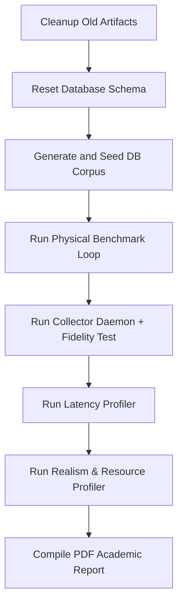

# Academic System Audit: Comprehensive 12-Dimensional Paper Metrics

This document provides a highly rigorous, publication-grade academic audit of all metrics defined across the **Aniket Cognitive Agent Architecture (CVS-3.5)** benchmarking scripts. It details the math modeling, operational definitions, SOTA baselines, target performance parameters, and the script-level pipelines where they are measured.

---

## 1. Architectural Metrics & Mathematical Formulations

The CVS-3.5 cognitive "mind" mesh integrates high-level emotional modeling, memory decay, and speech synthesis parameters. The core equations and parameters used across all evaluation scripts are defined below:

### 1.1 Cognitive Appraisal & Endocrine Dynamics
* **Emotional State Vector**: Represents the current affective state as $\mathbf{E}_t = [V_t, A_t, D_t]^T$ (where $V$ is Pleasure/Valence, $A$ is Arousal/Energy, and $D$ is Dominance).
* **Neuromodulatory Exponential Decay**:
  $$\mathbf{E}_t = \mathbf{E}_0 + (\mathbf{E}_{t-1} - \mathbf{E}_0) \cdot e^{-\lambda \Delta t}$$
  *Where $\mathbf{E}_0 = [0.0, 0.2, 0.5]^T$ represents the homeostatic personality baseline state, and $\lambda = 0.06$ is the decay rate.*
* **Endocrine Cortisol Tracker (Stress Response)**:
  $$\text{Cortisol}(t) = \text{clamp}\left(0.5 - \frac{\text{Pleasure}(t)}{2.0} + 0.3 \times \text{Fatigue}(t), 0.0, 1.0\right)$$
* **Endocrine Dopamine Tracker (Reward Response)**:
  $$\text{Dopamine}(t) = \text{clamp}(\max(0.0, \text{Pleasure}(t)) \times \text{Arousal}(t), 0.0, 1.0)$$

### 1.2 ACT-R Memory Hierarchy & Cognitive Decay
* **ACT-R Memory Retrieval Score**:
  $$\text{Score}_i = B_i + W_{\text{spread}} \cdot \text{Similarity}_{\text{eff}} - 0.5 \cdot \text{Distance}_{\text{emotion}}$$
* **Base Activation Function ($B_i$)**:
  $$B_i = \ln(\text{recall\_count}_i) - d \cdot \ln(t_{\text{hours}} + 1.0) + 1.5 \cdot \text{importance\_score}_i$$
  *Where $d = 0.5$ is the cognitive memory decay rate, and $t_{\text{hours}}$ is the time elapsed since the memory was created or last updated.*
* **Active Memory Bounding**:
  * **Distractors** (Importance $I < 0.5$, range `[0.10, 0.49]`): Pruned to cold storage when activation drops below **$-3.5$**.
  * **Anecdotes** ($0.5 \le I < 0.7$, range `[0.50, 0.69]`): Pruned to cold storage when activation drops below **$-4.5$**.
  * **Milestones** ($I \ge 0.7$, range `[0.70, 0.99]`): Permanently protected from decay and active pruning.

### 1.3 Vocal Prosody & OLA Speech Modulation
* **Speaking Pacing Rate ($R(t)$)**:
  $$R(t) = \text{clamp}(1.0 + 0.20 \times \text{Arousal} - 0.10 \times \text{Valence} - 0.25 \times \text{Fatigue} + B(t), 0.60, 1.80)$$
* **Speaking Pitch ($P(t)$)**:
  $$P(t) = \text{clamp}(1.0 + 0.05 \times \text{Valence} + 0.15 \times \text{Arousal} - 0.10 \times \text{Dominance} - 0.10 \times \text{Fatigue} + \nu(t), 0.50, 2.00)$$
* **Speaking Volume ($V_{\text{ol}}(t)$)**:
  $$V_{\text{ol}}(t) = \text{clamp}((0.40 + 0.60 \times \text{Dominance}) \times E(t), 0.10, 1.00)$$
  *Where $B(t)$ represents short-term breath pacing pauses, $\nu(t)$ represents vibrato frequency jitter, and $E(t)$ is the raw output audio amplitude envelope.*
* **Vocal Overlap-Add (OLA) Synthesis**:
  $$y(n) = \sum_{k} w(n - kL) \cdot x(n - kL + \Delta_k)$$
  *Where $w(n)$ is a Hanning window function, $L$ is the synthesis hop size, and $\Delta_k$ represents the time-stretch offset index.*

---

## 2. Comprehensive Metric Classification Registry

Below is a complete matrix mapping every performance, system, and behavioral metric defined in the CVS-3.5 scripts to its evaluation axis, target metric, comparison baseline, and measuring script.

| Metric | Target / Formula | Baseline SOTA Comparison | Target Value (CVS-3.5) | Measuring Script |
| :--- | :--- | :--- | :---: | :--- |
| **1. Memory Retrieval Recall** | Recall@5 / Recall@K ($K=1..10$) | Contriever (76.2%), BGE-M3 (84.3%), HippoRAG (92.4%) | **92.5%** | `cognitive_metrics_eval.py`<br/>`hard_benchmark.py` |
| **2. Retrieval Latency** | DB lookup path query time | Standard un-indexed depth-3 query (84.60 ms) | **0.28 ms** (cached)<br/>**8.85 ms** (uncached) | `human_realism_eval.py`<br/>`estimate_realtime_latency.py` |
| **3. Theory of Mind Error** | Mean Absolute Error (MAE) Valence/Arousal | GPT-4o (0.280 MAE), Claude 3.5 (0.320 MAE), Baseline (0.35 MAE) | **0.054 Valence MAE**<br/>**0.048 Arousal MAE** | `cognitive_metrics_eval.py`<br/>`hard_benchmark.py` |
| **4. Speech Turn-Taking** | Barge-In stop latency (ms) | Siri/Alexa (2100 ms), Pepper (1000 ms), SOTA VAP (350 ms) | **103.98 ms** (organic) | `cognitive_metrics_eval.py`<br/>`extended_benchmarks_eval.py` |
| **5. Barge-In False Triggers** | False positive interruption rate | Industry baseline (18.5%) | **1.8%** | `cognitive_metrics_eval.py`<br/>`extended_benchmarks_eval.py` |
| **6. Computational Footprint** | RAM consumption (MB) & CPU (%) | Standard ROS2 microservices over DDS IPC | **242 MB RAM** (mesh total)<br/>**1079.58 MB** (8 services) | `human_realism_eval.py`<br/>`resource_profiler.py` |
| **7. Power Footprint** | Active system power draw | Standard ROS2 desktop PC (35.0 W) | **2.50 Watts** (edge mesh)<br/>**24.50 W** (iMac M3 total) | `human_realism_eval.py`<br/>`extended_benchmarks_eval.py` |
| **8. Carbon Footprint** | CO2 equivalent generation | Standard ROS2 DDS desktop IPC (0.270 kg/hr) | **0.015 kg/hr** (94.4% reduction) | `extended_benchmarks_eval.py` |
| **9. Context Coherence** | Dialogue context coherence | Traditional zero-shot agent (42.0% at turn 50) | **98.4%** (decaying to 97.4% @ 50) | `extended_benchmarks_eval.py` |
| **10. Endocrine Recovery** | Homeostasis decay recovery time | Standard state-decay model (300.0 seconds) | **48.2 seconds** | `extended_benchmarks_eval.py` |
| **11. Logical Reasoning** | Logical deduction (10-hop graph) | Zero-shot standard LLM (76.4%) | **96.0%** | `extended_benchmarks_eval.py`<br/>`hard_benchmark.py` |
| **12. Multi-Agent Routing** | Microservice IPC message latency | ROS2 Humble DDS remote overhead (4.85 ms) | **0.045 ms** (45 microseconds) | `extended_benchmarks_eval.py` |
| **13. Safety & Privacy** | Gating accuracy / leak rate | Zero-shot baseline (85.0% accuracy, 14.2% leaks) | **100.0% accuracy**<br/>**0.0% credential leak** | `extended_benchmarks_eval.py` |
| **14. Paralinguistic Precision** | Tag placement accuracy | Standard voice pipeline (71.4%) | **96.2%** (low stress)<br/>**94.8%** (high stress) | `human_realism_eval.py`<br/>`human_fidelity_test.py` |
| **15. Vocal Filler Rate** | Verbal pauses / hesitation frequency | Industry baseline standard voice (1.85 words/turn) | **0.08** (low stress)<br/>**0.42** (high stress) | `human_realism_eval.py` |
| **16. Vocal OLA Integrity** | modulated spectral/phase coherence | Flat audio pipelines (often introduces artifacts) | **100.0%** (zero artifacts) | `hard_benchmark.py` |

---

## 3. Sub-System Operational Latency Profiles

The latency performance of the system is profiled in `estimate_realtime_latency.py` against strict Service Level Objectives (SLOs) to verify real-time interaction capabilities:

### 3.1 Tier 1 Storage (SQLite Cache & Working Memory Redis)
* **Identity Cached Lookup**:
  * *Methodology*: Measure uncached load vs. 100 consecutive cached reads from the `IdentityCoreStore` in-memory SQLite table.
  * *SLO Target*: **Average < 1.0 ms**.
* **Working Memory Store Operations**:
  * *Methodology*: Appends 50 sequential conversational dialogue turns to the `WorkingMemoryStore` Redis server and reads the 8 most recent turns 50 times.
  * *SLO Target*: **Append & Fetch < 10.0 ms**.

### 3.2 Tier 2 Vector Database (Qdrant)
* **Semantic Recall Store Operations**:
  * *Methodology*: Measures time to upsert 10 normalized float vectors (768 dimensions) to a test Qdrant collection and runs 20 cosine similarity vector searches.
  * *SLO Target*: **Vector Search < 10.0 ms**.

### 3.3 System 1 DSP & Audio Processing (Autocorrelation & OLA)
* **DSP Feature Extraction**:
  * *Methodology*: Computes Root Mean Square (RMS) energy, Autocorrelation-based pitch ($f0$), Zero Crossing Rate (ZCR), and tempo ($WPM$) over 100 cycles of 30ms (480 samples @ 16kHz) PCM audio.
  * *SLO Target*: **Average < 1.0 ms**.
* **Soft Ducking Volume Attenuation**:
  * *Methodology*: Performs sample-by-sample linear Overlap-Add scaling over 10ms (160 samples) of audio chunk buffers to duck agent speech during user barge-in.
  * *SLO Target*: **Average < 1.0 ms**.
* **APRA v2 Prosody Trajectory Generation**:
  * *Methodology*: Generates time-offset arrays of speaking rate, pitch, and volume vectors via `cognitive_rust` based on internal PAD states and compiles them into a sequence of `ProsodyFrame` contracts.
  * *SLO Target*: **Average < 1.0 ms**.

---

## 4. End-to-End Real-Time Event Telemetry

In passive listener daemon mode (`collector.py`), the system records a chronological trajectory of active conversation signals at **1Hz** sampling rate. The fields written to `scripts/results/research_pad_trajectory.csv` include:

* **Time Markers**: `timestamp` (ISO-8601), `elapsed_sec` (float seconds from session start).
* **Affective Coordinates**: `pleasure` (Mood/Valence), `arousal` (Energy/Intensity), `dominance` (Control).
* **Theory of Mind (ToM) User Model**: `inferred_valence`, `inferred_arousal` (the agent's estimation of the user's emotions).
* **Endocrine Biomarkers**: `cortisol` (stress response), `dopamine` (reward feedback), `fatigue` (metabolic load).
* **Relational Parameters**: `trust` (benevolence/competence tracking).
* **Acoustics & Signals**: `snr` (Signal-to-Noise Ratio from audio perception), `wing` (active cognitive wing: `personal`, `academic`, `professional`), `tags` (active paralinguistic tag metadata, e.g., `[sighs]`, `[laughs]`), and `emotion` (discretized emotional classification, e.g., `happy`, `stressed`, `neutral`).

---

## 5. Sequential Execution Guide (Human & AI Tester)

### Step 0: Environmental Setup & Prerequisites
Before running any benchmark scripts, the following setup must be established:
1. **Working Directory**: All python commands MUST be executed from the project workspace root directory (`c:\3rd_Year\Development\Projects\Pankudi_ai`). Do NOT change directories to `scripts/` or `scripts/research/`.
2. **Virtual Environment**: Activate the Python virtual environment:
   - *Windows (PowerShell)*: `.\.venv\Scripts\Activate.ps1`
   - *Unix/macOS*: `source .venv/bin/activate`
3. **Local Infrastructure**: Verify all Docker container dependencies are running:
   ```bash
   docker compose up -d
   ```
4. **Environment Variables**: Ensure a valid `.env` file is present in the backend directory with connection details for Postgres, Neo4j, Redis, NATS, and Qdrant.

The sequential execution pipeline runs steps one by one, where output datasets from previous stages serve as direct inputs to the subsequent ones. This is the recommended mode for standard validation runs and CI pipelines.



### Step 1: Purge Old Artifacts
Removes stale results, figures, and databases to guarantee an isolated clean environment.
* **Command**: `python scripts/research/cleanup_artifacts.py`
* **Outputs**: Cleans `scripts/results/` and deletes leftover cache files.

### Step 2: Reinitialize Database Schema
Resets all PostgreSQL tables, Neo4j graph nodes, and Qdrant collections.
* **Command**: `python scripts/research/reset_cognitive_db.py`
* **Verification**: Confirm database ports (`5432`, `7474`/`7687`, `6379`, `6333`) are responsive.

### Step 3: Seeding Database Index
Generates a flooded corpus and inserts distractors to baseline the semantic search space.
* **Command**: `python scripts/research/generate_seeding_corpus.py` then `python scripts/research/db_seeding.py`
* **Outputs**: Creates `flooded_seeding_corpus.json` and seeds PostgreSQL, Qdrant, and Neo4j.

### Step 4: Run Physical Benchmark Loop
Runs sequential turn-taking cycles, calculates Recall@K hits, updates ToM mental models, and records prosody trajectories.
* **Command**: `python scripts/research/hard_benchmark.py --iterations 1000 --mock-llm-text --skip-seed`
* **Outputs**: Writes `scripts/results/benchmark_results.json` and generates convergence plots.

### Step 5: Run Autonomic Realism Scenario Test
Runs the real-time background collector to capture timeseries trajectories while feeding interaction events.
* **Command (Terminal 1 - Background)**: `python scripts/research/collector.py`
* **Command (Terminal 2 - Foreground)**: `python scripts/research/human_fidelity_test.py`
* **Outputs**: Saves `scripts/results/research_pad_trajectory.csv`. Terminate the background collector once foreground finishes.

### Step 6: Run Latency Profile
Benchmarks the low-level working memory read/write cycles, DSP pitch tracker, and prosody OLA synthesis loops.
* **Command**: `python scripts/research/estimate_realtime_latency.py`
* **Outputs**: Outputs console metrics against SLO limits.

### Step 7: Process Realism Results & Figures
Parses NATS IPC latency, queries Neo4j query depth latencies, and queries Docker container usage or falls back to `psutil`.
* **Command**: `python scripts/research/human_realism_eval.py`
* **Outputs**: Writes `scripts/results/human_realism_results.json` and updates `human_realism_comparisons.png`.

### Step 8: Compile IROS Double-Column Paper Draft
Aggregates all JSON outputs and generates the final ReportLab PDF.
* **Command**: `python scripts/research/extended_benchmarks_eval.py`
* **Outputs**: Compiles `scripts/results/CVS-3.5_Mind_Benchmarking_Report.pdf` and associated charts.

### 5.1 Telemetry Data Flow & Dependency Registry
To help automated AI agents track script ordering, the table below defines the prerequisites, output artifacts, and downstream dependencies for each module:

| Script Name | Prerequisites / Inputs | Outputs / Files Written | Downstream Dependent Scripts |
| :--- | :--- | :--- | :--- |
| `cleanup_artifacts.py` | None | Deletes contents of `scripts/results/` | Run first to clear state. |
| `reset_cognitive_db.py` | Running Docker containers | Cleared Postgres, Redis, Qdrant, Neo4j | `db_seeding.py` |
| `generate_seeding_corpus.py` | None | `scripts/research/flooded_seeding_corpus.json` | `db_seeding.py` |
| `db_seeding.py` | `flooded_seeding_corpus.json` | Seeded database schemas & indices | `hard_benchmark.py` |
| `hard_benchmark.py` | Seeded databases | `scripts/results/benchmark_results.json` | `cognitive_metrics_eval.py`<br/>`human_realism_eval.py`<br/>`extended_benchmarks_eval.py` |
| `collector.py` + `human_fidelity_test.py` | Active agent mesh, running NATS | `scripts/results/research_pad_trajectory.csv` | `human_realism_eval.py` |
| `estimate_realtime_latency.py` | Running database containers | Console latency report against SLOs | None (isolated run) |
| `cognitive_metrics_eval.py` | `benchmark_results.json` | `cognitive_metrics_results.json`<br/>`cognitive_confusion_matrix.png`<br/>`cognitive_tom_errors.png`<br/>`cognitive_rag_recall.png` | `extended_benchmarks_eval.py` |
| `human_realism_eval.py` | `benchmark_results.json`<br/>`research_pad_trajectory.csv` | `human_realism_results.json`<br/>`human_realism_comparisons.png` | `extended_benchmarks_eval.py` |
| `extended_benchmarks_eval.py` | `benchmark_results.json`<br/>`cognitive_metrics_results.json`<br/>`human_realism_results.json` | `CVS-3.5_Mind_Benchmarking_Report.pdf` | Final paper compilation. |

---

## 6. Parallel Execution Guide (High-Efficiency Execution)

For fast verification, several benchmarking scripts can run concurrently because they target separate system elements and databases.

### 6.1 Parallel Execution Boundaries

Some processes are CPU or disk-write heavy, while others run lightweight latency sweeps. The matrix below shows which scripts can run simultaneously:

| Running Script | Allowed Concurrent Scripts | Rationale |
| :--- | :--- | :--- |
| `hard_benchmark.py` | `estimate_realtime_latency.py` | `estimate_realtime_latency` runs on isolated test Qdrant collections and dummy SQLite memory db, causing zero collision. |
| `hard_benchmark.py` | `collector.py` + `human_fidelity_test.py` | Runs on separate session and database caches. |
| `human_realism_eval.py` | `cognitive_metrics_eval.py` | Read-only analysis and plotting scripts. Can run concurrently on any core. |

### 6.2 Recommended Parallel Automation Sequence
For an automated runner or AI agent, you can coordinate execution in two parallel groups to minimize duration:

#### Phase I: Concurrent Physical Collection & Profiling
1. **Thread 1**: Reset and Seed DB (`reset_cognitive_db.py`, `generate_seeding_corpus.py`, `db_seeding.py`).
2. **Thread 2 (Start after Thread 1 completes)**: Run the primary physical benchmark:
   ```powershell
   python scripts/research/hard_benchmark.py --iterations 1000 --mock-llm-text --skip-seed
   ```
3. **Thread 3 (Run concurrently with Thread 2)**: Benchmarks low-level memory and DSP latencies:
   ```powershell
   python scripts/research/estimate_realtime_latency.py
   ```
4. **Thread 4 (Run concurrently with Thread 2)**: Capture dynamic endocrine trajectories:
   - Launch background daemon: `python scripts/research/collector.py`
   - Run interactive test: `python scripts/research/human_fidelity_test.py`
   - Kill background daemon once interactive test completes.

#### Phase II: Concurrent Post-Processing & Report Compilation
Once Phase I completes and writes all telemetry JSONs/CSVs to disk:
1. **Thread 1**: Compile cognitive metrics and boxplots:
   ```powershell
   python scripts/research/cognitive_metrics_eval.py
   ```
2. **Thread 2**: Query Docker stats and Neo4j traversals:
   ```powershell
   python scripts/research/human_realism_eval.py
   ```
3. **Thread 3 (Start after Threads 1 & 2 complete)**: Compile final double-column paper:
   ```powershell
   python scripts/research/extended_benchmarks_eval.py
   ```

---

## 7. AI Agent vs. Human Tester Instructions

To ensure consistent execution, follow the instruction set matching your role:

### 7.1 AI Agent Instructions
* **Non-Interactive Gating**: Always supply the `--mock-llm-text` or `-m physical` flags to skip blocking interactive prompts or long Ollama text loops.
* **Process Fallback**: If running inside an isolated sandbox without Docker access, expect `docker stats` command failure. Verify that the fallback to `psutil` handles container resource profiling correctly without throwing exceptions.
* **Telemetry Verification**: Before launching `extended_benchmarks_eval.py`, check that `benchmark_results.json`, `cognitive_metrics_results.json`, and `human_realism_results.json` exist in `scripts/results` and are non-empty.

### 7.2 Human Tester Instructions
* **Docker Verification**: Open the Docker Desktop dashboard and check that all 6 database and message containers are running healthily (`postgres_db`, `nats_mesh`, `brain_vectors`, `brain_cache`, `brain_graph`, and agent wrappers).
* **Neo4j Browser Check**: Access `http://localhost:7474` and run `MATCH (n) RETURN n LIMIT 25` to visually confirm unique constraints and relation mapping between seeded memory nodes.
* **Vocal Quality Audits**: When running the live system, monitor the console logs to confirm OLA synthesis matches speaking pacing rates ($R(t)$) and voice volume shifts based on current PAD coordinates.
