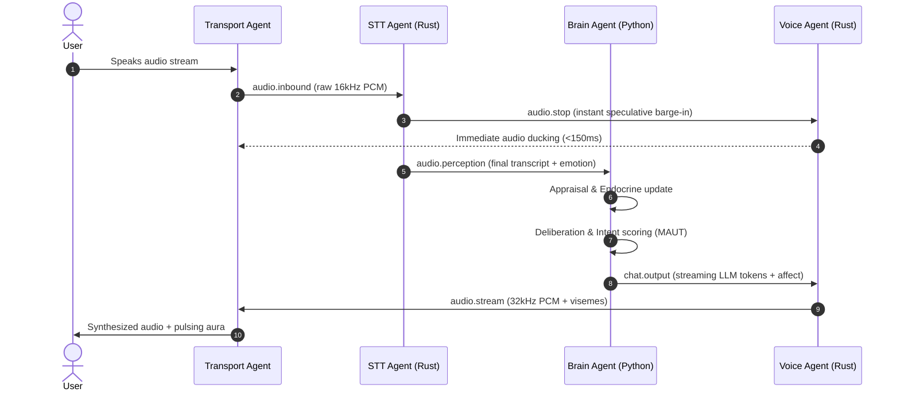

# Mesh Architecture

AI Friend is built as a **decoupled, multi-agent cognitive signal mesh**. Agents run as independent OS processes communicating asynchronously over **NATS JetStream** message subjects, never calling internal class methods across agent boundaries.

---

## The 9 Autonomous Mesh Agents

| Agent Name | Runtime Engine | Primary Responsibilities |
| :--- | :--- | :--- |
| **Signaling Agent** | Python / FastAPI | Issues WebRTC tokens, exposes REST routes (`/api/`), and initializes session state. |
| **Brain Agent** | Python / Ollama / PyTorch | Core cognition: appraisal, PAD affect calculation, deliberation, and streaming LLM generation. |
| **Voice Agent** | Rust / GPT-SoVITS | 32kHz physical voice synthesis, emotional prosody trajectory, and dynamic pause bias. |
| **STT Agent** | Rust / whisper.cpp + SenseVoice | Dual-path speech processing: 150ms speculative intent/emotion + high-precision transcript. |
| **Transport Agent** | Python / LiveKit | WebRTC media bridge: chunks inbound PCM, ingests outbound audio, dispatches viseme packets. |
| **Surfacing Agent** | Python / pgvector | ACT-R episodic memory retrieval and proactive recollection queueing. |
| **Subconscious Agent** | Python / Neo4j | Background reflection, sleep-time consolidation, and unprompted proactive outreach. |
| **Vision Agent** | Python / Moondream VLM | Screen and webcam visual appraisal with habituation filter dampening. |
| **Pulse Agent** | Python / asyncio | Mesh health, telemetry collection, and distributed heartbeat (`system.tick`). |

---

## The 7-Stage Cognitive Turn

Every conversational exchange traverses seven distinct, observable stages across the mesh:



1. **Perception**: Raw 16kHz PCM audio is ingested via WebRTC and published to `audio.inbound`.
2. **Speculation**: `SenseVoice` classifies speech intent and detects emotion in $<150\text{ms}$.
3. **Reflex**: If speech is detected while the agent is speaking, Voice Agent soft-attenuates playback instantly via `audio.stop`.
4. **Appraisal**: Brain Agent updates Russell's PAD (Pleasure, Arousal, Dominance) state and checks the 3-tier boundary floor.
5. **Deliberation**: Decision Service evaluates candidate conversational behaviors using multi-attribute utility theory (MAUT).
6. **Synthesis**: LLM streams tokens into Voice Agent, which synthesizes audio chunks matching the current emotional affect.
7. **Closure**: Voice Agent reports actual playback progress (`audio.playback.progress`) back to Brain Agent for conversational tempo entrainment.

---

## Signal Bus Contracts

Every message crossing the NATS bus is validated against strict Pydantic schemas in `backend/app/contracts.py`. Raw unvalidated dictionaries are structurally forbidden.

Example contract for `chat.output`:
```python
class ChatOutput(BaseModel):
    model_config = {"extra": "allow"}
    content: str
    turn_id: str             # UUID tracking the entire turn lifecycle
    done: bool = False       # Explicit stream termination flag
    proactive: bool = False  # Set when initiated spontaneously by subconscious
    affect: ChatOutputAffect | None = None
```
