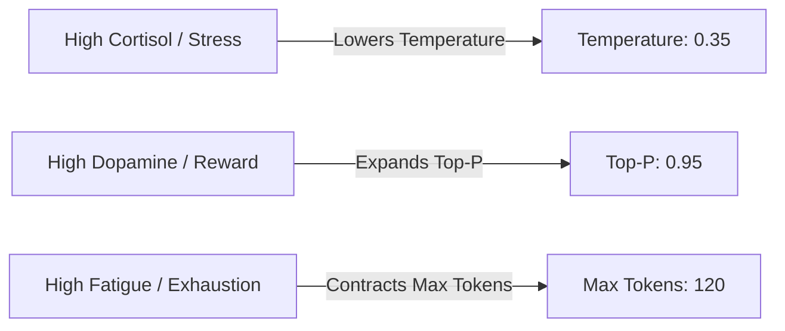

# Endocrine & Affect Simulation

Unlike standard chatbots that rely on static text prompts, AI Friend incorporates an **internal neurochemical simulation**. Internal affective states change how the LLM generates tokens in real time.

---

## The Tonic + Phasic Mathematical Model

The endocrine engine tracks two primary neurochemicals: **Cortisol** (stress/caution) and **Dopamine** (reward/enthusiasm). Each hormone is decomposed into two distinct mathematical channels:

$$\text{Hormone}(t) = \text{Tonic}(t) + \text{Phasic}(t)$$

### 1. Tonic Channel (Affective Baseline)
The tonic baseline reflects long-term emotional equilibrium and is derived continuously from the 3D PAD (Pleasure, Arousal, Dominance) space:

$$\text{Tonic}_{\text{Cortisol}} = \text{clamp}\left(0.5 - 0.5 \cdot \text{Valence} + 0.3 \cdot \text{Arousal}, 0.0, 1.0\right)$$
$$\text{Tonic}_{\text{Dopamine}} = \text{clamp}\left(0.5 + 0.5 \cdot \text{Valence} + 0.4 \cdot \text{Arousal}, 0.0, 1.0\right)$$

### 2. Phasic Channel (Decaying Event-Driven Bursts)
Phasic bursts are triggered by conversational events (e.g. insults, achievements, praise, long pauses) and decay exponentially according to their calibrated half-lives:

$$\text{Phasic}(t) = \text{Phasic}_0 \cdot e^{-\lambda t} \quad \text{where } \lambda = \frac{\ln(2)}{t_{1/2}}$$

* **Dopamine Half-Life ($t_{1/2}$)**: $90\text{ seconds}$ (Rapid reward spike and decay).
* **Cortisol Half-Life ($t_{1/2}$)**: $4500\text{ seconds}$ (Prolonged stress persistence, ~75 minutes).

Because phasic channels operate independently of anti-correlated tonic baselines, the agent can experience realistic complex emotions, such as being **simultaneously stressed and rewarded**.

---

## Dynamic LLM Sampling Modulation

Neurochemicals directly modulate LLM generation parameters during the cognitive action stream:

| Parameter | Modulated By | Impact on Generated Speech |
| :--- | :--- | :--- |
| **Temperature** | $\text{Cortisol}$ | High cortisol lowers temperature ($0.7 \rightarrow 0.35$), making responses concise, cautious, and direct. |
| **Top-P** | $\text{Dopamine}$ | High dopamine increases top-p ($0.8 \rightarrow 0.95$), encouraging creative vocabulary, humor, and expressive metaphors. |
| **Max Tokens** | $\text{Fatigue}$ | Fatigue reduces token ceiling ($500 \rightarrow 120$), causing the agent to give shorter, less verbose answers when tired. |
| **Speaking Rate** | $\text{Arousal}$ | High arousal accelerates speech pacing and shortens pauses. |

---

## Authentic Emotional Friction

The agent does **not** artificially soften or placate when the user is rude or unreasonable. If an insult occurs:
1. Valence drops, and an immediate **phasic Cortisol burst** fires.
2. The agent's temperature drops, and deliberation selects an assertive or disengaged conversational stance.
3. The response reflects authentic human annoyance, maintaining identity integrity rather than sycophantic obedience.
