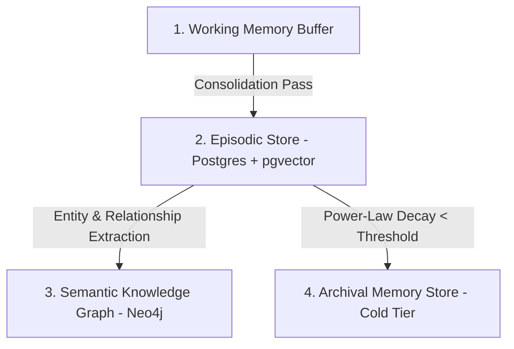

# Memory Systems & Learned Mental Lexicon

AI Friend implements a multi-tier, biologically grounded memory architecture inspired by John R. Anderson's **ACT-R Cognitive Architecture** and semantic spreading activation networks.

---

## The 4 Memory Tiers

### 1. Working Memory (Short-Term Buffer)
Maintains recent conversational turns, immediate sensory observations, and active conversational context in Redis and in-memory caches.

### 2. Episodic Memory (Lived History)
Stores conversation turns as 768-dimensional dense vectors in PostgreSQL (`pgvector`). Each memory records:
* `content`: The raw dialogue or observation.
* `valence` & `arousal`: Affective state at the time of encoding.
* `recall_count`: Total number of times recalled.
* `last_recalled_at`: Timestamp of latest activation.

### 3. Semantic Knowledge Graph (Neo4j)
A property graph mapping entities, relationships, shared preferences, and factual knowledge (`(:User)-[:DISLIKES]->(:Topic)`). Allows graph traversal and multi-hop reasoning.

### 4. Archival Tier
Memories whose activation score falls below the retention threshold move to cold archival storage rather than being deleted, preserving history for future long-term retrieval.

---

## ACT-R Power-Law Memory Decay

Memories do not persist forever at full strength. Activation strength decays over time following the ACT-R power-law formula:

$$A_i = \ln\left(\sum_{k=1}^{n} (t - t_k)^{-d}\right) + \sum_{j} W_j S_{ji}$$

Where:
* $t - t_k$: Time elapsed since the $k$-th recall.
* $d$: Memory decay parameter (default $d = 0.5$).
* $S_{ji}$: Associative strength between cue $j$ and memory $i$.

Memories frequently discussed remain prominent; trivial one-off details naturally fade.

---

## The Learned Mental Lexicon

Standard retrieval systems rely on generic static embeddings or rigid dictionary synonyms. AI Friend builds a **dynamic mental lexicon** extracted directly from past conversations:

* When you mention a nickname, a personal hobby, or an idiosyncratic phrase, the agent creates associative links in its lexicon graph.
* When searching memories for `"weekend project"`, the lexicon expands the search query using terms unique to your relationship (e.g. `"compiler"`, `"rust"`, `"garage"`).

---

## Subconscious REM Sleep Consolidation

When the conversational mesh is idle, `subconscious_agent` triggers an offline consolidation cycle:
1. **Fact Extraction**: Extracts new permanent facts and beliefs from recent turns.
2. **Knowledge Graph Graph-Sync**: Updates Neo4j entity relationships.
3. **Decay Refresh**: Recalculates ACT-R activation scores across all stored memories.
4. **Proactive Reflection**: Generates unprompted spontaneous thoughts that can trigger proactive outreach.

