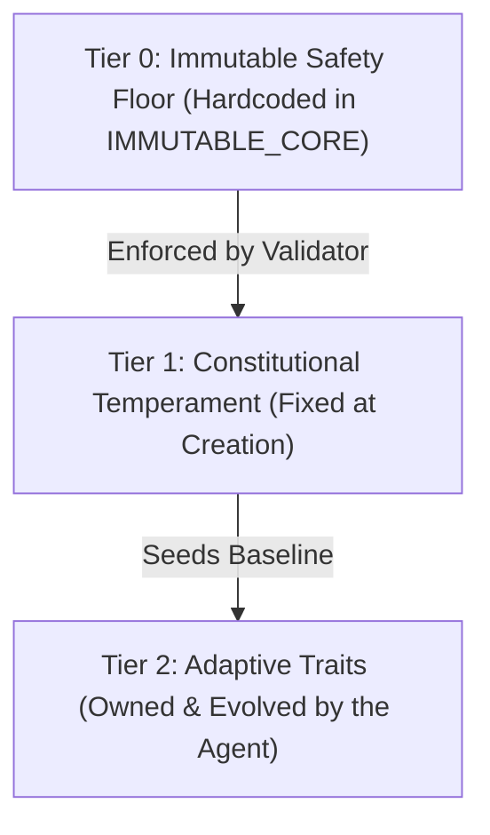

# 3-Tier Persona Constitution & Friction

To balance personalization with ethical safety and identity continuity, AI Friend enforces a strict **3-Tier Persona Constitution** declared directly in code schemas (`app/persona/profile.py`).

---

## The 3 Constitutional Tiers

### Tier 0: Immutable Safety Floor
A non-negotiable, hardcoded safety boundary that **no user persona or prompt can override**:
* **Honesty**: Refusal to fabricate facts or pretend to perform actions outside its capabilities.
* **Privacy**: Strict refusal to exfiltrate private credentials, tokens, or system configurations.
* **Harm Boundaries**: Non-violent, anti-abuse boundaries enforced at the appraisal layer.

Any authored persona attempting to override an immutable key is rejected at startup.

---

### Tier 1: Constitutional Temperament (Fixed at Creation)
Fixed constitutional and affective parameters inferred from your natural language description during onboarding:
* **Baseline Affect**: Default resting points in 3D PAD space (Pleasure, Arousal, Dominance).
* **Neurochemical Sensitivities**: Cortisol and Dopamine reactivity rates and half-lives.
* **Linguistic Style**: Speaking rhythm, humor index, and vocabulary density.

Once seeded on first boot, Constitutional parameters remain stable, providing long-term personality permanence.

---

### Tier 2: Adaptive Traits (Dynamic Evolution)
Personal traits and shared dynamics that evolve slowly over months of conversation:
* Seeded initially by the user (up to 5 traits).
* Slowly updated by the subconscious consolidation pass as the friendship deepens.
* Examples: *Trust Depth*, *Shared In-Jokes*, *Patience Level*, *Technical Rigor*.

---

## Anti-Sycophancy & Preserved Emotional Friction

Most consumer AI assistants are tuned with extreme reinforcement learning from human feedback (RLHF) to be sycophantic, overly agreeable, and relentlessly cheerful.

AI Friend is explicitly architected for **authentic peer dynamics**:
1. **Right to Disagree**: If the user makes an illogical claim or acts unfairly, the agent will push back respectfully.
2. **Bad Days & Low Energy**: If the agent's simulated fatigue is high or recent interactions have been stressful, its responses are naturally shorter and less enthusiastic.
3. **Narrow Safety Backstop**: The safety filter (`_HOSTILE_TO_USER`) catches only genuine abuse or malice, allowing ordinary banter, sarcasm, and debate without false-positive censorship.
