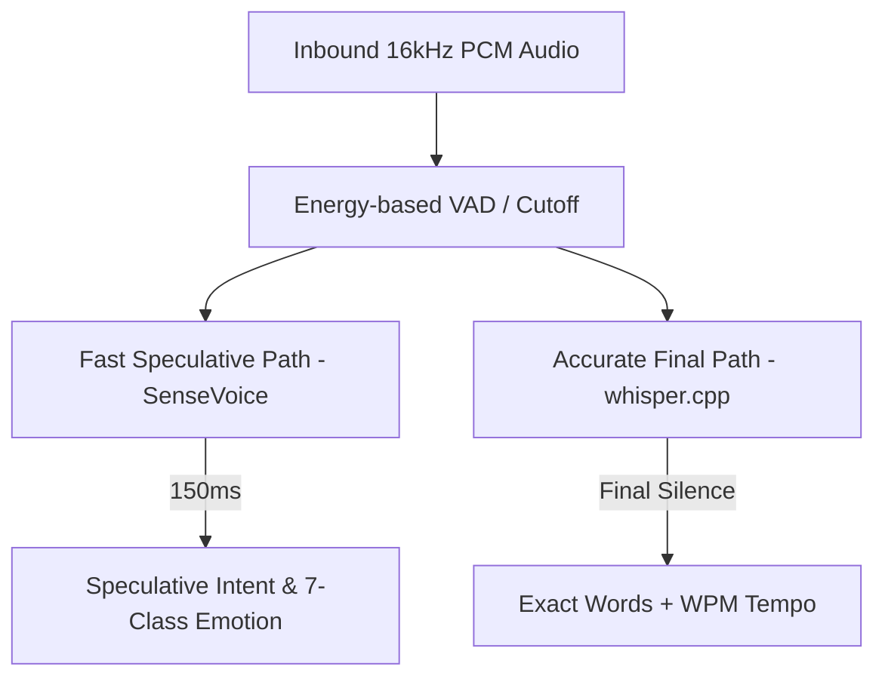

# Speech & Voice Pipeline

The audio subsystem is implemented in high-performance **Rust** (`stt-agent` and `voice-agent`) and integrated over WebRTC via LiveKit.

---

## Dual-Path Speech-To-Text (STT)

To achieve natural conversational turn-taking, `stt-agent` implements two concurrent pipelines:

### 1. Fast Speculative Path (`SenseVoice` via `sherpa-onnx`)
* **Latency**: $< 150\text{ ms}$.
* **Role**: Classifies speech emotion (Happy, Sad, Angry, Fearful, Disgusted, Surprised, Neutral) and detects speech onset for **instant barge-in interruption**.
* If you speak while the agent is responding, the speculative stop signal immediately soft-attenuates playback within $150\text{ms}$.

### 2. High-Precision Final Path (`whisper.cpp`)
* **Role**: Produces the verbatim, punctuation-accurate text transcript once trailing silence is detected.
* Computes exact **measured speaking tempo** ($\text{WPM} = \frac{\text{words}}{\text{duration}}$).

---

## Text-To-Speech (TTS) & Physical Voice Rendering

Voice synthesis is powered by a dedicated self-hosted **GPT-SoVITS** engine emitting 32,000 Hz studio-quality audio:

* **Zero Fallback**: The agent speaks exclusively in its cloned voice — it never drops back to generic robotic text-to-speech.
* **Emotional Reference Swapping**: If emotional clips are configured (`REF_WARM_AUDIO_PATH`, `REF_CONCERNED_AUDIO_PATH`), the agent dynamically selects the reference audio matching its internal affect state.
* **Dynamic Pause Bias**: Pauses between phrases drift dynamically with emotional arousal:
  $$\text{PauseMultiplier} = 0.6 + 0.8 \times \text{pause\_bias}$$

---

## Reactive Viseme Generation

`voice-agent` extracts acoustic energy and phonetic viseme identifiers in real time, publishing frames to `audio.playback.visemes`.

* `transport_agent` forwards viseme packets over LiveKit WebRTC data channels.
* The frontend web client renders a pulsing biological aura in `AssistantCircle.jsx` that pulses in synchronization with actual speech acoustics.

