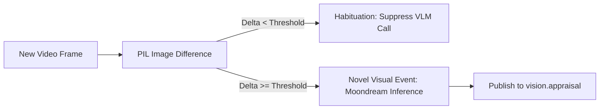

# Visual Appraisal System

The optional Visual Appraisal subsystem (`vision_agent`) equips your companion with spatial awareness, allowing it to see what you are looking at on your screen or webcam.

---

## Moondream Vision-Language Model (VLM)

Visual appraisal uses the lightweight **Moondream** model running locally via Ollama:
* **Footprint**: $\sim 1.7 \text{ GB}$ resident memory.
* **Input**: Periodic JPEG frames captured from the screen or webcam.
* **Output**: Semantic descriptions of visual activity, application context, and environmental changes.

---

## The Habituation Filter

Running a continuous vision model on every video frame wastes compute and fills memory with repetitive descriptions. AI Friend implements a **biological habituation filter**:

1. Each incoming frame is compared against recent visual history using spatial luminance and feature variance.
2. If you are reading a static article or writing code without major changes, the habituation filter **suppresses the VLM call**, conserving CPU/GPU cycles.
3. When a major visual shift occurs (e.g. switching tabs, opening a diagram, a person walking into view), the filter breaks habituation and triggers a full visual appraisal pass.

---

## Multimodal Grounding

Visual appraisals are wrapped in delimited metadata blocks in the cognitive context window, allowing the agent to naturally comment on what you are doing (e.g., *"That's a tricky Rust compiler error in line 42"*).

