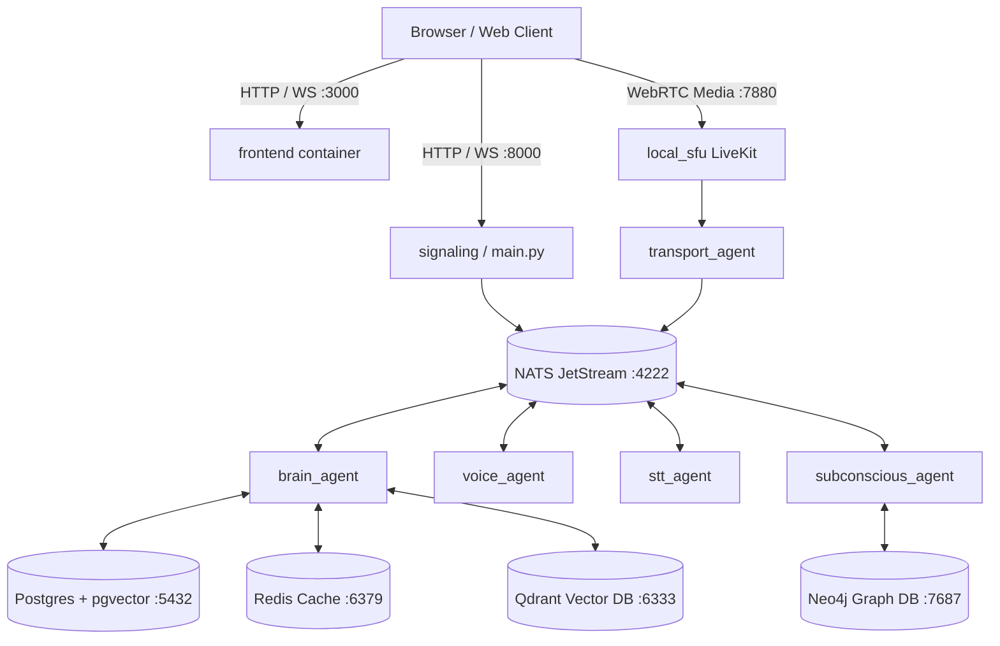

# Docker Compose Orchestration Guide

The AI Friend architecture is partitioned across two layered Compose configurations:
1. `docker-compose.infra.yml`: Persistent storage and messaging backbones (Postgres, Neo4j, Redis, Qdrant, NATS, LiveKit).
2. `docker-compose.prod.yml`: Autonomous worker agents and application services (`brain_agent`, `voice_agent`, `stt_agent`, `transport_agent`, `subconscious_agent`, `frontend`).

---

## Compose File Layering

To start or validate the complete stack, always layer both files in sequence:

```bash
# Validate compose syntax
docker compose -f docker-compose.infra.yml -f docker-compose.prod.yml config

# Start all services in detached mode
docker compose -f docker-compose.infra.yml -f docker-compose.prod.yml up -d

# View live container logs
docker compose -f docker-compose.infra.yml -f docker-compose.prod.yml logs -f
```

---

## Service Architecture Topology



---

## Volume Persistence & Security

All stateful containers mount dedicated Docker named volumes:

* `pgdata`: Primary PostgreSQL relational database and vector embeddings.
* `neo4j_data`: Neo4j graph relationships, entity nodes, and indexes.
* `redis_data`: Redis snapshot state and persistence files.
* `qdrant_data`: Qdrant HNSW vector indexes.
* `nats_data`: JetStream durable stream storage and consumer offsets.
* `voice_samples_data`: Cloned voice reference audio and emotion datasets.

### Port Security Posture
All backend infrastructure ports (`5432`, `7687`, `6379`, `4222`) bind exclusively to **loopback `127.0.0.1`**, preventing external local area network exposure. Only the web frontend (`3000`) and LiveKit SFU (`7880`) are accessible to clients.

---

## Profiles & Optional Services

* **`--profile docker-ollama`**: Runs Ollama inside Docker rather than host-natively (useful in headless CI environments).
* **`--profile vision`**: Enables `vision_agent` with Moondream VLM screen and camera appraisal.
